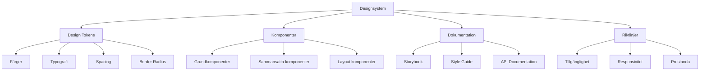

# Designsystem

## Introduktion till designsystem

Ett designsystem är en samling av återanvändbara komponenter, riktlinjer och standarder som säkerställer konsistens i design och utveckling över hela produkten eller organisationen. För webbutvecklare är designsystem ett kraftfullt verktyg för att skapa skalbar, underhållbar och enhetlig kod.



## Design tokens - Systemets grund

Design tokens är atomära värden som representerar designbeslut som färger, typografi, spacing och andra visuella egenskaper.

### CSS Custom Properties för tokens
```css
:root {
  /* Färg tokens */
  --color-primary-50: #eff6ff;
  --color-primary-100: #dbeafe;
  --color-primary-500: #3b82f6;
  --color-primary-900: #1e3a8a;
  
  --color-neutral-50: #f9fafb;
  --color-neutral-100: #f3f4f6;
  --color-neutral-500: #6b7280;
  --color-neutral-900: #111827;
  
  --color-success: #10b981;
  --color-warning: #f59e0b;
  --color-error: #ef4444;
  
  /* Typografi tokens */
  --font-family-sans: 'Inter', -apple-system, sans-serif;
  --font-family-mono: 'Fira Code', monospace;
  
  --font-size-xs: 0.75rem;    /* 12px */
  --font-size-sm: 0.875rem;   /* 14px */
  --font-size-base: 1rem;     /* 16px */
  --font-size-lg: 1.125rem;   /* 18px */
  --font-size-xl: 1.25rem;    /* 20px */
  --font-size-2xl: 1.5rem;    /* 24px */
  --font-size-3xl: 1.875rem;  /* 30px */
  --font-size-4xl: 2.25rem;   /* 36px */
  
  --font-weight-normal: 400;
  --font-weight-medium: 500;
  --font-weight-semibold: 600;
  --font-weight-bold: 700;
  
  --line-height-tight: 1.25;
  --line-height-normal: 1.5;
  --line-height-relaxed: 1.75;
  
  /* Spacing tokens */
  --space-0: 0;
  --space-1: 0.25rem;   /* 4px */
  --space-2: 0.5rem;    /* 8px */
  --space-3: 0.75rem;   /* 12px */
  --space-4: 1rem;      /* 16px */
  --space-5: 1.25rem;   /* 20px */
  --space-6: 1.5rem;    /* 24px */
  --space-8: 2rem;      /* 32px */
  --space-10: 2.5rem;   /* 40px */
  --space-12: 3rem;     /* 48px */
  --space-16: 4rem;     /* 64px */
  
  /* Border tokens */
  --border-width-0: 0;
  --border-width-1: 1px;
  --border-width-2: 2px;
  --border-width-4: 4px;
  
  --border-radius-none: 0;
  --border-radius-sm: 0.125rem;   /* 2px */
  --border-radius-base: 0.25rem;  /* 4px */
  --border-radius-md: 0.375rem;   /* 6px */
  --border-radius-lg: 0.5rem;     /* 8px */
  --border-radius-xl: 0.75rem;    /* 12px */
  --border-radius-full: 9999px;
  
  /* Shadow tokens */
  --shadow-sm: 0 1px 2px rgba(0, 0, 0, 0.05);
  --shadow-base: 0 1px 3px rgba(0, 0, 0, 0.1);
  --shadow-md: 0 4px 6px rgba(0, 0, 0, 0.07);
  --shadow-lg: 0 10px 15px rgba(0, 0, 0, 0.1);
  --shadow-xl: 0 20px 25px rgba(0, 0, 0, 0.1);
  
  /* Transition tokens */
  --transition-fast: 150ms ease;
  --transition-base: 250ms ease;
  --transition-slow: 350ms ease;
}
```

### JavaScript token system
```javascript
// Token manager för dynamisk hantering
class DesignTokens {
    constructor() {
        this.tokens = new Map();
        this.loadTokens();
    }
    
    loadTokens() {
        // Ladda tokens från CSS custom properties
        const root = document.documentElement;
        const computedStyle = getComputedStyle(root);
        
        // Hämta alla CSS custom properties
        const allProps = Array.from(document.styleSheets)
            .flatMap(sheet => Array.from(sheet.cssRules))
            .find(rule => rule.selectorText === ':root')
            ?.style || [];
            
        for (let i = 0; i < allProps.length; i++) {
            const prop = allProps[i];
            if (prop.startsWith('--')) {
                const value = computedStyle.getPropertyValue(prop).trim();
                this.tokens.set(prop, value);
            }
        }
    }
    
    get(tokenName) {
        const token = this.tokens.get(`--${tokenName}`);
        if (!token) {
            console.warn(`Token "${tokenName}" not found`);
            return null;
        }
        return token;
    }
    
    set(tokenName, value) {
        const cssVar = `--${tokenName}`;
        document.documentElement.style.setProperty(cssVar, value);
        this.tokens.set(cssVar, value);
    }
    
    // Generera färgskala från bas-färg
    generateColorScale(baseName, baseColor) {
        const hsl = this.hexToHsl(baseColor);
        const scales = [50, 100, 200, 300, 400, 500, 600, 700, 800, 900];
        
        scales.forEach(scale => {
            const lightness = this.calculateLightness(scale);
            const colorValue = `hsl(${hsl.h}, ${hsl.s}%, ${lightness}%)`;
            this.set(`color-${baseName}-${scale}`, colorValue);
        });
    }
    
    hexToHsl(hex) {
        const r = parseInt(hex.slice(1, 3), 16) / 255;
        const g = parseInt(hex.slice(3, 5), 16) / 255;
        const b = parseInt(hex.slice(5, 7), 16) / 255;
        
        const max = Math.max(r, g, b);
        const min = Math.min(r, g, b);
        const diff = max - min;
        const sum = max + min;
        
        const l = sum / 2;
        
        if (diff === 0) return { h: 0, s: 0, l: l * 100 };
        
        const s = l > 0.5 ? diff / (2 - sum) : diff / sum;
        
        let h;
        switch (max) {
            case r: h = ((g - b) / diff) + (g < b ? 6 : 0); break;
            case g: h = (b - r) / diff + 2; break;
            case b: h = (r - g) / diff + 4; break;
        }
        h /= 6;
        
        return {
            h: Math.round(h * 360),
            s: Math.round(s * 100),
            l: Math.round(l * 100)
        };
    }
    
    calculateLightness(scale) {
        // Mapping från scale till lightness
        const lightMap = {
            50: 98, 100: 95, 200: 90, 300: 83, 400: 70,
            500: 60, 600: 52, 700: 45, 800: 38, 900: 25
        };
        return lightMap[scale] || 60;
    }
}

// Initialisera token system
const tokens = new DesignTokens();
```

## Komponentarkitektur

### Grundkomponenter (Atoms)
```css
/* Button component - Grundkomponent */
.btn {
    /* Använd design tokens */
    font-family: var(--font-family-sans);
    font-size: var(--font-size-base);
    font-weight: var(--font-weight-medium);
    line-height: var(--line-height-normal);
    
    padding: var(--space-3) var(--space-4);
    border-radius: var(--border-radius-md);
    border: var(--border-width-1) solid transparent;
    
    cursor: pointer;
    transition: var(--transition-fast);
    
    /* Base states */
    &:focus {
        outline: 2px solid var(--color-primary-500);
        outline-offset: 2px;
    }
    
    &:disabled {
        opacity: 0.5;
        cursor: not-allowed;
    }
}

/* Button variants */
.btn--primary {
    background: var(--color-primary-500);
    color: white;
    
    &:hover:not(:disabled) {
        background: var(--color-primary-600);
    }
    
    &:active {
        background: var(--color-primary-700);
    }
}

.btn--secondary {
    background: transparent;
    color: var(--color-primary-500);
    border-color: var(--color-primary-500);
    
    &:hover:not(:disabled) {
        background: var(--color-primary-50);
    }
}

.btn--ghost {
    background: transparent;
    color: var(--color-neutral-600);
    
    &:hover:not(:disabled) {
        background: var(--color-neutral-100);
    }
}

/* Button sizes */
.btn--sm {
    font-size: var(--font-size-sm);
    padding: var(--space-2) var(--space-3);
}

.btn--lg {
    font-size: var(--font-size-lg);
    padding: var(--space-4) var(--space-6);
}
```

### JavaScript komponentklass
```javascript
// Button component class
class Button {
    constructor(element) {
        this.element = element;
        this.isLoading = false;
        this.originalText = element.textContent;
        this.init();
    }
    
    init() {
        this.bindEvents();
        this.setupAccessibility();
    }
    
    bindEvents() {
        this.element.addEventListener('click', this.handleClick.bind(this));
    }
    
    setupAccessibility() {
        // Säkerställ att knappen har rätt attribut
        if (!this.element.getAttribute('type')) {
            this.element.setAttribute('type', 'button');
        }
    }
    
    handleClick(event) {
        if (this.isLoading || this.element.disabled) {
            event.preventDefault();
            return;
        }
        
        // Dispatch custom event
        this.element.dispatchEvent(new CustomEvent('button:click', {
            detail: { button: this }
        }));
    }
    
    setLoading(loading = true) {
        this.isLoading = loading;
        
        if (loading) {
            this.element.disabled = true;
            this.element.innerHTML = `
                <span class="btn__spinner"></span>
                <span>Laddar...</span>
            `;
        } else {
            this.element.disabled = false;
            this.element.textContent = this.originalText;
        }
    }
    
    setVariant(variant) {
        // Ta bort befintliga variant-klasser
        this.element.classList.remove('btn--primary', 'btn--secondary', 'btn--ghost');
        
        // Lägg till ny variant
        if (variant && variant !== 'default') {
            this.element.classList.add(`btn--${variant}`);
        }
    }
    
    setSize(size) {
        this.element.classList.remove('btn--sm', 'btn--lg');
        
        if (size && size !== 'base') {
            this.element.classList.add(`btn--${size}`);
        }
    }
}

// Auto-initialize buttons
document.querySelectorAll('.btn').forEach(el => new Button(el));
```

### Input component
```css
/* Input component */
.input {
    font-family: var(--font-family-sans);
    font-size: var(--font-size-base);
    line-height: var(--line-height-normal);
    
    width: 100%;
    padding: var(--space-3) var(--space-4);
    
    background: white;
    border: var(--border-width-1) solid var(--color-neutral-300);
    border-radius: var(--border-radius-md);
    
    transition: var(--transition-fast);
    
    &::placeholder {
        color: var(--color-neutral-400);
    }
    
    &:focus {
        outline: none;
        border-color: var(--color-primary-500);
        box-shadow: 0 0 0 3px rgba(59, 130, 246, 0.1);
    }
    
    &:disabled {
        background: var(--color-neutral-50);
        color: var(--color-neutral-400);
        cursor: not-allowed;
    }
    
    /* States */
    &.input--error {
        border-color: var(--color-error);
        
        &:focus {
            border-color: var(--color-error);
            box-shadow: 0 0 0 3px rgba(239, 68, 68, 0.1);
        }
    }
    
    &.input--success {
        border-color: var(--color-success);
    }
}

/* Input group för label + input + help text */
.input-group {
    display: flex;
    flex-direction: column;
    gap: var(--space-2);
}

.input-label {
    font-size: var(--font-size-sm);
    font-weight: var(--font-weight-medium);
    color: var(--color-neutral-700);
}

.input-help {
    font-size: var(--font-size-sm);
    color: var(--color-neutral-500);
}

.input-error {
    font-size: var(--font-size-sm);
    color: var(--color-error);
}
```

## Sammansatta komponenter

### Card component
```css
.card {
    background: white;
    border: var(--border-width-1) solid var(--color-neutral-200);
    border-radius: var(--border-radius-lg);
    box-shadow: var(--shadow-sm);
    overflow: hidden;
    
    transition: var(--transition-base);
    
    &:hover {
        box-shadow: var(--shadow-md);
    }
}

.card__header {
    padding: var(--space-6);
    border-bottom: var(--border-width-1) solid var(--color-neutral-200);
}

.card__title {
    font-size: var(--font-size-lg);
    font-weight: var(--font-weight-semibold);
    color: var(--color-neutral-900);
    margin: 0;
}

.card__subtitle {
    font-size: var(--font-size-sm);
    color: var(--color-neutral-500);
    margin: var(--space-1) 0 0 0;
}

.card__body {
    padding: var(--space-6);
}

.card__footer {
    padding: var(--space-6);
    background: var(--color-neutral-50);
    border-top: var(--border-width-1) solid var(--color-neutral-200);
}

/* Card variants */
.card--elevated {
    box-shadow: var(--shadow-lg);
    border: none;
}

.card--interactive {
    cursor: pointer;
    
    &:hover {
        transform: translateY(-2px);
        box-shadow: var(--shadow-xl);
    }
}
```

### Modal component
```css
.modal {
    position: fixed;
    inset: 0;
    z-index: 1000;
    
    display: flex;
    align-items: center;
    justify-content: center;
    
    background: rgba(0, 0, 0, 0.5);
    backdrop-filter: blur(4px);
    
    opacity: 0;
    visibility: hidden;
    transition: var(--transition-base);
    
    &.modal--open {
        opacity: 1;
        visibility: visible;
    }
}

.modal__content {
    background: white;
    border-radius: var(--border-radius-lg);
    box-shadow: var(--shadow-xl);
    
    max-width: 90vw;
    max-height: 90vh;
    overflow: auto;
    
    transform: scale(0.95);
    transition: var(--transition-base);
    
    .modal--open & {
        transform: scale(1);
    }
}

.modal__header {
    display: flex;
    align-items: center;
    justify-content: space-between;
    padding: var(--space-6);
    border-bottom: var(--border-width-1) solid var(--color-neutral-200);
}

.modal__title {
    font-size: var(--font-size-xl);
    font-weight: var(--font-weight-semibold);
    color: var(--color-neutral-900);
    margin: 0;
}

.modal__close {
    background: none;
    border: none;
    font-size: var(--font-size-xl);
    color: var(--color-neutral-400);
    cursor: pointer;
    padding: var(--space-2);
    border-radius: var(--border-radius-base);
    
    &:hover {
        color: var(--color-neutral-600);
        background: var(--color-neutral-100);
    }
}

.modal__body {
    padding: var(--space-6);
}

.modal__footer {
    display: flex;
    gap: var(--space-3);
    justify-content: flex-end;
    padding: var(--space-6);
    border-top: var(--border-width-1) solid var(--color-neutral-200);
}
```

```javascript
// Modal component class
class Modal {
    constructor(element) {
        this.element = element;
        this.isOpen = false;
        this.init();
    }
    
    init() {
        this.bindEvents();
        this.setupAccessibility();
    }
    
    bindEvents() {
        // Close button
        const closeBtn = this.element.querySelector('.modal__close');
        if (closeBtn) {
            closeBtn.addEventListener('click', () => this.close());
        }
        
        // Click outside to close
        this.element.addEventListener('click', (e) => {
            if (e.target === this.element) {
                this.close();
            }
        });
        
        // Escape key to close
        document.addEventListener('keydown', (e) => {
            if (e.key === 'Escape' && this.isOpen) {
                this.close();
            }
        });
    }
    
    setupAccessibility() {
        this.element.setAttribute('role', 'dialog');
        this.element.setAttribute('aria-modal', 'true');
        
        const title = this.element.querySelector('.modal__title');
        if (title) {
            const titleId = title.id || `modal-title-${Math.random().toString(36).substr(2, 9)}`;
            title.id = titleId;
            this.element.setAttribute('aria-labelledby', titleId);
        }
    }
    
    open() {
        this.isOpen = true;
        this.element.classList.add('modal--open');
        
        // Hantera focus
        this.previousFocus = document.activeElement;
        const firstFocusable = this.element.querySelector('button, [href], input, select, textarea, [tabindex]:not([tabindex="-1"])');
        if (firstFocusable) {
            firstFocusable.focus();
        }
        
        // Förhindra scrollning på body
        document.body.style.overflow = 'hidden';
        
        // Dispatch event
        this.element.dispatchEvent(new CustomEvent('modal:open'));
    }
    
    close() {
        this.isOpen = false;
        this.element.classList.remove('modal--open');
        
        // Återställ focus
        if (this.previousFocus) {
            this.previousFocus.focus();
        }
        
        // Återställ scrollning
        document.body.style.overflow = '';
        
        // Dispatch event
        this.element.dispatchEvent(new CustomEvent('modal:close'));
    }
}

// Global modal trigger
document.addEventListener('click', (e) => {
    const trigger = e.target.closest('[data-modal-trigger]');
    if (trigger) {
        const targetId = trigger.getAttribute('data-modal-trigger');
        const modal = document.getElementById(targetId);
        if (modal) {
            const modalInstance = modal._modalInstance || new Modal(modal);
            modal._modalInstance = modalInstance;
            modalInstance.open();
        }
    }
});
```

## Layoutkomponenter

### Container och Grid system
```css
/* Container */
.container {
    width: 100%;
    margin: 0 auto;
    padding: 0 var(--space-4);
}

.container--sm { max-width: 640px; }
.container--md { max-width: 768px; }
.container--lg { max-width: 1024px; }
.container--xl { max-width: 1280px; }
.container--2xl { max-width: 1536px; }

/* Responsive containers */
@media (min-width: 640px) {
    .container { padding: 0 var(--space-6); }
}

@media (min-width: 1024px) {
    .container { padding: 0 var(--space-8); }
}

/* Grid system */
.grid {
    display: grid;
    gap: var(--space-4);
}

.grid--cols-1 { grid-template-columns: 1fr; }
.grid--cols-2 { grid-template-columns: repeat(2, 1fr); }
.grid--cols-3 { grid-template-columns: repeat(3, 1fr); }
.grid--cols-4 { grid-template-columns: repeat(4, 1fr); }
.grid--cols-6 { grid-template-columns: repeat(6, 1fr); }
.grid--cols-12 { grid-template-columns: repeat(12, 1fr); }

/* Auto-fit grid */
.grid--auto-fit {
    grid-template-columns: repeat(auto-fit, minmax(var(--min-column-width, 250px), 1fr));
}

/* Gap variations */
.grid--gap-2 { gap: var(--space-2); }
.grid--gap-6 { gap: var(--space-6); }
.grid--gap-8 { gap: var(--space-8); }

/* Responsive grid utilities */
@media (max-width: 767px) {
    .grid--cols-2,
    .grid--cols-3,
    .grid--cols-4,
    .grid--cols-6 {
        grid-template-columns: 1fr;
    }
}

@media (min-width: 768px) and (max-width: 1023px) {
    .grid--cols-3,
    .grid--cols-4,
    .grid--cols-6 {
        grid-template-columns: repeat(2, 1fr);
    }
}
```

### Stack och Flex utilities
```css
/* Stack - vertical spacing */
.stack > * + * {
    margin-top: var(--stack-space, var(--space-4));
}

.stack--tight { --stack-space: var(--space-2); }
.stack--loose { --stack-space: var(--space-8); }

/* Flex utilities */
.flex {
    display: flex;
    gap: var(--space-4);
}

.flex--column { flex-direction: column; }
.flex--wrap { flex-wrap: wrap; }

.flex--center {
    align-items: center;
    justify-content: center;
}

.flex--between {
    justify-content: space-between;
    align-items: center;
}

.flex--start {
    justify-content: flex-start;
    align-items: center;
}

.flex--end {
    justify-content: flex-end;
    align-items: center;
}
```

## Dokumentation och Storybook

### Komponentdokumentation
```javascript
// Component documentation template
const ButtonDocs = {
    title: 'Components/Button',
    component: Button,
    argTypes: {
        variant: {
            control: { type: 'select' },
            options: ['primary', 'secondary', 'ghost'],
            description: 'Button visual style'
        },
        size: {
            control: { type: 'select' },
            options: ['sm', 'base', 'lg'],
            description: 'Button size'
        },
        disabled: {
            control: 'boolean',
            description: 'Disable button interaction'
        }
    }
};

// Default story
export const Default = {
    args: {
        children: 'Button text',
        variant: 'primary',
        size: 'base',
        disabled: false
    }
};

// Variants showcase
export const AllVariants = () => `
    <div class="flex gap-4">
        <button class="btn btn--primary">Primary</button>
        <button class="btn btn--secondary">Secondary</button>
        <button class="btn btn--ghost">Ghost</button>
    </div>
`;

// Sizes showcase
export const AllSizes = () => `
    <div class="flex gap-4 items-center">
        <button class="btn btn--primary btn--sm">Small</button>
        <button class="btn btn--primary">Base</button>
        <button class="btn btn--primary btn--lg">Large</button>
    </div>
`;

// States showcase
export const States = () => `
    <div class="flex gap-4">
        <button class="btn btn--primary">Default</button>
        <button class="btn btn--primary" disabled>Disabled</button>
        <button class="btn btn--primary">
            <span class="btn__spinner"></span>
            Loading
        </button>
    </div>
`;
```

### Style guide generator
```javascript
// Automatisk style guide generering
class StyleGuideGenerator {
    constructor() {
        this.tokens = new DesignTokens();
        this.components = new Map();
    }
    
    generateColorPalette() {
        const colorTokens = Array.from(this.tokens.tokens.entries())
            .filter(([key]) => key.includes('color'))
            .reduce((acc, [key, value]) => {
                const colorName = key.replace('--color-', '').replace(/-\d+$/, '');
                const scale = key.match(/-(\d+)$/)?.[1] || 'base';
                
                if (!acc[colorName]) acc[colorName] = {};
                acc[colorName][scale] = value;
                
                return acc;
            }, {});
            
        return this.renderColorPalette(colorTokens);
    }
    
    renderColorPalette(colors) {
        return Object.entries(colors).map(([colorName, scales]) => `
            <div class="color-group">
                <h3>${colorName}</h3>
                <div class="color-swatches">
                    ${Object.entries(scales).map(([scale, value]) => `
                        <div class="color-swatch">
                            <div class="color-preview" style="background: ${value}"></div>
                            <div class="color-info">
                                <div class="color-name">${scale}</div>
                                <div class="color-value">${value}</div>
                            </div>
                        </div>
                    `).join('')}
                </div>
            </div>
        `).join('');
    }
    
    generateTypographyScale() {
        const fontSizes = Array.from(this.tokens.tokens.entries())
            .filter(([key]) => key.includes('font-size'))
            .map(([key, value]) => ({
                name: key.replace('--font-size-', ''),
                value: value,
                key: key
            }));
            
        return fontSizes.map(({ name, value, key }) => `
            <div class="typography-sample">
                <div class="typography-preview" style="font-size: var(${key})">
                    The quick brown fox jumps over the lazy dog
                </div>
                <div class="typography-info">
                    <span class="typography-name">${name}</span>
                    <span class="typography-value">${value}</span>
                </div>
            </div>
        `).join('');
    }
    
    generateSpacingScale() {
        const spacing = Array.from(this.tokens.tokens.entries())
            .filter(([key]) => key.includes('space'))
            .map(([key, value]) => ({
                name: key.replace('--space-', ''),
                value: value,
                key: key
            }));
            
        return spacing.map(({ name, value, key }) => `
            <div class="spacing-sample">
                <div class="spacing-preview">
                    <div class="spacing-box" style="width: var(${key}); height: var(${key})"></div>
                </div>
                <div class="spacing-info">
                    <span class="spacing-name">${name}</span>
                    <span class="spacing-value">${value}</span>
                </div>
            </div>
        `).join('');
    }
    
    generateFullStyleGuide() {
        return `
            <div class="style-guide">
                <header class="style-guide__header">
                    <h1>Design System Style Guide</h1>
                    <p>Generated automatically from design tokens</p>
                </header>
                
                <section class="style-guide__section">
                    <h2>Colors</h2>
                    ${this.generateColorPalette()}
                </section>
                
                <section class="style-guide__section">
                    <h2>Typography</h2>
                    ${this.generateTypographyScale()}
                </section>
                
                <section class="style-guide__section">
                    <h2>Spacing</h2>
                    <div class="spacing-grid">
                        ${this.generateSpacingScale()}
                    </div>
                </section>
                
                <section class="style-guide__section">
                    <h2>Components</h2>
                    ${this.generateComponentShowcase()}
                </section>
            </div>
        `;
    }
    
    generateComponentShowcase() {
        // Showcase av alla registrerade komponenter
        return Array.from(this.components.entries()).map(([name, component]) => `
            <div class="component-showcase">
                <h3>${name}</h3>
                <div class="component-examples">
                    ${component.examples || 'No examples available'}
                </div>
            </div>
        `).join('');
    }
}
```

## Tillgänglighet i designsystem

### ARIA patterns och semantik
```css
/* Focus management */
.focus-trap {
    /* Säkerställ att focus stannar inom komponenten */
}

.focus-visible {
    outline: 2px solid var(--color-primary-500);
    outline-offset: 2px;
}

/* Screen reader only content */
.sr-only {
    position: absolute;
    width: 1px;
    height: 1px;
    padding: 0;
    margin: -1px;
    overflow: hidden;
    clip: rect(0, 0, 0, 0);
    white-space: nowrap;
    border: 0;
}

/* High contrast support */
@media (prefers-contrast: high) {
    .btn {
        border-width: var(--border-width-2);
    }
    
    .card {
        border-width: var(--border-width-2);
    }
}

/* Reduced motion support */
@media (prefers-reduced-motion: reduce) {
    *,
    *::before,
    *::after {
        animation-duration: 0.01ms !important;
        animation-iteration-count: 1 !important;
        transition-duration: 0.01ms !important;
    }
}

/* Forced colors mode support */
@media (forced-colors: active) {
    .btn {
        border: 1px solid ButtonText;
    }
    
    .btn:focus {
        outline: 2px solid Highlight;
    }
}
```

### Accessibility checker
```javascript
// Accessibility validation för komponenter
class AccessibilityChecker {
    static checkComponent(element) {
        const issues = [];
        
        // Kontrollera färgkontrast
        const contrastIssues = this.checkColorContrast(element);
        issues.push(...contrastIssues);
        
        // Kontrollera ARIA attribut
        const ariaIssues = this.checkAriaAttributes(element);
        issues.push(...ariaIssues);
        
        // Kontrollera fokushantering
        const focusIssues = this.checkFocusManagement(element);
        issues.push(...focusIssues);
        
        // Kontrollera semantisk struktur
        const semanticIssues = this.checkSemantics(element);
        issues.push(...semanticIssues);
        
        return issues;
    }
    
    static checkColorContrast(element) {
        const issues = [];
        const styles = getComputedStyle(element);
        const color = styles.color;
        const backgroundColor = styles.backgroundColor;
        
        if (color && backgroundColor && backgroundColor !== 'transparent') {
            const ratio = this.calculateContrastRatio(color, backgroundColor);
            
            if (ratio < 4.5) {
                issues.push({
                    type: 'contrast',
                    severity: 'error',
                    message: `Insufficient color contrast: ${ratio.toFixed(2)}:1 (minimum 4.5:1)`,
                    element
                });
            }
        }
        
        return issues;
    }
    
    static checkAriaAttributes(element) {
        const issues = [];
        
        // Kontrollera om interaktiva element har tillräckliga ARIA attribut
        if (element.matches('button, [role="button"]')) {
            if (!element.textContent.trim() && !element.getAttribute('aria-label')) {
                issues.push({
                    type: 'aria',
                    severity: 'error',
                    message: 'Button missing accessible name',
                    element
                });
            }
        }
        
        return issues;
    }
    
    static checkFocusManagement(element) {
        const issues = [];
        
        // Kontrollera om interaktiva element kan ta focus
        if (element.matches('button, a, input, select, textarea')) {
            if (element.tabIndex < 0 && !element.disabled) {
                issues.push({
                    type: 'focus',
                    severity: 'warning',
                    message: 'Interactive element not focusable',
                    element
                });
            }
        }
        
        return issues;
    }
    
    static calculateContrastRatio(color1, color2) {
        // Förenklad kontrastberäkning
        const lum1 = this.getLuminance(color1);
        const lum2 = this.getLuminance(color2);
        
        const brightest = Math.max(lum1, lum2);
        const darkest = Math.min(lum1, lum2);
        
        return (brightest + 0.05) / (darkest + 0.05);
    }
    
    static getLuminance(color) {
        // Förenklad luminance-beräkning
        // I verklig implementation skulle detta vara mer komplex
        const rgb = this.parseColor(color);
        return (0.299 * rgb.r + 0.587 * rgb.g + 0.114 * rgb.b) / 255;
    }
    
    static parseColor(color) {
        // Förenklad färgparsing
        const div = document.createElement('div');
        div.style.color = color;
        document.body.appendChild(div);
        const computed = getComputedStyle(div).color;
        document.body.removeChild(div);
        
        const match = computed.match(/rgb\((\d+), (\d+), (\d+)\)/);
        return match ? {
            r: parseInt(match[1]),
            g: parseInt(match[2]),
            b: parseInt(match[3])
        } : { r: 0, g: 0, b: 0 };
    }
}
```

## Implementering och skalning

### Build process för designsystem
```javascript
// Build script för designsystem
const fs = require('fs');
const path = require('path');

class DesignSystemBuilder {
    constructor(config) {
        this.config = config;
        this.tokens = {};
        this.components = {};
    }
    
    async build() {
        console.log('Building design system...');
        
        // Ladda design tokens
        await this.loadTokens();
        
        // Bygge CSS
        await this.buildCSS();
        
        // Bygge JavaScript
        await this.buildJS();
        
        // Generera dokumentation
        await this.generateDocs();
        
        console.log('Design system built successfully!');
    }
    
    async loadTokens() {
        const tokenFiles = [
            'tokens/colors.json',
            'tokens/typography.json',
            'tokens/spacing.json'
        ];
        
        for (const file of tokenFiles) {
            const content = JSON.parse(fs.readFileSync(file, 'utf8'));
            Object.assign(this.tokens, content);
        }
    }
    
    async buildCSS() {
        let css = ':root {\n';
        
        // Konvertera tokens till CSS custom properties
        for (const [key, value] of Object.entries(this.tokens)) {
            css += `  --${key}: ${value};\n`;
        }
        
        css += '}\n\n';
        
        // Lägg till komponent-CSS
        const componentDir = 'components';
        const componentFiles = fs.readdirSync(componentDir)
            .filter(file => file.endsWith('.css'));
            
        for (const file of componentFiles) {
            const componentCSS = fs.readFileSync(path.join(componentDir, file), 'utf8');
            css += componentCSS + '\n\n';
        }
        
        // Skriv till dist
        fs.writeFileSync('dist/design-system.css', css);
    }
    
    async buildJS() {
        // Samla alla JavaScript-komponenter
        let js = '';
        
        const componentDir = 'components';
        const jsFiles = fs.readdirSync(componentDir)
            .filter(file => file.endsWith('.js'));
            
        for (const file of jsFiles) {
            const componentJS = fs.readFileSync(path.join(componentDir, file), 'utf8');
            js += componentJS + '\n\n';
        }
        
        // Auto-initialize script
        js += `
            // Auto-initialize all components
            document.addEventListener('DOMContentLoaded', () => {
                // Initialize buttons
                document.querySelectorAll('.btn').forEach(el => new Button(el));
                
                // Initialize modals
                document.querySelectorAll('.modal').forEach(el => new Modal(el));
                
                // Initialize other components...
            });
        `;
        
        fs.writeFileSync('dist/design-system.js', js);
    }
    
    async generateDocs() {
        const styleGuide = new StyleGuideGenerator();
        const html = styleGuide.generateFullStyleGuide();
        
        fs.writeFileSync('dist/style-guide.html', `
            <!DOCTYPE html>
            <html>
            <head>
                <title>Design System Style Guide</title>
                <link rel="stylesheet" href="design-system.css">
                <style>
                    .style-guide { max-width: 1200px; margin: 0 auto; padding: 2rem; }
                    .color-swatches { display: grid; grid-template-columns: repeat(auto-fit, minmax(150px, 1fr)); gap: 1rem; }
                    .color-swatch { text-align: center; }
                    .color-preview { width: 100%; height: 60px; border-radius: 4px; margin-bottom: 0.5rem; }
                </style>
            </head>
            <body>
                ${html}
                <script src="design-system.js"></script>
            </body>
            </html>
        `);
    }
}

// Kör build
const builder = new DesignSystemBuilder();
builder.build();
```

## Sammanfattning

Ett effektivt designsystem för webbutveckling innehåller:

- **Design tokens**: Atomära värden som säkerställer konsistens
- **Komponentarkitektur**: Från grundkomponenter till komplexa layouter  
- **Dokumentation**: Levande style guides och Storybook
- **Tillgänglighet**: Inbyggd WCAG-compliance och ARIA-mönster
- **Skalbarhet**: Build-processer och automatisering
- **Versionhantering**: Semantisk versioning av designsystem

Genom att implementera ett välstrukturerat designsystem kan utvecklingsteam arbeta mer effektivt, säkerställa konsistens och skapa bättre användarupplevelser som skalar över tid.

### Viktiga principer:
1. **Start enkelt**: Börja med tokens och grundkomponenter
2. **Dokumentera allt**: Kod är inte tillräckligt
3. **Testa kontinuerligt**: Automatiserad tillgänglighetstestning
4. **Versionshantera**: Designsystem är produkter som utvecklas
5. **Engagera teamet**: Designsystem lyckas genom adoption
