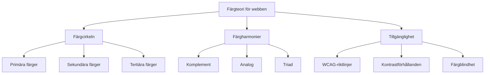

# Färg och kontrast

## Introduktion till färgteori för webben

Färg är ett av de mest kraftfulla verktygen i webdesign. Det påverkar användarupplevelse, känslor, tillgänglighet och konvertering. Som webbutvecklare är det viktigt att förstå både den teoretiska grunden och praktiska tillämpningen av färg.



## Grundläggande färgteori

### Färgcirkeln och färgmodeller

#### RGB (Red, Green, Blue) - För skärmar
```css
/* RGB-värden */
.primary-blue { background: rgb(59, 130, 246); }
.primary-green { background: rgb(16, 185, 129); }
.primary-red { background: rgb(239, 68, 68); }

/* RGB med alpha (transparens) */
.semi-transparent { background: rgba(59, 130, 246, 0.7); }
```

#### HSL (Hue, Saturation, Lightness) - Mer intuitiv
```css
/* HSL-värden - lättare att arbeta med */
.blue-base { background: hsl(217, 91%, 60%); }
.blue-light { background: hsl(217, 91%, 80%); }
.blue-dark { background: hsl(217, 91%, 40%); }

/* Skapa färgvariationer enkelt */
:root {
    --primary-hue: 217;
    --primary-sat: 91%;
    
    --primary-50: hsl(var(--primary-hue), var(--primary-sat), 97%);
    --primary-100: hsl(var(--primary-hue), var(--primary-sat), 94%);
    --primary-500: hsl(var(--primary-hue), var(--primary-sat), 60%);
    --primary-900: hsl(var(--primary-hue), var(--primary-sat), 20%);
}
```

### Färgegenskaper

#### Nyans (Hue)
Grundfärgen på färgcirkeln (0-360 grader).

#### Mättnad (Saturation)
Färgens intensitet (0-100%). 0% = gråskala, 100% = ren färg.

#### Ljushet (Lightness)
Hur ljus eller mörk färgen är (0-100%). 0% = svart, 100% = vit.

```css
/* Samma nyans, olika mättnad och ljushet */
.color-variations {
    --base-hue: 200;
}

.muted { background: hsl(var(--base-hue), 30%, 60%); }
.vibrant { background: hsl(var(--base-hue), 90%, 60%); }
.light { background: hsl(var(--base-hue), 60%, 85%); }
.dark { background: hsl(var(--base-hue), 60%, 25%); }
```

## Färgharmonier och paletter

### Monokromatisk färgpalett
Använder olika nyanser, mättnad och ljushet av samma färg.

```css
:root {
    /* Monokromatisk blå palett */
    --mono-50: hsl(210, 100%, 98%);
    --mono-100: hsl(210, 100%, 95%);
    --mono-200: hsl(210, 100%, 90%);
    --mono-300: hsl(210, 100%, 80%);
    --mono-400: hsl(210, 100%, 70%);
    --mono-500: hsl(210, 100%, 60%);
    --mono-600: hsl(210, 100%, 50%);
    --mono-700: hsl(210, 100%, 40%);
    --mono-800: hsl(210, 100%, 30%);
    --mono-900: hsl(210, 100%, 20%);
}

.card {
    background: var(--mono-50);
    border: 1px solid var(--mono-200);
    color: var(--mono-900);
}

.button-primary {
    background: var(--mono-600);
    color: white;
}

.button-primary:hover {
    background: var(--mono-700);
}
```

### Komplement färger
Färger som ligger mittemot varandra på färgcirkeln.

```css
:root {
    /* Komplement par: blå och orange */
    --primary: hsl(210, 100%, 50%);    /* Blå */
    --complement: hsl(30, 100%, 50%);  /* Orange */
}

.hero-section {
    background: var(--primary);
    color: white;
}

.cta-button {
    background: var(--complement);
    color: white;
}
```

### Analog färger
Färger som ligger bredvid varandra på färgcirkeln.

```css
:root {
    /* Analog färgpalett: blå-grön spektrum */
    --analog-1: hsl(180, 70%, 50%); /* Cyan */
    --analog-2: hsl(210, 70%, 50%); /* Blå */
    --analog-3: hsl(240, 70%, 50%); /* Blå-lila */
}

.gradient-background {
    background: linear-gradient(
        135deg,
        var(--analog-1),
        var(--analog-2),
        var(--analog-3)
    );
}
```

### Triad färger
Tre färger som är jämnt fördelade på färgcirkeln.

```css
:root {
    /* Triad: primära färger */
    --triad-1: hsl(0, 100%, 50%);    /* Röd */
    --triad-2: hsl(120, 100%, 50%);  /* Grön */
    --triad-3: hsl(240, 100%, 50%);  /* Blå */
}

.status-success { color: var(--triad-2); }
.status-warning { color: hsl(60, 100%, 40%); }
.status-error { color: var(--triad-1); }
.status-info { color: var(--triad-3); }
```

## Tillgänglighet och kontrast

### WCAG-riktlinjer för kontrast

```css
/* WCAG AA: Minst 4.5:1 för normal text */
.normal-text {
    background: #ffffff;
    color: #6b7280; /* Kontrastförhållande: 4.54:1 ✓ */
}

/* WCAG AAA: Minst 7:1 för normal text */
.high-contrast-text {
    background: #ffffff;
    color: #374151; /* Kontrastförhållande: 8.89:1 ✓ */
}

/* WCAG AA: Minst 3:1 för stor text (18pt+ eller 14pt+ bold) */
.large-text {
    font-size: 1.25rem;
    font-weight: 600;
    background: #ffffff;
    color: #9ca3af; /* Kontrastförhållande: 3.07:1 ✓ */
}
```

### Kontrastförhållanden beräkning
```javascript
// Funktion för att beräkna kontrastförhållande
function getContrastRatio(color1, color2) {
    const luminance1 = getLuminance(color1);
    const luminance2 = getLuminance(color2);
    
    const lighter = Math.max(luminance1, luminance2);
    const darker = Math.min(luminance1, luminance2);
    
    return (lighter + 0.05) / (darker + 0.05);
}

function getLuminance(color) {
    const [r, g, b] = color.match(/\d+/g).map(Number);
    const [rs, gs, bs] = [r, g, b].map(c => {
        c = c / 255;
        return c <= 0.03928 ? c / 12.92 : Math.pow((c + 0.055) / 1.055, 2.4);
    });
    return 0.2126 * rs + 0.7152 * gs + 0.0722 * bs;
}

// Användning
const ratio = getContrastRatio('rgb(255, 255, 255)', 'rgb(107, 114, 128)');
console.log(`Kontrastförhållande: ${ratio.toFixed(2)}:1`);
```

### CSS custom properties för tillgängliga färger

```css
:root {
    /* Tillgänglig färgpalett */
    --color-neutral-50: #fafafa;
    --color-neutral-100: #f4f4f5;
    --color-neutral-200: #e4e4e7;
    --color-neutral-300: #d4d4d8;
    --color-neutral-400: #a1a1aa;  /* 3.74:1 mot vit */
    --color-neutral-500: #71717a;  /* 5.74:1 mot vit */
    --color-neutral-600: #52525b;  /* 7.93:1 mot vit */
    --color-neutral-700: #3f3f46;  /* 10.52:1 mot vit */
    --color-neutral-800: #27272a;  /* 13.88:1 mot vit */
    --color-neutral-900: #18181b;  /* 16.68:1 mot vit */
    
    /* Semantiska färger med god kontrast */
    --color-success: #059669;      /* 4.5:1 mot vit */
    --color-warning: #d97706;      /* 4.52:1 mot vit */
    --color-error: #dc2626;        /* 5.9:1 mot vit */
    --color-info: #2563eb;         /* 5.14:1 mot vit */
}

/* Tillgängliga textstiler */
.text-accessible {
    color: var(--color-neutral-700);
    background: var(--color-neutral-50);
}

.text-high-contrast {
    color: var(--color-neutral-900);
    background: white;
}
```

## Färgblindhet och inklusivitet

### Deuteranopia-vänlig design
```css
/* Undvik problem med röd-grön färgblindhet */
.status-good {
    background: #2563eb; /* Blå istället för grön */
    color: white;
}

.status-bad {
    background: #dc2626; /* Röd */
    color: white;
}

.status-neutral {
    background: #6b7280; /* Grå */
    color: white;
}

/* Använd mönster och ikoner som stöd */
.status-indicator::before {
    content: '';
    display: inline-block;
    width: 8px;
    height: 8px;
    border-radius: 50%;
    margin-right: 0.5rem;
}

.status-good::before { background: #2563eb; }
.status-bad::before { 
    background: #dc2626;
    transform: rotate(45deg);
    border-radius: 0;
}
```

### Färgblindhetstestning
```css
/* CSS filter för att simulera färgblindhet */
.deuteranopia-simulation {
    filter: hue-rotate(180deg) saturate(0.7);
}

.protanopia-simulation {
    filter: sepia(1) saturate(0.8) hue-rotate(180deg);
}

.tritanopia-simulation {
    filter: hue-rotate(90deg) saturate(0.6);
}
```

## Psykologi och semantik

### Färgpsykologi för webben
```css
:root {
    /* Psykologiska färgassociationer */
    --trust-blue: #3b82f6;        /* Förtroende, stabilitet */
    --energy-orange: #f97316;     /* Energi, entusiasm */
    --nature-green: #10b981;      /* Natur, tillväxt, framgång */
    --luxury-purple: #8b5cf6;     /* Lyx, kreativitet */
    --warning-yellow: #fbbf24;    /* Uppmärksamhet, varning */
    --danger-red: #ef4444;        /* Fara, stopp, fel */
}

/* Brandspecifika färger */
.brand-tech {
    --primary: var(--trust-blue);
    --accent: var(--luxury-purple);
}

.brand-eco {
    --primary: var(--nature-green);
    --accent: #065f46; /* Mörkare grön */
}

.brand-finance {
    --primary: #1e40af; /* Mörkblå för seriositet */
    --accent: var(--trust-blue);
}
```

### Semantiska färger
```css
/* Konsistenta semantiska färger */
:root {
    --semantic-success: #10b981;
    --semantic-success-bg: #d1fae5;
    --semantic-success-border: #6ee7b7;
    
    --semantic-warning: #f59e0b;
    --semantic-warning-bg: #fef3c7;
    --semantic-warning-border: #fcd34d;
    
    --semantic-error: #ef4444;
    --semantic-error-bg: #fee2e2;
    --semantic-error-border: #fca5a5;
    
    --semantic-info: #3b82f6;
    --semantic-info-bg: #dbeafe;
    --semantic-info-border: #93c5fd;
}

.alert {
    padding: 1rem;
    border-radius: 0.5rem;
    border: 1px solid;
    margin-bottom: 1rem;
}

.alert-success {
    background: var(--semantic-success-bg);
    color: #065f46;
    border-color: var(--semantic-success-border);
}

.alert-error {
    background: var(--semantic-error-bg);
    color: #7f1d1d;
    border-color: var(--semantic-error-border);
}
```

## Dark mode och adaptiva färgscheman

### CSS custom properties för tema-switching
```css
:root {
    /* Light theme (default) */
    --bg-primary: #ffffff;
    --bg-secondary: #f8fafc;
    --text-primary: #1e293b;
    --text-secondary: #64748b;
    --border-color: #e2e8f0;
    --shadow: rgba(0, 0, 0, 0.1);
}

[data-theme="dark"] {
    /* Dark theme */
    --bg-primary: #0f172a;
    --bg-secondary: #1e293b;
    --text-primary: #f1f5f9;
    --text-secondary: #cbd5e1;
    --border-color: #334155;
    --shadow: rgba(0, 0, 0, 0.5);
}

/* Komponenter använder samma variabler */
.card {
    background: var(--bg-primary);
    color: var(--text-primary);
    border: 1px solid var(--border-color);
    box-shadow: 0 4px 6px var(--shadow);
}
```

### Prefers-color-scheme för automatisk anpassning
```css
:root {
    /* Light theme som standard */
    --bg-primary: #ffffff;
    --text-primary: #1e293b;
}

@media (prefers-color-scheme: dark) {
    :root {
        /* Automatisk dark mode */
        --bg-primary: #0f172a;
        --text-primary: #f1f5f9;
    }
}

/* JavaScript för manuell control */
.theme-toggle {
    background: var(--bg-secondary);
    border: 1px solid var(--border-color);
    color: var(--text-primary);
    padding: 0.5rem 1rem;
    border-radius: 0.25rem;
    cursor: pointer;
}
```

### JavaScript för tema-hantering
```javascript
// Tema-switching logik
class ThemeManager {
    constructor() {
        this.theme = localStorage.getItem('theme') || 'auto';
        this.applyTheme();
    }
    
    applyTheme() {
        if (this.theme === 'auto') {
            // Ta bort manuell tema-attribut för att låta prefers-color-scheme styra
            document.documentElement.removeAttribute('data-theme');
        } else {
            document.documentElement.setAttribute('data-theme', this.theme);
        }
    }
    
    setTheme(newTheme) {
        this.theme = newTheme;
        localStorage.setItem('theme', newTheme);
        this.applyTheme();
    }
    
    toggleTheme() {
        const themes = ['light', 'dark', 'auto'];
        const currentIndex = themes.indexOf(this.theme);
        const nextTheme = themes[(currentIndex + 1) % themes.length];
        this.setTheme(nextTheme);
    }
}

// Användning
const themeManager = new ThemeManager();

document.querySelector('.theme-toggle').addEventListener('click', () => {
    themeManager.toggleTheme();
});
```

## Gradients och avancerade färgtekniker

### Lineära gradienter
```css
.gradient-backgrounds {
    /* Enkel gradient */
    background: linear-gradient(135deg, #667eea 0%, #764ba2 100%);
    
    /* Multi-stop gradient */
    background: linear-gradient(
        135deg,
        #ff6b6b 0%,
        #feca57 35%,
        #48dbfb 70%,
        #ff9ff3 100%
    );
    
    /* Angled gradient */
    background: linear-gradient(
        45deg,
        transparent 30%,
        rgba(255, 255, 255, 0.1) 30%,
        rgba(255, 255, 255, 0.1) 70%,
        transparent 70%
    );
}
```

### Radiala gradienter
```css
.radial-gradients {
    /* Enkel radial gradient */
    background: radial-gradient(circle, #ff6b6b 0%, #764ba2 100%);
    
    /* Positionerad gradient */
    background: radial-gradient(
        circle at top right,
        #667eea 0%,
        transparent 50%
    );
    
    /* Ellips gradient */
    background: radial-gradient(
        ellipse 100px 50px at center,
        #ff6b6b 0%,
        transparent 100%
    );
}
```

### Conic gradienter
```css
.conic-gradients {
    /* Färghjul */
    background: conic-gradient(
        from 0deg,
        hsl(0, 100%, 60%),
        hsl(60, 100%, 60%),
        hsl(120, 100%, 60%),
        hsl(180, 100%, 60%),
        hsl(240, 100%, 60%),
        hsl(300, 100%, 60%),
        hsl(360, 100%, 60%)
    );
    
    /* Loading spinner */
    background: conic-gradient(
        from 0deg,
        transparent 70%,
        #3b82f6 100%
    );
}
```

## Färgverktyg och arbetsflöde

### CSS custom properties för färgsystem
```css
:root {
    /* Design tokens för färger */
    --color-primary-50: #eff6ff;
    --color-primary-100: #dbeafe;
    --color-primary-200: #bfdbfe;
    --color-primary-300: #93c5fd;
    --color-primary-400: #60a5fa;
    --color-primary-500: #3b82f6;
    --color-primary-600: #2563eb;
    --color-primary-700: #1d4ed8;
    --color-primary-800: #1e40af;
    --color-primary-900: #1e3a8a;
    
    /* Semantiska aliaser */
    --color-primary: var(--color-primary-600);
    --color-primary-hover: var(--color-primary-700);
    --color-primary-active: var(--color-primary-800);
    --color-primary-disabled: var(--color-primary-300);
}
```

### SCSS-funktioner för färggenerering
```scss
// SCSS-funktioner för färgpaletter
@function generate-color-scale($base-color, $steps: 9) {
    $scale: ();
    
    @for $i from 1 through $steps {
        $lightness: 95% - ($i - 1) * 10%;
        $color: hsl(hue($base-color), saturation($base-color), $lightness);
        $scale: map-merge($scale, (#{$i * 100}: $color));
    }
    
    @return $scale;
}

// Användning
$primary-blue: #3b82f6;
$blue-scale: generate-color-scale($primary-blue);

.button-primary {
    background: map-get($blue-scale, 600);
    
    &:hover {
        background: map-get($blue-scale, 700);
    }
}
```

### Färgvalidering och verktyg
```javascript
// Verktyg för färgvalidering
class ColorValidator {
    static isValidHex(color) {
        return /^#([A-Fa-f0-9]{6}|[A-Fa-f0-9]{3})$/.test(color);
    }
    
    static hexToHsl(hex) {
        const r = parseInt(hex.slice(1, 3), 16) / 255;
        const g = parseInt(hex.slice(3, 5), 16) / 255;
        const b = parseInt(hex.slice(5, 7), 16) / 255;
        
        const max = Math.max(r, g, b);
        const min = Math.min(r, g, b);
        const diff = max - min;
        const sum = max + min;
        
        const l = sum / 2;
        
        if (diff === 0) {
            return [0, 0, l * 100];
        }
        
        const s = l > 0.5 ? diff / (2 - sum) : diff / sum;
        
        let h;
        switch (max) {
            case r: h = ((g - b) / diff) + (g < b ? 6 : 0); break;
            case g: h = (b - r) / diff + 2; break;
            case b: h = (r - g) / diff + 4; break;
        }
        h /= 6;
        
        return [h * 360, s * 100, l * 100];
    }
    
    static generatePalette(baseColor) {
        const [h, s, l] = this.hexToHsl(baseColor);
        const palette = {};
        
        for (let i = 1; i <= 9; i++) {
            const lightness = 95 - (i - 1) * 10;
            palette[i * 100] = `hsl(${h}, ${s}%, ${lightness}%)`;
        }
        
        return palette;
    }
}
```

## Bästa praxis för färg i webbutveckling

### 1. Begränsa färgpaletten
```css
/* Begränsad, konsistent palett */
:root {
    /* Endast 2-3 huvudfärger + neutraler */
    --primary: #3b82f6;
    --secondary: #10b981;
    --accent: #f59e0b;
    
    /* Neutraler för text och bakgrund */
    --neutral-50: #f9fafb;
    --neutral-900: #111827;
}
```

### 2. Skapa semantiska färgtoken
```css
:root {
    /* Semantiska tokens istället för färgnamn */
    --color-text-primary: var(--neutral-900);
    --color-text-secondary: var(--neutral-600);
    --color-bg-primary: var(--neutral-50);
    --color-border: var(--neutral-200);
    
    --color-interactive: var(--primary);
    --color-interactive-hover: var(--primary-700);
    --color-interactive-active: var(--primary-800);
}
```

### 3. Testa tillgänglighet kontinuerligt
```css
/* Inkludera kontrastkommentarer */
.text-primary {
    color: #374151; /* 8.89:1 kontrast mot vit - WCAG AAA ✓ */
}

.text-secondary {
    color: #6b7280; /* 4.54:1 kontrast mot vit - WCAG AA ✓ */
}
```

## Verktyg och resurser

### Färgverktyg
- **Adobe Color**: Färghjul och palettgenerator
- **Coolors.co**: Snabb palettgenerering
- **Contrast Ratio**: WebAIM's kontrastchecker
- **Colour Contrast Analyser**: Desktop-app för tillgänglighetstestning

### Browser DevTools
```css
/* DevTools färgpicker */
.color-debug {
    background: #3b82f6; /* Klicka på färgrutan i DevTools */
    /* DevTools visar HSL, RGB, och kontrastinfo */
}
```

### CSS-in-JS färghantering
```javascript
// Styled-components eller emotion
const theme = {
    colors: {
        primary: {
            50: '#eff6ff',
            500: '#3b82f6',
            900: '#1e3a8a'
        }
    }
};

const Button = styled.button`
    background: ${props => props.theme.colors.primary[500]};
    color: white;
    
    &:hover {
        background: ${props => props.theme.colors.primary[600]};
    }
`;
```

## Sammanfattning

Effektiv färganvändning för webben kräver:
- **Teoretisk grund**: Färgcirkel, harmonier och kontrast
- **Tillgänglighet**: WCAG-riktlinjer och färgblindhet
- **Semantik**: Meningsfull färganvändning och psykologi
- **Teknisk implementation**: CSS custom properties och färgsystem
- **Testning**: Kontinuerlig validering av kontrast och användbarhet
- **Konsistens**: Begränsade paletter och designtoken

Genom att kombinera färgteori med teknisk kunskap kan du skapa visuellt tilltalande och tillgängliga webbupplevelser som fungerar för alla användare.
