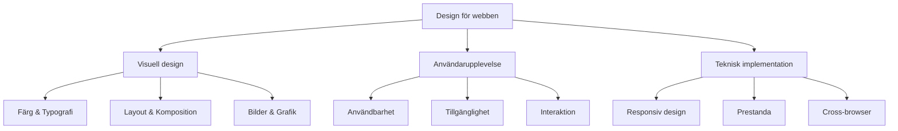
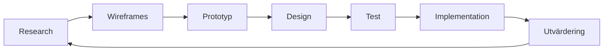

# Grundläggande designteori

## Introduktion till design för webbutvecklare

Design är inte bara om att göra saker "snygga" - det handlar om att skapa funktionella, användarvänliga och effektiva digitala upplevelser. Som webbutvecklare är det viktigt att förstå designprinciper för att kunna bygga webbplatser och applikationer som både ser bra ut och fungerar väl.



## De grundläggande designprinciperna

### 1. Balans (Balance)
Balans skapar visuell stabilitet och harmoni i en design. Det finns tre typer av balans:

**Symmetrisk balans**: Elementen är identiskt placerade på båda sidor av en central axel.
```css
.symmetric-layout {
    display: grid;
    grid-template-columns: 1fr 1fr;
    gap: 2rem;
}
```

**Asymmetrisk balans**: Olika element balanseras genom storlek, färg eller position.
```css
.asymmetric-layout {
    display: grid;
    grid-template-columns: 2fr 1fr;
    gap: 1.5rem;
}
```

**Radiell balans**: Element arrangeras runt en central punkt.

### 2. Hierarki (Hierarchy)
Visuell hierarki guidar användarens öga genom innehållet i ordning av viktighet.

```css
/* Typografisk hierarki */
h1 { font-size: 2.5rem; font-weight: 700; color: #1a1a1a; }
h2 { font-size: 2rem; font-weight: 600; color: #2d2d2d; }
h3 { font-size: 1.5rem; font-weight: 500; color: #404040; }
p { font-size: 1rem; font-weight: 400; color: #666; }
```

### 3. Kontrast (Contrast)
Kontrast skapar uppmärksamhet och förbättrar läsbarhet.

```css
/* Färgkontrast */
.high-contrast {
    background: #ffffff;
    color: #000000;
    /* Kontrastförhållande: 21:1 - WCAG AAA */
}

.accent-color {
    background: #007bff;
    color: #ffffff;
    /* Kontrastförhållande: 4.5:1 - WCAG AA */
}
```

### 4. Repetition (Repetition)
Repetition skapar enhet och konsistens genom återkommande element.

```css
/* Konsistenta marginaler */
.card, .button, .input {
    margin-bottom: 1.5rem;
    border-radius: 0.5rem;
    box-shadow: 0 2px 4px rgba(0,0,0,0.1);
}
```

### 5. Närhet (Proximity)
Relaterade element ska grupperas tillsammans för att skapa tydliga relationer.

```css
.form-group {
    margin-bottom: 1.5rem;
}

.form-group label,
.form-group input {
    display: block;
    margin-bottom: 0.25rem;
}
```

### 6. Inriktning (Alignment)
Alla element ska ha en tydlig visuell koppling genom inriktning.

```css
.text-content {
    text-align: left;
    max-width: 65ch; /* Optimal radlängd */
    line-height: 1.6;
}

.center-content {
    display: flex;
    align-items: center;
    justify-content: center;
}
```

## Designprocessen



### 1. Research och målgruppsanalys
- Vem är målgruppen?
- Vilka är deras behov och mål?
- Vilket problem löser vi?

### 2. Wireframing
Skapa enkla strukturskisser som fokuserar på layout och funktionalitet.

```html
<!-- Exempel: Enkel wireframe i HTML -->
<div class="wireframe">
    <header>[HEADER - Logo + Navigation]</header>
    <main>
        <section>[HERO - Stor rubrik + CTA]</section>
        <section>[CONTENT - 3 kolumner]</section>
    </main>
    <footer>[FOOTER - Kontaktinfo]</footer>
</div>
```

### 3. Prototyping
Skapa interaktiva prototyper för att testa användarflöden.

### 4. Visuell design
Applicera färg, typografi och bilder på prototypen.

### 5. Testning och iteration
Testa designen med riktiga användare och förbättra baserat på feedback.

## Komposition och whitespace

### The Rule of Thirds
Placera viktiga element längs linjer som delar upp området i tredjedelar.

```css
.hero-section {
    display: grid;
    grid-template-columns: 2fr 1fr;
    min-height: 100vh;
    align-items: center;
}

.hero-content {
    padding: 0 2rem;
    /* Innehållet placeras i vänster 2/3 */
}
```

### Whitespace (Negativt utrymme)
Whitespace är inte "tomt" utrymme - det är ett aktivt designelement.

```css
/* Bra användning av whitespace */
.content-section {
    padding: 4rem 2rem;
    margin-bottom: 3rem;
}

.text-block {
    line-height: 1.6;
    margin-bottom: 1.5rem;
}

.button {
    padding: 0.875rem 2rem;
    margin: 1rem 0;
}
```

## Visuell kommunikation

### Gestaltlagar (Gestalt Principles)
Hur människor tolkar visuell information:

1. **Närhet**: Element som är nära varandra uppfattas som relaterade
2. **Likhet**: Liknande element grupperas mentalt
3. **Kontinuitet**: Ögat följer linjer och kurvor
4. **Slutenhet**: Vi fyller i luckor för att skapa kompletta former
5. **Figur/bakgrund**: Vi skiljer objekt från bakgrund

### Användning i CSS

```css
/* Närhet - gruppera relaterade element */
.card-group {
    display: grid;
    grid-template-columns: repeat(auto-fit, minmax(300px, 1fr));
    gap: 1rem; /* Kort gap inom grupp */
    margin-bottom: 3rem; /* Längre gap till nästa grupp */
}

/* Likhet - visa relation genom stil */
.primary-button,
.secondary-button {
    padding: 0.75rem 1.5rem;
    border-radius: 0.5rem;
    font-weight: 600;
    transition: all 0.3s ease;
}
```

## Responsiv designteori

### Mobile-first approach
```css
/* Mobil först (default) */
.container {
    padding: 1rem;
    max-width: 100%;
}

/* Tablet */
@media (min-width: 768px) {
    .container {
        padding: 2rem;
        max-width: 750px;
        margin: 0 auto;
    }
}

/* Desktop */
@media (min-width: 1024px) {
    .container {
        padding: 3rem;
        max-width: 1200px;
    }
}
```

## Praktiska tips för webbutvecklare

### 1. Använd ett typografiskt system
```css
:root {
    --font-size-xs: 0.75rem;
    --font-size-sm: 0.875rem;
    --font-size-base: 1rem;
    --font-size-lg: 1.125rem;
    --font-size-xl: 1.25rem;
    --font-size-2xl: 1.5rem;
    --font-size-3xl: 1.875rem;
    --font-size-4xl: 2.25rem;
}
```

### 2. Skapa konsistenta spacing
```css
:root {
    --space-xs: 0.25rem;
    --space-sm: 0.5rem;
    --space-md: 1rem;
    --space-lg: 1.5rem;
    --space-xl: 2rem;
    --space-2xl: 3rem;
}
```

### 3. Använd semantiska färger
```css
:root {
    --color-primary: #3b82f6;
    --color-secondary: #64748b;
    --color-success: #10b981;
    --color-warning: #f59e0b;
    --color-error: #ef4444;
}
```

## Designverktyg för utvecklare

### 1. CSS-ramverk med designsystem
- **Tailwind CSS**: Utility-first framework
- **Bootstrap**: Komponentbaserat system
- **Bulma**: Modern CSS framework

### 2. Designverktyg
- **Figma**: Kollaborativ design
- **Adobe XD**: Prototyping och design
- **Sketch**: MacOS designverktyg

### 3. Inspiration och resurser
- **Dribbble**: Designinspiration
- **Behance**: Portfolio-plattform
- **Awwwards**: Prisade webbdesigns

## Sammanfattning

God design för webben kombinerar:
- **Funktionalitet**: Användaren kan lätt utföra sina uppgifter
- **Estetik**: Visuellt tilltalande och professionell
- **Användbarhet**: Intuitiv och tillgänglig för alla
- **Prestanda**: Snabb laddning och responsiv

Genom att förstå och tillämpa dessa grundläggande designprinciper kan du som webbutvecklare skapa digitala upplevelser som både fungerar väl och ser professionella ut.

## Nästa steg

I de kommande lektionerna kommer vi att fördjupa oss i:
- Typografi och läsbarhet
- Bildhantering och optimering
- Layout och grid-system
- Färgteori och kontrast
- Användarupplevelse (UX)
- Designsystem och komponenter

Varje lektion bygger på dessa grundläggande principer och ger dig verktygen att skapa genomtänkta, användarvänliga webbupplevelser.