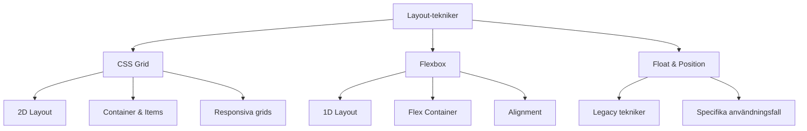

# Layout och grid-system

## Introduktion till modern webblayout

Modern webblayout har utvecklats från enkla tabellbaserade layouter till kraftfulla CSS-tekniker som Flexbox och CSS Grid. Dessa verktyg ger oss möjlighet att skapa komplexa, responsiva layouter som fungerar på alla enheter.



## CSS Grid - Tvådimensionell layout

CSS Grid är det mest kraftfulla layoutverktyget för att skapa komplexa, tvådimensionella layouter.

### Grundläggande grid-koncept

```css
/* Grid container */
.grid-container {
    display: grid;
    grid-template-columns: repeat(3, 1fr);
    grid-template-rows: auto 1fr auto;
    gap: 1.5rem;
    min-height: 100vh;
}

/* Grid items placeras automatiskt */
.header { grid-column: 1 / -1; }
.sidebar { grid-column: 1; grid-row: 2; }
.main { grid-column: 2 / -1; grid-row: 2; }
.footer { grid-column: 1 / -1; }
```

### Grid-template-areas för semantiska layouter

```css
.page-layout {
    display: grid;
    grid-template-areas:
        "header header header"
        "sidebar main main"
        "footer footer footer";
    grid-template-columns: 250px 1fr 1fr;
    grid-template-rows: auto 1fr auto;
    gap: 1rem;
    min-height: 100vh;
}

.header { grid-area: header; }
.sidebar { grid-area: sidebar; }
.main { grid-area: main; }
.footer { grid-area: footer; }
```

### Responsiv grid med auto-fit och minmax

```css
.card-grid {
    display: grid;
    grid-template-columns: repeat(auto-fit, minmax(300px, 1fr));
    gap: 2rem;
    padding: 2rem;
}

/* Kortet anpassar sig automatiskt */
.card {
    background: white;
    border-radius: 0.5rem;
    box-shadow: 0 2px 10px rgba(0,0,0,0.1);
    padding: 1.5rem;
    transition: transform 0.3s ease;
}

.card:hover {
    transform: translateY(-5px);
}
```

### Implicit grid för dynamiskt innehåll

```css
.photo-gallery {
    display: grid;
    grid-template-columns: repeat(auto-fill, minmax(200px, 1fr));
    grid-auto-rows: 200px;
    gap: 1rem;
}

/* Vissa bilder kan sträcka sig över flera celler */
.photo.featured {
    grid-column: span 2;
    grid-row: span 2;
}
```

## Flexbox - Endimensionell layout

Flexbox är perfekt för endimensionella layouter och alignment av element.

### Grundläggande flex-koncept

```css
/* Flex container */
.flex-container {
    display: flex;
    justify-content: space-between; /* Huvudaxel */
    align-items: center; /* Tvärsaxel */
    gap: 1rem;
}

/* Flex item egenskaper */
.flex-item {
    flex: 1; /* flex-grow: 1, flex-shrink: 1, flex-basis: 0 */
}

.flex-item.sidebar {
    flex: 0 0 250px; /* Fast bredd */
}

.flex-item.main {
    flex: 1; /* Tar kvarvarande utrymme */
}
```

### Flexbox för navigering

```css
.navbar {
    display: flex;
    justify-content: space-between;
    align-items: center;
    padding: 1rem 2rem;
    background: white;
    box-shadow: 0 2px 10px rgba(0,0,0,0.1);
}

.nav-brand {
    font-size: 1.5rem;
    font-weight: bold;
}

.nav-links {
    display: flex;
    list-style: none;
    margin: 0;
    padding: 0;
    gap: 2rem;
}

.nav-actions {
    display: flex;
    gap: 1rem;
}
```

### Centrera innehåll med flexbox

```css
.hero-section {
    display: flex;
    flex-direction: column;
    justify-content: center;
    align-items: center;
    min-height: 100vh;
    text-align: center;
    background: linear-gradient(135deg, #667eea 0%, #764ba2 100%);
    color: white;
}

.hero-content {
    max-width: 600px;
    padding: 2rem;
}
```

## Kombinera Grid och Flexbox

Grid och Flexbox kompletterar varandra perfekt i moderna layouter.

### Grid för övergripande layout, Flexbox för komponenter

```css
/* Grid för huvudlayout */
.app-layout {
    display: grid;
    grid-template-areas:
        "header"
        "main"
        "footer";
    grid-template-rows: auto 1fr auto;
    min-height: 100vh;
}

/* Flexbox för header-komponenten */
.header {
    grid-area: header;
    display: flex;
    justify-content: space-between;
    align-items: center;
    padding: 1rem 2rem;
}

/* Flexbox för footer-komponenten */
.footer {
    grid-area: footer;
    display: flex;
    justify-content: center;
    align-items: center;
    padding: 2rem;
    background: #f8f9fa;
}
```

### Responsiv navigation med båda teknikerna

```css
.main-nav {
    display: grid;
    grid-template-columns: auto 1fr auto;
    align-items: center;
    padding: 1rem 2rem;
}

.nav-menu {
    display: flex;
    justify-content: center;
    gap: 2rem;
    list-style: none;
    margin: 0;
    padding: 0;
}

/* Mobilanpassning */
@media (max-width: 768px) {
    .main-nav {
        grid-template-columns: 1fr auto;
        grid-template-areas:
            "brand toggle"
            "menu menu";
    }
    
    .nav-brand { grid-area: brand; }
    .nav-toggle { grid-area: toggle; }
    .nav-menu {
        grid-area: menu;
        grid-column: 1 / -1;
        flex-direction: column;
        padding-top: 1rem;
    }
}
```

## Responsiv design med grid-system

### Breakpoint-baserad responsiv design

```css
:root {
    --breakpoint-sm: 576px;
    --breakpoint-md: 768px;
    --breakpoint-lg: 992px;
    --breakpoint-xl: 1200px;
}

.container {
    max-width: 100%;
    margin: 0 auto;
    padding: 0 1rem;
}

@media (min-width: 576px) {
    .container { max-width: 540px; }
}

@media (min-width: 768px) {
    .container { max-width: 720px; }
}

@media (min-width: 992px) {
    .container { max-width: 960px; }
}

@media (min-width: 1200px) {
    .container { max-width: 1140px; }
}
```

### Fluid grid system

```css
.row {
    display: grid;
    grid-template-columns: repeat(12, 1fr);
    gap: 1.5rem;
}

.col-1 { grid-column: span 1; }
.col-2 { grid-column: span 2; }
.col-3 { grid-column: span 3; }
.col-4 { grid-column: span 4; }
.col-6 { grid-column: span 6; }
.col-8 { grid-column: span 8; }
.col-12 { grid-column: span 12; }

/* Responsiva kolumner */
@media (max-width: 768px) {
    .col-md-6 { grid-column: span 6; }
    .col-md-12 { grid-column: span 12; }
}

@media (max-width: 576px) {
    .col-sm-12 { grid-column: span 12; }
}
```

## Container queries - Framtidens responsiva design

Container queries låter oss anpassa komponenter baserat på deras container istället för viewport.

```css
.card-container {
    container-type: inline-size;
}

.card {
    padding: 1rem;
    background: white;
    border-radius: 0.5rem;
}

/* Anpassa baserat på container-storlek */
@container (min-width: 300px) {
    .card {
        display: grid;
        grid-template-columns: auto 1fr;
        gap: 1rem;
    }
}

@container (min-width: 500px) {
    .card {
        padding: 2rem;
    }
    
    .card-title {
        font-size: 1.5rem;
    }
}
```

## CSS Subgrid för komplex layout

Subgrid låter child-element delta i parent-gridets linjer.

```css
.main-grid {
    display: grid;
    grid-template-columns: repeat(4, 1fr);
    gap: 1rem;
}

.subgrid-container {
    grid-column: span 2;
    display: grid;
    grid-template-columns: subgrid;
    gap: inherit;
}

/* Child-elementen alignar med main-grid */
.subgrid-item {
    background: #f0f0f0;
    padding: 1rem;
}
```

## Prestandaoptimering för layouter

### CSS Containment för bättre prestanda

```css
.isolated-component {
    contain: layout style paint;
}

.article-list {
    contain: layout;
    display: grid;
    grid-template-columns: repeat(auto-fill, minmax(300px, 1fr));
    gap: 2rem;
}
```

### Will-change för smooth animationer

```css
.animated-grid-item {
    will-change: transform;
    transition: transform 0.3s ease;
}

.animated-grid-item:hover {
    transform: scale(1.05);
}
```

## Tillgänglighet i layouter

### Logical properties för internationalisering

```css
.content {
    margin-inline-start: 2rem; /* margin-left i LTR, margin-right i RTL */
    padding-block: 1rem; /* padding-top och padding-bottom */
    border-inline-end: 1px solid #ddd; /* border-right i LTR */
}
```

### Focus management i grid-layouter

```css
.grid-item:focus {
    outline: 2px solid #007bff;
    outline-offset: 2px;
    z-index: 1;
}

/* Skip-links för tangentbordsnavigation */
.skip-link {
    position: absolute;
    top: -40px;
    left: 6px;
    background: #000;
    color: #fff;
    padding: 8px;
    text-decoration: none;
    z-index: 1000;
}

.skip-link:focus {
    top: 6px;
}
```

## Praktiska layoutexempel

### Blog-layout med grid

```css
.blog-layout {
    display: grid;
    grid-template-areas:
        "header header header"
        "sidebar main aside"
        "footer footer footer";
    grid-template-columns: 250px 1fr 200px;
    grid-template-rows: auto 1fr auto;
    gap: 2rem;
    max-width: 1200px;
    margin: 0 auto;
    padding: 1rem;
    min-height: 100vh;
}

@media (max-width: 968px) {
    .blog-layout {
        grid-template-areas:
            "header"
            "main"
            "sidebar"
            "aside"
            "footer";
        grid-template-columns: 1fr;
    }
}
```

### E-handelsproduktgrid

```css
.product-grid {
    display: grid;
    grid-template-columns: repeat(auto-fill, minmax(280px, 1fr));
    gap: 2rem;
    padding: 2rem;
}

.product-card {
    display: grid;
    grid-template-rows: 200px auto auto auto;
    background: white;
    border-radius: 0.5rem;
    box-shadow: 0 2px 10px rgba(0,0,0,0.1);
    overflow: hidden;
    transition: transform 0.3s ease;
}

.product-card:hover {
    transform: translateY(-5px);
}

.product-image {
    background-size: cover;
    background-position: center;
}

.product-info {
    padding: 1rem;
    display: flex;
    flex-direction: column;
    gap: 0.5rem;
}

.product-actions {
    padding: 1rem;
    margin-top: auto;
}
```

## Verktyg och resurser

### CSS Grid/Flexbox generators
- **CSS Grid Generator**: Visuell grid-builder
- **Flexbox Froggy**: Interaktiv Flexbox-träning
- **Grid Garden**: CSS Grid-spel

### DevTools för layout-debugging
```css
/* Grid debugging */
.debug-grid {
    display: grid;
    /* Firefox DevTools visar grid-linjer */
}

/* Flexbox debugging */
.debug-flex {
    display: flex;
    /* Chrome DevTools visar flex-egenskaper */
}
```

### Layout-ramverk
- **CSS Grid Layout**: Native CSS
- **Tailwind CSS**: Utility-first grid
- **Bootstrap Grid**: 12-kolumnsystem

## Sammanfattning

Modern webblayout kombinerar:
- **CSS Grid**: För komplexa 2D-layouter och overall structure
- **Flexbox**: För 1D-layouter och komponentalignment
- **Responsiv design**: Mobile-first approach med breakpoints
- **Container queries**: Komponentbaserad responsivitet
- **Prestanda**: CSS containment och optimerade animationer
- **Tillgänglighet**: Logical properties och focus management

Genom att behärska dessa tekniker kan du skapa flexibla, responsiva och performanta layouter som fungerar perfekt på alla enheter och skärmstorlekar.
