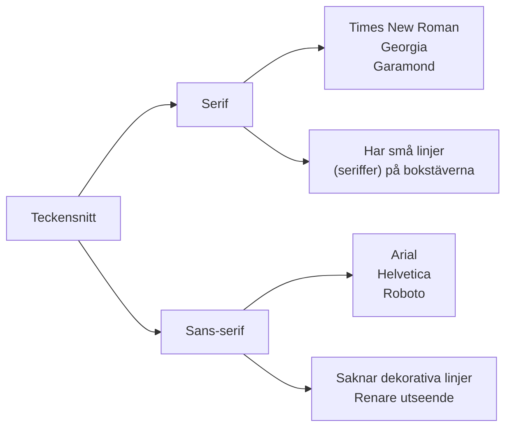

# Typografi

## Vad är typografi och varför är det viktigt?

Typografi är konsten och vetenskapen att arrangera text på ett sätt som gör den läsbar, tillgänglig och visuellt tilltalande. I webbutveckling är typografi avgörande för användarupplevelsen - dålig typografi kan göra även det bästa innehållet svårt att läsa, medan god typografi kan förbättra förståelsen och engagemanget hos användarna.

Som webbutvecklare kommer du att fatta typografiska beslut dagligen: vilka teckensnitt ska användas, hur stora ska rubrikerna vara, och hur mycket utrymme ska det vara mellan raderna? Dessa beslut påverkar direkt hur användarna interagerar med dina webbplatser.

## Grundläggande typografiska begrepp

### Teckensnitt vs Typsnitt (Font vs Typeface)

Ett **teckensnitt** (typeface) är den övergripande designen av bokstäver, siffror och symboler - till exempel "Arial" eller "Times New Roman". Ett **typsnitt** (font) är en specifik implementation av ett teckensnitt med bestämda egenskaper som storlek, vikt och stil - till exempel "Arial Bold 16px".

```css
/* Exempel på CSS-deklarationer */
font-family: Arial, sans-serif;        /* Teckensnitt */
font-size: 16px;                       /* Storlek */
font-weight: bold;                     /* Vikt */
font-style: italic;                   /* Stil */
```

### Serif vs Sans-serif



**Serif-teckensnitt** har små dekorativa linjer (seriffer) i ändarna av bokstävernas streck. De anses traditionellt vara mer läsvänliga i längre texter eftersom serifferna hjälper ögat att följa raderna.

**Sans-serif-teckensnitt** ("sans" betyder "utan" på franska) saknar dessa dekorativa element. De har ett modernare, renare utseende och fungerar ofta bättre på skärmar, särskilt i mindre storlekar.

### Typografisk hierarki

Hierarki handlar om att organisera text så att läsaren lätt kan förstå vad som är viktigast. Detta åstadkoms genom att variera:

- **Storlek** (size)
- **Vikt** (weight) - från light till bold
- **Färg** och kontrast
- **Avstånd** runt texten

```css
/* Exempel på typografisk hierarki */
h1 {
    font-size: 2.5rem;      /* 40px */
    font-weight: 700;       /* Bold */
    margin-bottom: 1rem;
}

h2 {
    font-size: 2rem;        /* 32px */
    font-weight: 600;       /* Semi-bold */
    margin-bottom: 0.75rem;
}

p {
    font-size: 1rem;        /* 16px */
    font-weight: 400;       /* Normal */
    margin-bottom: 1rem;
    line-height: 1.6;       /* Radavstånd */
}
```

## Läsbarhet i digital miljö

### Radlängd (Line Length)
Den optimala radlängden för läsbarhet är 45-75 tecken per rad. För långa rader gör det svårt för ögat att hitta början av nästa rad, medan för korta rader skapar för många radbrytningar.

```css
/* Begränsa radlängd med max-width */
.text-content {
    max-width: 65ch;  /* 65 tecken bred */
    margin: 0 auto;
}
```

### Radavstånd (Line Height)
Radavståndet ska vara 1.4-1.6 gånger textstorleken för optimal läsbarhet. För tätt text känns sammantryckt, medan för glest avstånd gör texten svår att följa.

```css
body {
    line-height: 1.5;  /* 150% av font-size */
}
```

### Kontrast
Tillräcklig kontrast mellan text och bakgrund är avgörande för tillgänglighet (accessibility). WCAG-riktlinjerna rekommenderar minst 4.5:1 kontrast för normal text.

## Webbtypsnitt och implementation

### System-teckensnitt (System Fonts)
Dessa finns förinstallerade på användarens dator och laddas snabbt:

```css
/* Modern system font stack */
font-family: -apple-system, BlinkMacSystemFont, 'Segoe UI', 
             Roboto, Oxygen, Ubuntu, Cantarell, sans-serif;
```

### Webbteckensnitt (Web Fonts)
Externa teckensnitt som laddas från internet, till exempel Google Fonts:

```html
<!-- I HTML head -->
<link href="https://fonts.googleapis.com/css2?family=Inter:wght@300;400;600;700&display=swap" rel="stylesheet">
```

```css
/* I CSS */
font-family: 'Inter', sans-serif;
```

**Prestandaöverväganden:** Webbteckensnitt kan påverka laddningstider. Använd `font-display: swap` för att visa reservteckensnitt medan webbteckensnittet laddas.

## Responsiv typografi

Typografi måste anpassas för olika skärmstorlekar. Använd relativa enheter (em, rem) istället för absoluta (px) för bättre skalbarhet:

```css
/* Responsiv typografisk skala */
html {
    font-size: 16px;  /* Basstorlek */
}

h1 {
    font-size: 2.5rem;  /* 40px på desktop */
}

/* För mobila enheter */
@media (max-width: 768px) {
    html {
        font-size: 14px;  /* Mindre basstorlek */
    }
    
    h1 {
        font-size: 2rem;  /* Proportionellt mindre */
    }
}
```

## Praktisk tillämpning: Skapa ett typografiskt system

Ett typografiskt system definierar alla textrelaterade stilar för ett projekt:

```css
/* Typografiskt system */
:root {
    /* Teckensnitt */
    --font-primary: 'Inter', sans-serif;
    --font-heading: 'Playfair Display', serif;
    
    /* Typografisk skala */
    --text-xs: 0.75rem;    /* 12px */
    --text-sm: 0.875rem;   /* 14px */
    --text-base: 1rem;     /* 16px */
    --text-lg: 1.125rem;   /* 18px */
    --text-xl: 1.25rem;    /* 20px */
    --text-2xl: 1.5rem;    /* 24px */
    --text-3xl: 1.875rem;  /* 30px */
    --text-4xl: 2.25rem;   /* 36px */
    
    /* Radavstånd */
    --leading-tight: 1.25;
    --leading-normal: 1.5;
    --leading-relaxed: 1.75;
}

/* Användning av systemet */
.heading-1 {
    font-family: var(--font-heading);
    font-size: var(--text-4xl);
    line-height: var(--leading-tight);
    font-weight: 700;
}

.body-text {
    font-family: var(--font-primary);
    font-size: var(--text-base);
    line-height: var(--leading-normal);
}
```

## Tillgänglighet och typografi

God typografi är avgörande för tillgänglighet:

- **Kontrast:** Minst 4.5:1 för normal text, 3:1 för stor text
- **Storlek:** Minst 16px för brödtext
- **Zoomning:** Text ska vara läsbar vid 200% zoom utan horisontell scrollning
- **Typsnitt:** Undvik dekorativa teckensnitt för längre texter

```css
/* Tillgänglig typografi */
.accessible-text {
    font-size: 1rem;           /* Minst 16px */
    line-height: 1.5;          /* God läsbarhet */
    color: #333;               /* Tillräcklig kontrast mot vit bakgrund */
    font-family: system-ui, sans-serif;  /* Läsbart teckensnitt */
}
```

## Vanliga typografiska misstag att undvika

1. **För många teckensnitt:** Begränsa dig till 2-3 teckensnitt per projekt
2. **Dålig kontrast:** Använd verktyg som WebAIM Contrast Checker
3. **För långa rader:** Håll radlängden under 75 tecken
4. **Inkonsistent spacing:** Skapa ett system för marginaler och padding
5. **Oläsliga kombinationer:** Testa alltid läsbarheten på riktiga enheter

Genom att följa dessa principer skapar du typografi som inte bara ser bra ut, utan också förbättrar användarupplevelsen och gör ditt innehåll tillgängligt för alla användare.