# Användarupplevelse (UX)

## Introduktion till UX för webbutvecklare

Användarupplevelse (User Experience, UX) handlar om hur användare upplever och interagerar med digitala produkter. Som webbutvecklare är det viktigt att förstå UX-principer för att skapa webbplatser och applikationer som är intuitiva, effektiva och tillfredsställande att använda.

```mermaid
graph TD
    A[UX Design Process] --> B[Research]
    A --> C[Design]
    A --> D[Test]
    A --> E[Iterate]
    
    B --> B1[Användarintervjuer]
    B --> B2[Personas]
    B --> B3[Konkurentanalys]
    
    C --> C1[Wireframes]
    C --> C2[Prototyper]
    C --> C3[Visuell design]
    
    D --> D1[Användartest]
    D --> D2[A/B test]
    D --> D3[Analytics]
    
    E --> E1[Iterativ förbättring]
    E --> E2[Kontinuerlig optimering]
```



## Grundläggande UX-principer

### 1. Användbarhet (Usability)
Hur lätt och effektivt användare kan utföra sina uppgifter.

#### Jakob Nielsens 10 heuristiker
```html
<!-- 1. System status synlighet -->
<div class="loading-indicator">
    <div class="spinner"></div>
    <span>Laddar innehåll...</span>
</div>

<!-- 2. Match system och verkliga världen -->
<button class="save-button">
    <i class="icon-floppy-disk"></i>
    Spara dokument
</button>

<!-- 3. Användarkontroll och frihet -->
<div class="breadcrumb">
    <a href="/hem">Hem</a> > 
    <a href="/produkter">Produkter</a> > 
    <span>Smartphone</span>
</div>

<!-- 4. Konsistens och standarder -->
<nav class="main-nav">
    <a href="/" class="nav-link">Hem</a>
    <a href="/om" class="nav-link">Om oss</a>
    <a href="/kontakt" class="nav-link">Kontakt</a>
</nav>
```

```css
/* Konsistent navigation styling */
.nav-link {
    padding: 0.75rem 1rem;
    text-decoration: none;
    color: #374151;
    transition: background-color 0.2s ease;
}

.nav-link:hover,
.nav-link.active {
    background-color: #f3f4f6;
    color: #1f2937;
}

/* Loading states för feedback */
.loading-indicator {
    display: flex;
    align-items: center;
    gap: 0.5rem;
    padding: 1rem;
    font-size: 0.875rem;
    color: #6b7280;
}

.spinner {
    width: 1rem;
    height: 1rem;
    border: 2px solid #e5e7eb;
    border-top: 2px solid #3b82f6;
    border-radius: 50%;
    animation: spin 1s linear infinite;
}

@keyframes spin {
    to { transform: rotate(360deg); }
}
```

### 2. Tillgänglighet (Accessibility)
Säkerställa att alla användare kan använda produkten.

```html
<!-- Semantisk HTML för skärmläsare -->
<main role="main">
    <section aria-labelledby="products-heading">
        <h2 id="products-heading">Våra produkter</h2>
        
        <article class="product-card" role="article">
            
            
            <h3>iPhone 14</h3>
            <p>Senaste modellen med förbättrad kamera</p>
            
            <button type="button" 
                    aria-describedby="price-14"
                    class="add-to-cart">
                Lägg i kundvagn
            </button>
            <span id="price-14" class="price">12 999 kr</span>
        </article>
    </section>
</main>

<!-- Skip links för tangentbordsnavigation -->
<div class="skip-links">
    <a href="#main-content" class="skip-link">
        Hoppa till huvudinnehåll
    </a>
    <a href="#main-nav" class="skip-link">
        Hoppa till navigering
    </a>
</div>
```

```css
/* Tillgänglig fokushantering */
.skip-link {
    position: absolute;
    top: -40px;
    left: 6px;
    background: #000;
    color: #fff;
    padding: 8px;
    text-decoration: none;
    z-index: 1000;
    border-radius: 0 0 4px 4px;
}

.skip-link:focus {
    top: 6px;
}

/* Tydlig fokusindikator */
button:focus,
a:focus,
input:focus {
    outline: 2px solid #3b82f6;
    outline-offset: 2px;
}

/* Reduced motion respekt */
@media (prefers-reduced-motion: reduce) {
    *,
    ::before,
    ::after {
        animation-duration: 0.01ms !important;
        animation-iteration-count: 1 !important;
        transition-duration: 0.01ms !important;
    }
}
```

### 3. Informationsarkitektur
Strukturera och organisera innehåll logiskt.

```html
<!-- Tydlig hierarki och struktur -->
<header class="site-header">
    <div class="container">
        <div class="header-brand">
            
            <span class="brand-name">WebbShop</span>
        </div>
        
        <nav class="main-navigation" aria-label="Huvudnavigation">
            <ul class="nav-list">
                <li><a href="/hem">Hem</a></li>
                <li class="dropdown">
                    <a href="/produkter" aria-expanded="false">
                        Produkter <span class="dropdown-arrow">▼</span>
                    </a>
                    <ul class="dropdown-menu">
                        <li><a href="/produkter/mobiler">Mobiler</a></li>
                        <li><a href="/produkter/laptops">Laptops</a></li>
                        <li><a href="/produkter/tillbehor">Tillbehör</a></li>
                    </ul>
                </li>
                <li><a href="/om">Om oss</a></li>
                <li><a href="/kontakt">Kontakt</a></li>
            </ul>
        </nav>
        
        <div class="header-actions">
            <button class="search-toggle" aria-label="Öppna sök">🔍</button>
            <a href="/kundvagn" class="cart-link">
                <span class="cart-icon">🛒</span>
                <span class="cart-count">3</span>
            </a>
        </div>
    </div>
</header>
```

```css
/* Visuell hierarki genom spacing och storlek */
.site-header {
    background: white;
    border-bottom: 1px solid #e5e7eb;
    padding: 1rem 0;
    position: sticky;
    top: 0;
    z-index: 100;
}

.container {
    max-width: 1200px;
    margin: 0 auto;
    padding: 0 1rem;
    display: flex;
    justify-content: space-between;
    align-items: center;
}

.header-brand {
    display: flex;
    align-items: center;
    gap: 0.75rem;
}

.logo {
    width: 40px;
    height: 40px;
}

.brand-name {
    font-size: 1.5rem;
    font-weight: 700;
    color: #1f2937;
}

/* Dropdown navigation */
.dropdown {
    position: relative;
}

.dropdown-menu {
    position: absolute;
    top: 100%;
    left: 0;
    background: white;
    border: 1px solid #e5e7eb;
    border-radius: 0.5rem;
    padding: 0.5rem 0;
    min-width: 150px;
    box-shadow: 0 10px 25px rgba(0,0,0,0.15);
    opacity: 0;
    visibility: hidden;
    transform: translateY(-10px);
    transition: all 0.2s ease;
}

.dropdown:hover .dropdown-menu {
    opacity: 1;
    visibility: visible;
    transform: translateY(0);
}
```

## Användarforskning och personas

### Skapande av personas
```javascript
// Persona template
const personaTemplate = {
    name: "Anna Andersson",
    age: 32,
    occupation: "Marknadsförare",
    location: "Stockholm",
    
    // Demografisk information
    demographics: {
        income: "45 000 kr/månad",
        education: "Högskoleexamen",
        familyStatus: "Sambo, inga barn"
    },
    
    // Teknikvanor
    technology: {
        devices: ["iPhone", "MacBook Pro", "iPad"],
        apps: ["Instagram", "LinkedIn", "Spotify"],
        webUsage: "8-10 timmar/dag",
        shoppingHabits: "Främst online, researchar innan köp"
    },
    
    // Mål och motivation
    goals: [
        "Hitta kvalitetsprodukter snabbt",
        "Jämföra priser effektivt",
        "Säker och smidig betalning"
    ],
    
    // Frustrationspunkter
    painPoints: [
        "Långsam laddningstid",
        "Komplicerad checkout-process",
        "Otydlig produktinformation"
    ],
    
    // Beteendemönster
    behaviors: {
        shoppingTriggers: ["Rekommendationer", "Erbjudanden", "Säsongsbehovet"],
        decisionFactors: ["Pris", "Kvalitet", "Leveranstid", "Recensioner"],
        preferredChannels: ["Webb", "Mobil app", "Social media"]
    }
};
```

### Användarresor (User Journeys)
```html
<!-- User journey mapping template -->
<div class="user-journey">
    <div class="journey-stage">
        <h3>Medvetenhet</h3>
        <div class="stage-content">
            <h4>Användarens tankar:</h4>
            <p>"Jag behöver en ny telefon, min gamla är för långsam"</p>
            
            <h4>Handlingar:</h4>
            <ul>
                <li>Söker på Google efter "bästa smartphone 2024"</li>
                <li>Läser recensioner</li>
                <li>Frågar vänner om råd</li>
            </ul>
            
            <h4>Känslor:</h4>
            <p>Nyfiken, något överväldigad av alla alternativ</p>
            
            <h4>Touchpoints:</h4>
            <ul>
                <li>Google sökning</li>
                <li>Recensionssiter</li>
                <li>Social media</li>
            </ul>
        </div>
    </div>
    
    <div class="journey-stage">
        <h3>Utvärdering</h3>
        <div class="stage-content">
            <h4>Användarens tankar:</h4>
            <p>"Vilken telefon passar mina behov och budget bäst?"</p>
            
            <h4>Handlingar:</h4>
            <ul>
                <li>Jämför specifikationer</li>
                <li>Läser detaljerade recensioner</li>
                <li>Besöker fysiska butiker</li>
            </ul>
            
            <h4>Känslor:</h4>
            <p>Fokuserad, vill göra rätt val</p>
            
            <h4>Touchpoints:</h4>
            <ul>
                <li>Webbplats produktsidor</li>
                <li>Jämförelsesiter</li>
                <li>Fysisk butik</li>
            </ul>
        </div>
    </div>
</div>
```

```css
.user-journey {
    display: grid;
    grid-template-columns: repeat(auto-fit, minmax(300px, 1fr));
    gap: 2rem;
    margin: 2rem 0;
}

.journey-stage {
    background: #f8fafc;
    border: 1px solid #e2e8f0;
    border-radius: 0.5rem;
    padding: 1.5rem;
}

.journey-stage h3 {
    color: #1e40af;
    margin-bottom: 1rem;
    padding-bottom: 0.5rem;
    border-bottom: 2px solid #3b82f6;
}

.stage-content h4 {
    color: #374151;
    margin: 1rem 0 0.5rem 0;
    font-size: 0.875rem;
    text-transform: uppercase;
    font-weight: 600;
}

.stage-content ul {
    margin: 0.5rem 0;
    padding-left: 1.5rem;
}

.stage-content li {
    margin: 0.25rem 0;
    color: #4b5563;
}
```

## Wireframing och prototyping

### Low-fidelity wireframes
```html
<!-- Enkel wireframe struktur -->
<div class="wireframe-container">
    <div class="wireframe-section" data-section="header">
        <div class="wireframe-element" data-element="logo">LOGO</div>
        <div class="wireframe-element" data-element="nav">NAVIGATION</div>
        <div class="wireframe-element" data-element="search">SEARCH</div>
    </div>
    
    <div class="wireframe-section" data-section="hero">
        <div class="wireframe-element large" data-element="hero-text">
            HUVUDRUBRIK
        </div>
        <div class="wireframe-element" data-element="cta">
            CALL TO ACTION
        </div>
    </div>
    
    <div class="wireframe-section" data-section="content">
        <div class="wireframe-grid">
            <div class="wireframe-element" data-element="feature">FUNKTION 1</div>
            <div class="wireframe-element" data-element="feature">FUNKTION 2</div>
            <div class="wireframe-element" data-element="feature">FUNKTION 3</div>
        </div>
    </div>
    
    <div class="wireframe-section" data-section="footer">
        <div class="wireframe-element" data-element="footer-links">FOOTER LINKS</div>
    </div>
</div>
```

```css
/* Wireframe styling */
.wireframe-container {
    max-width: 1200px;
    margin: 2rem auto;
    border: 2px solid #6b7280;
    background: #f9fafb;
}

.wireframe-section {
    border-bottom: 1px solid #d1d5db;
    padding: 1rem;
    display: flex;
    gap: 1rem;
    align-items: center;
}

.wireframe-section[data-section="header"] {
    background: #e5e7eb;
    justify-content: space-between;
}

.wireframe-section[data-section="hero"] {
    min-height: 200px;
    flex-direction: column;
    justify-content: center;
    text-align: center;
    background: #f3f4f6;
}

.wireframe-element {
    background: #d1d5db;
    border: 1px solid #9ca3af;
    padding: 0.5rem 1rem;
    font-family: monospace;
    font-size: 0.75rem;
    color: #374151;
    text-align: center;
}

.wireframe-element.large {
    font-size: 1.5rem;
    padding: 1rem 2rem;
    margin-bottom: 1rem;
}

.wireframe-grid {
    display: grid;
    grid-template-columns: repeat(3, 1fr);
    gap: 1rem;
    width: 100%;
}

/* Responsiv wireframe */
@media (max-width: 768px) {
    .wireframe-section[data-section="header"] {
        flex-direction: column;
        gap: 0.5rem;
    }
    
    .wireframe-grid {
        grid-template-columns: 1fr;
    }
}
```

### Interaktiva prototyper
```javascript
// Enkel prototyping interaktivitet
class WireframePrototype {
    constructor() {
        this.currentStep = 0;
        this.steps = [
            'Användaren landar på hemsidan',
            'Användaren klickar på "Produkter"',
            'Användaren väljer en kategori',
            'Användaren ser produktlistan',
            'Användaren klickar på en produkt',
            'Användaren ser produktdetaljer',
            'Användaren lägger produkt i kundvagn',
            'Användaren går till checkout'
        ];
        this.setupInteractions();
    }
    
    setupInteractions() {
        // Simulera navigation
        document.querySelectorAll('[data-prototype-action]').forEach(element => {
            element.addEventListener('click', (e) => {
                e.preventDefault();
                const action = e.target.dataset.prototypeAction;
                this.handleAction(action);
            });
        });
    }
    
    handleAction(action) {
        switch(action) {
            case 'navigate':
                this.showNavigationFeedback();
                break;
            case 'add-to-cart':
                this.showAddToCartFeedback();
                break;
            case 'checkout':
                this.showCheckoutFlow();
                break;
        }
    }
    
    showNavigationFeedback() {
        const feedback = document.createElement('div');
        feedback.className = 'prototype-feedback';
        feedback.textContent = 'Navigation aktiverad - användaren flyttas till ny sida';
        document.body.appendChild(feedback);
        
        setTimeout(() => {
            feedback.remove();
        }, 2000);
    }
    
    showAddToCartFeedback() {
        const cartIcon = document.querySelector('.cart-icon');
        if (cartIcon) {
            cartIcon.style.transform = 'scale(1.2)';
            cartIcon.style.backgroundColor = '#10b981';
            
            setTimeout(() => {
                cartIcon.style.transform = 'scale(1)';
                cartIcon.style.backgroundColor = '';
            }, 300);
        }
    }
}

// Initialisera prototype
document.addEventListener('DOMContentLoaded', () => {
    new WireframePrototype();
});
```

## Usability testing

### Testplanering och genomförande
```javascript
// Usability test framework
class UsabilityTest {
    constructor(testName, tasks) {
        this.testName = testName;
        this.tasks = tasks;
        this.currentTask = 0;
        this.startTime = null;
        this.results = [];
        this.setupTest();
    }
    
    setupTest() {
        this.createTestInterface();
        this.bindEvents();
    }
    
    createTestInterface() {
        const testContainer = document.createElement('div');
        testContainer.className = 'usability-test-container';
        testContainer.innerHTML = `
            <div class="test-header">
                <h2>Usability Test: ${this.testName}</h2>
                <div class="test-progress">
                    Uppgift ${this.currentTask + 1} av ${this.tasks.length}
                </div>
            </div>
            
            <div class="current-task">
                <h3>Aktuell uppgift:</h3>
                <p id="task-description">${this.tasks[0]?.description || ''}</p>
                <div class="task-timer">
                    Tid: <span id="timer">00:00</span>
                </div>
            </div>
            
            <div class="test-controls">
                <button id="start-task" class="btn btn-primary">Starta uppgift</button>
                <button id="complete-task" class="btn btn-success" disabled>
                    Slutför uppgift
                </button>
                <button id="skip-task" class="btn btn-secondary">
                    Hoppa över
                </button>
            </div>
            
            <div class="observations">
                <h4>Observationer:</h4>
                <textarea id="observations-text" 
                         placeholder="Anteckna användarens beteende och kommentarer...">
                </textarea>
            </div>
        `;
        
        document.body.appendChild(testContainer);
    }
    
    bindEvents() {
        document.getElementById('start-task').addEventListener('click', () => {
            this.startTask();
        });
        
        document.getElementById('complete-task').addEventListener('click', () => {
            this.completeTask(true);
        });
        
        document.getElementById('skip-task').addEventListener('click', () => {
            this.completeTask(false);
        });
    }
    
    startTask() {
        this.startTime = Date.now();
        document.getElementById('start-task').disabled = true;
        document.getElementById('complete-task').disabled = false;
        
        // Starta timer
        this.timerInterval = setInterval(() => {
            this.updateTimer();
        }, 1000);
    }
    
    updateTimer() {
        if (!this.startTime) return;
        
        const elapsed = Date.now() - this.startTime;
        const seconds = Math.floor(elapsed / 1000);
        const minutes = Math.floor(seconds / 60);
        const remainingSeconds = seconds % 60;
        
        document.getElementById('timer').textContent = 
            `${minutes.toString().padStart(2, '0')}:${remainingSeconds.toString().padStart(2, '0')}`;
    }
    
    completeTask(successful) {
        if (this.timerInterval) {
            clearInterval(this.timerInterval);
        }
        
        const endTime = Date.now();
        const duration = endTime - this.startTime;
        const observations = document.getElementById('observations-text').value;
        
        // Spara resultat
        this.results.push({
            taskId: this.currentTask,
            task: this.tasks[this.currentTask],
            successful: successful,
            duration: duration,
            observations: observations
        });
        
        // Nästa uppgift eller avsluta
        this.currentTask++;
        if (this.currentTask < this.tasks.length) {
            this.loadNextTask();
        } else {
            this.finishTest();
        }
    }
    
    loadNextTask() {
        document.getElementById('task-description').textContent = 
            this.tasks[this.currentTask].description;
        document.querySelector('.test-progress').textContent = 
            `Uppgift ${this.currentTask + 1} av ${this.tasks.length}`;
        document.getElementById('observations-text').value = '';
        document.getElementById('timer').textContent = '00:00';
        
        // Återställ knappar
        document.getElementById('start-task').disabled = false;
        document.getElementById('complete-task').disabled = true;
    }
    
    finishTest() {
        this.generateReport();
    }
    
    generateReport() {
        const report = {
            testName: this.testName,
            completedAt: new Date().toISOString(),
            totalTasks: this.tasks.length,
            successfulTasks: this.results.filter(r => r.successful).length,
            averageTime: this.results.reduce((sum, r) => sum + r.duration, 0) / this.results.length,
            results: this.results
        };
        
        console.log('Usability Test Report:', report);
        
        // Visa sammanfattning
        this.showSummary(report);
    }
    
    showSummary(report) {
        const summaryContainer = document.createElement('div');
        summaryContainer.className = 'test-summary';
        summaryContainer.innerHTML = `
            <h2>Test Sammanfattning</h2>
            <div class="summary-stats">
                <div class="stat">
                    <span class="stat-value">${report.successfulTasks}/${report.totalTasks}</span>
                    <span class="stat-label">Slutförda uppgifter</span>
                </div>
                <div class="stat">
                    <span class="stat-value">${(report.averageTime / 1000).toFixed(1)}s</span>
                    <span class="stat-label">Genomsnittlig tid</span>
                </div>
                <div class="stat">
                    <span class="stat-value">${((report.successfulTasks / report.totalTasks) * 100).toFixed(0)}%</span>
                    <span class="stat-label">Framgångsrate</span>
                </div>
            </div>
            
            <div class="detailed-results">
                <h3>Detaljerade resultat:</h3>
                ${report.results.map((result, index) => `
                    <div class="result-item ${result.successful ? 'success' : 'failed'}">
                        <h4>Uppgift ${index + 1}: ${result.task.description}</h4>
                        <p><strong>Status:</strong> ${result.successful ? 'Slutförd' : 'Misslyckad/Hoppades över'}</p>
                        <p><strong>Tid:</strong> ${(result.duration / 1000).toFixed(1)} sekunder</p>
                        <p><strong>Observationer:</strong> ${result.observations || 'Inga anteckningar'}</p>
                    </div>
                `).join('')}
            </div>
        `;
        
        document.querySelector('.usability-test-container').replaceWith(summaryContainer);
    }
}

// Exempel på test setup
const testTasks = [
    {
        id: 1,
        description: "Hitta och köp en smartphone under 8000 kr",
        expectedPath: ["Hem", "Produkter", "Mobiler", "Filter", "Produktsida", "Kundvagn"]
    },
    {
        id: 2,
        description: "Skapa ett användarkonto",
        expectedPath: ["Registrera", "Fyll i formulär", "Bekräfta email"]
    },
    {
        id: 3,
        description: "Hitta kontaktinformation",
        expectedPath: ["Kontakt-sida", "Hitta telefonnummer"]
    }
];

// Starta test
const test = new UsabilityTest("E-handelswebbplats", testTasks);
```

## A/B testing och optimering

### Implementering av A/B-tester
```javascript
// A/B testing framework
class ABTest {
    constructor(testName, variants) {
        this.testName = testName;
        this.variants = variants;
        this.userVariant = this.assignUserToVariant();
        this.events = [];
        this.init();
    }
    
    assignUserToVariant() {
        // Använd användare-id eller session för konsistent uppdelning
        const userId = this.getUserId();
        const hash = this.simpleHash(userId + this.testName);
        const variantIndex = hash % this.variants.length;
        return this.variants[variantIndex];
    }
    
    getUserId() {
        // Få eller skapa unikt användar-id
        let userId = localStorage.getItem('user_id');
        if (!userId) {
            userId = 'user_' + Math.random().toString(36).substr(2, 9);
            localStorage.setItem('user_id', userId);
        }
        return userId;
    }
    
    simpleHash(str) {
        let hash = 0;
        for (let i = 0; i < str.length; i++) {
            const char = str.charCodeAt(i);
            hash = ((hash << 5) - hash) + char;
            hash = hash & hash; // Convert to 32bit integer
        }
        return Math.abs(hash);
    }
    
    init() {
        // Applicera variant
        this.applyVariant();
        
        // Spåra visning
        this.trackEvent('variant_viewed', {
            variant: this.userVariant.name
        });
    }
    
    applyVariant() {
        const variant = this.userVariant;
        
        // Applicera CSS-ändringar
        if (variant.css) {
            const style = document.createElement('style');
            style.textContent = variant.css;
            document.head.appendChild(style);
        }
        
        // Applicera HTML-ändringar
        if (variant.changes) {
            variant.changes.forEach(change => {
                const element = document.querySelector(change.selector);
                if (element) {
                    if (change.type === 'text') {
                        element.textContent = change.value;
                    } else if (change.type === 'html') {
                        element.innerHTML = change.value;
                    } else if (change.type === 'attribute') {
                        element.setAttribute(change.attribute, change.value);
                    }
                }
            });
        }
    }
    
    trackEvent(eventName, data = {}) {
        const event = {
            test: this.testName,
            variant: this.userVariant.name,
            event: eventName,
            timestamp: Date.now(),
            data: data
        };
        
        this.events.push(event);
        
        // Skicka till analytics
        this.sendToAnalytics(event);
    }
    
    sendToAnalytics(event) {
        // Implementera din analytics-integrering här
        console.log('AB Test Event:', event);
        
        // Exempel med Google Analytics
        if (typeof gtag !== 'undefined') {
            gtag('event', event.event, {
                'ab_test_name': event.test,
                'ab_test_variant': event.variant,
                'custom_parameter': JSON.stringify(event.data)
            });
        }
    }
    
    // Hjälpmetod för att spåra konverteringar
    trackConversion(conversionType, value = null) {
        this.trackEvent('conversion', {
            type: conversionType,
            value: value
        });
    }
}

// Exempel på A/B test implementation
const buttonTest = new ABTest('cta_button_test', [
    {
        name: 'control',
        css: `
            .cta-button {
                background: #3b82f6;
                color: white;
                padding: 12px 24px;
                border-radius: 6px;
            }
        `,
        changes: [
            {
                selector: '.cta-button',
                type: 'text',
                value: 'Köp nu'
            }
        ]
    },
    {
        name: 'variant_a',
        css: `
            .cta-button {
                background: #10b981;
                color: white;
                padding: 16px 32px;
                border-radius: 8px;
                font-size: 18px;
            }
        `,
        changes: [
            {
                selector: '.cta-button',
                type: 'text',
                value: 'Handla direkt!'
            }
        ]
    }
]);

// Spåra klick på CTA-knappen
document.addEventListener('click', (e) => {
    if (e.target.matches('.cta-button')) {
        buttonTest.trackConversion('cta_click');
    }
});
```

## Metrics och KPI:er för UX

### Användbar analytics implementation
```javascript
// UX Metrics tracking
class UXMetrics {
    constructor() {
        this.startTime = Date.now();
        this.interactions = [];
        this.setupTracking();
    }
    
    setupTracking() {
        // Page load performance
        this.trackPageLoad();
        
        // User engagement
        this.trackScrollDepth();
        this.trackTimeOnPage();
        this.trackInteractions();
        
        // Error tracking
        this.trackErrors();
    }
    
    trackPageLoad() {
        window.addEventListener('load', () => {
            const loadTime = performance.timing.loadEventEnd - performance.timing.navigationStart;
            
            this.sendMetric('page_load_time', {
                duration: loadTime,
                url: window.location.href
            });
        });
    }
    
    trackScrollDepth() {
        let maxScroll = 0;
        
        window.addEventListener('scroll', () => {
            const scrollPercent = Math.round(
                (window.scrollY / (document.body.scrollHeight - window.innerHeight)) * 100
            );
            
            if (scrollPercent > maxScroll) {
                maxScroll = scrollPercent;
                
                // Spåra viktiga scroll milstones
                if (scrollPercent >= 25 && scrollPercent < 50) {
                    this.sendMetric('scroll_depth', { depth: '25%' });
                } else if (scrollPercent >= 50 && scrollPercent < 75) {
                    this.sendMetric('scroll_depth', { depth: '50%' });
                } else if (scrollPercent >= 75) {
                    this.sendMetric('scroll_depth', { depth: '75%' });
                }
            }
        });
    }
    
    trackTimeOnPage() {
        window.addEventListener('beforeunload', () => {
            const timeSpent = Date.now() - this.startTime;
            this.sendMetric('time_on_page', {
                duration: timeSpent,
                url: window.location.href
            });
        });
    }
    
    trackInteractions() {
        // Klick tracking
        document.addEventListener('click', (e) => {
            this.interactions.push({
                type: 'click',
                element: e.target.tagName,
                className: e.target.className,
                timestamp: Date.now()
            });
            
            // Spåra specifika CTA klick
            if (e.target.matches('.cta-button, .buy-button, .signup-button')) {
                this.sendMetric('cta_interaction', {
                    button_type: e.target.className,
                    text: e.target.textContent.trim()
                });
            }
        });
        
        // Form interactions
        document.addEventListener('focus', (e) => {
            if (e.target.matches('input, textarea, select')) {
                this.sendMetric('form_field_focus', {
                    field_type: e.target.type,
                    field_name: e.target.name
                });
            }
        }, true);
        
        // Form submissions
        document.addEventListener('submit', (e) => {
            this.sendMetric('form_submission', {
                form_id: e.target.id,
                form_action: e.target.action
            });
        });
    }
    
    trackErrors() {
        // JavaScript errors
        window.addEventListener('error', (e) => {
            this.sendMetric('javascript_error', {
                message: e.message,
                filename: e.filename,
                lineno: e.lineno,
                url: window.location.href
            });
        });
        
        // Network errors
        window.addEventListener('unhandledrejection', (e) => {
            this.sendMetric('promise_rejection', {
                reason: e.reason.toString(),
                url: window.location.href
            });
        });
    }
    
    sendMetric(metricName, data) {
        const metric = {
            name: metricName,
            timestamp: Date.now(),
            url: window.location.href,
            userAgent: navigator.userAgent,
            data: data
        };
        
        // Skicka till din analytics service
        console.log('UX Metric:', metric);
        
        // Implementera verklig analytics-integrering
        this.sendToAnalytics(metric);
    }
    
    sendToAnalytics(metric) {
        // Google Analytics
        if (typeof gtag !== 'undefined') {
            gtag('event', metric.name, {
                'metric_data': JSON.stringify(metric.data),
                'page_url': metric.url
            });
        }
        
        // Custom analytics endpoint
        fetch('/api/metrics', {
            method: 'POST',
            headers: {
                'Content-Type': 'application/json'
            },
            body: JSON.stringify(metric)
        }).catch(err => {
            console.warn('Failed to send metric:', err);
        });
    }
    
    // Core Web Vitals tracking
    trackCoreWebVitals() {
        // Largest Contentful Paint (LCP)
        new PerformanceObserver((entryList) => {
            const entries = entryList.getEntries();
            const lastEntry = entries[entries.length - 1];
            this.sendMetric('lcp', { value: lastEntry.startTime });
        }).observe({ entryTypes: ['largest-contentful-paint'] });
        
        // First Input Delay (FID)
        new PerformanceObserver((entryList) => {
            for (const entry of entryList.getEntries()) {
                this.sendMetric('fid', { value: entry.processingStart - entry.startTime });
            }
        }).observe({ entryTypes: ['first-input'] });
        
        // Cumulative Layout Shift (CLS)
        let clsValue = 0;
        new PerformanceObserver((entryList) => {
            for (const entry of entryList.getEntries()) {
                if (!entry.hadRecentInput) {
                    clsValue += entry.value;
                }
            }
            this.sendMetric('cls', { value: clsValue });
        }).observe({ entryTypes: ['layout-shift'] });
    }
}

// Initialisera UX metrics
document.addEventListener('DOMContentLoaded', () => {
    const uxMetrics = new UXMetrics();
    uxMetrics.trackCoreWebVitals();
});
```

## Bästa praxis för UX i webbutveckling

### Performance och Core Web Vitals
```css
/* Optimera för Core Web Vitals */

/* Largest Contentful Paint (LCP) */
.hero-image {
    /* Preload kritiska bilder */
    content-visibility: auto;
    contain-intrinsic-size: 300px;
}

/* First Input Delay (FID) */
.interactive-element {
    /* Undvik att blockera main thread */
    will-change: transform;
    transform: translateZ(0);
}

/* Cumulative Layout Shift (CLS) */
.dynamic-content {
    /* Reservera utrymme för dynamiskt innehåll */
    min-height: 200px;
    aspect-ratio: 16/9;
}

/* Loading states för bättre upplevd prestanda */
.loading-skeleton {
    background: linear-gradient(
        90deg,
        #f0f0f0 25%,
        #e0e0e0 50%,
        #f0f0f0 75%
    );
    background-size: 200% 100%;
    animation: loading 1.5s infinite;
}

@keyframes loading {
    0% { background-position: 200% 0; }
    100% { background-position: -200% 0; }
}
```

### Micro-interactions för bättre UX
```css
/* Subtila animationer för feedback */
.button {
    transition: all 0.2s ease;
    transform: translateY(0);
}

.button:hover {
    transform: translateY(-2px);
    box-shadow: 0 4px 8px rgba(0,0,0,0.15);
}

.button:active {
    transform: translateY(0);
    transition-duration: 0.1s;
}

/* Form feedback */
.input-field {
    border: 2px solid #e5e7eb;
    transition: border-color 0.2s ease;
}

.input-field:focus {
    border-color: #3b82f6;
    outline: none;
}

.input-field.error {
    border-color: #ef4444;
    animation: shake 0.5s ease-in-out;
}

@keyframes shake {
    0%, 100% { transform: translateX(0); }
    25% { transform: translateX(-5px); }
    75% { transform: translateX(5px); }
}

/* Progress indicators */
.progress-bar {
    width: 100%;
    height: 4px;
    background: #e5e7eb;
    border-radius: 2px;
    overflow: hidden;
}

.progress-fill {
    height: 100%;
    background: #3b82f6;
    transition: width 0.3s ease;
    transform-origin: left;
}
```

## Verktyg och resurser

### UX-verktyg för utvecklare
- **Figma**: Design och prototyping
- **Maze**: Användartestning av prototyper
- **Hotjar**: Heatmaps och användarinspelningar
- **Google Analytics**: Beteendeanalys
- **Lighthouse**: Performance och UX audit

### UX-testning och validering
```javascript
// Automated UX testing
class UXValidator {
    static validateAccessibility() {
        const issues = [];
        
        // Kontrollera alt-text på bilder
        document.querySelectorAll('img').forEach(img => {
            if (!img.alt) {
                issues.push({
                    type: 'accessibility',
                    message: 'Bild saknar alt-text',
                    element: img
                });
            }
        });
        
        // Kontrollera heading hierarki
        const headings = Array.from(document.querySelectorAll('h1, h2, h3, h4, h5, h6'));
        let expectedLevel = 1;
        
        headings.forEach(heading => {
            const level = parseInt(heading.tagName.substring(1));
            if (level > expectedLevel + 1) {
                issues.push({
                    type: 'accessibility',
                    message: `Heading nivå hoppar från h${expectedLevel} till h${level}`,
                    element: heading
                });
            }
            expectedLevel = level;
        });
        
        return issues;
    }
    
    static validateUsability() {
        const issues = [];
        
        // Kontrollera klickbara elementstorlekar
        document.querySelectorAll('button, a').forEach(element => {
            const rect = element.getBoundingClientRect();
            const minSize = 44; // 44px minimum touch target
            
            if (rect.width < minSize || rect.height < minSize) {
                issues.push({
                    type: 'usability',
                    message: `Klickbart element är mindre än ${minSize}px`,
                    element: element
                });
            }
        });
        
        return issues;
    }
    
    static generateReport() {
        const accessibilityIssues = this.validateAccessibility();
        const usabilityIssues = this.validateUsability();
        
        return {
            timestamp: new Date().toISOString(),
            totalIssues: accessibilityIssues.length + usabilityIssues.length,
            accessibility: accessibilityIssues,
            usability: usabilityIssues
        };
    }
}

// Kör UX-validering
console.log('UX Validation Report:', UXValidator.generateReport());
```

## Sammanfattning

Effektiv UX för webbutvecklare innebär:
- **Användarcentrerat tänkande**: Alltid börja med användarnas behov
- **Iterativ design**: Testa, lär och förbättra kontinuerligt
- **Data-driven beslut**: Använd analytics och användarfeedback
- **Tillgänglighet**: Skapa för alla användare
- **Performance**: Snabb och responsiv upplevelse
- **Användbarhet**: Intuitivt och effektivt interface

Genom att integrera UX-principer i utvecklingsprocessen kan du skapa webbupplevelser som inte bara fungerar tekniskt, utan också levererar värde och tillfredsställelse för användarna.
