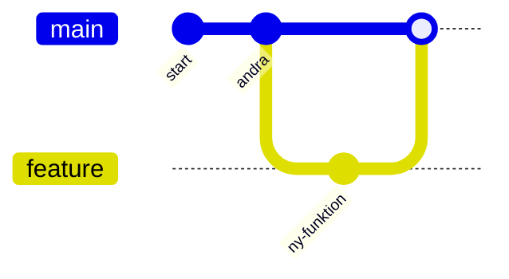

# Brancher och merge

Hittills har vi jobbat på en enda linje i **`portfolio-site`**. Men tänk om du vill prova en ny funktion utan att röra det som fungerar? Eller jobba på två saker parallellt? Det är vad **brancher** (grenar) är till för – och när du är klar slår du ihop dem med **merge** (sammanfogning).

> **Mål:**  
> Förstå vad en branch är, kunna skapa och byta branch, slå ihop ändringar med merge och hantera en enkel konflikt.

**Förutsättning:** Du kan kärnflödet från [Dina första commits](./forsta-commits.md) och har minst en commit i `portfolio-site`.

---

## Vad är en branch?

En **branch** (gren) är en egen utvecklingslinje. Standardbranchen heter `main`. När du skapar en ny branch får du en separat linje där du kan committa fritt utan att påverka `main`. När funktionen är klar **mergar** (sammanfogar) du tillbaka.

Liknelse: tänk dig en bok där huvudberättelsen är `main`. En branch är ett sidospår där du provar en alternativ handling. Blir den bra väver du in den i huvudberättelsen (merge); blir den dålig slänger du bara sidospåret – huvudboken är orörd.


*Diagram: en branch `feature` skapas, får en commit och mergas tillbaka till `main`.*

---

## Skapa och byta branch – `git switch`

```bash
git switch -c feature
```

- `git switch -c feature` skapar en ny branch `feature` och byter till den (`-c` = *create*).
- `git switch main` byter tillbaka till `main`.
- `git branch` listar alla brancher och visar med en `*` vilken du står på.

> Du kommer även se det äldre `git checkout -b feature` i guider på nätet. Det gör samma sak; `git switch` är den nyare, tydligare varianten.

**Prova själv:** Skapa en branch, kontrollera att du bytt, och committa en ändring där.

<!-- terminal -->
```bash
$ git switch -c feature
Switched to a new branch 'feature'
$ git branch
* feature
  main
$ git add about.html
$ git commit -m "Lägg till om-sidan"
[feature 9a8b7c6] Lägg till om-sidan
 1 file changed, 5 insertions(+)
```

> **Kör nu i din riktiga terminal:** I `portfolio-site`, kör `git switch -c about-page`, skapa filen `about.html`, committa den, och kör `git branch` för att se att du står på rätt branch.

> **Vanliga misstag**
>
> - **Committar på fel branch** → ändringen hamnar på `main` i stället för din feature-branch. Åtgärd: kör `git branch` *innan* du committar och kontrollera vilken branch som har `*`.
> - **Glömmer byta tillbaka till `main` före merge** → du försöker merga från fel håll. Åtgärd: `git switch main` först, sedan `git merge feature`.

---

## Slå ihop – `git merge`

När funktionen är klar går du tillbaka till `main` och slår ihop branchen dit.

```bash
git switch main
git merge feature
```

Om `main` inte ändrats under tiden gör Git en **fast-forward** – `main` flyttas helt enkelt fram till samma punkt som `feature`. Om båda brancherna har egna commits skapar Git i stället en **merge-commit** som binder ihop dem.

**Prova själv:** Byt till main och merga in din feature-branch.

<!-- terminal -->
```bash
$ git switch main
Switched to branch 'main'
$ git merge feature
Updating a1b2c3d..9a8b7c6
Fast-forward
 about.html | 5 +++++
 1 file changed, 5 insertions(+)
```

När en branch är mergad och inte behövs mer kan du ta bort den: `git branch -d feature`.

> **Kör nu i din riktiga terminal:** Byt till `main`, merga in `about-page`, och kör `git log --oneline --graph` för att se hur historiken ser ut.

---

## När det krockar: merge-konflikt

En **merge-konflikt** uppstår när två brancher ändrat *samma rader* i samma fil. Git kan inte gissa vilken version som är rätt, så den ber dig välja.

Filen får då konfliktmarkeringar:

```html
<<<<<<< HEAD
<h1>Välkommen till min portfolio</h1>
=======
<h1>Hej och välkommen!</h1>
>>>>>>> feature
```

- Allt mellan `<<<<<<< HEAD` och `=======` är versionen från din nuvarande branch (`main`).
- Allt mellan `=======` och `>>>>>>> feature` är versionen från branchen du mergar in.

**Så här löser du konflikten:**

1. Öppna filen och bestäm vilken text som ska vara kvar (en av dem, eller en kombination).
2. Ta bort markeringarna `<<<<<<<`, `=======` och `>>>>>>>`.
3. Spara, `git add` filen och `git commit` för att slutföra mergen.

**Prova själv:** Slutför en merge efter att du löst konflikten i filen.

<!-- terminal -->
```bash
$ git merge feature
Auto-merging index.html
CONFLICT (content): Merge conflict in index.html
Automatic merge failed; fix conflicts and then commit the result.
$ git add index.html
$ git commit -m "Slå ihop feature och lös konflikt i index.html"
[main 1c2d3e4] Slå ihop feature och lös konflikt i index.html
```

> Konflikter ser läskiga ut första gången, men de är helt normala och ofarliga – Git stannar och låter dig välja lugnt. Inget går förlorat.

### Miniövning: skapa och lös en konflikt (i din riktiga terminal)

Gör detta i `portfolio-site` för att öva på riktigt:

1. På `main`: öppna `index.html` och skriv `<h1>Min portfolio</h1>`. Committa.
2. Skapa branch: `git switch -c rubrik-andring`.
3. På branchen: ändra rubriken till `<h1>Hej! Jag heter Anna</h1>`. Committa.
4. Byt till `main`: `git switch main`.
5. På `main`: ändra *samma rad* till `<h1>Välkommen till min sida</h1>`. Committa.
6. Försök merga: `git merge rubrik-andring` → du får en konflikt.
7. Öppna `index.html`, välj en rubrik (eller kombinera), ta bort alla `<<<<<<<` / `=======` / `>>>>>>>`.
8. Slutför: `git add index.html` och `git commit -m "Lös konflikt i rubrik"`.

**Förväntat resultat:** `git status` visar *working tree clean* och `git log --oneline` visar din merge-commit.

---

## Prova brancher visuellt

Det bästa sättet att förstå brancher är att *se* dem. Nedan är [Learn Git Branching](https://learngitbranching.js.org/), en interaktiv sandlåda. Kommandona nedan körs automatiskt så du ser hur en branch skapas och mergas – skriv gärna egna kommandon direkt i rutan.

<!-- learngit -->
```bash
git commit
git checkout -b feature
git commit
git checkout main
git merge feature
```

---

## En blick framåt: rebase

Det finns ett alternativ till merge som heter **rebase**, som flyttar dina commits så historiken blir en rak linje i stället för att skapa en merge-commit. Det är kraftfullt men har fallgropar, så vi nöjer oss med att veta att det finns – vi håller oss till **merge** i den här kursen.

---

## Checkpoint

Innan du går vidare, kontrollera att du kan:

- [ ] Skapa en branch med `git switch -c` och se vilken branch du står på med `git branch`.
- [ ] Merga en branch tillbaka till `main` (fast-forward eller merge-commit).
- [ ] Förklara vad konfliktmarkeringarna `<<<<<<<`, `=======` och `>>>>>>>` betyder.
- [ ] Lösa en enkel konflikt genom att redigera filen, `git add` och `git commit`.

---

## Sammanfattning

En branch låter dig arbeta parallellt utan risk. Du skapar och byter med `git switch -c`/`git switch`, slår ihop med `git merge`, och löser en eventuell konflikt genom att redigera filen, `git add` och `git commit`. Med Learn Git Branching kan du öva visuellt. I nästa lektion kopplar vi `portfolio-site` till molnet med **GitHub**.
