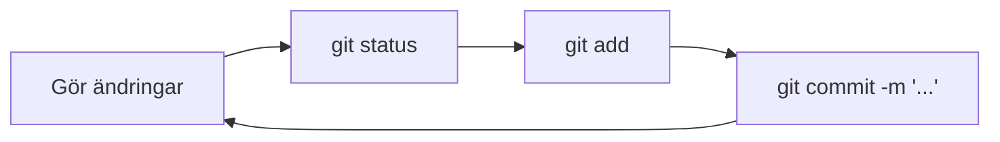

# Dina första commits

Det här är lektionen där allt klickar. Vi fortsätter med exempelprojektet **`portfolio-site`** och går igenom Gits kärnflöde steg för steg: `init → status → add → commit → log`. Efter varje steg får du prova själv i en simulerad terminal – och sedan i din riktiga.

> **Mål:**  
> Kunna skapa ett repository, se dess status, lägga till filer i staging och spara din första commit – och förstå vad varje steg gör.

**Förutsättning:** Du har installerat och ställt in Git (se [Vad är Git?](./vad-ar-git.md)).

> **Notera:** Terminalerna nedan är *guidade simuleringar* – kommandona körs inte på riktigt. Efter varje övning ska du göra samma sak i din egen terminal.

---

## Steg 0: Hitta rätt i terminalen

Git körs i terminalen, alltid **inuti din projektmapp**. Du behöver bara en handfull kommandon för att ta dig dit:

- **`pwd`** – visar var du är (*print working directory*).
- **`ls`** – listar filer och mappar. `ls -la` visar även dolda filer (som `.git`).
- **`cd mapp`** – går in i en mapp. `cd ..` går upp en nivå.
- **`mkdir namn`** – skapar en ny mapp (*make directory*).
- **`touch fil`** – skapar en tom fil.

Liknelse: terminalen är som att gå runt i ett hus utan att se rummen. `pwd` säger vilket rum du står i, `ls` visar vad som finns där, och `cd` är dörren till nästa rum.

**Prova själv:** Skapa mappen `portfolio-site`, gå in i den och lägg en tom `index.html` där. Klicka **Tips** om du fastnar.

<!-- terminal -->
```bash
$ mkdir portfolio-site
$ cd portfolio-site
$ pwd
/home/elev/portfolio-site
$ touch index.html
$ ls
index.html
```

> **Kör nu i din riktiga terminal:** Skapa mappen `portfolio-site` på din dator och kör samma kommandon. Kontrollera med `pwd` att du står i rätt mapp.

> **Windows:** I **Git Bash** fungerar kommandona ovan precis som här. I PowerShell kan `touch index.html` ersättas med `New-Item index.html`.

> **Vanliga misstag**
>
> - **Skriver `git` i fel mapp** → `fatal: not a git repository`. Åtgärd: `cd portfolio-site` innan du kör Git-kommandon.
> - **Glömmer `cd` efter `mkdir`** → du skapar mappen men står kvar utanför den. Åtgärd: kör alltid `cd portfolio-site` direkt efter `mkdir`.

---

## Steg 1: Skapa ett repository – `git init`

Det första du gör i ett *nytt* projekt är att starta ett Git-repository.

```bash
git init
```

Detta skapar en dold mapp `.git` i din projektmapp. Där sparar Git all historik. Du behöver bara köra `git init` **en gång** per projekt.

> **Lägeskollen efter `git init`:**
>
> | Working directory | Staging area | Historik |
> | --- | --- | --- |
> | `index.html` finns här | Tom | Inga commits än |

**Prova själv:**

<!-- terminal -->
```bash
$ git init
Initialized empty Git repository in /home/elev/portfolio-site/.git/
```

> **Kör nu i din riktiga terminal:** Stå i `portfolio-site` och kör `git init`. Kör sedan `ls -la` – du ska se mappen `.git`.

---

## Steg 2: Se läget – `git status`

`git status` är det kommando du kommer använda mest. Det svarar på frågan "var står jag just nu?".

```bash
git status
```

Det visar vilken branch du är på, vilka filer som ändrats men inte sparats, och vilka filer Git ännu inte spårar (*untracked*). Just nu ser Git din `index.html`, men spårar den inte än.

> **Lägeskollen efter `git status`:**
>
> | Working directory | Staging area | Historik |
> | --- | --- | --- |
> | `index.html` (untracked) | Tom | Inga commits än |
>
> *Untracked* betyder: Git ser filen men väntar på att du säger `git add`.

**Prova själv:**

<!-- terminal -->
```bash
$ git status
On branch main

No commits yet

Untracked files:
  (use "git add <file>..." to include in what will be committed)
        index.html

nothing added to commit but untracked files present (use "git add" to track)
```

> **Kör nu i din riktiga terminal:** Kör `git status` i `portfolio-site`. Du ska se `index.html` under "Untracked files".

---

## Steg 3: Förbered ändringen – `git add`

Innan du sparar måste du tala om *vilka* ändringar som ska med. Du lägger dem i **staging area**.

```bash
git add index.html
```

- `git add index.html` lägger till en specifik fil.
- `git add .` lägger till **alla** ändrade och nya filer (punkten betyder "den här mappen"). Mycket vanligt.

Kör du `git status` igen ligger filen nu under "Changes to be committed" – den är redo att sparas.

> **Lägeskollen efter `git add`:**
>
> | Working directory | Staging area | Historik |
> | --- | --- | --- |
> | Filen finns kvar här | `index.html` väntar på commit | Oförändrad |

**Prova själv:**

<!-- terminal -->
```bash
$ git add index.html
$ git status
On branch main

No commits yet

Changes to be committed:
  (use "git rm --cached <file>..." to unstage)
        new file:   index.html
```

> **Kör nu i din riktiga terminal:** Kör `git add index.html` och sedan `git status` igen. Filen ska nu ligga under "Changes to be committed".

> **Vanliga misstag**
>
> - **Committar utan `git add`** → `nothing to commit`. Åtgärd: lägg till filerna med `git add` först.
> - **Lägger till fel fil med `git add .`** → för många filer i staging. Åtgärd: använd `git add filnamn` när du bara vill ha vissa filer (mer om det i [Ångra och rätta till](./angra-andringar.md)).

---

## Steg 4: Spara – `git commit`

Nu förseglar du ögonblicksbilden. Varje commit måste ha ett **meddelande** som beskriver ändringen.

```bash
git commit -m "Skapa index.html"
```

- `-m` står för *message*. Skriv kort och beskrivande, gärna i imperativ: "Lägg till startsida", inte "Lade till startsidan".
- Ett bra meddelande hjälper både dig och andra att förstå historiken senare.

> **Lägeskollen efter `git commit`:**
>
> | Working directory | Staging area | Historik |
> | --- | --- | --- |
> | Ren (inga osparade ändringar) | Tom | Ny commit sparad |

**Prova själv:**

<!-- terminal -->
```bash
$ git commit -m "Skapa index.html"
[main (root-commit) a1b2c3d] Skapa index.html
 1 file changed, 0 insertions(+), 0 deletions(-)
 create mode 100644 index.html
```

> **Kör nu i din riktiga terminal:** Committa med ett eget meddelande. Kör `git status` – det ska stå *working tree clean*.

---

## Steg 5: Se historiken – `git log`

För att se alla commits du gjort:

```bash
git log --oneline
```

- `git log` visar full historik (tryck `q` för att avsluta om den är lång).
- `git log --oneline` ger en kompakt vy med commit-ID och meddelande – perfekt för en snabb överblick.

**Prova själv:**

<!-- terminal -->
```bash
$ git log --oneline
a1b2c3d Skapa index.html
```

> **Kör nu i din riktiga terminal:** Kör `git log --oneline` och bekräfta att din commit syns.

---

## Hela flödet på en gång

Det dagliga arbetsflödet ser alltid likadant ut:



1. **Gör ändringar** i filerna.
2. **`git status`** – se vad som ändrats.
3. **`git add`** – välj vad som ska med.
4. **`git commit -m "..."`** – spara.
5. Upprepa. Använd `git log` när du vill se historiken.

**Prova själv:** Kör hela flödet från tomt repository till första committen.

<!-- terminal -->
```bash
$ git init
Initialized empty Git repository in /home/elev/portfolio-site/.git/
$ git add index.html
$ git commit -m "Skapa index.html"
[main (root-commit) a1b2c3d] Skapa index.html
 1 file changed, 0 insertions(+), 0 deletions(-)
 create mode 100644 index.html
$ git log --oneline
a1b2c3d Skapa index.html
```

---

## Checkpoint

Innan du går vidare, kontrollera att du kan:

- [ ] Skapa mappen `portfolio-site` och initiera Git där.
- [ ] Förklara vad `git status` visar efter `git add` respektive efter `git commit`.
- [ ] Göra en commit med ett tydligt meddelande i imperativ form.
- [ ] Visa historiken med `git log --oneline`.

**Bonus:** Lägg till lite text i `index.html`, kör hela flödet igen (`status` → `add` → `commit` → `log`) och bekräfta att du nu har **två** commits.

---

## Sammanfattning

Du behärskar nu Gits kärna: `init` startar ett repo, `status` visar läget, `add` förbereder ändringar, `commit` sparar dem och `log` visar historiken. Det här flödet kommer du upprepa hundratals gånger i `portfolio-site` och alla framtida projekt. I nästa lektion lär vi oss hur man **ångrar** när något blev fel.
