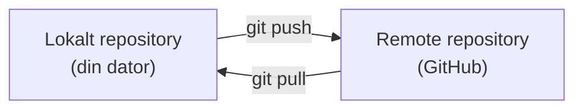

# Git och GitHub

Hittills har allt skett lokalt i **`portfolio-site`** på din dator. Men Gits verkliga styrka – säkerhetskopiering och samarbete – kommer när du kopplar ditt repository till en **remote** (fjärrserver) i molnet. Den vanligaste plattformen för det är **GitHub**.

> **Mål:**  
> Kunna koppla ett lokalt repository till GitHub samt skicka (`push`), hämta (`pull`) och klona (`clone`) kod.

**Förutsättning:** Du har ett gratiskonto på [GitHub](https://github.com/) och ett lokalt repository med minst en commit i `portfolio-site`.

---

## Vad är GitHub?

GitHub är en webbplats där du lagrar dina Git-repositories online. Det ger dig:

- **Backup:** koden finns säkert i molnet även om din dator går sönder.
- **Samarbete:** flera personer kan jobba i samma projekt och granska varandras kod.
- **Synlighet:** du kan visa upp dina projekt – en viktig portfölj när du söker jobb.

Viktigt att skilja på: **Git** är verktyget, **GitHub** är en tjänst som lagrar Git-repositories. Det finns liknande tjänster som GitLab och Bitbucket.


*Diagram: push skickar upp dina commits, pull hämtar ner andras.*

---

## Skapa ett tomt repo på GitHub

1. Logga in på GitHub och klicka på **+** uppe till höger → **New repository**.
2. Ge det ett namn, t.ex. `portfolio-site` (samma som din lokala mapp underlättar).
3. Välj **Public** (synligt för alla) eller **Private** (bara du och inbjudna).
4. **Viktigt:** har du redan ett lokalt repo – bocka **inte** i "Add a README", ".gitignore" eller "license". Du vill ha ett tomt repo att koppla till.
5. Klicka **Create repository**.

---

## Koppla ihop och pusha första gången

GitHub visar nu instruktioner under "…or push an existing repository from the command line". De består av tre kommandon:

```bash
git remote add origin https://github.com/ditt-anvandarnamn/portfolio-site.git
git branch -M main
git push -u origin main
```

- **`git remote add origin <url>`** – kopplar ditt lokala repo till GitHub. `origin` är standardnamnet på remoten.
- **`git branch -M main`** – ser till att din huvudbranch heter `main` (GitHubs standard).
- **`git push -u origin main`** – skickar upp dina commits. `-u` kopplar ihop din lokala branch med remoten, så att du senare bara behöver skriva `git push`.

**Prova själv:** Kör hela kopplingsflödet för `portfolio-site`.

<!-- terminal -->
```bash
$ git remote add origin https://github.com/elev/portfolio-site.git
$ git branch -M main
$ git push -u origin main
Enumerating objects: 3, done.
Counting objects: 100% (3/3), done.
Writing objects: 100% (3/3), 230 bytes, done.
To https://github.com/elev/portfolio-site.git
 * [new branch]      main -> main
branch 'main' set up to track 'origin/main'.
```

> **Säkerhet – autentisering:** GitHub tillåter inte lösenord i terminalen. När du pushar första gången loggar du in via webbläsaren, eller skapar en **personlig access token** (Settings → Developer settings) som du använder i stället för lösenord. Dela aldrig din token – den ger åtkomst till dina repon.

> **Kör nu i din riktiga terminal:** Skapa ett tomt repo på GitHub, koppla `portfolio-site` och pusha. Öppna repot i webbläsaren och bekräfta att dina commits syns.

---

## Första hjälpen vid push-problem

När push misslyckas är det nästan alltid ett av dessa problem:

| Felmeddelande / symptom | Trolig orsak | Åtgärd |
| --- | --- | --- |
| `Authentication failed` / `403` | Fel inloggning eller utgången token | Logga in igen via webbläsaren, eller skapa en ny personal access token på GitHub |
| `remote origin already exists` | Du har redan lagt till `origin` | Kör `git remote -v` för att se URL:en. Behöver du byta: `git remote set-url origin <ny-url>` |
| `failed to push some refs` / `rejected` | GitHub har commits du saknar lokalt (t.ex. du skapade README på GitHub) | Kör `git pull --rebase origin main` (eller skapa repot tomt från början) |
| `fatal: not a git repository` | Du står i fel mapp | `cd portfolio-site` och försök igen |
| `Repository not found` | Fel URL eller inga rättigheter till repot | Kontrollera att URL:en matchar ditt användarnamn och reponamn exakt |

> **Tips:** Kör `git remote -v` när något strular – det visar exakt vilken GitHub-URL ditt lokala repo är kopplat till.

---

## Det dagliga molnflödet

När repot väl är kopplat blir vardagen enkel:

```bash
git push
```
Skickar upp dina nya commits till GitHub.

```bash
git pull
```
Hämtar ner ändringar som någon annan (eller du själv från en annan dator) lagt upp, och slår ihop dem med din lokala kod.

> **Tips:** Kör `git pull` *innan* du börjar arbeta och innan du pushar. Då minskar du risken för konflikter (se [Brancher och merge](./brancher-och-merge.md)).

> **Vanliga misstag**
>
> - **Skapar README på GitHub trots befintligt lokalt repo** → första pushen misslyckas. Åtgärd: skapa repot tomt, eller kör `git pull` innan push.
> - **Pushar innan första commit** → inget att skicka. Åtgärd: gör minst en lokal commit först.
> - **Committar hemligheter och pushar** → synliga för alla på publika repon. Åtgärd: använd `.gitignore` *innan* första push (se nedan).

---

## Börja från ett befintligt projekt – `git clone`

Vill du jobba med ett projekt som redan finns på GitHub laddar du ner det med:

```bash
git clone https://github.com/anvandarnamn/projekt.git
```

Detta skapar en lokal mapp med alla filer och hela historiken, och kopplar automatiskt upp `origin` – så `git push` och `git pull` fungerar direkt.

> **Kör nu i din riktiga terminal (valfritt):** Klona ett publikt repo du gillar (t.ex. ett litet öppet kursprojekt) och kör `git log --oneline` i den nya mappen för att se hur andra strukturerar commits.

---

## Säkerhet: committa aldrig hemligheter

När du pushar till ett publikt repo blir allt synligt för hela världen – även av misstag uppladdade lösenord och API-nycklar. Skydda dig genom att lägga känsliga filer i en `.gitignore`-fil, så att Git ignorerar dem:

```
.env
*.log
node_modules/
```

Skulle en hemlighet ändå hamna på GitHub: byt ut/återkalla den direkt. Att radera filen i en ny commit räcker inte – den finns kvar i historiken.

---

## Checkpoint

Innan du går vidare, kontrollera att du kan:

- [ ] Skapa ett tomt repo på GitHub och koppla det med `git remote add origin`.
- [ ] Pusha `portfolio-site` och se dina commits på GitHub.
- [ ] Förklara skillnaden mellan `git push` och `git pull`.
- [ ] Veta vad du gör vid `Authentication failed` eller `remote origin already exists`.

**Bonus:** Gör en liten ändring lokalt, committa, pusha, och uppdatera GitHub-sidan tills du ser ändringen.

---

## Sammanfattning

GitHub lagrar ditt Git-repository i molnet för backup och samarbete. Du kopplar ihop med `git remote add origin`, skickar upp med `git push`, hämtar med `git pull` och laddar ner befintliga projekt med `git clone`. Tänk på autentisering med token, kolla felsöknings-tabellen om push strular, och lägg aldrig upp hemligheter – använd `.gitignore`. Nu har du allt du behöver för att versionshantera `portfolio-site`; dags att öva!
