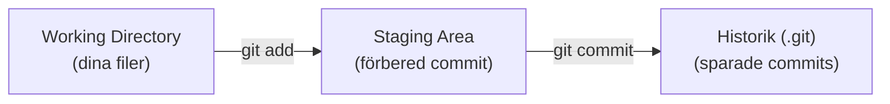

# Vad är Git?

Innan vi skriver ett enda kommando ska vi förstå *vad* Git egentligen är och vilka ord som används. Då blir kommandona i nästa lektion mycket lättare att förstå.

> **Mål:**  
> Förstå vad versionshantering är, lära dig Gits viktigaste begrepp, samt installera och ställa in Git på din dator.

---

## Versionshantering – en tidsmaskin för din kod

**Versionshantering** (version control) betyder att ett verktyg håller reda på alla ändringar i dina filer över tid. I stället för att spara `index_slutgiltig_v2_NY.html` kan du jobba i en enda fil och låta Git komma ihåg varje sparad version åt dig.

Tänk dig att du spelar ett tv-spel och sparar på olika ställen. Går något fel kan du alltid ladda en tidigare sparpunkt. Git är dina sparpunkter – fast för kod, och med obegränsat antal.

**Git** är det mest använda versionshanteringssystemet i världen. Det skapades av Linus Torvalds (mannen bakom Linux) och är *distribuerat*, vilket betyder att varje dator har en komplett kopia av hela projektets historik.

---

## Viktiga begrepp

Det räcker att känna igen dessa ord till att börja med – vi använder dem praktiskt i kommande lektioner.

- **Repository (repo):** Projektets "hem" – en mapp där Git sparar både dina filer och hela historiken (i en dold undermapp som heter `.git`).
- **Commit:** En sparad ögonblicksbild av projektet vid en viss tidpunkt, med ett meddelande som beskriver ändringen. Som ett foto av projektets tillstånd.
- **Working directory (arbetsmapp):** De filer du faktiskt ser och redigerar i din projektmapp just nu.
- **Staging area (mellanlager):** Ett mellanläge där du samlar ihop *exakt* de ändringar som ska med i nästa commit.
- **Branch (gren):** En egen utvecklingslinje där du kan jobba utan att påverka huvudversionen (oftast kallad `main`).

---

## Så hänger det ihop

En ändring reser genom tre steg: från din arbetsmapp, via staging, in i historiken.


*Diagram: Förenklat arbetsflöde i Git.*

Liknelsen med ett paket: i **working directory** lägger du saker på bordet, i **staging area** packar du ner det du faktiskt vill skicka, och **commit** är när du förseglar och daterar paketet. Allt som inte hamnade i lådan ligger kvar på bordet tills nästa gång.

> **Lägeskollen – var befinner sig en ändring?**
>
> | Plats | Vad betyder det? | Exempel |
> | --- | --- | --- |
> | Working directory | Du har redigerat en fil, men Git har inte förberett den än | Du skrev ny text i `index.html` |
> | Staging area | Ändringen är vald och väntar på nästa commit | Du körde `git add index.html` |
> | Historik | Ändringen är sparad som en commit | Du körde `git commit -m "..."` |
>
> `git status` berättar alltid var du befinner dig i tabellen ovan. Det är därför det kommandot är så viktigt.

---

## Installera Git

Kontrollera först om Git redan finns genom att öppna en terminal och köra `git --version`.

- **Windows:** Installera [Git for Windows](https://git-scm.com/download/win). Det inkluderar även **Git Bash**, en terminal där kommandona i den här boken fungerar precis som på macOS och Linux.
- **macOS:** Git följer ofta med Xcode Command Line Tools. Saknas det kör du `xcode-select --install`, eller installerar via Homebrew: `brew install git`.
- **Linux (Ubuntu/Debian):** `sudo apt install git`.

Kör `git --version` igen för att verifiera att det fungerar.

> **Kör nu i din riktiga terminal:** Öppna terminalen och skriv `git --version`. Om du får ett versionsnummer är du redo för nästa lektion.

---

## Ställ in Git (görs en gång)

Innan din första commit behöver Git veta vem du är. Namnet och e-posten knyts till varje commit du gör.

```bash
git config --global user.name "Ditt Namn"
git config --global user.email "din.epost@example.com"
```

- `--global` betyder att inställningen gäller för alla dina projekt på den här datorn.
- Du behöver bara göra detta en gång.

> **Säkerhet:** E-postadressen du anger blir synlig i alla publika commits du gör (t.ex. på GitHub). Använd en adress du är bekväm med att visa offentligt – GitHub erbjuder även en särskild "noreply"-adress om du vill dölja din riktiga e-post.

> **Kör nu i din riktiga terminal:** Ställ in namn och e-post med kommandona ovan (byt ut mot dina egna uppgifter).

> **Vanliga misstag**
>
> - **Glömmer ställa in namn/e-post** → Git varnar vid första commit, eller commits får fel författare. Åtgärd: kör `git config --global user.name` och `user.email` som ovan.
> - **Kör `git config` utan `--global` i fel mapp** → inställningen gäller bara den mappen. För kursen räcker `--global`.

---

## Checkpoint

Innan du går vidare, kontrollera att du kan:

- [ ] Förklara med egna ord vad en **commit** är.
- [ ] Beskriva skillnaden mellan **working directory**, **staging area** och **historik**.
- [ ] Köra `git --version` och se ett versionsnummer.
- [ ] Ha ställt in `user.name` och `user.email`.

---

## Sammanfattning

Git är ett versionshanteringssystem som låter dig spara ögonblicksbilder (commits) av ditt projekt, gå tillbaka i tiden och samarbeta tryggt. De centrala begreppen är **repository**, **commit**, **working directory**, **staging area** och **branch**. När Git är installerat och inställt med ditt namn och din e-post är du redo att göra din första commit i projektet `portfolio-site` – det gör vi i nästa lektion.
