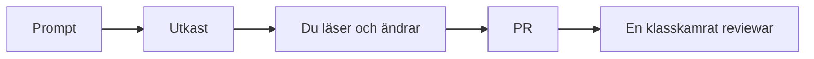

# AI i grupparbete

I modul 1–3 var AI och autocomplete avstängda så att HTML, CSS och Git skulle sätta sig i fingrarna. I det här grupparbetet är AI **tillåten**. På en arbetsplats är den också tillåten – och du är fortfarande ansvarig för det som landar på `main`.

> **Mål:**  
> Veta vad AI får göra i gruppen, hur du promptar mot `api.md`, och när en AI-diff måste avvisas i review.

**Förutsättning:** [Om AI-tjänster](../kapitel_1/Om-ai-tjänster.md) för grundregeln: AI ersätter inte förståelse. Här tillkommer *laget*.

---

## Regeln som inte förhandlas

**Du äger din pull request.** Om du inte kan förklara en rad för en klasskamrat ska den inte mergas – oavsett om Copilot, ChatGPT eller Claude skrev den.

Muntlig genomgång av **någon annans** PR är en del av bedömningen. "AI gjorde det" är inte ett svar.

AI är ett utkast. Review är människor.

---

## Tillåtet – och ofta smart

- **Utkast till `api.md`** utifrån era annoteringsfält. Ni redigerar sedan tillsammans.
- **Dockerfile och compose** mot *er* mappstruktur. Läs varje `COPY` och port.
- **Kontraktstester** som utgår från `api.md` ("skriv tre tester som faller om `title` saknas").
- **Sammanfatta en lång diff** så reviewern vet var hen ska börja – sen läser hen Files changed ändå.
- **Förklara ett felmeddelande** från Actions eller CORS.

Bra prompt-form:

> Här är vår `api.md` (klistra in). Generera *inte* en ny app. Skriv en `Dockerfile` för mappen `api/` som kör `npm ci` och `node src/server.js` på port 3000. Förklara varje rad kort.

Kontraktet i prompten är det som hindrar AI från att hitta på `userName` när ni sagt `title`.

---

## Inte tillåtet – även om det kompilerar

- Merga en PR du inte kan gå igenom rad för rad.
- Låta AI "fixa konflikten" utan att ni två tittar på `<<<<<<<`.
- Klistra in hemligheter i en chatt (`DATABASE_URL`, tokens).
- Byta kontraktet i koden men inte i `api.md` för att modellen "föredrog andra namn".
- Generera hela frontend *och* backend i ett svep och dumpa 40 filer i en PR.

En stor AI-PR är samma problem som en stor människo-PR: omöjlig att granska. Dela upp.

---

## Reviewa en AI-diff

Läs som om en stressad klasskamrat skrivit den klockan 23.

- Stämmer fält och statuskoder mot `api.md`?
- Finns `innerHTML` med API-data (XSS)?
- Skrevs `.env` in i någon fil?
- Är felvägarna där, eller bara happy path?
- Finns det beroenden ni inte kom överens om (`axios` när ni sagt `fetch`)?

Om svaret är "jag förstår inte den här helpern" – **Request changes**, inte Approve. Be författaren förklara i PR-tråden. Den förklaringen är lärandet.

---

## År 1 och år 2

År 1: AI får skriva `fetch`-skelett och CSS-utkast. Ni måste fortfarande kunna peka ut `API_BASE`, de tre tillstånden och var `altText` sätts.

År 2: AI får skriva seed, CORS och testerskelett. Ni måste kunna peka ut var kontraktet kan brytas och hur Actions kör `npm test`.

---

## Checkpoint

- [ ] Jag kan ge ett exempel på en tillåten och en otillåten AI-användning i *vår* grupp.
- [ ] Min senaste PR innehåller ingenting jag inte kan förklara.
- [ ] Jag har minst en gång avvisat eller ändrat AI-kod i review (eller i min egen diff).

Data, bilder och att lägga ut appen: [Data och publicera](./data-och-publicera.md).
