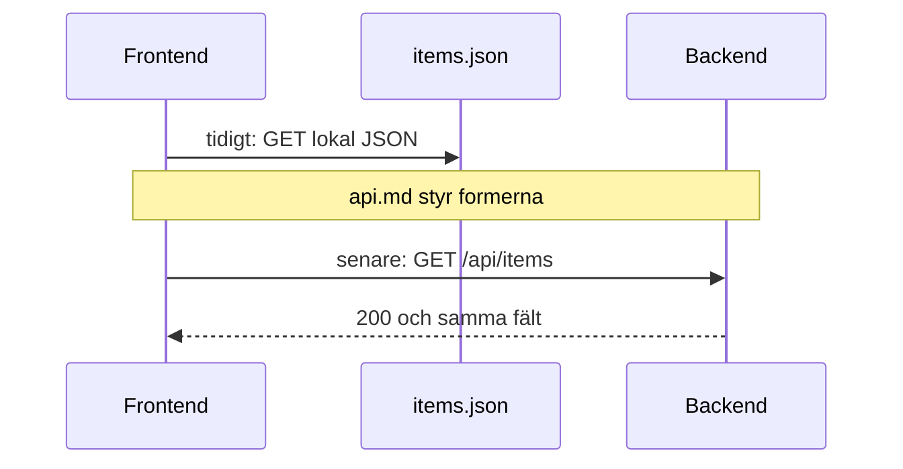

# API-kontraktet

Frontend och backend möts inte i en mapp. De möts i ett **kontrakt**: vilka URL:er som finns, vilka fält JSON:en har, och vilka statuskoder som betyder vad. Utan det gissar år 1 fältnamn och år 2 byter dem tyst – och integrationen spricker sista dagen.

> **Mål:**  
> Kunna skriva och följa en kort `api.md`, mocka data så frontend kan börja före API:t, och känna igen CORS och token-fel.

**Förutsättning:** Du kan JSON och `fetch` från [Hantera data](../kapitel_5/data-format.md) och [Fetch API](../kapitel_5/fetch.md). År 2 har REST-grunden från [RESTful API:er](../kapitel_9/rest-api.md).

---

## Varför ett kontrakt först

Liknelse: två personer bygger varsin halv bro. Om de inte kommit överens om höjd och fästpunkter möts de inte mitt i ån. `api.md` är ritningen.

År 2 **äger** filen. Att ändra ett fält är en issue och en PR, inte en tyst commit – år 1 bygger mot texten.



---

## En resurs ni faktiskt äger

Byt `Item` mot er domän (fågel, lunch, minnesmärke). Fälten ska matcha det ni annoterar när ni tar bilder.

| Metod | Endpoint | Handling | Lyckat svar |
| --- | --- | --- | --- |
| `GET` | `/api/items` | lista | `200 OK` |
| `GET` | `/api/items/:id` | en post | `200 OK` |
| `POST` | `/api/items` | skapa | `201 Created` |
| `PATCH` | `/api/items/:id` | ändra fält | `200 OK` |
| `DELETE` | `/api/items/:id` | ta bort | `204 No Content` |

Misslyckanden ni ska avtala:

- `400` ogiltig body (saknat fält, fel typ)
- `401` saknad eller ogiltig token, om ni har inloggning
- `404` id som inte finns
- `500` oväntat serverfel – frontend visar "något gick fel", inte stacktracen

### Exempelpost

```json
{
  "id": "a3f1",
  "title": "Koltrast vid matsalsfönstret",
  "description": "Hane, sjöng från eken.",
  "imageUrl": "/data/images/koltrast.jpg",
  "altText": "Svart fågel med orange näbb på en gren",
  "tags": ["fagel", "skolgard"],
  "observedAt": "2026-04-12",
  "createdAt": "2026-04-12T09:14:00.000Z"
}
```

`imageUrl` pekar på en **fil i repot** i början. Filuppladdning via `multipart/form-data` är valfritt senare – den äter tid och är inte målet med modulen.

Skriv detta i `api.md` med tre rubriker: **Endpoints**, **Fält**, **Felkoder**. En halvsida räcker. OpenAPI är valfritt om år 2 redan kan det; tvinga inte YAML på år 1.

---

## Mock så år 1 inte väntar

Lägg era första poster i `data/items.json` (en array med samma fält som kontraktet). Frontend kan då göra:

```javascript
const API_BASE = window.API_BASE ?? "./data";

async function listItems() {
  const response = await fetch(`${API_BASE}/items.json`);
  if (!response.ok) {
    throw new Error(`HTTP ${response.status}`);
  }
  return response.json();
}
```

När Docker-API:t lever byter ni `API_BASE` till `http://localhost:3000/api` och `listItems` till `${API_BASE}/items`. **Samma fält.** Om mocken och API:t divergerar har någon brutit kontraktet – öppna en issue.

En lokal JSON-fil klarar inte `POST`/`PATCH`/`DELETE`. Det är okej i fas 2: bygg listan och detaljvy mot mocken, koppla skrivande metoder när API:t svarar. Alternativ: ett litet mock-verktyg (till exempel json-server) om gruppen vill – det är inte ett krav.

---

## Två fel som stoppar nästan varje grupp

### CORS (Cross-Origin Resource Sharing)

Sidan på `http://localhost:8080` anropar API:t på `http://localhost:3000`. Webbläsaren ser det som två ursprung (origins) och blockerar svaret om servern inte skickar rätt CORS-headers.

Symptom: i DevTools under Network är anropet rött, konsolen nämner `Access-Control-Allow-Origin`.

Åtgärd (år 2): tillåt frontendens origin, inte `*` om ni skickar credentials. År 1: bekräfta att URL:en är rätt innan ni skyller på CSS.

### Token

Om API:t kräver inloggning skickar frontend token i en header, till exempel `Authorization: Bearer ...`. Ni övade token-tänk i [Fetch API](../kapitel_5/fetch.md).

Symptom: `401` på allt utom hälsokontrollen.

Åtgärd: avtala i `api.md` *om* auth finns, *var* token hamnar, och hur år 1 får en token under utveckling (en seed-användare räcker). Committa aldrig token till Git.

---

## Ändra kontraktet

1. Öppna en issue: "Lägg till fältet `place` på Item".
2. År 2 uppdaterar `api.md`, API och tester i en PR.
3. År 1 uppdaterar mocken och UI i en *annan* PR när kontraktet är mergat – eller i samma PR om ni parprogrammerar.

Att byta `title` till `name` i koden men inte i `api.md` är en bugg. Reviewern ska fånga det.

---

## Checkpoint

- [ ] `api.md` listar endpoints, fält och felkoder för er resurs.
- [ ] `data/items.json` har minst några poster med samma fält.
- [ ] Gruppen kan förklara CORS med en mening.
- [ ] Ni vet om API:t kräver token eller inte.

Nästa steg för processen: [GitHub-workflow](./github-workflow.md). År 1 kan parallellt läsa [Frontend mot API](./frontend.md).
