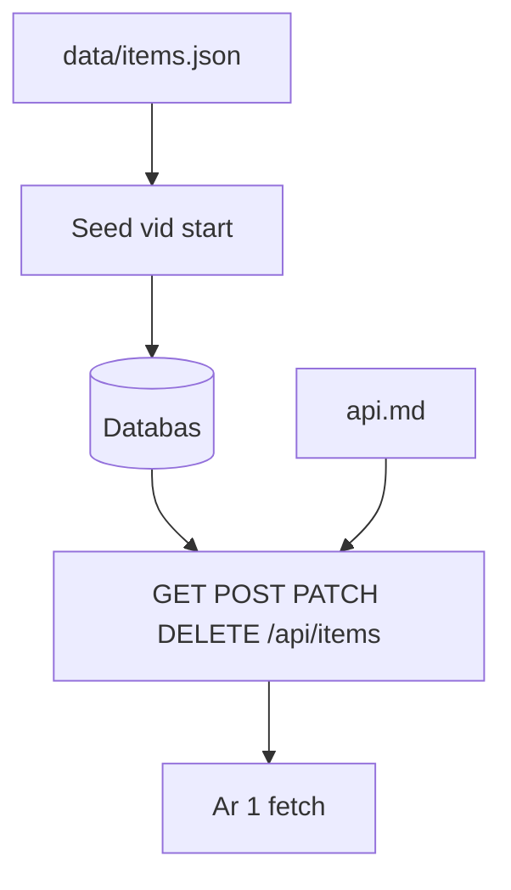

# Backend och API-dokumentation

År 2:s leverans är inte "ett ramverk". Det är ett **dokumenterat, körbart API** som år 1 kan lita på, plus Docker så de slipper er utvecklingsmiljö. REST och databaser kan ni redan – den här sidan säger vad som måste finnas för *gruppen*.

> **Mål:**  
> Exponera kontraktet, seeda från gruppens JSON, hålla hemligheter utanför Git och göra API:t trivialt att starta.

**Förutsättning:** [RESTful API:er](../kapitel_9/rest-api.md) (eller motsvarande ni just läst) och [API-kontraktet](./api-kontrakt.md). Ni väljer Express, Deno eller det ni kan – år 1 ser bara HTTP och JSON.

---

## Leveransen



Klart för år 2 i den här modulen:

1. `api.md` stämmer med det servern faktiskt gör.
2. Alla CRUD-endpoints för er resurs, med de statuskoder ni avtalet.
3. Seed från `data/items.json` (och bilder som statiska filer).
4. CORS mot frontendens origin.
5. `Dockerfile` + compose, se [Docker](./docker.md).
6. Några tester, se [Testning och GitHub Actions](./testning-och-actions.md).

Bygg inte filuppladdning förrän listan, detaljen och formulären fungerar mot fil-URL:er. Den här modulen betygssätter flödet, inte multipart.

---

## Seed från er data

Gruppen samlar poster i `data/items.json`. API:t ska kunna starta tomt och **fylla databasen** från den filen om tabellen är tom. Då ser år 1 samma koltrast som ni fotade, inte `Item 1`.

Pseudoflöde:

1. Läs `data/items.json`.
2. Om databasen saknar rader, inserta varje post (behåll `id` om kontraktet säger att ni styr id, annars mappa).
3. Logga hur många rader som seedades – det hjälper när någon tror att API:t är "tomt".

När annoteringarna uppdateras: antingen en issue "re-seeda" eller ett dokumenterat kommando i README (`npm run seed`). Kör inte seed som tyst raderar produktionsdata.

---

## Statiska bilder

Lägg bilderna i `data/images/`. API:t (eller nginx i compose) ska servera dem på den `imageUrl` som står i JSON, till exempel `/data/images/koltrast.jpg`.

Kolla att URL:en i seedad data **träffar en fil som finns**. En 404 på bilden är en databugg, inte en CSS-bugg.

---

## CORS och felkropp

Tillåt explicit `http://localhost:8080` (och senare den publicerade frontend-URL:en). Svara på `OPTIONS`.

Ensa felkroppen så frontend kan visa den:

```json
{ "error": "title is required" }
```

`400` med en tom body tvingar år 1 att gissa. Dokumentera formen i `api.md`.

---

## Miljövariabler

```
PORT=3000
DATABASE_URL=...
CORS_ORIGIN=http://localhost:8080
```

`.env` i `.gitignore`. `.env.example` i Git. README säger vilka värden som funkar mot compose-databasen.

Committa aldrig connection strings till Atlas eller lösenord. Om det händer: byt hemligheten, den finns kvar i historiken även om ni raderar filen i en ny commit.

---

## README-raderna år 1 behöver

Tre kommandon, inget mer:

```bash
cp api/.env.example api/.env
docker compose up --build
```

Sedan: "Öppna http://localhost:3000/api/items". Om det krävs mer har ni gömt för mycket i huvudet.

---

## Ändra API:t

Byte av fält = issue + PR som **uppdaterar `api.md` i samma diff** som koden och testerna. Reviewern avvisar PR:er där koden och kontraktet divergerar.

---

## Checkpoint

- [ ] `GET /api/items` returnerar seedad gruppdata med fälten från `api.md`.
- [ ] `POST`/`PATCH`/`DELETE` finns och ger avtalade koder.
- [ ] CORS tillåter frontendens origin.
- [ ] År 1 kan starta API:t med compose utan att installera ert ramverk.

Tester och röd/grön PR: [Testning och GitHub Actions](./testning-och-actions.md).
