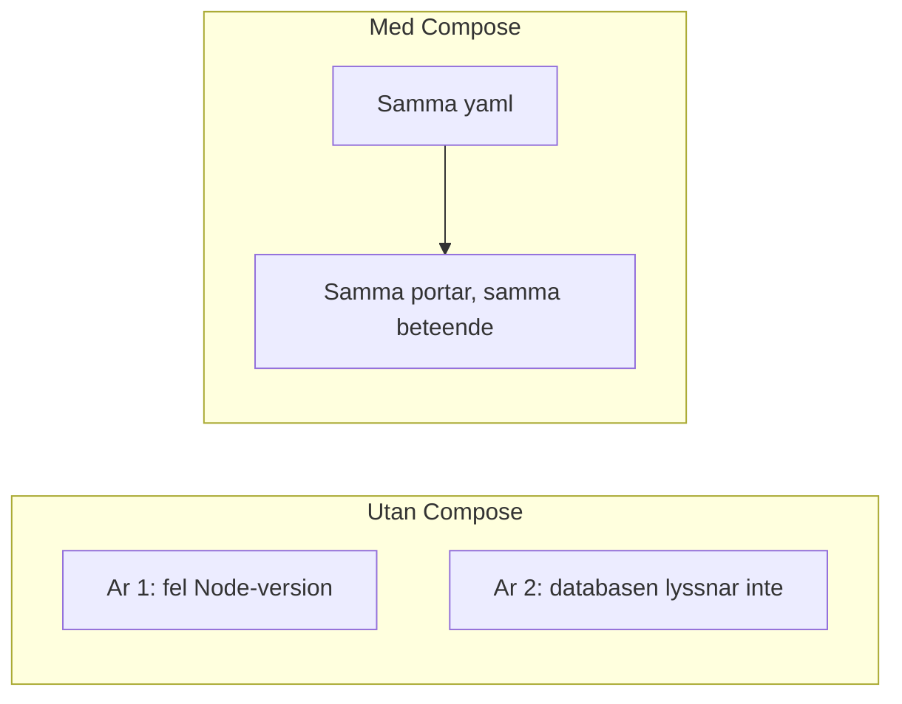

# Docker så ni kör samma sak

År 1 ska inte installera Node, MongoDB eller Deno "som år 2 har det". År 2 ska inte säga "det funkar på min dator". **Docker Compose** paketerar frontend, API och databas så att samma tre tjänster startar hos alla med ett kommando.

> **Mål:**  
> År 1 kan köra `docker compose up` och nå API:t i webbläsaren. År 2 kan skriva en `Dockerfile` och en compose-fil som matchar kontraktet.

**Förutsättning:** Docker Desktop (eller Docker Engine) igång. Begreppen image och container finns i [Introduktion till Docker](../kapitel_6/docker-intro.md) – läs den om orden är nya. Här övar vi bara *team-användningen*.

---

## Varför Docker i just den här gruppen



År 1:s lektion är **inte** att skriva Dockerfiler. Den är: klona, `docker compose up`, öppna URL:en i `api.md`. År 2 skriver filerna och tar issues när någon inte kommer igång.

---

## En compose-fil som räcker

Lägg `docker-compose.yml` i rotmappen. Byt databas-image om ni kör MySQL i stället för MongoDB – kontraktet ändras inte av det.

```yaml
services:
  frontend:
    image: nginx:alpine
    volumes:
      - ./frontend:/usr/share/nginx/html:ro
      - ./data:/usr/share/nginx/html/data:ro
    ports:
      - "8080:80"
    depends_on:
      - api

  api:
    build: ./api
    ports:
      - "3000:3000"
    env_file:
      - ./api/.env
    depends_on:
      - db

  db:
    image: mongo:7
    volumes:
      - dbdata:/data/db
    ports:
      - "27017:27017"

volumes:
  dbdata:
```

- Frontend på **http://localhost:8080** – statiska filer från `frontend/`.
- API på **http://localhost:3000** – det `API_BASE` pekar på när ni lämnar mocken.
- `data/` monteras in så bilder och `items.json` syns på samma origin som HTML, vilket förenklar tidig mock.

**År 2** lägger en `Dockerfile` i `api/`. Formen beror på er runtime; principen är densamma: installera beroenden, kopiera koden, `EXPOSE` samma port som compose.

```dockerfile
FROM node:22-alpine
WORKDIR /app
COPY package.json package-lock.json ./
RUN npm ci --omit=dev
COPY . .
EXPOSE 3000
CMD ["node", "src/server.js"]
```

Kopiera inte den blint om ni kör Deno – be AI generera *mot er* `package.json` eller `deno.json`, sen läs varje rad innan ni mergar. Se [AI i grupparbete](./ai-i-teamet.md).

---

## År 1: starta stacken

I rotmappen:

<!-- terminal -->
```bash
$ docker compose up --build
[+] Running 3/3
 ✔ Container ...-db-1        Created
 ✔ Container ...-api-1       Created
 ✔ Container ...-frontend-1  Created
Attaching to api-1, db-1, frontend-1
api-1  | lyssnar på port 3000
```

Öppna http://localhost:8080 för sidan och http://localhost:3000/api/items (eller den hälsokontroll ni avtalet i `api.md`).

Stoppa med `Ctrl+C`, eller i en annan terminal: `docker compose down`.

> **Kör nu i din riktiga terminal:** När år 2 har mergat compose-filen, kör `docker compose up --build` och bekräfta att API:t svarar JSON. Fungerar det inte: läs loggen för `api`-tjänsten, inte CSS:en.

---

## `.env` och hemligheter

`env_file: ./api/.env` laddar variabler in i containern. Filen **får inte** versioneras.

```
# .gitignore
.env
node_modules/
```

Lägg `api/.env.example` med tomma nycklar (`PORT=3000`, `DATABASE_URL=`) så klasskamrater vet vad som ska fyllas i. Det är dokumentation, inte hemligheter.

---

## Vanliga fel

| Symptom | Trolig orsak | Åtgärd |
| --- | --- | --- |
| `port is already allocated` | Något annat kör på 3000/8080 | Stoppa den processen, eller byt host-port i yaml (`8081:80`) |
| API dör direkt | Fel `CMD`, saknad `.env`, databasen inte redo | `docker compose logs api` |
| Frontend visar gammal HTML | Webbläsarcache, eller volymen pekar fel | Hård omladdning, kolla sökvägen i `volumes` |
| År 1 får CORS mot `:3000` | Sidan på `:8080` anropar annat origin | År 2 tillåter `http://localhost:8080` – se [API-kontraktet](./api-kontrakt.md) |

Ni behöver inte `docker system prune` i den här kursen. Rör inte andras images.

---

## Checkpoint

- [ ] `docker compose up --build` startar frontend, API och databas.
- [ ] År 1 kan öppna API-URL:en och känna igen fälten från `api.md`.
- [ ] `.env` är gitignored, `.env.example` finns.
- [ ] Jag vet att jag läser `docker compose logs` innan jag skyller på klasskamratens kod.

År 1: koppla `fetch` i [Frontend mot API](./frontend.md). År 2: [Backend och API-dokumentation](./backend.md).
