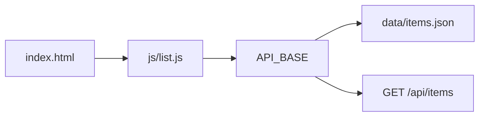

# Frontend mot API

År 1 bygger gränssnittet i **vanilla** HTML, CSS och JavaScript. Ni har redan hämtat data med `fetch` mot JSONPlaceholder. Skillnaden nu: URL:en och fälten står i **er** `api.md`, och sidan ska tåla att API:t är långsamt, tomt eller trasigt.

> **Mål:**  
> Kunna lista, visa, skapa, uppdatera och ta bort poster mot kontraktet, med tydliga tillstånd och en enda `API_BASE` att byta när mocken blir Docker.

**Förutsättning:** [Fetch API](../kapitel_5/fetch.md) och [API-kontraktet](./api-kontrakt.md). Du skriver inte React här.

---

## En bas-URL, två lägen

```javascript
// frontend/js/config.js
const API_BASE = window.API_BASE ?? "http://localhost:3000/api";
```

Ladda skripten i ordning i HTML (`config.js`, sedan `api.js`, sedan `list.js`) så `API_BASE` finns som en vanlig konstant – samma stil som i kapitel 5, utan `import`/`export`.

Tidigt, innan API:t lever, kan ni peka på mocken i stället – till exempel `"./data"` och `GET /items.json`. Byt **en** konstant när compose-stacken svarar. Sprid inte URL:en i tio filer.



---

## Mappförslag i `frontend/`

```
frontend/
  index.html
  item.html
  new.html
  css/style.css
  js/config.js
  js/api.js
  js/list.js
```

`api.js` pratar HTTP. `list.js` pratar DOM. Blanda inte `fetch` rakt i klick-hanterare om ni kan undvika det – då blir review enklare.

---

## `api.js` – ett tunt skal runt fetch

Mönstret är detsamma som i kapitel 5: kolla `response.ok`, läs JSON, kasta ett fel ni kan visa.

```javascript
async function request(path, options = {}) {
  const response = await fetch(`${API_BASE}${path}`, {
    headers: {
      "Content-Type": "application/json",
      ...options.headers,
    },
    ...options,
  });

  if (response.status === 204) {
    return null;
  }

  const data = await response.json().catch(() => null);

  if (!response.ok) {
    const message = data?.error ?? `HTTP ${response.status}`;
    throw new Error(message);
  }

  return data;
}

function listItems() {
  return request("/items");
}

function getItem(id) {
  return request(`/items/${id}`);
}

function createItem(body) {
  return request("/items", {
    method: "POST",
    body: JSON.stringify(body),
  });
}

function updateItem(id, body) {
  return request(`/items/${id}`, {
    method: "PATCH",
    body: JSON.stringify(body),
  });
}

function deleteItem(id) {
  return request(`/items/${id}`, { method: "DELETE" });
}
```

Fältnamnen i `body` ska vara **exakt** de i `api.md`. Hitta inte på `name` om kontraktet säger `title`.

Om API:t kräver token: lägg `Authorization` i `request`, inte i varje anrop. Spara inte token i Git.

---

## Tre tillstånd, varje vy

En lista som bara har "lyckat" ljuger när Wi-Fi dör.

```javascript
const statusEl = document.querySelector("#status");
const listEl = document.querySelector("#item-list");

statusEl.textContent = "Laddar…";

try {
  const items = await listItems();
  if (items.length === 0) {
    statusEl.textContent = "Inga poster ännu.";
    listEl.replaceChildren();
    return;
  }
  statusEl.textContent = "";
  renderList(items);
} catch (error) {
  statusEl.textContent = `Kunde inte hämta poster: ${error.message}`;
}
```

`renderList` använder `createElement` och `textContent`. Sätt inte `innerHTML` till data från API:t – det är XSS om någon post innehåller HTML. Bilder: `img.alt = item.altText`.

---

## Formulär mot POST/PATCH

Samla fält som kontraktet kräver (`title`, `description`, `altText`, `imageUrl`, `tags`, `observedAt`). `tags` kan vara en kommaseparerad sträng i input som ni splittar till en array innan `JSON.stringify`.

Efter lyckad `POST` (`201`): gå till listan eller till den nya postens `item.html?id=...`. Efter `400`: visa serverns feltext vid formuläret, inte en tom reload.

Ta bort (`DELETE`) bakom en bekräftelse (`confirm` räcker i den här modulen).

---

## Bilder

I början ligger filerna i `data/images/` och `imageUrl` är en sökväg ni själva skrivit i JSON. Frontend behöver ingen uppladdningsknapp. Visa bilden, visa `altText`, visa titel.

Om bilden saknas: visa en platshållare, inte en trasig ikon utan förklaring.

---

## Vanliga misstag

> - **Glömmer `response.ok`** → 404 renderar `undefined` i kortet. Åtgärd: samma mönster som i fetch-lektionen.
> - **Bygger mot fel fält** → `item.name` är `undefined` för att kontraktet säger `title`. Åtgärd: öppna `api.md` bredvid `list.js` i review.
> - **En globalt hårdkodad URL** → fungerar hos år 2 på port 3000, inte hos år 1 mot mocken. Åtgärd: `API_BASE`.
> - **Ingen tom vy** → det ser ut som en bugg när seed saknas. Åtgärd: explicit tomt tillstånd.

---

## Checkpoint

- [ ] Listan visar poster från mock eller API med bild, titel och `alt`.
- [ ] Laddar / tomt / fel syns på riktigt (dra ur API:t och bevisera det).
- [ ] Formulär skickar JSON som `api.md` beskriver.
- [ ] `API_BASE` är det enda ni byter vid integration.

År 2:s sida av samma mynt: [Backend och API-dokumentation](./backend.md).
