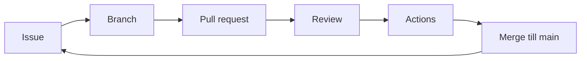

# GitHub-workflow

Git-kommandona kan ni redan: commit, branch, push, pull. Det som saknas är **hur ett team rör sig på GitHub** – från en mening i en issue till en granskad pull request (PR) som får mergas. Det är hjärtat i det här kapitlet.

> **Mål:**  
> Kunna öppna en issue, skapa en branch från den, skriva en PR, granska någon annans PR och hantera en konflikt tillsammans.

**Förutsättning:** [Brancher och merge](../git/brancher-och-merge.md) och [Git och GitHub](../git/github.md). Du har skyddat `main` enligt [kickoffen](./roller.md).

---

## Loopen ni upprepar



*Diagram: en uppgift lever som issue tills en PR med grön CI är mergad. Sedan tar ni nästa.*

En person tar **en** issue i taget. Halvfärdiga brancher som blandar tre features är svåra att granska – och review är poängen.

---

## Issues och labels

En **issue** är en uppgift med ett namn, en beskrivning och ett "klart när". Den är inte en chatt.

Bra issue:

> **Titel:** Lista poster som kort i `frontend/index.html`  
> **Klart när:** givet `data/items.json` med 10 poster renderas 10 kort med bild, titel och `alt`. Tom lista visar ett tydligt tomt tillstånd.

Dålig issue: "Gör frontend" – för stor, inget klart-kriterium.

**Labels** (etiketter) ni kan skapa under Issues → Labels:

- `frontend` / `backend` / `docs` / `docker`
- `bug` / `enhancement`
- `year-1` / `year-2`

**Projects:** skapa en GitHub Project-board med kolumnerna `Backlog`, `Pågår`, `Review`, `Klart`. Koppla issues till boarden. Ni behöver inte Trello – issues *är* tavlan.

När du börjar jobba: assigna dig själv, flytta kortet till `Pågår`.

---

## Branch per issue

Namnge branchen så att numret syns:

```bash
git switch main
git pull
git switch -c feature/issue-12-kort-lista
```

Mönster: `feature/issue-<nummer>-<kort-namn>`. Buggar kan heta `fix/issue-18-alt-text`.

**Prova själv:** skapa branchen (byt nummer till en issue ni faktiskt har).

<!-- terminal -->
```bash
$ git switch main
Switched to branch 'main'
Your branch is up to date with 'origin/main'.
$ git pull
Already up to date.
$ git switch -c feature/issue-12-kort-lista
Switched to a new branch 'feature/issue-12-kort-lista'
```

> **Kör nu i din riktiga terminal:** I gruppens repo, stå på uppdaterad `main` och skapa en branch som matchar er issue.

Pusha branchen när du har minst en vettig commit:

```bash
git push -u origin feature/issue-12-kort-lista
```

---

## Skriv en pull request

På GitHub: branchen → **Compare & pull request**. Mallen från kickoffen ska dyka upp.

En PR som går att granska:

- **Titel** som issue-titeln, gärna med nummer: `Lista poster som kort (#12)`.
- **Vad** – tre rader om ändringen.
- **Hur testar jag** – konkreta klick eller kommandon.
- **Skärmdump** om UI ändrats.
- Koppla issuen med `Closes #12` i beskrivningen så den stängs vid merge.

En PR som *inte* går att granska: 40 filer, ingen beskrivning, mix av formattering och ny logik, "fix stuff".

Håll PR:en liten. Hellre tre PR:er än en som ingen vågar godkänna.

---

## Läs någon annans PR

Du granskar för att **fånga fel och lära dig koden**, inte för att vara trevlig. Öppna fliken **Files changed**. Läs diffen uppifrån. Kör koden lokalt om UI eller API ändrats:

```bash
git fetch
git switch feature/issue-12-kort-lista
```

### Checklista för reviewern

- [ ] Gör PR:en det issuen bad om – inget mer, inget dolt?
- [ ] Följer JSON-fälten `api.md`?
- [ ] Finns laddar / tomt / fel om det är UI?
- [ ] Inga hemligheter, inga `console.log` som skräpar?
- [ ] Kan jag förklara ändringen för gruppen efteråt?

### Kommentar mot review

- En **kommentar** på en rad är en anteckning. Den blockerar inte merge.
- En **review** skickar du med **Comment**, **Approve** eller **Request changes**. *Request changes* betyder: jag mergar inte förrän detta är löst.
- Svara i tråden när du fixat ("Fixat i 3a1b2c0") så reviewern kan resolve.

### Dålig kommentar vs bra

Dålig:

> "Ser bra ut 👍"

> "Varför gjorde du så här??"

Bra:

> "I `renderList` sätts `card.innerHTML = item.description`. Om description kommer från användare är det XSS (cross-site scripting). Använd `textContent` i stället, som i fetch-lektionen."

> "Klart-kriteriet i #12 bad om tomt tillstånd. Jag ser bara `if (!items.length) return;` – listan blir blank. Kan vi visa ett `<p>` med 'Inga poster än'?"

Du får gilla det som är bra, men skriv *varför* om du ber om ändring.

---

## Merge

När review är godkänd **och** Actions är gröna: **Squash and merge** eller **Create a merge commit** – enas om en variant i kickoffen och håll er till den. Ta bort branchen på GitHub efteråt (`Delete branch`).

Lokalt:

```bash
git switch main
git pull
git branch -d feature/issue-12-kort-lista
```

Mergar du röd CI har ni just lovat varandra att tester inte betyder något. Gör inte det.

---

## Konflikter – två personer, en fil

Om GitHub säger att branchen inte kan mergas: hämta `main` in i din feature-branch och lös konflikten där, inte genom att force-pusha `main`.

<!-- terminal -->
```bash
$ git switch feature/issue-12-kort-lista
Switched to branch 'feature/issue-12-kort-lista'
$ git fetch origin
$ git merge origin/main
Auto-merging frontend/js/list.js
CONFLICT (content): Merge conflict in frontend/js/list.js
Automatic merge failed; fix conflicts and then commit the result.
```

Sitt **två stycken** vid konflikten: den som skrev raderna och den som just mergar. Ta bort `<<<<<<<` / `=======` / `>>>>>>>`, `git add` och committa. Pusha. PR:en uppdateras.

> **Kör nu i din riktiga terminal** när ni faktiskt har en konflikt – hitta inte på en ensam. Övningen i [Praktiska övningar](./ovningar.md) låter er öva med vilje.

Visuellt: samma gren-tänk som i Git-kapitlet, nu med en extra commit efter `main` rört sig.

<!-- learngit -->
```bash
git commit
git checkout -b feature
git commit
git checkout main
git commit
git checkout feature
git merge main
git checkout main
git merge feature
```

---

## Vanliga misstag

> - **Jobbar på `main` "bara en liten fix"** → branch protection stoppar er, eller värre: den är av och historiken dör. Åtgärd: `git switch -c` *före* första redigeringen.
> - **PR mot fel bas** → jämför alltid mot `main`.
> - **Reviewar genom att titta på Preview** → du missar XSS, fel fältnamn och borttagen `api.md`. Läs **Files changed**.
> - **Force push på delad branch** (`git push --force`) → klasskamratens commits försvinner. Använd `--force-with-lease` bara om ni kommit överens, helst inte alls i den här kursen.

---

## Checkpoint

- [ ] Jag kan öppna en issue med ett "klart när".
- [ ] Jag kan skapa `feature/issue-N-namn` från uppdaterad `main`.
- [ ] Jag kan skriva en PR som en klasskamrat kan testa utan att fråga mig på Discord.
- [ ] Jag kan lämna en review som pekar på en konkret rad och ett konkret problem.
- [ ] Jag vet skillnaden mellan Comment, Approve och Request changes.

Nästa: kör samma sak på alla datorer med [Docker](./docker.md).
