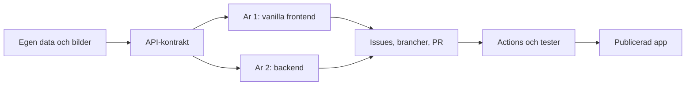

# Grupparbete: frontend och API

I de tidiga modulerna har du byggt ensam: HTML, CSS, JavaScript och `fetch` mot andras API:er. Nu gör ni något som mer liknar ett jobb: **ett gemensamt CRUD-projekt** (create, read, update, delete) där år 1 bygger frontend och år 2 bygger backend.

Det här kapitlet är en **handbok**, inte ett recept för appen. Ni väljer själva vad appen handlar om, samlar egen data och får använda AI fritt. Det ni ska bli bra på är *hur ni jobbar tillsammans* på GitHub: issues, brancher, pull requests (PR), kommentarer, tester och publicering.

> **Mål:**  
> Kunna köra ett grupprojekt från kickoff till publicerad app, med synlig historik på GitHub – inte bara en färdig sida.

**Förutsättningar:**

- År 1: HTML, CSS, JavaScript, Git/GitHub och `fetch` från [Fortsättning JavaScript](../kapitel_5/index.md).
- År 2: ett API ni redan kan bygga (till exempel [Node.js](../kapitel_9/index.md)) plus [testning](../kapitel_9/testning.md).
- Alla: ett GitHub-konto och vana vid `git push` / `git pull` från [Git och GitHub](../git/github.md).

---

## Två årskurser, ett repo

*Diagram: kontraktet är navet. Frontend och backend möts där, GitHub-flödet bär arbetet till en publicerad app.*

**År 1** bygger gränssnittet med HTML, CSS och JavaScript. Ni pratar med API:t via `fetch`, precis som mot JSONPlaceholder – men nu är det klasskamrater som äger servern.

**År 2** bygger API:t, dokumenterar det, kör det i Docker och skriver tester som GitHub Actions kan köra.

Båda årskurserna äger **processen**: issues, review och README.

---

## Boken är stöd, inte facit

Ni utvecklar appen själva. AI är tillåten. När något i *samarbetet* strular – en PR ni inte förstår, en CORS-vägg, en röd Action – kommer ni tillbaka hit.

Det ni *inte* hittar här:

- en färdig todo-app att kopiera
- React (det kommer i [frontend-ramverk](../kapitel_8/index.md))
- en ny genomgång av REST eller Jest – det finns i Node-kapitlet

---

## Vad "klart" betyder

En snygg demo räcker inte. Klart är när allt detta finns:

1. En **publicerad** app som någon utanför gruppen kan öppna.
2. Ett **API-kontrakt** (`api.md`) som frontend faktiskt följer.
3. Synlig GitHub-historik: issues, brancher, PR:er med kommentarer.
4. **Grön CI** (continuous integration) på `main` – tester körs automatiskt.
5. Ni kan **förklara en klasskamrats PR** muntligt, inte bara er egen kod.

Bedömningen tittar på den historiken. En medioker app med professionellt flöde slår en snygg app där allt pushats rakt på `main`.

---

## Faserna – inte en kalender

Lärarna mappar faserna till era lektioner. Ni behöver inte bli klara på en vecka.

1. **Kickoff** – ett repo, roller, branch protection på `main`. Se [Projektet och rollerna](./roller.md).
2. **Kontrakt och data** – skriv `api.md`, samla bilder och annoteringar. Se [API-kontraktet](./api-kontrakt.md) och [Data och publicera](./data-och-publicera.md).
3. **Parallellt arbete** – år 1 mot en mock, år 2 mot en riktig server. Issues och PR:er varje dag. Se [GitHub-workflow](./github-workflow.md).
4. **Integrera** – `docker compose up`, byt mock-URL mot riktig API-URL. Se [Docker](./docker.md) och [Frontend mot API](./frontend.md).
5. **Ship** – tester i Actions, publicera, README. Se [Testning och GitHub Actions](./testning-och-actions.md).

---

## AI är en lagkamrat, inte författaren

I modul 1–3 var AI avstängd så att grunderna skulle sätta sig. Här får ni använda den. Regeln är densamma som på en arbetsplats: **du äger din PR**. Om du inte kan förklara en diff ska den inte mergas.

Hur ni använder AI i gruppen står i [AI i grupparbete](./ai-i-teamet.md).

---

## Så navigerar du kapitlet

| Om du... | Öppna |
| --- | --- |
| ska sätta upp gruppen | [Projektet och rollerna](./roller.md) |
| inte vet vilka fält API:t har | [API-kontraktet](./api-kontrakt.md) |
| ska öppna en issue eller granska en PR | [GitHub-workflow](./github-workflow.md) |
| inte får igång klasskamratens server | [Docker](./docker.md) |
| bygger listor, formulär och `fetch` | [Frontend mot API](./frontend.md) |
| bygger och dokumenterar API:t | [Backend och API-dokumentation](./backend.md) |
| vill att PR:en ska bli röd när tester faller | [Testning och GitHub Actions](./testning-och-actions.md) |
| undrar vad AI får göra | [AI i grupparbete](./ai-i-teamet.md) |
| ska samla bilder och lägga ut appen | [Data och publicera](./data-och-publicera.md) |
| vill öva processen | [Praktiska övningar](./ovningar.md) |

När kickoffen närmar sig: börja i [Projektet och rollerna](./roller.md).
