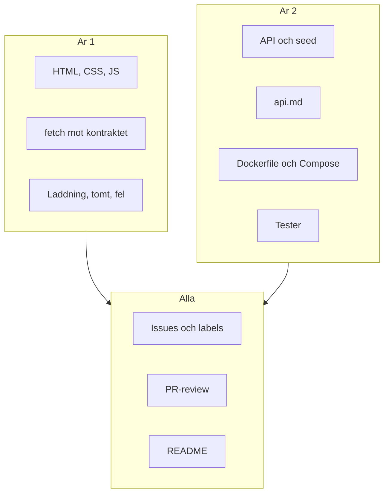

# Projektet och rollerna

Ett grupprojekt faller sällan på CSS eller SQL. Det faller när ingen vet vem som äger `main`, vad "klart" betyder eller hur år 1 ska prata med år 2:s server. Kickoffen är till för att låsa det – innan första feature-branchen.

> **Mål:**  
> Kunna sätta upp ett gemensamt GitHub-repo, fördela roller mellan årskurserna och veta vad varje person äger.

**Förutsättning:** Alla i gruppen har GitHub-konton och har gjort [Git och GitHub](../git/github.md).

---

## Ett repo, två årskurser

Ni är blandade grupper: år 1 och år 2 i samma repository. År 1 har precis lärt sig `fetch`. År 2 har redan byggt API:er. Appen är en **CRUD-app kring er egen data** – bilder ni tar, texter ni annoterar, poster ni själva samlar in.

Liknelse: tänk er en restaurang. År 2 driver köket (API:t). År 1 driver matsalen (sidan besökaren ser). Menyn är **API-kontraktet**. Ingen lagar mat utan att menyn stämmer.



---

## Vad år 1 äger

- Listvy, detaljvy och formulär i **vanilla** HTML, CSS och JavaScript.
- `fetch` mot kontraktet: lista, hämta en post, skapa, uppdatera, ta bort.
- Tre tillstånd på varje vy: **laddar**, **tomt**, **fel** – inte bara lyckat svar.
- Bilder med `alt`-text från era annoteringar.
- En skrivbar testchecklista per issue ("given 10 poster i mocken syns 10 kort").

Ni skriver inte React. Ni installerar inte år 2:s hela backend. Ni kör API:t med Docker när det finns, och en JSON-mock tills dess. Mönster: [Frontend mot API](./frontend.md).

---

## Vad år 2 äger

- Ett **dokumenterat, körbart API** som följer `api.md`.
- Seed från gruppens JSON (`data/items.json`), inte påhittad dummy-data ni slänger.
- `Dockerfile` och `docker-compose.yml` så år 1 kan skriva `docker compose up`.
- Några **kontraktstester** som GitHub Actions kör på varje PR.
- Hemligheter i `.env`, aldrig i Git. `.env` ligger i `.gitignore`.

Vilket ramverk ni väljer (Express, Deno eller något ni redan kan) är er sak. Kontraktet är det år 1 ser. Mönster: [Backend och API-dokumentation](./backend.md).

---

## Vad alla äger

- Issues: en issue per uppgift, stängs av en PR.
- Review: ingen mergar sin egen PR utan minst en annan person.
- README: hur man startar projektet på en ny dator på under fem minuter.
- Respekt för `main`: den är skyddad. Allt går via PR.

---

## Kickoff-checklista

Gör detta tillsammans, i samma rum eller på samma samtal, innan någon skriver feature-kod.

1. **Skapa ett tomt GitHub-repo** (en ägare, bjud in resten som collaborators).
2. **Klona** det lokalt. En person pushar en första README och `.gitignore`.
3. **Skydda `main`:** Settings → Branches → Add branch ruleset. Kräv pull request. Kräv att status checks är gröna när Actions finns.
4. **Lägg in mallar** (kopiera in i `.github/`):

```markdown
<!-- .github/ISSUE_TEMPLATE/feature.md -->
## Vad ska göras
## Varför
## Klart när
```

```markdown
<!-- .github/pull_request_template.md -->
## Vad
## Varför
## Hur testar jag
- [ ] Jag kan förklara varje ändring
- [ ] api.md är uppdaterad om kontraktet ändrats
```

5. **Välj domän** för appen (fåglar på skolgården, lunchmenyer, lokalhistoria – vad som helst ni kan fotografera själva).
6. **Skriv första versionen av `api.md` tillsammans** – även om den är kort. Se [API-kontraktet](./api-kontrakt.md).
7. **Boka en fast avstämning** (till exempel 10 minuter i början av varje lektion): vad är öppet, vad blockerar, vem tar nästa issue.

`CODEOWNERS` är valfritt. En fil `.github/CODEOWNERS` med `/frontend/ @ar1-personer` och `/api/ @ar2-personer` gör att rätt folk blir ombedda om review automatiskt. Hoppa över den om gruppen är liten.

---

## Mappförslag

Håll frontend och API isär så PR:er inte trampar på varandra i onödan:

```
README.md
api.md
.gitignore
docker-compose.yml
data/
  items.json
  images/
frontend/
  index.html
  css/
  js/
api/
  Dockerfile
  ...
.github/
  pull_request_template.md
  workflows/
    ci.yml
```

År 1 lever i `frontend/` och `data/`. År 2 lever i `api/` och äger `api.md` (ändringar via issue + PR, eftersom år 1 bygger mot filen).

---

## Vanliga misstag på dag ett

> - **Alla pushar på `main`** → historiken blir en soppa och ni kan inte granska. Åtgärd: slå på branch protection *innan* första featuren.
> - **År 1 väntar på ett färdigt API** → halva gruppen sitter overksam. Åtgärd: mocka mot `data/items.json` från dag ett.
> - **Ingen äger README** → nästa lektion vet ingen hur man startar. Åtgärd: en person tar issue "Skriv README med tre kommandon".
> - **Hemligheter i första commiten** → API-nycklar syns för alltid i historiken. Åtgärd: `.gitignore` med `.env` *före* första push.

---

## Checkpoint

- [ ] Repot finns, alla är collaborators, `main` är skyddad.
- [ ] Ni kan säga högt vem som äger frontend, API, Docker och README.
- [ ] Det finns en första `api.md` och en issue-lista med minst tre konkreta uppgifter.
- [ ] Ingen planerar att committa `.env`.

Nästa steg: lås språket mellan åren i [API-kontraktet](./api-kontrakt.md).
