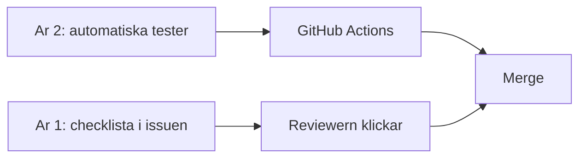

# Testning och GitHub Actions

En PR som "ser bra ut" kan ändå ha sönder listan för år 1. **Tester** fångar det. **GitHub Actions** kör testerna på varje PR så `main` inte blir röd i tysthet. Det är skillnaden mellan hobby-Git och hur team jobbar.

> **Mål:**  
> År 2 har några kontraktstester som faller om `api.md` bryts. År 1 har en skriven testchecklista per issue. Actions är gröna innan merge. `main` är skyddad.

**Förutsättning:** År 2 har sett [Testning med Jest](../kapitel_9/testning.md) eller motsvarande. Alla har [GitHub-workflow](./github-workflow.md).

---

## Två slags "test" i gruppen



**År 2** skriver kod som maskinen kör: GET-listan, en `400` när `title` saknas, en `404` på okänt id. Det är *kontraktstester* – de låser `api.md`, inte intern mappstruktur.

**År 1** skriver i issuen:

> Givet 10 poster i mocken syns 10 kort. Givet tom array syns "Inga poster ännu." Givet avstängt API syns felmeddelandet, inte en tom vit sida.

Reviewern *utför* listan innan Approve. Det är också test – bara manuellt.

Ni behöver inte ett frontend-testramverk i den här modulen. Vill ni lägga till ett senare är det bonus, inte krav.

---

## Minimala kontraktstester (år 2)

Tre tester räcker för att börja. Skriv dem mot HTTP, som i Jest-lektionen, inte mot privata funktioner:

1. `GET /api/items` → `200` och en array där första elementet har `title`, `imageUrl`, `altText`.
2. `POST /api/items` utan `title` → `400`.
3. `GET /api/items/finns-inte` → `404`.

När någon byter `title` till `name` utan att uppdatera testerna blir PR:en röd. Det är *meningen*.

Kör lokalt innan push:

```bash
npm test
```

(eller `deno test` – det som står i README).

---

## En Action som faller PR:en

Skapa `.github/workflows/ci.yml`. Den här formen räcker; anpassa working-directory och kommandon till er runtime.

```yaml
name: CI

on:
  pull_request:
    branches: [main]
  push:
    branches: [main]

jobs:
  test:
    runs-on: ubuntu-latest
    steps:
      - uses: actions/checkout@v4
      - uses: actions/setup-node@v4
        with:
          node-version: "22"
          cache: npm
          cache-dependency-path: api/package-lock.json
      - name: Installera och testa API
        working-directory: api
        run: |
          npm ci
          npm test
```

Efter push: öppna PR:en, fliken **Checks**. Rött = merge inte. Läs loggen, rätta, pusha igen på samma branch.

Kursboken ni läser just nu publiceras med ett liknande flöde: filen `.github/workflows/mdbook.yml` i kursboks-repot. Skillnaden är bara *vad* som körs (mdBook mot `npm test`). Pipen är samma idé: checkout, bygg eller testa, misslyckas högt.

---

## Skydda `main`

Settings → Rulesets (eller Branch protection):

- Kräv pull request innan merge.
- Kräv att status check `test` är grön.
- Kräv minst en approving review.

Då *kan* ni inte squash-merga en röd PR "för att det är fredag". Det är en feature.

---

## Vanliga misstag

> - **Tester som kräver er laptop-databas** → Actions har inte den. Åtgärd: in-memory eller en testdatabas som jobbet sätter upp, samma tänk som i Jest-lektionen.
> - **`npm install` i stället för `npm ci` i CI** → lockfilen ignoreras, bygget blir icke-reproducerbart.
> - **Workflow på fel sökväg** → filen måste ligga i `.github/workflows/` och vara YAML.
> - **Approve utan att köra år 1:s checklista** → ni har bara testat backend. Klicka i UI:t.

---

## Checkpoint

- [ ] `npm test` (eller motsvarande) faller om `GET /api/items` tappar `title`.
- [ ] En PR visar en grön (eller röd) check från Actions.
- [ ] `main` kräver PR + grön check + review.
- [ ] Senaste frontend-issuen har tre rader "klart när" som någon faktiskt klickat igenom.

Publicering: [Data och publicera](./data-och-publicera.md). AI-regler: [AI i grupparbete](./ai-i-teamet.md).
