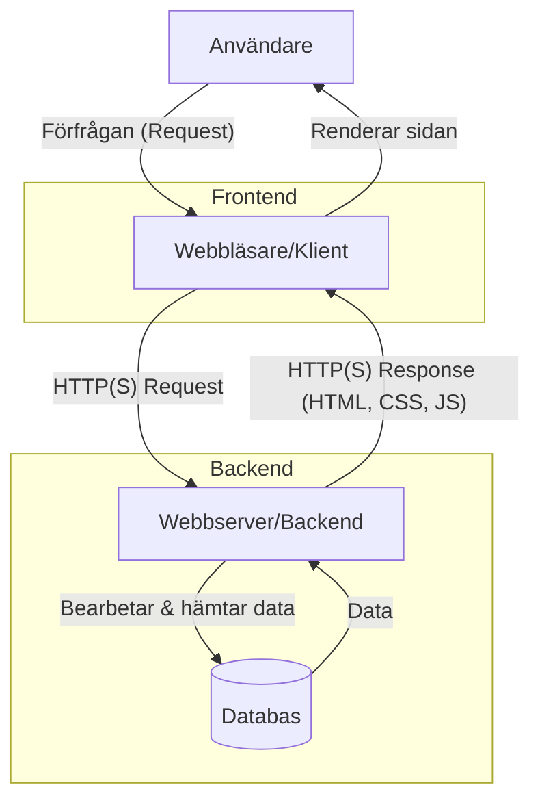

# Vad är webbutveckling?

Du använder webben varje dag – för att söka information, kommunicera, handla, eller titta på videor. Men har du någonsin stannat upp och funderat på *hur* allt detta fungerar? Hur skapas webbplatserna och applikationerna som gör detta möjligt?

Svaret är **webbutveckling**. Det är processen att designa, bygga och underhålla webbplatser och webbapplikationer. Det handlar om att kombinera teknisk skicklighet med kreativ problemlösning för att skapa de digitala upplevelser vi tar för givna.

**Varför är det relevant för dig?** Att förstå grunderna i webbutveckling ger dig inte bara insikt i hur en stor del av den moderna världen fungerar, utan öppnar också dörrar till att själv kunna skapa och forma digitalt innehåll och verktyg.

## Två sidor av samma mynt: Frontend och Backend

Webbutveckling brukar delas upp i två huvudsakliga områden:

1.  **Frontend (Klientsidan):** Tänk på detta som allt du *ser* och *interagerar med* i din webbläsare. Det är layouten, färgerna, knapparna, formulären och animationerna. Frontend-utvecklare använder språk som:
    *   **HTML (HyperText Markup Language):** Byggstenarna som strukturerar innehållet (rubriker, paragrafer, bilder, länkar).
    *   **CSS (Cascading Style Sheets):** Reglerna som bestämmer hur innehållet ska se ut (färger, typsnitt, layout).
    *   **JavaScript:** Språket som gör sidan interaktiv och dynamisk (hanterar klick, uppdaterar innehåll utan att ladda om sidan, skapar animationer).

2.  **Backend (Serversidan):** Detta är "bakom kulisserna". Backend hanterar logiken, databaserna och allt som sker på servern för att webbplatsen ska fungera. Tänk på det som motorn i en bil – du ser den inte direkt, men den är avgörande. Backend-utvecklare arbetar med:
    *   **Serverspråk:** Språk som PHP (som vi fokuserar på i denna kurs), Python, Ruby, Node.js (JavaScript på servern), Java, m.fl. Dessa språk hanterar inkommande förfrågningar, bearbetar data och genererar svar.
    *   **Databaser:** System som MySQL, PostgreSQL, MongoDB för att lagra och hämta information (t.ex. användardata, produkter, inlägg).
    *   **Servern:** Datorn där webbplatsens kod körs och dess data lagras.

**Analogi:** Tänk på en restaurang. Frontend är matsalen – inredningen, menyn du läser, hur servitören interagerar med dig. Backend är köket – kocken som lagar maten (processar data), recepten (logiken), och skafferiet (databasen).

*Diagram: Förenklad bild av hur en webbförfrågan (request) hanteras.* 

## Hur fungerar det? Request-Response Cycle

När du skriver in en webbadress (t.ex. `www.example.com`) eller klickar på en länk, händer följande i stora drag:

1.  **Förfrågan (Request):** Din webbläsare (klienten) skickar en förfrågan (HTTP request) över internet till den server där webbplatsen finns lagrad. Adressen översätts först från ett domännamn (som `www.example.com`) till en IP-adress via DNS (Domain Name System), ungefär som en telefonkatalog för internet.
2.  **Bearbetning (Processing):** Servern tar emot förfrågan. Om det är en enkel sida kan den direkt skicka tillbaka HTML-, CSS- och JavaScript-filer. Om det krävs logik (t.ex. logga in, hämta data) kör backend-koden, interagerar kanske med en databas.
3.  **Svar (Response):** Servern skickar tillbaka ett svar (HTTP response) till din webbläsare. Detta svar innehåller de filer och data som behövs för att visa sidan (oftast HTML, CSS, JavaScript).
4.  **Rendering:** Din webbläsare tar emot svaret, tolkar filerna och "ritar upp" webbsidan på din skärm.

Denna process, från förfrågan till svar, kallas **Request-Response Cycle** och är grunden för hur webben fungerar.

## Fullstack-utvecklare

En person som behärskar både frontend- och backend-utveckling kallas ofta **Fullstack-utvecklare**. De har en bred förståelse för hela processen och kan bygga kompletta webbapplikationer på egen hand.

## Viktiga Begrepp (Ordlista)

*   **HTTP/HTTPS (HyperText Transfer Protocol/Secure):** Protokollet (regelverket) för hur data skickas mellan klient och server på webben. HTTPS är den krypterade, säkra versionen.
*   **URL (Uniform Resource Locator):** Webbadressen som identifierar en specifik resurs (t.ex. en webbsida) på internet.
*   **DNS (Domain Name System):** Internets "telefonkatalog" som översätter läsbara domännamn till numeriska IP-adresser.
*   **IP-adress (Internet Protocol Address):** En unik numerisk adress för varje enhet ansluten till internet (t.ex. `192.168.1.1`).
*   **API (Application Programming Interface):** Ett gränssnitt som låter olika program eller systemdelar kommunicera med varandra.

## Sammanfattning

Webbutveckling är fältet där man skapar och underhåller webbplatser och applikationer. Det delas huvudsakligen upp i **Frontend** (det användaren ser och interagerar med, byggt med HTML, CSS, JavaScript) och **Backend** (logiken, databasen och servern som driver allt, ofta med språk som PHP). Förståelsen för hur klient och server kommunicerar via HTTP(S) i en **Request-Response Cycle** är central.

I nästa del tittar vi närmare på webbens historia och framtid.
