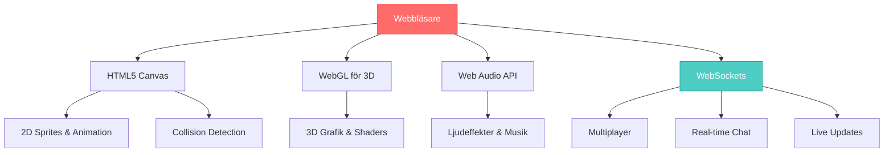
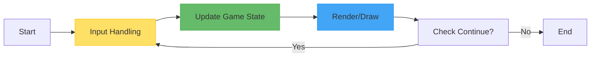
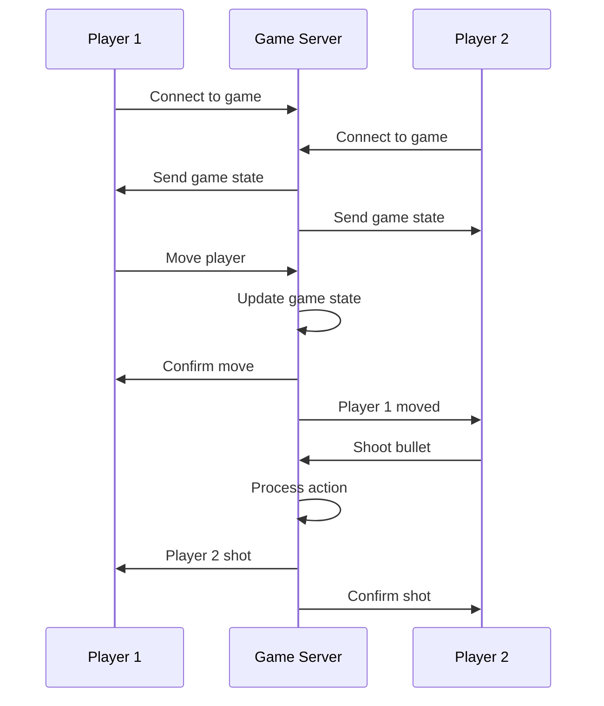
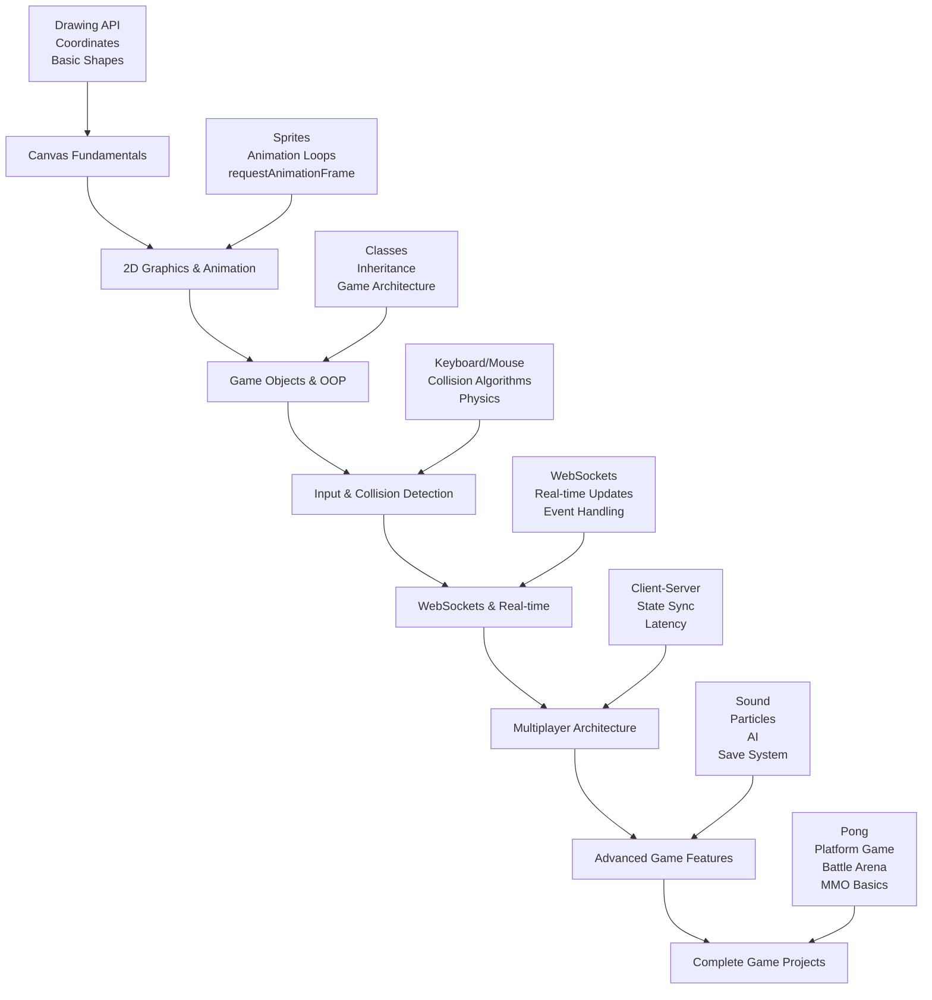

# Spelutveckling och WebSockets

Välkommen till den spännande världen av webbaserad spelutveckling! I detta kapitel ska vi utforska hur man skapar interaktiva spel och realtidsapplikationer direkt i webbläsaren. Från enkla Canvas-spel till komplexa multiplayer-upplevelser - här lär du dig verktygen och teknikerna som driver modern webbaserad spel- och applikationsutveckling.

## Vad är webbaserad spelutveckling?

Webbaserad spelutveckling innebär att skapa interaktiva spel som körs direkt i webbläsaren utan behov av nedladdning eller installation. Med moderna webbteknologier kan vi skapa allt från enkla pussel-spel till avancerade 3D-världar.

### Fördelar med webspel

- **Omedelbar tillgänglighet**: Spel körs direkt i webbläsaren
- **Plattformsoberoende**: Fungerar på dator, mobil och surfplatta
- **Enkel distribution**: Dela via en URL
- **Automatiska uppdateringar**: Inga manuella nedladdningar
- **Social integration**: Enkelt att dela och spela tillsammans
- **Låg tröskel**: Tillgängligt för alla med internetanslutning



## Teknologier för webspel

### Core Technologies

**HTML5 Canvas**: 2D-ritning och animation
```javascript
const canvas = document.getElementById('game');
const ctx = canvas.getContext('2d');

// Rita spelkaraktär
ctx.fillStyle = 'blue';
ctx.fillRect(playerX, playerY, 32, 32);
```

**WebGL**: Högpresterande 3D-grafik
```javascript
// Three.js exempel för 3D
const scene = new THREE.Scene();
const camera = new THREE.PerspectiveCamera(75, window.innerWidth / window.innerHeight);
const renderer = new THREE.WebGLRenderer();
```

**Web Audio API**: Avancerat ljud
```javascript
const audioContext = new AudioContext();
const oscillator = audioContext.createOscillator();
oscillator.frequency.setValueAtTime(440, audioContext.currentTime);
```

### Realtidskommunikation

**WebSockets**: Tvåvägs kommunikation
```javascript
const socket = new WebSocket('ws://game-server.com');
socket.send(JSON.stringify({ action: 'move', x: 100, y: 200 }));
```

**WebRTC**: Peer-to-peer kommunikation
```javascript
// Direkt kommunikation mellan spelare
const peerConnection = new RTCPeerConnection();
```

## Spelutvecklingsarkitektur

### Game Loop - hjärtat i alla spel



**Grundläggande Game Loop**:
```javascript
class Game {
  constructor() {
    this.running = true;
    this.lastTime = 0;
  }
  
  gameLoop = (currentTime) => {
    const deltaTime = currentTime - this.lastTime;
    this.lastTime = currentTime;
    
    // 1. Hantera input
    this.handleInput();
    
    // 2. Uppdatera spellogik
    this.update(deltaTime);
    
    // 3. Rita spelet
    this.render();
    
    // 4. Fortsätt loopen
    if (this.running) {
      requestAnimationFrame(this.gameLoop);
    }
  }
  
  start() {
    requestAnimationFrame(this.gameLoop);
  }
}
```

### Objektorienterad speldesign

**Game Objects**: Allt i spelet representeras som objekt
```javascript
class GameObject {
  constructor(x, y) {
    this.x = x;
    this.y = y;
    this.velocity = { x: 0, y: 0 };
    this.sprite = null;
  }
  
  update(deltaTime) {
    this.x += this.velocity.x * deltaTime;
    this.y += this.velocity.y * deltaTime;
  }
  
  render(ctx) {
    if (this.sprite) {
      ctx.drawImage(this.sprite, this.x, this.y);
    }
  }
}

class Player extends GameObject {
  constructor(x, y) {
    super(x, y);
    this.health = 100;
    this.score = 0;
  }
  
  takeDamage(amount) {
    this.health -= amount;
    if (this.health <= 0) {
      this.die();
    }
  }
}
```

## Multiplayer och WebSockets

### Client-Server Architecture



**Realtidssynkronisering**:
```javascript
// Klient
class MultiplayerGame {
  constructor() {
    this.socket = new WebSocket('ws://localhost:8080');
    this.players = new Map();
    this.setupSocketEvents();
  }
  
  setupSocketEvents() {
    this.socket.onmessage = (event) => {
      const data = JSON.parse(event.data);
      
      switch(data.type) {
        case 'player-moved':
          this.updatePlayerPosition(data.playerId, data.x, data.y);
          break;
        case 'player-joined':
          this.addPlayer(data.player);
          break;
        case 'game-state':
          this.syncGameState(data.state);
          break;
      }
    };
  }
  
  sendPlayerAction(action, data) {
    this.socket.send(JSON.stringify({
      type: action,
      ...data
    }));
  }
}
```

## Spelutvecklingsparadigm

### Component-Based Architecture

```javascript
// Entity Component System (ECS)
class Entity {
  constructor() {
    this.components = new Map();
    this.id = Math.random();
  }
  
  addComponent(component) {
    this.components.set(component.constructor.name, component);
    return this;
  }
  
  getComponent(componentType) {
    return this.components.get(componentType.name);
  }
}

// Komponenter
class PositionComponent {
  constructor(x, y) {
    this.x = x;
    this.y = y;
  }
}

class VelocityComponent {
  constructor(vx, vy) {
    this.vx = vx;
    this.vy = vy;
  }
}

class RenderComponent {
  constructor(sprite) {
    this.sprite = sprite;
  }
}

// System som hanterar komponenter
class MovementSystem {
  update(entities, deltaTime) {
    entities.forEach(entity => {
      const pos = entity.getComponent(PositionComponent);
      const vel = entity.getComponent(VelocityComponent);
      
      if (pos && vel) {
        pos.x += vel.vx * deltaTime;
        pos.y += vel.vy * deltaTime;
      }
    });
  }
}
```

## Kapitelets struktur och progression

I detta kapitel kommer du att lära dig:



### Kapitelinnehåll

**Fundamentals (Kapitel 1-3)**:
1. **Canvas API** - 2D-ritning, sprites och grundläggande animation
2. **OOP för spel** - Klasser, arv och spelarkitektur
3. **WebSockets** - Realtidskommunikation och grundläggande multiplayer

**Intermediate (Kapitel 4-6)**:
4. **Chat-applikationer** - WebSockets och användarhantering
5. **Multiplayer-spel** - State synchronization och spelmekanik
6. **Praktiska övningar** - Fyra progressiva spelprojekt

**Advanced (Kapitel 7)**:
7. **Teknisk intervju** - Förberedelse för spelutvecklingsjobb

## Utvecklingsmiljö för spelutveckling

### Nödvändiga verktyg

**Code Editor med extensions**:
```bash
# VS Code extensions för spelutveckling
- Live Server (för lokal testning)
- WebGL Shader Language Support
- JavaScript (ES6) code snippets
- Bracket Pair Colorizer
```

**Grafiska resurser**:
- **Sprites**: Piskel, Aseprite för pixelart
- **Audio**: Audacity, LMMS för ljud
- **Texturer**: GIMP, Photoshop för grafik

**Development Server**:
```javascript
// Enkel server för WebSocket-testning
const express = require('express');
const http = require('http');
const WebSocket = require('ws');

const app = express();
const server = http.createServer(app);
const wss = new WebSocket.Server({ server });

app.use(express.static('public'));

wss.on('connection', (ws) => {
  console.log('En spelare anslöt');
  
  ws.on('message', (message) => {
    const data = JSON.parse(message);
    console.log('Mottaget:', data);
    
    // Broadcast till alla anslutna
    wss.clients.forEach((client) => {
      if (client.readyState === WebSocket.OPEN) {
        client.send(JSON.stringify(data));
      }
    });
  });
});

server.listen(3000, () => {
  console.log('Game server på port 3000');
});
```

### Projektstruktur för spel

```
game-project/
├── index.html              # Entry point
├── style.css              # Styling
├── client/                # Frontend kod
│   ├── game.js            # Huvudspellogik
│   ├── entities/          # Spelobjekt
│   │   ├── Player.js
│   │   ├── Enemy.js
│   │   └── Bullet.js
│   ├── systems/           # Game systems
│   │   ├── InputSystem.js
│   │   ├── RenderSystem.js
│   │   └── CollisionSystem.js
│   └── utils/             # Hjälpfunktioner
│       ├── Vector2D.js
│       └── SpriteLoader.js
├── server/                # Backend (multiplayer)
│   ├── server.js          # WebSocket server
│   ├── GameRoom.js        # Spelrum-logik
│   └── PlayerManager.js   # Spelarhantering
├── assets/                # Grafik och ljud
│   ├── sprites/
│   ├── sounds/
│   └── music/
└── docs/                  # Dokumentation
    └── game-design.md
```

## Moderna spelutvecklingstrender

### Progressive Web Apps (PWA) för spel

```javascript
// Service Worker för offline-spel
self.addEventListener('install', event => {
  event.waitUntil(
    caches.open('game-cache-v1').then(cache => {
      return cache.addAll([
        '/',
        '/game.js',
        '/sprites/player.png',
        '/sounds/shoot.wav'
      ]);
    })
  );
});
```

### WebAssembly för prestanda

```javascript
// Ladda WASM-modul för tunga beräkningar
WebAssembly.instantiateStreaming(fetch('physics.wasm'))
  .then(result => {
    const physics = result.instance.exports;
    // Använd WASM för fysikberäkningar
    const collision = physics.checkCollision(x1, y1, x2, y2);
  });
```

### Web Workers för parallellprocessning

```javascript
// Huvudtråd
const worker = new Worker('ai-worker.js');
worker.postMessage({ enemies: gameState.enemies });

worker.onmessage = (event) => {
  const { aiDecisions } = event.data;
  // Applicera AI-beslut
};

// ai-worker.js
self.onmessage = (event) => {
  const { enemies } = event.data;
  const decisions = calculateAI(enemies);
  self.postMessage({ aiDecisions: decisions });
};
```

## Varför lära sig webbaserad spelutveckling?

### Karriärmöjligheter

**Frontend Game Developer**:
- HTML5-spelstudios
- Casual gaming-företag
- Reklam- och marknadsföringsspel

**Full-Stack Game Developer**:
- Multiplayer-spelservrar
- Real-time applikationer
- Social gaming-plattformar

**Specialistroller**:
- WebGL/3D-specialist
- Performance optimization
- Mobile game development

### Transferable Skills

Kunskaperna från webbaserad spelutveckling överförs till:
- **Interactive Visualizations**: D3.js, data storytelling
- **Real-time Applications**: Trading platforms, collaboration tools
- **Media Applications**: Video editing, streaming platforms
- **IoT Applications**: Sensor dashboards, device control

## Redo för äventyret?

Webbaserad spelutveckling kombinerar kreativitet med teknisk skicklighet. Du kommer att lära dig:

**Tekniska färdigheter**:
- 🎨 Canvas API och 2D-grafik
- 🎮 Game loops och animation
- 🏗️ Objektorienterad spelarkitektur
- 🌐 WebSockets och multiplayer
- ⚡ Performance optimization

**Kreativa färdigheter**:
- 🎯 Spelmekanik och design
- 🎵 Ljud och användarupplevelse
- 🎨 Visuell design och animation
- 📱 Responsive game design

**Nästa steg**:
1. 🎨 **Canvas API** - Lär dig rita och animera
2. 🎮 **OOP för spel** - Strukturera din spelkod
3. 🌐 **WebSockets** - Skapa realtidsupplevelser
4. 💬 **Chat-app** - Bygg din första multiplayer-funktion
5. 🏟️ **Multiplayer-spel** - Avancerad spelarinteraktion
6. 🚀 **Praktiska projekt** - Bygg fyra kompletta spel

Varje kapitel innehåller:
- 📖 Detaljerade förklaringar med interaktiva exempel
- 🎮 Praktiska spelprototyper att bygga vidare på
- 💡 Industry best practices från professionella studios
- 🔧 Moderna verktyg och tekniker

Spelutveckling är en av de mest kreativa och givande formerna av programmering - där logik möter fantasi och kod blir till upplevelser. Låt oss börja skapa!

## Performance och optimering

### Frame Rate och timing

```javascript
class PerformanceMonitor {
  constructor() {
    this.frameCount = 0;
    this.lastFPSUpdate = 0;
    this.currentFPS = 0;
  }
  
  update(currentTime) {
    this.frameCount++;
    
    if (currentTime - this.lastFPSUpdate >= 1000) {
      this.currentFPS = this.frameCount;
      this.frameCount = 0;
      this.lastFPSUpdate = currentTime;
      
      // Visa FPS i UI
      document.getElementById('fps').textContent = `FPS: ${this.currentFPS}`;
    }
  }
}
```

### Memory Management

```javascript
// Object pooling för bullets
class BulletPool {
  constructor(size) {
    this.pool = [];
    this.active = [];
    
    for (let i = 0; i < size; i++) {
      this.pool.push(new Bullet());
    }
  }
  
  getBullet() {
    if (this.pool.length > 0) {
      const bullet = this.pool.pop();
      this.active.push(bullet);
      return bullet;
    }
    return null; // Pool är tom
  }
  
  returnBullet(bullet) {
    const index = this.active.indexOf(bullet);
    if (index > -1) {
      this.active.splice(index, 1);
      bullet.reset();
      this.pool.push(bullet);
    }
  }
}
```

Webbaserad spelutveckling öppnar dörrar till en värld av kreativitet och innovation. Med de verktyg och tekniker du lär dig här kan du skapa allt från enkla arkadspel till komplexa multiplayer-upplevelser som når miljontals spelare världen över! 🚀
