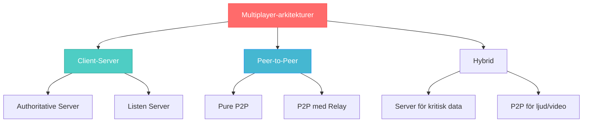
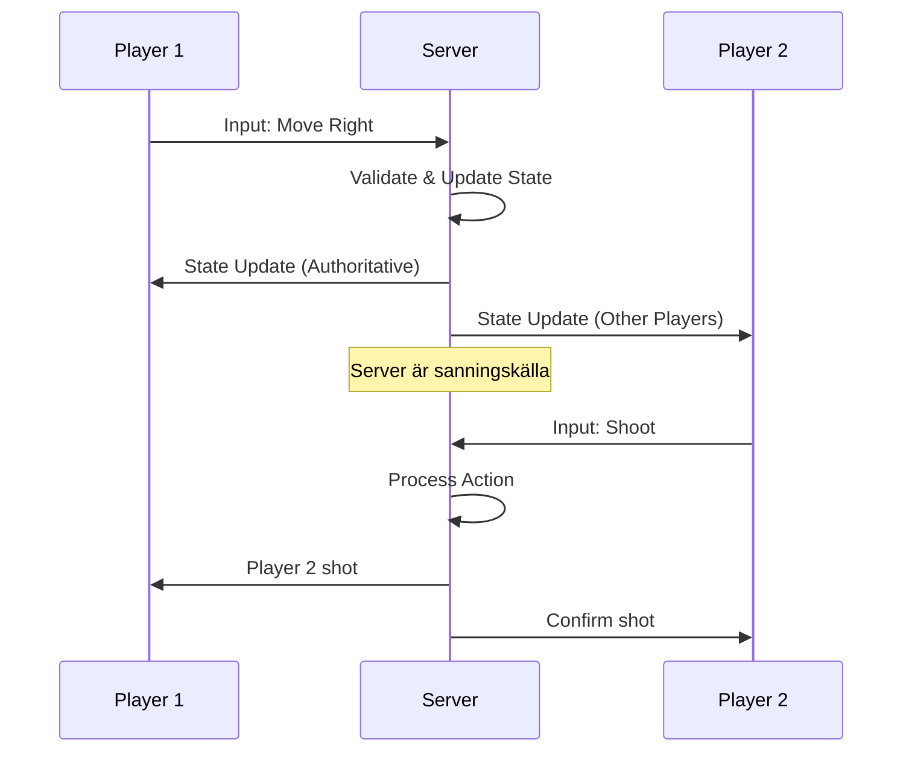

# Multiplayer-spel och realtidsarkitektur

Multiplayer-spel representerar toppen av webbaserad spelutveckling, där flera spelare interagerar i realtid inom samma virtuella miljö. Detta kapitel utforskar arkitekturen, utmaningarna och lösningarna för att skapa framgångsrika multiplayer-upplevelser.

## Vad är multiplayer-spel?

Multiplayer-spel låter flera spelare delta samtidigt i samma spelupplevelse. De kan vara:
- **Cooperative**: Spelare arbetar tillsammans mot gemensamma mål
- **Competitive**: Spelare konkurrerar mot varandra
- **Sandbox**: Öppen värld där spelare kan interagera fritt
- **MMO**: Massively Multiplayer Online med hundratals eller tusentals spelare

### Typer av multiplayer-arkitekturer



## Client-Server arkitektur

### Authoritative Server

Servern har full kontroll över spelstatet och validerar alla handlingar.

```javascript
// Server-side game state management
class GameServer {
  constructor() {
    this.gameState = {
      players: new Map(),
      entities: new Map(),
      worldState: {}
    };
    this.tickRate = 60; // 60 updates per sekund
    this.lastUpdate = Date.now();
  }
  
  startGameLoop() {
    setInterval(() => {
      const currentTime = Date.now();
      const deltaTime = currentTime - this.lastUpdate;
      
      this.updateGameLogic(deltaTime);
      this.broadcastGameState();
      
      this.lastUpdate = currentTime;
    }, 1000 / this.tickRate);
  }
  
  updateGameLogic(deltaTime) {
    // Uppdatera alla spelobjekt
    this.gameState.players.forEach(player => {
      player.update(deltaTime);
      this.validatePlayerPosition(player);
    });
    
    // Hantera kollisioner
    this.handleCollisions();
    
    // Spawna nya objekt
    this.spawnEntities();
  }
  
  validatePlayerPosition(player) {
    // Anti-cheat: Kontrollera att spelaren inte rör sig för snabbt
    const maxSpeed = 300; // pixels per sekund
    const maxDistance = maxSpeed * (this.deltaTime / 1000);
    
    if (player.distanceMoved > maxDistance) {
      // Återställ spelaren till förra giltiga position
      player.x = player.lastValidX;
      player.y = player.lastValidY;
      console.log(`Player ${player.id} potential speed hack detected`);
    }
  }
}
```

### State Synchronization



### Netcode och latency handling

```javascript
// Client-side prediction och reconciliation
class MultiplayerClient {
  constructor() {
    this.socket = null;
    this.localPlayer = null;
    this.serverState = null;
    this.inputHistory = [];
    this.stateBuffer = [];
  }
  
  // Client-side prediction
  sendInput(input) {
    const timestamp = Date.now();
    
    // Spara input för senare reconciliation
    this.inputHistory.push({
      input,
      timestamp,
      sequenceNumber: this.getNextSequence()
    });
    
    // Applicera input lokalt omedelbart (prediction)
    this.applyInputLocally(input);
    
    // Skicka till server
    this.socket.send(JSON.stringify({
      type: 'player_input',
      input,
      timestamp,
      sequenceNumber: this.currentSequence
    }));
  }
  
  // Server reconciliation
  onServerUpdate(serverState) {
    this.stateBuffer.push({
      state: serverState,
      timestamp: Date.now()
    });
    
    // Jämför server state med vår prediction
    const serverPlayer = serverState.players[this.playerId];
    const localPlayer = this.localPlayer;
    
    const positionDiff = Math.sqrt(
      Math.pow(serverPlayer.x - localPlayer.x, 2) +
      Math.pow(serverPlayer.y - localPlayer.y, 2)
    );
    
    // Om skillnaden är för stor, korrigera
    if (positionDiff > 5) {
      this.reconcileWithServer(serverPlayer);
    }
  }
  
  reconcileWithServer(serverPlayer) {
    // Sätt spelaren till serverns position
    this.localPlayer.x = serverPlayer.x;
    this.localPlayer.y = serverPlayer.y;
    
    // Återapplicera alla inputs sedan serverns timestamp
    const serverTime = serverPlayer.timestamp;
    const inputsToReplay = this.inputHistory.filter(
      input => input.timestamp > serverTime
    );
    
    inputsToReplay.forEach(input => {
      this.applyInputLocally(input.input);
    });
  }
}
```

## Lag Compensation tekniker

### Interpolation och extrapolation

```javascript
// Smooth movement för andra spelare
class NetworkedPlayer {
  constructor() {
    this.positions = []; // Buffer av positioner från server
    this.renderPosition = { x: 0, y: 0 };
    this.interpolationDelay = 100; // ms
  }
  
  addServerPosition(position, timestamp) {
    this.positions.push({
      x: position.x,
      y: position.y,
      timestamp: timestamp
    });
    
    // Håll bara de senaste positionerna
    const cutoff = Date.now() - 1000;
    this.positions = this.positions.filter(p => p.timestamp > cutoff);
  }
  
  update() {
    const now = Date.now();
    const renderTime = now - this.interpolationDelay;
    
    // Hitta två positioner att interpolera mellan
    let before = null;
    let after = null;
    
    for (let i = 0; i < this.positions.length - 1; i++) {
      if (this.positions[i].timestamp <= renderTime &&
          this.positions[i + 1].timestamp >= renderTime) {
        before = this.positions[i];
        after = this.positions[i + 1];
        break;
      }
    }
    
    if (before && after) {
      // Interpolera mellan positionerna
      const totalTime = after.timestamp - before.timestamp;
      const targetTime = renderTime - before.timestamp;
      const ratio = targetTime / totalTime;
      
      this.renderPosition.x = before.x + (after.x - before.x) * ratio;
      this.renderPosition.y = before.y + (after.y - before.y) * ratio;
    }
  }
}
```

### Rollback och konfliktlösning

```javascript
// Rollback netcode för fighting games
class RollbackManager {
  constructor() {
    this.stateHistory = [];
    this.inputHistory = [];
    this.confirmedFrame = 0;
  }
  
  saveState(frame, gameState) {
    this.stateHistory[frame] = this.deepClone(gameState);
  }
  
  rollbackToFrame(frame) {
    if (this.stateHistory[frame]) {
      return this.deepClone(this.stateHistory[frame]);
    }
    return null;
  }
  
  onConfirmedInput(frame, inputs) {
    // Om vi får bekräftad input som skiljer sig från vad vi trodde
    const ourInput = this.inputHistory[frame];
    
    if (JSON.stringify(ourInput) !== JSON.stringify(inputs)) {
      // Rollback och simulera igen
      const rollbackState = this.rollbackToFrame(frame);
      
      if (rollbackState) {
        // Simulera alla frames igen med korrekta inputs
        for (let f = frame; f <= this.currentFrame; f++) {
          const frameInputs = this.getConfirmedInputs(f);
          rollbackState = this.simulateFrame(rollbackState, frameInputs);
        }
        
        // Uppdatera current state
        this.currentState = rollbackState;
      }
    }
    
    this.confirmedFrame = Math.max(this.confirmedFrame, frame);
  }
}
```

## Game Rooms och matchmaking

### Room Management

```javascript
// Server-side room management
class GameRoom {
  constructor(roomId, maxPlayers = 4) {
    this.id = roomId;
    this.players = new Map();
    this.maxPlayers = maxPlayers;
    this.gameState = 'waiting'; // waiting, playing, finished
    this.gameData = {};
    this.spectators = new Set();
  }
  
  addPlayer(playerId, playerData) {
    if (this.players.size >= this.maxPlayers) {
      return { success: false, reason: 'Room full' };
    }
    
    if (this.gameState === 'playing') {
      // Lägg till som spectator istället
      this.spectators.add(playerId);
      return { success: true, role: 'spectator' };
    }
    
    this.players.set(playerId, {
      id: playerId,
      ...playerData,
      ready: false,
      score: 0
    });
    
    // Meddela alla i rummet
    this.broadcast({
      type: 'player_joined',
      player: playerData,
      playerCount: this.players.size
    });
    
    return { success: true, role: 'player' };
  }
  
  setPlayerReady(playerId, ready) {
    const player = this.players.get(playerId);
    if (player) {
      player.ready = ready;
      
      // Kolla om alla är redo
      const allReady = Array.from(this.players.values())
        .every(p => p.ready);
      
      if (allReady && this.players.size >= 2) {
        this.startGame();
      }
    }
  }
  
  startGame() {
    this.gameState = 'playing';
    this.initializeGameData();
    
    this.broadcast({
      type: 'game_started',
      initialState: this.gameData
    });
    
    // Starta game loop
    this.gameLoop();
  }
  
  broadcast(message, excludePlayer = null) {
    this.players.forEach((player, playerId) => {
      if (playerId !== excludePlayer) {
        player.socket.send(JSON.stringify(message));
      }
    });
    
    // Skicka även till spectators
    this.spectators.forEach(spectatorId => {
      const spectator = this.getPlayerConnection(spectatorId);
      if (spectator) {
        spectator.send(JSON.stringify(message));
      }
    });
  }
}

// Room Manager
class RoomManager {
  constructor() {
    this.rooms = new Map();
    this.playerRooms = new Map(); // player -> room mapping
  }
  
  createRoom(roomId, settings) {
    const room = new GameRoom(roomId, settings.maxPlayers);
    this.rooms.set(roomId, room);
    return room;
  }
  
  joinRoom(playerId, roomId, playerData) {
    let room = this.rooms.get(roomId);
    
    if (!room) {
      // Skapa rum automatiskt
      room = this.createRoom(roomId, { maxPlayers: 4 });
    }
    
    const result = room.addPlayer(playerId, playerData);
    
    if (result.success) {
      this.playerRooms.set(playerId, roomId);
    }
    
    return result;
  }
  
  // Matchmaking baserat på skill
  findMatch(playerId, playerSkill) {
    // Hitta rum med liknande skill-nivå
    for (const [roomId, room] of this.rooms) {
      if (room.gameState === 'waiting' && room.players.size < room.maxPlayers) {
        const avgSkill = this.calculateRoomSkill(room);
        
        if (Math.abs(avgSkill - playerSkill) < 100) {
          return this.joinRoom(playerId, roomId, { skill: playerSkill });
        }
      }
    }
    
    // Skapa nytt rum om inget hittas
    const newRoomId = `room_${Date.now()}`;
    return this.joinRoom(playerId, newRoomId, { skill: playerSkill });
  }
}
```

## Player Management och persistens

### Player State Synchronization

```javascript
// Persistent player data
class PlayerManager {
  constructor() {
    this.players = new Map();
    this.database = new DatabaseConnection();
  }
  
  async createPlayer(playerId, initialData) {
    const playerData = {
      id: playerId,
      username: initialData.username,
      level: 1,
      experience: 0,
      stats: {
        gamesPlayed: 0,
        gamesWon: 0,
        totalScore: 0
      },
      inventory: [],
      achievements: [],
      createdAt: new Date(),
      lastSeen: new Date()
    };
    
    // Spara till databas
    await this.database.savePlayer(playerData);
    
    this.players.set(playerId, playerData);
    return playerData;
  }
  
  async updatePlayerStats(playerId, gameResult) {
    const player = this.players.get(playerId);
    
    if (player) {
      player.stats.gamesPlayed++;
      player.stats.totalScore += gameResult.score;
      
      if (gameResult.won) {
        player.stats.gamesWon++;
      }
      
      // Uppdatera level baserat på experience
      const newExp = player.experience + gameResult.experienceGained;
      const newLevel = this.calculateLevel(newExp);
      
      if (newLevel > player.level) {
        player.level = newLevel;
        
        // Notify level up
        this.notifyLevelUp(playerId, newLevel);
      }
      
      player.experience = newExp;
      player.lastSeen = new Date();
      
      // Spara till databas
      await this.database.updatePlayer(playerId, player);
    }
  }
  
  calculateLevel(experience) {
    return Math.floor(Math.sqrt(experience / 100)) + 1;
  }
}
```

## Real-time kommunikationsprotokoll

### Message Types och protokoll

```javascript
// Standardiserat meddelande-protokoll
const MessageTypes = {
  // Connection
  CONNECT: 'connect',
  DISCONNECT: 'disconnect',
  
  // Room management
  JOIN_ROOM: 'join_room',
  LEAVE_ROOM: 'leave_room',
  ROOM_STATE: 'room_state',
  
  // Game state
  GAME_START: 'game_start',
  GAME_END: 'game_end',
  GAME_UPDATE: 'game_update',
  
  // Player actions
  PLAYER_INPUT: 'player_input',
  PLAYER_ACTION: 'player_action',
  PLAYER_UPDATE: 'player_update',
  
  // Chat
  CHAT_MESSAGE: 'chat_message',
  SYSTEM_MESSAGE: 'system_message'
};

class MessageHandler {
  constructor(gameServer) {
    this.server = gameServer;
  }
  
  handleMessage(playerId, message) {
    try {
      const data = JSON.parse(message);
      const { type, payload } = data;
      
      switch (type) {
        case MessageTypes.JOIN_ROOM:
          this.handleJoinRoom(playerId, payload);
          break;
          
        case MessageTypes.PLAYER_INPUT:
          this.handlePlayerInput(playerId, payload);
          break;
          
        case MessageTypes.CHAT_MESSAGE:
          this.handleChatMessage(playerId, payload);
          break;
          
        default:
          console.warn(`Unknown message type: ${type}`);
      }
    } catch (error) {
      console.error('Error handling message:', error);
    }
  }
  
  sendMessage(playerId, type, payload) {
    const message = JSON.stringify({ type, payload });
    this.server.sendToPlayer(playerId, message);
  }
  
  broadcastMessage(roomId, type, payload, excludePlayer = null) {
    const message = JSON.stringify({ type, payload });
    this.server.broadcastToRoom(roomId, message, excludePlayer);
  }
}
```

## Säkerhet och anti-cheat

### Input Validation

```javascript
// Server-side input validation
class InputValidator {
  constructor() {
    this.maxInputRate = 120; // Max inputs per sekund
    this.playerInputRates = new Map();
  }
  
  validateInput(playerId, input) {
    // Rate limiting
    if (!this.checkInputRate(playerId)) {
      return { valid: false, reason: 'Input rate exceeded' };
    }
    
    // Validate input struktur
    if (!this.isValidInputStructure(input)) {
      return { valid: false, reason: 'Invalid input structure' };
    }
    
    // Validate input värden
    if (!this.isValidInputValues(input)) {
      return { valid: false, reason: 'Invalid input values' };
    }
    
    return { valid: true };
  }
  
  checkInputRate(playerId) {
    const now = Date.now();
    const playerData = this.playerInputRates.get(playerId) || {
      inputs: [],
      lastCleanup: now
    };
    
    // Rensa gamla inputs
    if (now - playerData.lastCleanup > 1000) {
      playerData.inputs = playerData.inputs.filter(
        timestamp => now - timestamp < 1000
      );
      playerData.lastCleanup = now;
    }
    
    // Lägg till ny input
    playerData.inputs.push(now);
    this.playerInputRates.set(playerId, playerData);
    
    return playerData.inputs.length <= this.maxInputRate;
  }
  
  isValidInputStructure(input) {
    return (
      typeof input === 'object' &&
      'type' in input &&
      'timestamp' in input
    );
  }
  
  isValidInputValues(input) {
    switch (input.type) {
      case 'move':
        return (
          typeof input.direction === 'string' &&
          ['up', 'down', 'left', 'right'].includes(input.direction)
        );
        
      case 'shoot':
        return (
          typeof input.angle === 'number' &&
          input.angle >= 0 &&
          input.angle < 360
        );
        
      default:
        return false;
    }
  }
}
```

### Cheat Detection

```javascript
// Anti-cheat system
class AntiCheatSystem {
  constructor() {
    this.suspicionLevels = new Map();
    this.flaggedPlayers = new Set();
  }
  
  checkPlayer(playerId, gameState, input) {
    let suspicion = this.suspicionLevels.get(playerId) || 0;
    
    // Kontrollera hastighet
    if (this.checkSpeedHack(playerId, gameState)) {
      suspicion += 10;
    }
    
    // Kontrollera impossible shots
    if (this.checkAimbot(playerId, input, gameState)) {
      suspicion += 20;
    }
    
    // Kontrollera koordinat-hopp
    if (this.checkTeleportHack(playerId, gameState)) {
      suspicion += 50;
    }
    
    this.suspicionLevels.set(playerId, suspicion);
    
    // Flagga spelare vid hög misstanke
    if (suspicion > 100 && !this.flaggedPlayers.has(playerId)) {
      this.flagPlayer(playerId, suspicion);
    }
  }
  
  checkSpeedHack(playerId, gameState) {
    const player = gameState.players.get(playerId);
    const maxSpeed = 300; // pixels per sekund
    
    if (player && player.velocity) {
      const speed = Math.sqrt(
        player.velocity.x ** 2 + player.velocity.y ** 2
      );
      
      return speed > maxSpeed * 1.5; // 50% tolerance
    }
    
    return false;
  }
  
  flagPlayer(playerId, suspicionLevel) {
    this.flaggedPlayers.add(playerId);
    
    console.log(`Player ${playerId} flagged for cheating (suspicion: ${suspicionLevel})`);
    
    // Notify administrators
    this.notifyAdmins(playerId, suspicionLevel);
    
    // Take action based on suspicion level
    if (suspicionLevel > 200) {
      this.kickPlayer(playerId);
    }
  }
}
```

## Best Practices för multiplayer-spel

### Skalbarhet och prestanda

```javascript
// Load balancing för multiple game servers
class LoadBalancer {
  constructor() {
    this.servers = [];
    this.serverStats = new Map();
  }
  
  addServer(serverId, serverInfo) {
    this.servers.push({
      id: serverId,
      host: serverInfo.host,
      port: serverInfo.port,
      maxCapacity: serverInfo.maxCapacity
    });
    
    this.serverStats.set(serverId, {
      currentLoad: 0,
      activeGames: 0,
      averageLatency: 0
    });
  }
  
  findBestServer(playerLocation) {
    let bestServer = null;
    let bestScore = Infinity;
    
    for (const server of this.servers) {
      const stats = this.serverStats.get(server.id);
      const loadRatio = stats.currentLoad / server.maxCapacity;
      
      // Kombinera load och latency för score
      const score = loadRatio * 0.7 + stats.averageLatency * 0.3;
      
      if (score < bestScore && loadRatio < 0.9) {
        bestScore = score;
        bestServer = server;
      }
    }
    
    return bestServer;
  }
}
```

### Monitoring och observability

```javascript
// Spel-metrics och monitoring
class GameMetrics {
  constructor() {
    this.metrics = {
      activePlayer: 0,
      activeRooms: 0,
      messageRate: 0,
      averageLatency: 0,
      errorRate: 0
    };
    
    this.startMetricsCollection();
  }
  
  startMetricsCollection() {
    setInterval(() => {
      this.collectMetrics();
      this.sendMetricsToMonitoring();
    }, 10000); // Var 10:e sekund
  }
  
  collectMetrics() {
    this.metrics.timestamp = Date.now();
    
    // Exempel metrics collection
    this.metrics.memoryUsage = process.memoryUsage();
    this.metrics.cpuUsage = process.cpuUsage();
    this.metrics.uptime = process.uptime();
  }
  
  trackLatency(playerId, latency) {
    // Beräkna rullande medelvärde
    const current = this.metrics.averageLatency;
    this.metrics.averageLatency = (current * 0.9) + (latency * 0.1);
  }
}
```

## Slutsats

Multiplayer-spelutveckling är komplext men otroligt givande. Viktiga principer att komma ihåg:

**Arkitektur**:
- Välj rätt arkitektur för ditt spel (client-server vs P2P)
- Implementera robust state synchronization
- Planera för skalbarhet från början

**Networking**:
- Hantera latency med prediction och interpolation
- Implementera rollback för konkurrensspel
- Validera all input på servern

**Säkerhet**:
- Implementera anti-cheat system
- Rate-limit alla inputs
- Validera all data på servern

**Performance**:
- Optimera för nätverkstrafik
- Använd object pooling
- Implementera load balancing

**Användarupplevelse**:
- Smooth interpolation för visuell kvalitet
- Robust reconnection-hantering
- Bra felmeddelanden och feedback

Med dessa principer och tekniker kan du skapa multiplayer-spel som skalas och ger spelare fantastiska upplevelser tillsammans!
