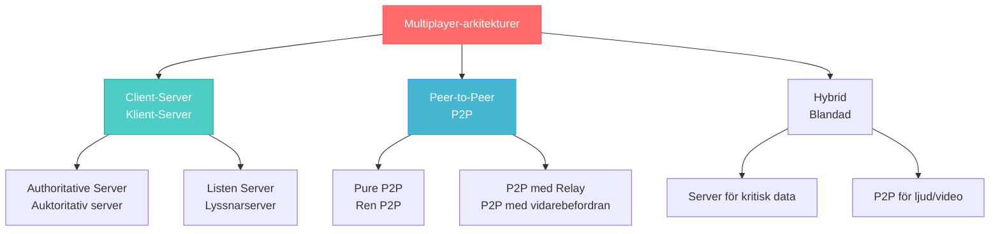
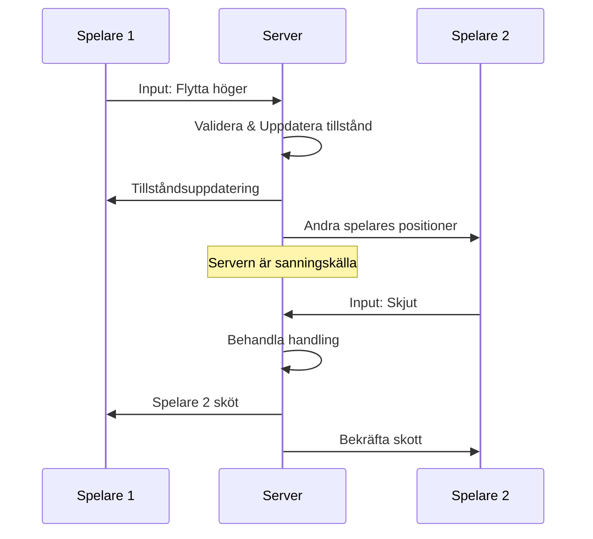

# Multiplayer-spel och realtidsarkitektur

## Varför multiplayer-spel?

Tänk dig att du spelar ett schackparti mot datorn - det fungerar bra, men det verkligt spännande händer när du spelar mot en riktig motståndare. Samma princip gäller för alla spel. Multiplayer-spel (flerspelarspel) skapar dynamiska, oförutsägbara upplevelser som bara människor kan leverera.

Webbaserade multiplayer-spel har revolutionerat spelvärlden genom att göra det möjligt för spelare världen över att interagera i realtid. Men att bygga dessa system innebär unika tekniska utmaningar - hur synkroniserar man spelstatus mellan flera klienter? Hur hanterar man nätverkslatens? Hur förhindrar man fusk?

Detta kapitel utforskar arkitekturen, utmaningarna och lösningarna för att skapa framgångsrika multiplayer-upplevelser på webben.

**Förkunskaper**: Detta kapitel förutsätter kunskap om WebSockets (kapitel 4), objektorienterad programmering och grundläggande nätverkskoncept.

## Vad är multiplayer-spel?

Multiplayer-spel låter flera spelare (players) delta samtidigt i samma spelupplevelse. De kan kategoriseras på olika sätt:

**Efter samarbetstyp**:
- **Cooperative (Co-op)**: Spelare arbetar tillsammans mot gemensamma mål (t.ex. Portal 2)
- **Competitive**: Spelare konkurrerar mot varandra (t.ex. Counter-Strike)
- **Sandbox**: Öppen värld där spelare kan interagera fritt (t.ex. Minecraft)

**Efter skala**:
- **Local multiplayer**: 2-4 spelare på samma enhet
- **Online multiplayer**: Spelare ansluter via internet
- **MMO**: Massively Multiplayer Online med hundratals eller tusentals spelare

### Arkitektur-alternativ



## Client-Server arkitektur

I client-server arkitektur fungerar servern som en "domare" i spelet - den bestämmer vad som är sant och vad som händer. Tänk på det som en fotbollsmatch där domaren har det sista ordet, oavsett vad spelarna tycker.

### Authoritative Server (Auktoritativ server)

Servern har full kontroll över game state (spelstatus) och validerar alla handlingar. Detta är den mest säkra men också mest komplexa lösningen.

```javascript
// Grundläggande spelserver
class GameServer {
  constructor() {
    this.gameState = {
      players: new Map(),
      entities: new Map(),
      worldState: {}
    };
    this.tickRate = 60; // Uppdateringar per sekund
  }
  
  startGameLoop() {
    setInterval(() => {
      this.updateGameLogic();
      this.broadcastGameState();
    }, 1000 / this.tickRate);
  }
  
  updateGameLogic() {
    // Uppdatera alla spelobjekt
    this.gameState.players.forEach(player => {
      player.update();
      this.validatePlayerAction(player);
    });
  }
}
```

**Fördelar**:
- Säker mot fusk (cheating)
- Konsistent spelupplevelse för alla
- Enkelt att implementera complex spellogik

**Nackdelar**:
- Kräver kraftfull server
- Högre latens (fördröjning)
- Single point of failure

### State Synchronization (Tillståndssynkronisering)



Servern fungerar som den enda källan till sanning (single source of truth). Alla klienter måste synkronisera sitt lokala **tillstånd** med serverns auktoritativa tillstånd.

## Hantera nätverkslatens

Nätverkslatens (network latency) är tiden det tar för data att resa från klient till server och tillbaka. För multiplayer-spel kan detta skapa märkbara förseningar.

### Client-side Prediction

Tänk på det som att "gissa" vad som kommer att hända medan du väntar på serverns svar:

```javascript
// Enkel client-side prediction
class GameClient {
  constructor() {
    this.socket = new WebSocket('ws://localhost:3000');
    this.localPlayer = { x: 100, y: 100 };
    this.inputHistory = [];
  }
  
  handleInput(direction) {
    const input = {
      direction: direction,
      timestamp: Date.now(),
      sequenceNumber: this.getNextSequence()
    };
    
    // Spara för senare reconciliation
    this.inputHistory.push(input);
    
    // Applicera omedelbart lokalt (prediction)
    this.movePlayer(this.localPlayer, direction);
    
    // Skicka till server
    this.socket.send(JSON.stringify({
      type: 'player_input',
      input: input
    }));
  }
  
  movePlayer(player, direction) {
    const speed = 5;
    switch (direction) {
      case 'up': player.y -= speed; break;
      case 'down': player.y += speed; break;
      case 'left': player.x -= speed; break;
      case 'right': player.x += speed; break;
    }
  }
}
```

### Server Reconciliation

När servern skickar tillbaka den "riktiga" positionen måste klienten jämföra och korrigera eventuella skillnader:

```javascript
// Hantera serveruppdateringar
onServerUpdate(serverState) {
  const serverPlayer = serverState.players[this.playerId];
  const localPlayer = this.localPlayer;
  
  // Beräkna skillnad i position
  const positionDiff = Math.sqrt(
    Math.pow(serverPlayer.x - localPlayer.x, 2) +
    Math.pow(serverPlayer.y - localPlayer.y, 2)
  );
  
  // Om skillnaden är för stor, korrigera
  if (positionDiff > 5) {
    this.reconcileWithServer(serverPlayer);
  }
}

reconcileWithServer(serverPlayer) {
  // Sätt till serverns position
  this.localPlayer.x = serverPlayer.x;
  this.localPlayer.y = serverPlayer.y;
  
  // Återapplicera inputs som servern inte hade sett ännu
  const serverTime = serverPlayer.timestamp;
  const inputsToReplay = this.inputHistory.filter(
    input => input.timestamp > serverTime
  );
  
  inputsToReplay.forEach(input => {
    this.movePlayer(this.localPlayer, input.direction);
  });
}
```

## Interpolation för mjuk rörelse

För att andra spelares rörelser ska se mjuka ut använder vi interpolation - som att "fylla i luckorna" mellan positionsuppdateringar:

```javascript
// Mjuk rörelse för andra spelare
class NetworkedPlayer {
  constructor() {
    this.positions = []; // Buffer av positioner från server
    this.renderPosition = { x: 0, y: 0 };
    this.interpolationDelay = 100; // 100ms fördröjning
  }
  
  addServerPosition(position, timestamp) {
    this.positions.push({
      x: position.x,
      y: position.y,
      timestamp: timestamp
    });
    
    // Behåll bara de senaste positionerna
    const cutoff = Date.now() - 1000;
    this.positions = this.positions.filter(p => p.timestamp > cutoff);
  }
  
  update() {
    const renderTime = Date.now() - this.interpolationDelay;
    
    // Hitta två positioner att interpolera mellan
    let before = null;
    let after = null;
    
    for (let i = 0; i < this.positions.length - 1; i++) {
      if (this.positions[i].timestamp <= renderTime &&
          this.positions[i + 1].timestamp >= renderTime) {
        before = this.positions[i];
        after = this.positions[i + 1];
        break;
      }
    }
    
    if (before && after) {
      // Interpolera mellan positionerna
      const totalTime = after.timestamp - before.timestamp;
      const targetTime = renderTime - before.timestamp;
      const ratio = targetTime / totalTime;
      
      this.renderPosition.x = before.x + (after.x - before.x) * ratio;
      this.renderPosition.y = before.y + (after.y - before.y) * ratio;
    }
  }
}
```

## Room Management (Rumhantering)

I de flesta multiplayer-spel behöver spelare organiseras i rooms (spelrum) eller lobbies:

```javascript
// Enkel rumhantering
class GameRoom {
  constructor(roomId, maxPlayers = 4) {
    this.id = roomId;
    this.players = new Map();
    this.maxPlayers = maxPlayers;
    this.gameState = 'waiting'; // waiting, playing, finished
  }
  
  addPlayer(playerId, playerData) {
    if (this.players.size >= this.maxPlayers) {
      return { success: false, reason: 'Rummet är fullt' };
    }
    
    this.players.set(playerId, {
      id: playerId,
      ...playerData,
      ready: false
    });
    
    // Meddela alla i rummet
    this.broadcast({
      type: 'player_joined',
      player: playerData,
      playerCount: this.players.size
    });
    
    return { success: true };
  }
  
  broadcast(message) {
    this.players.forEach((player) => {
      if (player.socket && player.socket.readyState === WebSocket.OPEN) {
        player.socket.send(JSON.stringify(message));
      }
    });
  }
}
```

## Säkerhet och anti-cheat

Multiplayer-spel är måltavlor för fuskare. Här är grundläggande säkerhetsåtgärder:

### Input Validation (Indatavalidering)

```javascript
// Validera all input på servern
class InputValidator {
  static validateMove(player, input) {
    // Kontrollera att input har rätt format
    if (typeof input.direction !== 'string') {
      return false;
    }
    
    // Kontrollera giltiga riktningar
    const validDirections = ['up', 'down', 'left', 'right'];
    if (!validDirections.includes(input.direction)) {
      return false;
    }
    
    // Kontrollera hastighet (anti-speed hack)
    const maxSpeed = 300; // pixels per sekund
    const timeDiff = Date.now() - player.lastMoveTime;
    const maxDistance = (maxSpeed * timeDiff) / 1000;
    
    if (player.distanceMoved > maxDistance) {
      console.log(`Misstänkt hastighetsfusk från spelare ${player.id}`);
      return false;
    }
    
    return true;
  }
}
```

### Rate Limiting

Förhindra spam genom att begränsa hur ofta en spelare kan skicka inputs:

```javascript
class RateLimiter {
  constructor() {
    this.playerInputCounts = new Map();
    this.maxInputsPerSecond = 60;
  }
  
  checkInputRate(playerId) {
    const now = Date.now();
    const playerData = this.playerInputCounts.get(playerId) || {
      inputs: [],
      lastCleanup: now
    };
    
    // Rensa gamla inputs varje sekund
    if (now - playerData.lastCleanup > 1000) {
      playerData.inputs = playerData.inputs.filter(
        timestamp => now - timestamp < 1000
      );
      playerData.lastCleanup = now;
    }
    
    // Lägg till ny input
    playerData.inputs.push(now);
    this.playerInputCounts.set(playerId, playerData);
    
    return playerData.inputs.length <= this.maxInputsPerSecond;
  }
}
```

## Praktiska användningsområden

### Realtidsstrategi (RTS)
- Synkroniserade commands (kommandon) mellan spelare
- Fog of war (krigsdimma) implementering
- Resource management (resurshantering)

### Action-spel
- Snabb input-respons krävs
- Kollisionsdetektering i realtid
- Smooth movement interpolation

### Turn-based spel
- Enklare att implementera
- Mindre krav på latens
- Fokus på fair turn management

## Best Practices

**Arkitekturval**:
- Använd authoritative server för competitive spel
- Överväg P2P för casual co-op spel
- Planera för skalbarhet från början

**Prestanda**:
- Optimera nätverkstrafik genom att bara skicka förändringar
- Använd object pooling för ofta skapade objekt
- Implementera lag compensation tekniker

**Säkerhet**:
- Validera all input på servern
- Implementera rate limiting
- Använd SSL/TLS (wss://) för säker kommunikation

**Användarupplevelse**:
- Implementera reconnection-hantering
- Visa tydliga felmeddelanden
- Ge feedback för nätverksstatus

## Sammanfattning

Multiplayer-spelutveckling kombinerar flera komplexa tekniker:

1. **Nätverkarkitektur**: Välj rätt struktur för ditt spel
2. **Tillståndssynkronisering**: Håll alla klienter uppdaterade
3. **Latenskompensation**: Gör spelet responsivt trots nätverksfördröjning
4. **Säkerhet**: Skydda mot fusk och attacker
5. **Skalbarhet**: Planera för tillväxt

Med en solid förståelse av dessa principer kan du bygga engagerande multiplayer-upplevelser som spelarna kommer att älska!

**Nästa steg**: Testa att implementera en enkel multiplayer-demo med 2-4 spelare för att praktisera dessa koncept.
