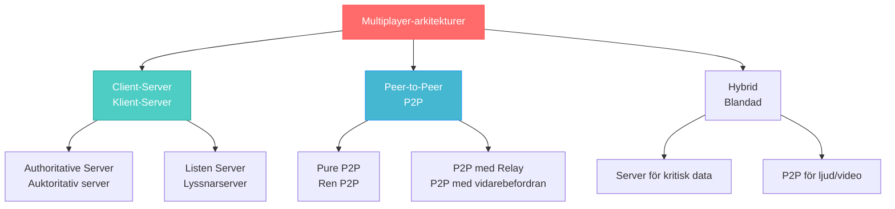
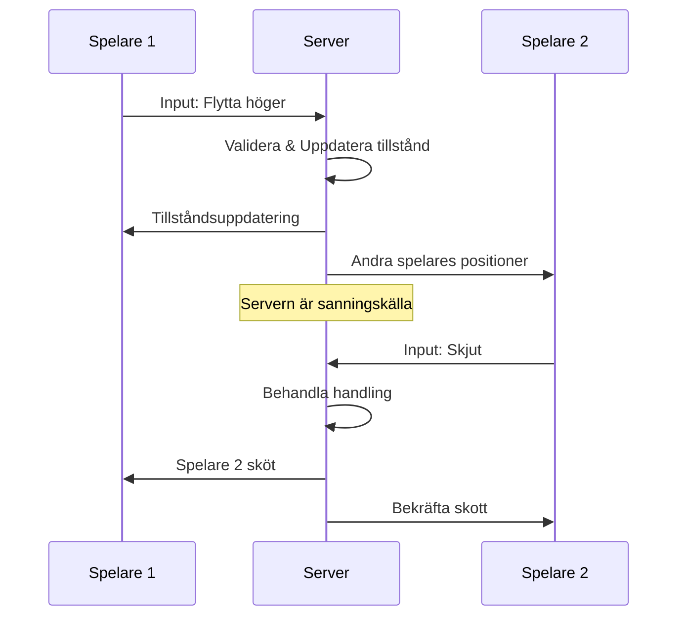

# Multiplayer-spel och realtidsarkitektur

## Varför multiplayer-spel?

Tänk dig att du spelar ett schackparti mot datorn - det fungerar bra, men det verkligt spännande händer när du spelar mot en riktig motståndare. Samma princip gäller för alla spel. Multiplayer-spel (flerspelarspel) skapar dynamiska, oförutsägbara upplevelser som bara människor kan leverera.

Webbaserade multiplayer-spel har revolutionerat spelvärlden genom att göra det möjligt för spelare världen över att interagera i realtid. Men att bygga dessa system innebär unika tekniska utmaningar - hur synkroniserar man spelstatus mellan flera klienter? Hur hanterar man nätverkslatens? Hur förhindrar man fusk?

Detta kapitel utforskar arkitekturen, utmaningarna och lösningarna för att skapa framgångsrika multiplayer-upplevelser på webben.

**Förkunskaper**: Detta kapitel förutsätter kunskap om WebSockets (kapitel 4), objektorienterad programmering och grundläggande nätverkskoncept.

## Vad är multiplayer-spel?

Multiplayer-spel låter flera spelare (players) delta samtidigt i samma spelupplevelse. De kan kategoriseras på olika sätt:

**Efter samarbetstyp**:
- **Cooperative (Co-op)**: Spelare arbetar tillsammans mot gemensamma mål (t.ex. Portal 2)
- **Competitive**: Spelare konkurrerar mot varandra (t.ex. Counter-Strike)
- **Sandbox**: Öppen värld där spelare kan interagera fritt (t.ex. Minecraft)

**Efter skala**:
- **Local multiplayer**: 2-4 spelare på samma enhet
- **Online multiplayer**: Spelare ansluter via internet
- **MMO**: Massively Multiplayer Online med hundratals eller tusentals spelare

### Arkitektur-alternativ


```mermaid
graph TB
    A[Multiplayer-arkitekturer] --> B["Client-Server\nKlient-Server"]
    A --> C["Peer-to-Peer\nP2P"]
    A --> D["Hybrid\nBlandad"]
    
    B --> B1["Authoritative Server\nAuktoritativ server"]
    B --> B2["Listen Server\nLyssnarserver"]
    
    C --> C1["Pure P2P\nRen P2P"]
    C --> C2["P2P med Relay\nP2P med vidarebefordran"]
    
    D --> D1[Server för kritisk data]
    D --> D2[P2P för ljud/video]
    
    style A fill:#FF6B6B,stroke:#FF5252,color:#fff
    style B fill:#4ECDC4,stroke:#26A69A,color:#fff
    style C fill:#45B7D1,stroke:#2196F3,color:#fff
```

## Client-Server arkitektur

I client-server arkitektur fungerar servern som en "domare" i spelet - den bestämmer vad som är sant och vad som händer. Tänk på det som en fotbollsmatch där domaren har det sista ordet, oavsett vad spelarna tycker.

### Authoritative Server (Auktoritativ server)

Servern har full kontroll över game state (spelstatus) och validerar alla handlingar. Detta är den mest säkra men också mest komplexa lösningen.

```javascript
// Grundläggande spelserver
class GameServer {
  constructor() {
    this.gameState = {
      players: new Map(),
      entities: new Map(),
      worldState: {}
    };
    this.tickRate = 60; // Uppdateringar per sekund
  }
  
  startGameLoop() {
    setInterval(() => {
      this.updateGameLogic();
      this.broadcastGameState();
    }, 1000 / this.tickRate);
  }
  
  updateGameLogic() {
    // Uppdatera alla spelobjekt
    this.gameState.players.forEach(player => {
      player.update();
      this.validatePlayerAction(player);
    });
  }
}
```

**Fördelar**:
- Säker mot fusk (cheating)
- Konsistent spelupplevelse för alla
- Enkelt att implementera complex spellogik

**Nackdelar**:
- Kräver kraftfull server
- Högre latens (fördröjning)
- Single point of failure

### State Synchronization (Tillståndssynkronisering)


```mermaid
sequenceDiagram
    participant P1 as Spelare 1
    participant S as Server
    participant P2 as Spelare 2
    
    P1->>S: Input: Flytta höger
    S->>S: Validera & Uppdatera tillstånd
    S->>P1: Tillståndsuppdatering
    S->>P2: Andra spelares positioner
    
    Note over S: Servern är sanningskälla
    
    P2->>S: Input: Skjut
    S->>S: Behandla handling
    S->>P1: Spelare 2 sköt
    S->>P2: Bekräfta skott
```

Servern fungerar som den enda källan till sanning (single source of truth). Alla klienter måste synkronisera sitt lokala **tillstånd** med serverns auktoritativa tillstånd.

## Hantera nätverkslatens

Nätverkslatens (network latency) är tiden det tar för data att resa från klient till server och tillbaka. För multiplayer-spel kan detta skapa märkbara förseningar.

### Client-side Prediction (översikt)

Client-side prediction är en teknik där klienten "gissar" vad som kommer att hända och visar resultatet direkt, medan den väntar på serverns bekräftelse. När serverns svar kommer korrigeras eventuella skillnader. Detta gör spelet kännas mer responsivt trots nätverksfördröjning. Detaljerad implementation av client-side prediction och server reconciliation ligger utanför denna moduls scope.

## Bygg en enkel multiplayer-server: Steg för steg

Låt oss bygga en enkel multiplayer-server steg för steg. Vi börjar med grunderna och bygger vidare.

### Steg 1: Grundläggande server-setup

Först behöver vi en WebSocket-server som lyssnar på anslutningar:

```javascript
// SERVER - Steg 1: Grundläggande setup
const WebSocket = require('ws');
const wss = new WebSocket.Server({ port: 3000 });

// Vi använder Map för att lagra spelare eftersom Map är mer robust
// för dynamiska nycklar och ger oss bättre prestanda vid många spelare
const gameState = {
  players: new Map() // playerId -> { x, y, color }
};

wss.on('connection', (ws) => {
  console.log('Ny anslutning');
  // Här kommer vi hantera anslutningar...
});
```

**Uppgift**: Skapa en fil `server.js` och sätt upp grundstrukturen ovan. Testa att starta servern med `node server.js`.

### Steg 2: Hantera nya spelare

När en spelare ansluter behöver vi:
1. Skapa ett unikt ID för spelaren
2. Lägga till spelaren i `gameState`
3. Skicka initialt tillstånd tillbaka

```javascript
wss.on('connection', (ws) => {
  // Skapa unikt ID för spelaren
  const playerId = Math.random().toString(36).substr(2, 9);
  
  // Lägg till spelare med startposition och färg
  gameState.players.set(playerId, {
    id: playerId,
    x: Math.random() * 400,  // Slumpmässig x-position
    y: Math.random() * 400,   // Slumpmässig y-position
    color: `#${Math.floor(Math.random()*16777215).toString(16)}` // Slumpmässig färg
  });
  
  // Skicka initialt tillstånd till den nya spelaren
  ws.send(JSON.stringify({
    type: 'init',
    playerId: playerId,
    gameState: Array.from(gameState.players.values())
  }));
  
  // TODO: Skicka till alla andra spelare att någon ny anslöt
});
```

**Uppgift**: Implementera funktionen `broadcastToOthers()` som skickar meddelanden till alla utom en specifik spelare. Tänk på att kontrollera att WebSocket-anslutningen är öppen innan du skickar.

### Steg 3: Hantera spelarrörelser

När en spelare vill röra sig skickar klienten ett meddelande. Servern måste:
1. Validera och uppdatera positionen (auktoritativt)
2. Skicka den nya positionen till alla spelare

```javascript
ws.on('message', (message) => {
  const data = JSON.parse(message);
  
  if (data.type === 'move') {
    const player = gameState.players.get(playerId);
    if (!player) return;
    
    // SERVER VALIDERAR OCH UPPDATERAR (auktoritativt)
    const speed = 5;
    // TODO: Implementera rörelselogik för alla fyra riktningar
    // Tänk på att begränsa positionerna till kanvas-storleken (0-400)
    
    // TODO: Skicka uppdaterad position till alla spelare
  }
});
```

**Uppgift**: Implementera rörelselogiken för alla fyra riktningar (up, down, left, right). Använd `Math.max()` och `Math.min()` för att hålla positionerna inom gränserna.

### Steg 4: Hantera när spelare lämnar

När en spelare kopplar från måste vi:
1. Ta bort spelaren från `gameState`
2. Meddela alla andra spelare

```javascript
ws.on('close', () => {
  // TODO: Ta bort spelaren från gameState
  // TODO: Meddela alla andra spelare att spelaren lämnade
});
```

**Uppgift**: Implementera hanteringen när en spelare kopplar från.

### Steg 5: Klienten - Grundstruktur

Nu ska vi bygga klienten. Börja med grundstrukturen:

```javascript
// KLIENT - Steg 1: Grundstruktur
class SimpleGameClient {
  constructor() {
    this.socket = new WebSocket('ws://localhost:3000');

    // Map är en inbyggd datastruktur i JavaScript som låter dig lagra nyckel-värde-par,
    // där nycklarna kan vara av vilken typ som helst (t.ex. strängar, siffror, objekt).
    // I multiplayer-spel passar Map bättre än vanliga objekt för att lagra spelare,
    // eftersom varje spelare kan ha ett unikt id (t.ex. en socket-id) som nyckel.
    // Det blir enkelt att lägga till, ta bort och slå upp spelare utan krockar mellan olika typer av nycklar.
    this.players = new Map(); 
    this.myPlayerId = null;
    
    // TODO: Sätt upp event listeners för meddelanden från servern
  }
}
```

**Uppgift**: Skapa en HTML-fil med en `<canvas>` (id: `gameCanvas`, storlek 400x400) och en `GameClient`-klass. Anslut till servern.

### Steg 6: Hantera meddelanden från servern

Klienten måste hantera olika typer av meddelanden:

```javascript
this.socket.onmessage = (event) => {
  const data = JSON.parse(event.data);
  
  if (data.type === 'init') {
    // TODO: Spara ditt eget playerId
    // TODO: Lägg till alla spelare från gameState
    // TODO: Rendera spelet
  }
  
  if (data.type === 'player_joined') {
    // TODO: Lägg till den nya spelaren
    // TODO: Rendera spelet
  }
  
  if (data.type === 'player_moved') {
    // TODO: Uppdatera spelarens position från servern
    // TODO: Rendera spelet
  }
  
  if (data.type === 'player_left') {
    // TODO: Ta bort spelaren
    // TODO: Rendera spelet
  }
};
```

**Uppgift**: Implementera hanteringen för alla meddelandetyper. Kom ihåg att klienten bara visar vad servern säger - den uppdaterar inte positioner själv.

### Steg 7: Skicka input till servern

Klienten skickar input när spelaren trycker på piltangenterna:

```javascript
document.addEventListener('keydown', (e) => {
  if (!this.myPlayerId) return;
  
  // TODO: Konvertera tangenttryckningar till riktningar
  // ArrowUp -> 'up', ArrowDown -> 'down', etc.
  // const direction = ...
  
  if (direction) {
    // TODO: Skicka meddelande till servern med typ 'move' och riktningen
  }
});
```

**Uppgift**: Implementera tangentlyssnaren som skickar rörelsekommandon till servern.

### Steg 8: Rendera spelet

Slutligen behöver vi rendera alla spelare:

```javascript
render() {
  const canvas = document.getElementById('gameCanvas');
  const ctx = canvas.getContext('2d');
  ctx.clearRect(0, 0, 400, 400);
  
  // TODO: Loopa över alla spelare och rita dem
  // Tips: Använd player.color för färg, player.x och player.y för position
  // Rita en kvadrat (20x20 pixlar) för varje spelare
  // Markera din egen spelare med en svart kant
}
```

**Uppgift**: Implementera render-funktionen. Testa att öppna flera flikar och se att spelarna syns för varandra.

**Viktiga lärdomar:**
- Servern är auktoritativ - den bestämmer alla positioner
- Klienten skickar bara input och visar vad servern säger
- Alla spelare får samma uppdateringar från servern
- Detta gör det enkelt att validera och förhindra fusk

### Lobby
Det är viktigt att låta spelare landa i en lobby med chat innan man faktiskt kör igång spelet. Nedan får ni se steg för steg hur man kan implementera en sådan.

#### Steg 1: Skapa Lobby-klassen

Vi börjar med en klass som håller reda på spelare, chatmeddelanden och vem som är redo:

```javascript
class Lobby {
  constructor(lobbyId, maxPlayers = 4) {
    this.id = lobbyId;
    this.players = new Map(); // playerId -> { socket, name, ready }
    this.maxPlayers = maxPlayers;
    this.chatHistory = []; // { playerId, name, text, ts }
  }
  
  // TODO: Implementera addPlayer-metoden
  // Den ska:
  // 1. Kontrollera om lobbyn är full
  // 2. Lägga till spelaren (name + ready=false)
  // 3. Skicka en lobby_update till alla
  // 4. Returnera { success: true/false, reason: ... }
  
  // TODO: Implementera removePlayer-metoden
  // Den ska ta bort spelaren och skicka lobby_update
  
  // TODO: Implementera setReady-metoden
  // Den ska uppdatera ready-status och skicka lobby_update
  
  // TODO: Implementera addChatMessage-metoden
  // Den ska spara meddelandet och broadcasta chat_message
  
  // TODO: Implementera canStart-metoden
  // Den ska returnera true om alla spelare är ready och minst 2 spelare finns
  
  // TODO: Implementera broadcast-metoden
  // Den ska skicka meddelanden till alla spelare i lobbyn
}
```

**Uppgift**: Implementera `Lobby`-klassen. Se till att lobbyn håller koll på ready-status och kan avgöra om spelet får starta.

#### Steg 2: Hantera lobby på servern

Nu behöver vi en Map för att lagra lobbyer och uppdatera connection-hanteraren:

```javascript
const lobbies = new Map(); // lobbyId -> Lobby

wss.on('connection', (ws) => {
  const playerId = Math.random().toString(36).substr(2, 9);
  let currentLobby = null;
  
  ws.on('message', (message) => {
    const data = JSON.parse(message);
    
    if (data.type === 'join_lobby') {
      const lobbyId = data.lobbyId || 'default';
      const name = data.name || 'Player';
      
      // TODO: Skapa lobby om den inte finns
      // TODO: Försök lägga till spelaren i lobbyn
      // TODO: Om lyckat, spara currentLobby och skicka lobby_state + chat_history
      // TODO: Om misslyckat, skicka felmeddelande
    }
    
    if (data.type === 'chat' && currentLobby) {
      // TODO: Lägg till chatmeddelande i lobbyn
    }
    
    if (data.type === 'ready' && currentLobby) {
      // TODO: Uppdatera ready-status och broadcasta lobby_update
    }
    
    if (data.type === 'start_game' && currentLobby) {
      // TODO: Kontrollera currentLobby.canStart()
      // TODO: Om ok, skicka start_game till alla i lobbyn
    }
  });
  
  ws.on('close', () => {
    // TODO: Ta bort spelaren från lobbyn
    // TODO: Ta bort lobbyn om den blir tom
  });
});
```

**Uppgift**: Implementera lobbyhanteringen. Testa att chatta, toggla ready och starta spelet när alla är redo.

#### Steg 3: Uppdatera klienten

Klienten behöver kunna ansluta till en lobby, skicka chat och toggla ready:

```javascript
// I konstruktorn, efter att socket skapats:
this.socket.onopen = () => {
  // TODO: Skicka join_lobby med lobbyId + namn
};

sendChat(text) {
  // TODO: Skicka { type: 'chat', text }
}

toggleReady() {
  // TODO: Skicka { type: 'ready', ready: !this.isReady }
}

startGame() {
  // TODO: Skicka { type: 'start_game' }
}
```

**Uppgift**: Bygg ett enkelt lobby-UI med chatlista, input, ready-knapp och en start-knapp som bara fungerar när alla är redo.


### Överkurs: Utöka med Room Management

I exemplet ovan är alla spelare i samma "rum". Låt oss lägga till möjligheten att organisera spelare i separata spelrum.

#### Steg 1: Skapa GameRoom-klassen

Först behöver vi en klass som representerar ett spelrum:

```javascript
class GameRoom {
  constructor(roomId, maxPlayers = 4) {
    this.id = roomId;
    this.players = new Map(); // playerId -> { socket, playerData }
    this.maxPlayers = maxPlayers;
    this.gameState = {
      players: new Map() // Lokal gameState för detta rum
    };
  }
  
  // TODO: Implementera addPlayer-metoden
  // Den ska:
  // 1. Kontrollera om rummet är fullt
  // 2. Lägga till spelaren i både players och gameState
  // 3. Skicka meddelande till alla i rummet
  // 4. Returnera { success: true/false, reason: ... }
  
  // TODO: Implementera removePlayer-metoden
  // Den ska ta bort spelaren och meddela andra
  
  // TODO: Implementera handleMove-metoden
  // Den ska hantera rörelser (samma logik som tidigare)
  
  // TODO: Implementera broadcast-metoden
  // Den ska skicka meddelanden till alla spelare i rummet
}
```

**Uppgift**: Implementera `GameRoom`-klassen. Tänk på att varje rum har sin egen `gameState` så att spelare i olika rum inte ser varandra.

#### Steg 2: Hantera rum i servern

Nu behöver vi en Map för att lagra alla rum och uppdatera connection-hanteraren:

```javascript
const rooms = new Map(); // roomId -> GameRoom

wss.on('connection', (ws) => {
  const playerId = Math.random().toString(36).substr(2, 9);
  let currentRoom = null;
  
  ws.on('message', (message) => {
    const data = JSON.parse(message);
    
    if (data.type === 'join_room') {
      const roomId = data.roomId || 'default';
      
      // TODO: Skapa rum om det inte finns
      // TODO: Försök lägga till spelaren i rummet
      // TODO: Om lyckat, spara currentRoom och skicka init-meddelande
      // TODO: Om misslyckat, skicka felmeddelande
    }
    
    if (data.type === 'move' && currentRoom) {
      // TODO: Hantera rörelse via rummet
    }
  });
  
  ws.on('close', () => {
    // TODO: Ta bort spelaren från rummet
    // TODO: Ta bort rummet om det blir tomt
  });
});
```

**Uppgift**: Implementera rumhanteringen. Testa att skapa flera rum och se att spelare i olika rum inte ser varandra.

#### Steg 3: Uppdatera klienten

Klienten behöver skicka ett `join_room`-meddelande när den ansluter:

```javascript
// I konstruktorn, efter att socket skapats:
this.socket.onopen = () => {
  // TODO: Skicka join_room-meddelande
  // Använd ett rum-ID eller 'default' om inget anges
};
```

**Uppgift**: Lägg till möjlighet att välja rum-ID (t.ex. via en input-ruta) och ansluta till det rummet.

### Överkurs: Utöka för olika speltyper

Den grundläggande strukturen kan anpassas för olika speltyper. Här är några idéer att experimentera med:

**Turn-based spel** (t.ex. schack, brädpel):
- Lägg till `gameState.currentTurn` som håller koll på vems tur det är
- Validera på servern att bara spelaren vars tur det är kan göra drag
- Skicka meddelande när turen är över så nästa spelare kan agera
- **Uppgift**: Försök implementera en enkel turordning där spelare växlar tur

**Action-spel** (t.ex. platformer, racing):
- Öka uppdateringsfrekvensen (lägre intervall i `setInterval`)
- Lägg till kollisionsdetektering på servern innan position uppdateras
- **Uppgift**: Lägg till en enkel kollisionsdetektering - t.ex. förhindra att spelare går utanför kanvasen eller kolliderar med varandra

**Realtidsstrategi** (RTS):
- Istället för direkt rörelse, låt spelare skicka "kommandon" (t.ex. "flytta till position X,Y")
- Servern köar kommandona och kör dem i turordning
- **Uppgift**: Skapa ett enkelt commands-system där spelare kan skicka kommandon som servern kör asynkront

## Sammanfattning

I detta kapitel har vi byggt en enkel multiplayer-server steg för steg:

1. **Grundstruktur**: Servern är auktoritativ - den validerar och uppdaterar allt spelstatus
2. **Klientens roll**: Skicka input, ta emot uppdateringar, rendera vad servern säger
3. **Utbyggbarhet**: Samma grund kan utökas med rumhantering, turordning, kommandon m.m.

**Viktiga lärdomar:**
- Använd `Map` för att hantera dynamiska spelare effektivt
- Servern bestämmer allt - klienten är bara en "vy" av serverns tillstånd
- Alla spelare måste få samma uppdateringar för konsistens
- Bygg steg för steg - börja enkelt och lägg till funktioner när du behöver dem

**Nästa steg**: Experimentera med att lägga till nya funktioner till din server. Kanske en poängräkning, objekt att samla, eller en enkel spellogik?

