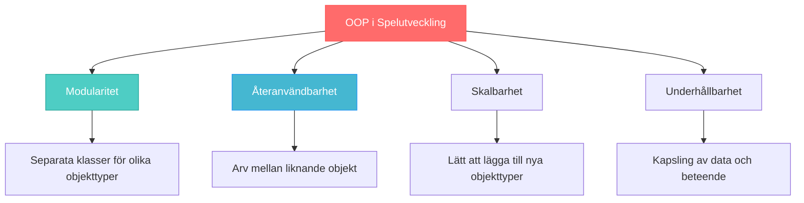
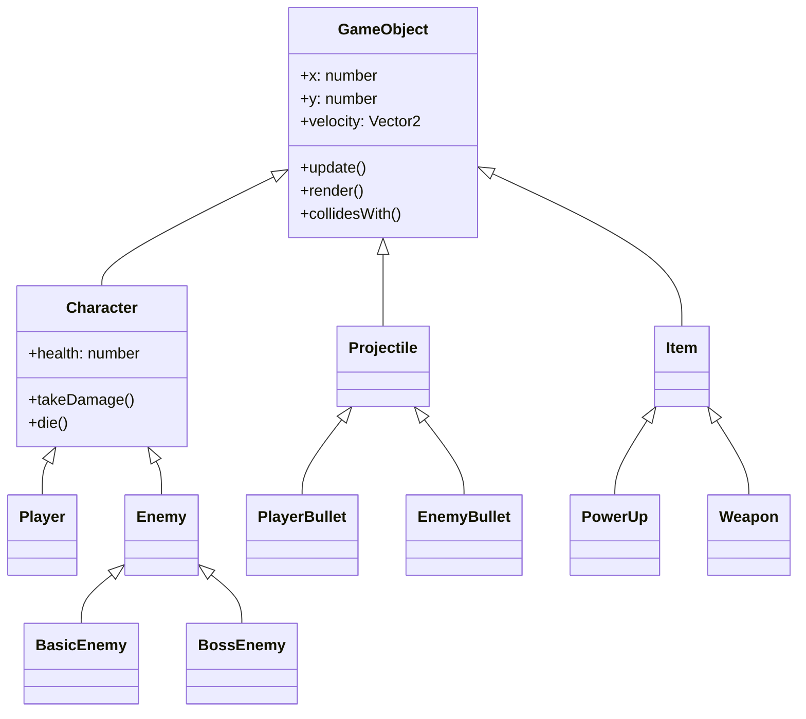

# Objektorienterad programmering för spelutveckling

Objektorienterad programmering (OOP) är en kraftfull paradigm som är särskilt väl lämpad för spelutveckling. I spel representerar vi olika element som objekt - spelare, fiender, projektiler, powerups - och varje objekt har sina egna egenskaper och beteenden. Detta kapitel utforskar hur du använder JavaScript's OOP-funktioner för att bygga välstrukturerade och skalbara spel.

## Varför OOP för spel?

### Fördelar med OOP i spelutveckling



- **Naturlig modellering**: Spelobjekt mappar naturligt till klasser och objekt
- **Kodorganisation**: Separera olika spelmekaniker i egna klasser
- **Återanvändning**: Skapa basobjekt som kan utökas för specifika behov
- **Kollisionshantering**: Enkelt att hantera interaktioner mellan objekttyper
- **Skalbarhet**: Lätt att lägga till nya funktioner och objekttyper

### Grundläggande spelarkitektur

```javascript
// Basarkitektur för ett spel med OOP
class Game {
  constructor() {
    this.entities = [];
    this.running = false;
    this.lastTime = 0;
  }
  
  addEntity(entity) {
    this.entities.push(entity);
  }
  
  removeEntity(entity) {
    const index = this.entities.indexOf(entity);
    if (index > -1) {
      this.entities.splice(index, 1);
    }
  }
  
  update(deltaTime) {
    // Uppdatera alla entiteter
    this.entities.forEach(entity => {
      entity.update(deltaTime);
    });
    
    // Ta bort döda objekt
    this.entities = this.entities.filter(entity => !entity.isDead);
    
    // Hantera kollisioner
    this.handleCollisions();
  }
  
  render(ctx) {
    // Rita alla entiteter
    this.entities.forEach(entity => {
      entity.render(ctx);
    });
  }
}
```

## Klasser och objekt i JavaScript

### ES6 Class Syntax

JavaScript använder prototypbaserad arv men ES6-klasser ger en mer välbekant syntax:

```javascript
class GameObject {
  constructor(x, y, width, height) {
    this.x = x;
    this.y = y;
    this.width = width;
    this.height = height;
    this.velocity = { x: 0, y: 0 };
    this.isDead = false;
    this.sprite = null;
  }
  
  // Metoder som alla spelobjekt har
  update(deltaTime) {
    // Grundläggande fysik
    this.x += this.velocity.x * deltaTime;
    this.y += this.velocity.y * deltaTime;
  }
  
  render(ctx) {
    if (this.sprite) {
      ctx.drawImage(this.sprite, this.x, this.y, this.width, this.height);
    } else {
      // Fallback till enkel rektangel
      ctx.fillStyle = this.color || '#ff0000';
      ctx.fillRect(this.x, this.y, this.width, this.height);
    }
  }
  
  // Kollisionsdetektering
  getBounds() {
    return {
      left: this.x,
      right: this.x + this.width,
      top: this.y,
      bottom: this.y + this.height
    };
  }
  
  collidesWith(other) {
    const bounds1 = this.getBounds();
    const bounds2 = other.getBounds();
    
    return bounds1.left < bounds2.right &&
           bounds1.right > bounds2.left &&
           bounds1.top < bounds2.bottom &&
           bounds1.bottom > bounds2.top;
  }
  
  destroy() {
    this.isDead = true;
  }
}
```

### Privata fält och metoder

```javascript
class Player {
  // Privata fält (ES2022)
  #health = 100;
  #maxHealth = 100;
  #invulnerable = false;
  
  constructor(x, y) {
    this.x = x;
    this.y = y;
    this.score = 0;
  }
  
  // Publik metod för att ta skada
  takeDamage(amount) {
    if (this.#invulnerable) return;
    
    this.#health -= amount;
    this.#makeInvulnerable(1000); // 1 sekund invulnerabilitet
    
    if (this.#health <= 0) {
      this.die();
    }
  }
  
  // Privat metod
  #makeInvulnerable(duration) {
    this.#invulnerable = true;
    setTimeout(() => {
      this.#invulnerable = false;
    }, duration);
  }
  
  // Getter för hälsa (read-only från utsidan)
  get health() {
    return this.#health;
  }
  
  get healthPercentage() {
    return (this.#health / this.#maxHealth) * 100;
  }
  
  // Metod för healing
  heal(amount) {
    this.#health = Math.min(this.#health + amount, this.#maxHealth);
  }
}
```

## Arv och polymorfism

### Hierarki av spelobjekt



### Implementering av arv

```javascript
// Baskarakterklass
class Character extends GameObject {
  constructor(x, y, width, height, health) {
    super(x, y, width, height);
    this.health = health;
    this.maxHealth = health;
    this.direction = 1; // 1 för höger, -1 för vänster
  }
  
  takeDamage(amount) {
    this.health -= amount;
    if (this.health <= 0) {
      this.die();
    }
  }
  
  die() {
    this.isDead = true;
    this.onDeath(); // Hook för subklasser
  }
  
  // Abstrakt metod som subklasser måste implementera
  onDeath() {
    // Override i subklasser
  }
  
  heal(amount) {
    this.health = Math.min(this.health + amount, this.maxHealth);
  }
}

// Spelarklass
class Player extends Character {
  constructor(x, y) {
    super(x, y, 32, 32, 100);
    this.score = 0;
    this.lives = 3;
    this.weapons = ['pistol'];
    this.currentWeapon = 0;
    this.ammunition = { pistol: Infinity, rifle: 30 };
  }
  
  onDeath() {
    this.lives--;
    if (this.lives > 0) {
      this.respawn();
    } else {
      this.gameOver();
    }
  }
  
  respawn() {
    this.health = this.maxHealth;
    this.x = 100; // Startposition
    this.y = 100;
    this.isDead = false;
  }
  
  shoot() {
    const weapon = this.weapons[this.currentWeapon];
    const ammo = this.ammunition[weapon];
    
    if (ammo > 0) {
      // Skapa projektil
      const bullet = new PlayerBullet(
        this.x + this.width / 2,
        this.y,
        this.direction
      );
      
      game.addEntity(bullet);
      
      if (ammo !== Infinity) {
        this.ammunition[weapon]--;
      }
    }
  }
  
  switchWeapon() {
    this.currentWeapon = (this.currentWeapon + 1) % this.weapons.length;
  }
}

// Fiendeklass
class Enemy extends Character {
  constructor(x, y, health, aiType = 'basic') {
    super(x, y, 24, 24, health);
    this.aiType = aiType;
    this.attackDamage = 10;
    this.scoreValue = 100;
    this.lastAttack = 0;
    this.attackCooldown = 1000; // ms
  }
  
  update(deltaTime) {
    super.update(deltaTime);
    this.updateAI(deltaTime);
    this.checkAttack();
  }
  
  updateAI(deltaTime) {
    switch (this.aiType) {
      case 'basic':
        this.basicAI(deltaTime);
        break;
      case 'aggressive':
        this.aggressiveAI(deltaTime);
        break;
      case 'defensive':
        this.defensiveAI(deltaTime);
        break;
    }
  }
  
  basicAI(deltaTime) {
    // Enkel AI: rör sig mot spelaren
    const player = game.getPlayer();
    if (player) {
      const dx = player.x - this.x;
      const dy = player.y - this.y;
      const distance = Math.sqrt(dx * dx + dy * dy);
      
      if (distance > 0) {
        this.velocity.x = (dx / distance) * 50; // Hastighet 50 px/s
        this.velocity.y = (dy / distance) * 50;
      }
    }
  }
  
  checkAttack() {
    const now = Date.now();
    if (now - this.lastAttack < this.attackCooldown) return;
    
    const player = game.getPlayer();
    if (player && this.collidesWith(player)) {
      player.takeDamage(this.attackDamage);
      this.lastAttack = now;
    }
  }
  
  onDeath() {
    // Ge poäng till spelaren
    const player = game.getPlayer();
    if (player) {
      player.score += this.scoreValue;
    }
    
    // Möjlighet att droppa items
    this.dropLoot();
  }
  
  dropLoot() {
    if (Math.random() < 0.3) { // 30% chans
      const powerup = new HealthPowerUp(this.x, this.y);
      game.addEntity(powerup);
    }
  }
}
```

### Polymorfism i praktiken

```javascript
// Olika projektiltyper
class Projectile extends GameObject {
  constructor(x, y, direction, speed, damage) {
    super(x, y, 4, 8);
    this.velocity.x = direction * speed;
    this.damage = damage;
    this.lifespan = 3000; // 3 sekunder
    this.createdAt = Date.now();
  }
  
  update(deltaTime) {
    super.update(deltaTime);
    
    // Ta bort projektil efter lifespan
    if (Date.now() - this.createdAt > this.lifespan) {
      this.destroy();
    }
    
    // Kontrollera kollision med mål
    this.checkCollisions();
  }
  
  // Abstrakt metod
  checkCollisions() {
    // Implementeras av subklasser
  }
}

class PlayerBullet extends Projectile {
  constructor(x, y, direction) {
    super(x, y, direction, 300, 25); // Snabb, hög skada
    this.color = '#ffff00'; // Gul
  }
  
  checkCollisions() {
    game.entities.forEach(entity => {
      if (entity instanceof Enemy && this.collidesWith(entity)) {
        entity.takeDamage(this.damage);
        this.destroy();
      }
    });
  }
}

class EnemyBullet extends Projectile {
  constructor(x, y, direction) {
    super(x, y, direction, 200, 15); // Långsammare, lägre skada
    this.color = '#ff0000'; // Röd
  }
  
  checkCollisions() {
    const player = game.getPlayer();
    if (player && this.collidesWith(player)) {
      player.takeDamage(this.damage);
      this.destroy();
    }
  }
}

// Polymorf hantering
class BulletManager {
  constructor() {
    this.bullets = [];
  }
  
  addBullet(bullet) {
    this.bullets.push(bullet);
  }
  
  update(deltaTime) {
    // Alla bullets uppdateras polymorfiskt
    this.bullets.forEach(bullet => {
      bullet.update(deltaTime);
    });
    
    // Ta bort döda bullets
    this.bullets = this.bullets.filter(bullet => !bullet.isDead);
  }
}
```

## Composition över inheritance

### Komponent-baserad arkitektur

```javascript
// Komponent-baserat system
class Component {
  constructor(entity) {
    this.entity = entity;
    this.enabled = true;
  }
  
  update(deltaTime) {
    // Override i subkomponenter
  }
}

class PositionComponent extends Component {
  constructor(entity, x, y) {
    super(entity);
    this.x = x;
    this.y = y;
  }
}

class VelocityComponent extends Component {
  constructor(entity, vx = 0, vy = 0) {
    super(entity);
    this.vx = vx;
    this.vy = vy;
  }
  
  update(deltaTime) {
    if (this.entity.hasComponent('Position')) {
      const pos = this.entity.getComponent('Position');
      pos.x += this.vx * deltaTime / 1000;
      pos.y += this.vy * deltaTime / 1000;
    }
  }
}

class RenderComponent extends Component {
  constructor(entity, sprite, width, height) {
    super(entity);
    this.sprite = sprite;
    this.width = width;
    this.height = height;
  }
  
  render(ctx) {
    if (!this.enabled) return;
    
    const pos = this.entity.getComponent('Position');
    if (pos) {
      if (this.sprite) {
        ctx.drawImage(this.sprite, pos.x, pos.y, this.width, this.height);
      } else {
        ctx.fillStyle = '#ff0000';
        ctx.fillRect(pos.x, pos.y, this.width, this.height);
      }
    }
  }
}

class HealthComponent extends Component {
  constructor(entity, maxHealth) {
    super(entity);
    this.health = maxHealth;
    this.maxHealth = maxHealth;
  }
  
  takeDamage(amount) {
    this.health -= amount;
    if (this.health <= 0) {
      this.entity.destroy();
    }
  }
  
  heal(amount) {
    this.health = Math.min(this.health + amount, this.maxHealth);
  }
}

// Entity som använder komponenter
class Entity {
  constructor() {
    this.components = new Map();
    this.id = Math.random().toString(36).substr(2, 9);
  }
  
  addComponent(name, component) {
    this.components.set(name, component);
    return this;
  }
  
  getComponent(name) {
    return this.components.get(name);
  }
  
  hasComponent(name) {
    return this.components.has(name);
  }
  
  removeComponent(name) {
    this.components.delete(name);
  }
  
  update(deltaTime) {
    this.components.forEach(component => {
      if (component.enabled) {
        component.update(deltaTime);
      }
    });
  }
  
  render(ctx) {
    const renderComponent = this.getComponent('Render');
    if (renderComponent) {
      renderComponent.render(ctx);
    }
  }
}

// Skapa entities med komponenter
function createPlayer(x, y) {
  const player = new Entity()
    .addComponent('Position', new PositionComponent(player, x, y))
    .addComponent('Velocity', new VelocityComponent(player))
    .addComponent('Render', new RenderComponent(player, playerSprite, 32, 32))
    .addComponent('Health', new HealthComponent(player, 100))
    .addComponent('Input', new InputComponent(player));
  
  return player;
}

function createEnemy(x, y) {
  const enemy = new Entity()
    .addComponent('Position', new PositionComponent(enemy, x, y))
    .addComponent('Velocity', new VelocityComponent(enemy))
    .addComponent('Render', new RenderComponent(enemy, enemySprite, 24, 24))
    .addComponent('Health', new HealthComponent(enemy, 50))
    .addComponent('AI', new AIComponent(enemy, 'basic'));
  
  return enemy;
}
```

## Design patterns för spel

### State Pattern för AI

```javascript
// State pattern för fiende-AI
class AIState {
  constructor(enemy) {
    this.enemy = enemy;
  }
  
  enter() {
    // Initialisering när state aktiveras
  }
  
  update(deltaTime) {
    // Abstrakt metod
  }
  
  exit() {
    // Cleanup när state lämnas
  }
}

class IdleState extends AIState {
  constructor(enemy) {
    super(enemy);
    this.idleTime = 0;
    this.maxIdleTime = 2000; // 2 sekunder
  }
  
  update(deltaTime) {
    this.idleTime += deltaTime;
    
    // Kolla om spelare är i närheten
    const player = game.getPlayer();
    const distance = this.enemy.distanceTo(player);
    
    if (distance < 100) {
      this.enemy.changeState(new ChaseState(this.enemy));
    } else if (this.idleTime >= this.maxIdleTime) {
      this.enemy.changeState(new PatrolState(this.enemy));
    }
  }
}

class ChaseState extends AIState {
  update(deltaTime) {
    const player = game.getPlayer();
    if (!player) return;
    
    const distance = this.enemy.distanceTo(player);
    
    if (distance > 200) {
      // Spelaren kom undan
      this.enemy.changeState(new IdleState(this.enemy));
    } else if (distance < 30) {
      // Nära nog för attack
      this.enemy.changeState(new AttackState(this.enemy));
    } else {
      // Jaga spelaren
      this.enemy.moveTowards(player.x, player.y, deltaTime);
    }
  }
}

class AttackState extends AIState {
  constructor(enemy) {
    super(enemy);
    this.attackTimer = 0;
    this.attackDuration = 500; // Attack tar 0.5 sekunder
  }
  
  enter() {
    // Starta attack-animation
    this.enemy.startAttackAnimation();
  }
  
  update(deltaTime) {
    this.attackTimer += deltaTime;
    
    if (this.attackTimer >= this.attackDuration) {
      // Utför attack
      const player = game.getPlayer();
      if (player && this.enemy.distanceTo(player) < 30) {
        player.takeDamage(this.enemy.attackDamage);
      }
      
      this.enemy.changeState(new IdleState(this.enemy));
    }
  }
}

// Enemy med state machine
class StateMachineEnemy extends Enemy {
  constructor(x, y) {
    super(x, y, 100, 'stateMachine');
    this.currentState = new IdleState(this);
    this.currentState.enter();
  }
  
  changeState(newState) {
    this.currentState.exit();
    this.currentState = newState;
    this.currentState.enter();
  }
  
  update(deltaTime) {
    super.update(deltaTime);
    this.currentState.update(deltaTime);
  }
}
```

### Observer Pattern för events

```javascript
// Event system med Observer pattern
class EventEmitter {
  constructor() {
    this.events = new Map();
  }
  
  on(eventName, callback) {
    if (!this.events.has(eventName)) {
      this.events.set(eventName, []);
    }
    this.events.get(eventName).push(callback);
  }
  
  off(eventName, callback) {
    if (this.events.has(eventName)) {
      const callbacks = this.events.get(eventName);
      const index = callbacks.indexOf(callback);
      if (index > -1) {
        callbacks.splice(index, 1);
      }
    }
  }
  
  emit(eventName, ...args) {
    if (this.events.has(eventName)) {
      this.events.get(eventName).forEach(callback => {
        callback(...args);
      });
    }
  }
}

// Global event bus
const gameEvents = new EventEmitter();

// Användning i spelobjekt
class EventAwarePlayer extends Player {
  constructor(x, y) {
    super(x, y);
    
    // Lyssna på events
    gameEvents.on('enemy-killed', this.onEnemyKilled.bind(this));
    gameEvents.on('item-collected', this.onItemCollected.bind(this));
  }
  
  takeDamage(amount) {
    super.takeDamage(amount);
    
    // Skicka event när spelaren tar skada
    gameEvents.emit('player-damaged', {
      player: this,
      damage: amount,
      health: this.health
    });
  }
  
  onEnemyKilled(enemy) {
    this.score += enemy.scoreValue;
    gameEvents.emit('score-changed', this.score);
  }
  
  onItemCollected(item) {
    // Hantera olika item-typer
    switch (item.type) {
      case 'health':
        this.heal(item.value);
        break;
      case 'weapon':
        this.addWeapon(item.weaponType);
        break;
    }
  }
}

// UI-system som lyssnar på events
class GameUI {
  constructor() {
    gameEvents.on('player-damaged', this.updateHealthBar.bind(this));
    gameEvents.on('score-changed', this.updateScore.bind(this));
    gameEvents.on('level-completed', this.showLevelComplete.bind(this));
  }
  
  updateHealthBar(data) {
    const healthBar = document.getElementById('health-bar');
    const percentage = (data.health / data.player.maxHealth) * 100;
    healthBar.style.width = `${percentage}%`;
  }
  
  updateScore(score) {
    const scoreElement = document.getElementById('score');
    scoreElement.textContent = `Score: ${score}`;
  }
}
```

### Factory Pattern för object creation

```javascript
// Factory för att skapa olika typer av fiender
class EnemyFactory {
  static createEnemy(type, x, y) {
    switch (type) {
      case 'grunt':
        return new GruntEnemy(x, y);
      case 'tank':
        return new TankEnemy(x, y);
      case 'sniper':
        return new SniperEnemy(x, y);
      case 'boss':
        return new BossEnemy(x, y);
      default:
        throw new Error(`Unknown enemy type: ${type}`);
    }
  }
  
  static createWave(waveData) {
    const enemies = [];
    
    waveData.forEach(enemySpec => {
      for (let i = 0; i < enemySpec.count; i++) {
        const x = enemySpec.spawnArea.x + Math.random() * enemySpec.spawnArea.width;
        const y = enemySpec.spawnArea.y + Math.random() * enemySpec.spawnArea.height;
        
        const enemy = this.createEnemy(enemySpec.type, x, y);
        enemies.push(enemy);
      }
    });
    
    return enemies;
  }
}

// Specialiserade fiendeklasser
class GruntEnemy extends Enemy {
  constructor(x, y) {
    super(x, y, 30, 'basic');
    this.speed = 80;
    this.scoreValue = 50;
    this.attackDamage = 10;
  }
}

class TankEnemy extends Enemy {
  constructor(x, y) {
    super(x, y, 150, 'defensive');
    this.speed = 30;
    this.scoreValue = 200;
    this.attackDamage = 25;
    this.armor = 5; // Reducerar skada
  }
  
  takeDamage(amount) {
    const reducedDamage = Math.max(1, amount - this.armor);
    super.takeDamage(reducedDamage);
  }
}

class SniperEnemy extends Enemy {
  constructor(x, y) {
    super(x, y, 40, 'sniper');
    this.speed = 50;
    this.scoreValue = 150;
    this.attackRange = 300;
    this.attackCooldown = 3000; // 3 sekunder mellan skott
  }
  
  updateAI(deltaTime) {
    const player = game.getPlayer();
    if (!player) return;
    
    const distance = this.distanceTo(player);
    
    if (distance > this.attackRange) {
      // Rör sig närmare
      this.moveTowards(player.x, player.y, deltaTime);
    } else {
      // Stanna och skjut
      this.velocity.x = 0;
      this.velocity.y = 0;
      this.checkAttack();
    }
  }
}

// Användning av factory
const wave1 = EnemyFactory.createWave([
  {
    type: 'grunt',
    count: 5,
    spawnArea: { x: 0, y: 0, width: 100, height: 100 }
  },
  {
    type: 'tank',
    count: 1,
    spawnArea: { x: 200, y: 0, width: 50, height: 50 }
  }
]);

wave1.forEach(enemy => game.addEntity(enemy));
```

## Best Practices för OOP i spel

### 1. Separation of Concerns

```javascript
// Separera rendering från logik
class GameObjectRenderer {
  static render(gameObject, ctx) {
    switch (gameObject.constructor.name) {
      case 'Player':
        this.renderPlayer(gameObject, ctx);
        break;
      case 'Enemy':
        this.renderEnemy(gameObject, ctx);
        break;
      default:
        this.renderDefault(gameObject, ctx);
    }
  }
  
  static renderPlayer(player, ctx) {
    // Specialiserad rendering för spelare
    ctx.save();
    
    // Flicker effect om invulnerable
    if (player.isInvulnerable && Math.floor(Date.now() / 100) % 2) {
      ctx.globalAlpha = 0.5;
    }
    
    ctx.drawImage(player.sprite, player.x, player.y);
    ctx.restore();
  }
}
```

### 2. Dependency Injection

```javascript
// Injicera dependencies istället för hårdkodade referenser
class Enemy {
  constructor(x, y, gameWorld, soundManager) {
    this.x = x;
    this.y = y;
    this.gameWorld = gameWorld; // Istället för global 'game'
    this.soundManager = soundManager;
  }
  
  attack() {
    const target = this.gameWorld.getClosestPlayer(this.x, this.y);
    if (target) {
      target.takeDamage(this.attackDamage);
      this.soundManager.play('enemy-attack');
    }
  }
}
```

### 3. Interface-liknande design

```javascript
// Definiera "interfaces" med mixins
const Movable = {
  move(deltaTime) {
    this.x += this.velocity.x * deltaTime;
    this.y += this.velocity.y * deltaTime;
  }
};

const Collidable = {
  checkCollision(other) {
    return this.x < other.x + other.width &&
           this.x + this.width > other.x &&
           this.y < other.y + other.height &&
           this.y + this.height > other.y;
  }
};

const Damageable = {
  takeDamage(amount) {
    this.health -= amount;
    if (this.health <= 0) {
      this.die();
    }
  }
};

// Använd mixins
class Player {
  constructor(x, y) {
    this.x = x;
    this.y = y;
    this.health = 100;
    this.velocity = { x: 0, y: 0 };
    
    // Applicera mixins
    Object.assign(this, Movable, Collidable, Damageable);
  }
}
```

## Sammanfattning

OOP i spelutveckling handlar om att:

**Strukturera kod effektivt**:
- Separera olika objekt i egna klasser
- Använd arv för att dela gemensam funktionalitet
- Implementera polymorfism för flexibel hantering

**Hantera komplexitet**:
- Använd composition när det blir för komplext med arv
- Implementera design patterns för vanliga problem
- Separera concerns (logik, rendering, ljud, etc.)

**Skalbarhet**:
- Planera för att lägga till nya objekttyper
- Använd factory patterns för object creation
- Implementera event-system för löst kopplad kommunikation

**Prestanda**:
- Undvik för djup arvshierarki
- Använd object pooling för ofta skapade objekt
- Optimera kritiska update-loopar

Med dessa principer kan du bygga välstrukturerade spel som är enkla att utöka och underhålla!
