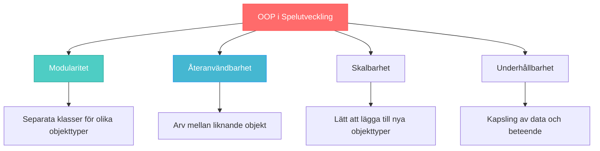
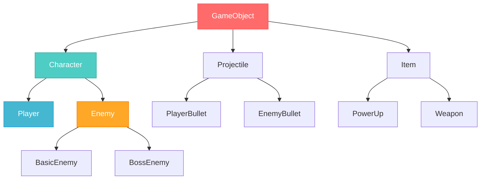

# Objektorienterad programmering för spelutveckling

Objektorienterad programmering (OOP) är en kraftfull paradigm som är särskilt väl lämpad för spelutveckling. I spel representerar vi olika element som objekt - spelare, fiender, projektiler, powerups - och varje objekt har sina egna egenskaper och beteenden. Detta kapitel utforskar hur du använder JavaScript's OOP-funktioner för att bygga välstrukturerade och skalbara spel.

## Varför OOP för spel?

### Fördelar med OOP i spelutveckling


```mermaid
graph TD
    A[OOP i Spelutveckling] --> B[Modularitet]
    A --> C[Återanvändbarhet]  
    A --> D[Skalbarhet]
    A --> E[Underhållbarhet]
    
    B --> B1[Separata klasser för olika objekttyper]
    C --> C1[Arv mellan liknande objekt]
    D --> D1[Lätt att lägga till nya objekttyper]
    E --> E1[Kapsling av data och beteende]
    
    style A fill:#FF6B6B,stroke:#FF5252,color:#fff
    style B fill:#4ECDC4,stroke:#26A69A,color:#fff
    style C fill:#45B7D1,stroke:#2196F3,color:#fff
```

- **Naturlig modellering**: Spelobjekt mappar naturligt till klasser och objekt
- **Kodorganisation**: Separera olika spelmekaniker i egna klasser
- **Återanvändning**: Skapa basobjekt som kan utökas för specifika behov
- **Kollisionshantering**: Enkelt att hantera interaktioner mellan objekttyper
- **Skalbarhet**: Lätt att lägga till nya funktioner och objekttyper

### Grundläggande spelarkitektur

```javascript
// Basarkitektur för ett spel med OOP
class Game {
  constructor() {
    this.entities = [];
    this.running = false;
    this.lastTime = 0;
  }
  
  addEntity(entity) {
    this.entities.push(entity);
  }
  
  removeEntity(entity) {
    const index = this.entities.indexOf(entity);
    if (index > -1) {
      this.entities.splice(index, 1);
    }
  }
  
  update(deltaTime) {
    // Uppdatera alla entiteter
    this.entities.forEach(entity => {
      entity.update(deltaTime);
    });
    
    // Ta bort döda objekt
    this.entities = this.entities.filter(entity => !entity.isDead);
    
    // Hantera kollisioner
    this.handleCollisions();
  }
  
  render(ctx) {
    // Rita alla entiteter
    this.entities.forEach(entity => {
      entity.render(ctx);
    });
  }
}
```

## Klasser och objekt i JavaScript

### ES6 Class Syntax

JavaScript använder prototypbaserad arv men ES6-klasser ger en mer välbekant syntax:

```javascript
class GameObject {
  constructor(x, y, width, height) {
    this.x = x;
    this.y = y;
    this.width = width;
    this.height = height;
    this.velocity = { x: 0, y: 0 };
    this.isDead = false;
    this.sprite = null;
  }
  
  // Metoder som alla spelobjekt har
  update(deltaTime) {
    // Grundläggande fysik
    this.x += this.velocity.x * deltaTime;
    this.y += this.velocity.y * deltaTime;
  }
  
  render(ctx) {
    if (this.sprite) {
      ctx.drawImage(this.sprite, this.x, this.y, this.width, this.height);
    } else {
      // Fallback till enkel rektangel
      ctx.fillStyle = this.color || '#ff0000';
      ctx.fillRect(this.x, this.y, this.width, this.height);
    }
  }
  
  // Kollisionsdetektering
  getBounds() {
    return {
      left: this.x,
      right: this.x + this.width,
      top: this.y,
      bottom: this.y + this.height
    };
  }
  
  collidesWith(other) {
    const bounds1 = this.getBounds();
    const bounds2 = other.getBounds();
    
    return bounds1.left < bounds2.right &&
           bounds1.right > bounds2.left &&
           bounds1.top < bounds2.bottom &&
           bounds1.bottom > bounds2.top;
  }
  
  destroy() {
    this.isDead = true;
  }
}
```

### Privata fält och metoder

```javascript
class Player {
  // Privata fält (ES2022)
  #health = 100;
  #maxHealth = 100;
  #invulnerable = false;
  
  constructor(x, y) {
    this.x = x;
    this.y = y;
    this.score = 0;
  }
  
  // Publik metod för att ta skada
  takeDamage(amount) {
    if (this.#invulnerable) return;
    
    this.#health -= amount;
    this.#makeInvulnerable(1000); // 1 sekund invulnerabilitet
    
    if (this.#health <= 0) {
      this.die();
    }
  }
  
  // Privat metod
  #makeInvulnerable(duration) {
    this.#invulnerable = true;
    setTimeout(() => {
      this.#invulnerable = false;
    }, duration);
  }
  
  // Getter för hälsa (read-only från utsidan)
  get health() {
    return this.#health;
  }
  
  get healthPercentage() {
    return (this.#health / this.#maxHealth) * 100;
  }
  
  // Metod för healing
  heal(amount) {
    this.#health = Math.min(this.#health + amount, this.#maxHealth);
  }
}
```

## Arv och polymorfism

### Hierarki av spelobjekt


```mermaid
graph TD
    GameObject --> Character
    GameObject --> Projectile
    GameObject --> Item
    
    Character --> Player
    Character --> Enemy
    
    Enemy --> BasicEnemy
    Enemy --> BossEnemy
    
    Projectile --> PlayerBullet
    Projectile --> EnemyBullet
    
    Item --> PowerUp
    Item --> Weapon
    
    style GameObject fill:#FF6B6B,stroke:#FF5252,color:#fff
    style Character fill:#4ECDC4,stroke:#26A69A,color:#fff
    style Player fill:#45B7D1,stroke:#2196F3,color:#fff
    style Enemy fill:#FFA726,stroke:#F57C00,color:#fff
```

### Implementering av arv

```javascript
// Baskarakterklass
class Character extends GameObject {
  constructor(x, y, width, height, health) {
    super(x, y, width, height);
    this.health = health;
    this.maxHealth = health;
    this.direction = 1; // 1 för höger, -1 för vänster
  }
  
  takeDamage(amount) {
    this.health -= amount;
    if (this.health <= 0) {
      this.die();
    }
  }
  
  die() {
    this.isDead = true;
    this.onDeath(); // Hook för subklasser
  }
  
  // Abstrakt metod som subklasser måste implementera
  onDeath() {
    // Override i subklasser
  }
  
  heal(amount) {
    this.health = Math.min(this.health + amount, this.maxHealth);
  }
}

// Spelarklass
class Player extends Character {
  constructor(x, y) {
    super(x, y, 32, 32, 100);
    this.score = 0;
    this.lives = 3;
    this.weapons = ['pistol'];
    this.currentWeapon = 0;
    this.ammunition = { pistol: Infinity, rifle: 30 };
  }
  
  onDeath() {
    this.lives--;
    if (this.lives > 0) {
      this.respawn();
    } else {
      this.gameOver();
    }
  }
  
  respawn() {
    this.health = this.maxHealth;
    this.x = 100; // Startposition
    this.y = 100;
    this.isDead = false;
  }
  
  shoot() {
    const weapon = this.weapons[this.currentWeapon];
    const ammo = this.ammunition[weapon];
    
    if (ammo > 0) {
      // Skapa projektil
      const bullet = new PlayerBullet(
        this.x + this.width / 2,
        this.y,
        this.direction
      );
      
      game.addEntity(bullet);
      
      if (ammo !== Infinity) {
        this.ammunition[weapon]--;
      }
    }
  }
  
  switchWeapon() {
    this.currentWeapon = (this.currentWeapon + 1) % this.weapons.length;
  }
}

// Fiendeklass
class Enemy extends Character {
  constructor(x, y, health, aiType = 'basic') {
    super(x, y, 24, 24, health);
    this.aiType = aiType;
    this.attackDamage = 10;
    this.scoreValue = 100;
    this.lastAttack = 0;
    this.attackCooldown = 1000; // ms
  }
  
  update(deltaTime) {
    super.update(deltaTime);
    this.updateAI(deltaTime);
    this.checkAttack();
  }
  
  updateAI(deltaTime) {
    switch (this.aiType) {
      case 'basic':
        this.basicAI(deltaTime);
        break;
      case 'aggressive':
        this.aggressiveAI(deltaTime);
        break;
      case 'defensive':
        this.defensiveAI(deltaTime);
        break;
    }
  }
  
  basicAI(deltaTime) {
    // Enkel AI: rör sig mot spelaren
    const player = game.getPlayer();
    if (player) {
      const dx = player.x - this.x;
      const dy = player.y - this.y;
      const distance = Math.sqrt(dx * dx + dy * dy);
      
      if (distance > 0) {
        this.velocity.x = (dx / distance) * 50; // Hastighet 50 px/s
        this.velocity.y = (dy / distance) * 50;
      }
    }
  }
  
  checkAttack() {
    const now = Date.now();
    if (now - this.lastAttack < this.attackCooldown) return;
    
    const player = game.getPlayer();
    if (player && this.collidesWith(player)) {
      player.takeDamage(this.attackDamage);
      this.lastAttack = now;
    }
  }
  
  onDeath() {
    // Ge poäng till spelaren
    const player = game.getPlayer();
    if (player) {
      player.score += this.scoreValue;
    }
    
    // Möjlighet att droppa items
    this.dropLoot();
  }
  
  dropLoot() {
    if (Math.random() < 0.3) { // 30% chans
      const powerup = new HealthPowerUp(this.x, this.y);
      game.addEntity(powerup);
    }
  }
}
```

### Polymorfism i praktiken

```javascript
// Olika projektiltyper
class Projectile extends GameObject {
  constructor(x, y, direction, speed, damage) {
    super(x, y, 4, 8);
    this.velocity.x = direction * speed;
    this.damage = damage;
    this.lifespan = 3000; // 3 sekunder
    this.createdAt = Date.now();
  }
  
  update(deltaTime) {
    super.update(deltaTime);
    
    // Ta bort projektil efter lifespan
    if (Date.now() - this.createdAt > this.lifespan) {
      this.destroy();
    }
    
    // Kontrollera kollision med mål
    this.checkCollisions();
  }
  
  // Abstrakt metod
  checkCollisions() {
    // Implementeras av subklasser
  }
}

class PlayerBullet extends Projectile {
  constructor(x, y, direction) {
    super(x, y, direction, 300, 25); // Snabb, hög skada
    this.color = '#ffff00'; // Gul
  }
  
  checkCollisions() {
    game.entities.forEach(entity => {
      if (entity instanceof Enemy && this.collidesWith(entity)) {
        entity.takeDamage(this.damage);
        this.destroy();
      }
    });
  }
}

class EnemyBullet extends Projectile {
  constructor(x, y, direction) {
    super(x, y, direction, 200, 15); // Långsammare, lägre skada
    this.color = '#ff0000'; // Röd
  }
  
  checkCollisions() {
    const player = game.getPlayer();
    if (player && this.collidesWith(player)) {
      player.takeDamage(this.damage);
      this.destroy();
    }
  }
}

// Polymorf hantering
class BulletManager {
  constructor() {
    this.bullets = [];
  }
  
  addBullet(bullet) {
    this.bullets.push(bullet);
  }
  
  update(deltaTime) {
    // Alla bullets uppdateras polymorfiskt
    this.bullets.forEach(bullet => {
      bullet.update(deltaTime);
    });
    
    // Ta bort döda bullets
    this.bullets = this.bullets.filter(bullet => !bullet.isDead);
  }
}
```


## Sammanfattning

OOP i spelutveckling handlar om att:

**Strukturera kod effektivt**:
- Separera olika objekt i egna klasser
- Använd arv för att dela gemensam funktionalitet
- Implementera polymorfism för flexibel hantering
- Undvik för djup arvshierarki

Med dessa principer kan du bygga välstrukturerade spel som är enkla att utöka och underhålla!
