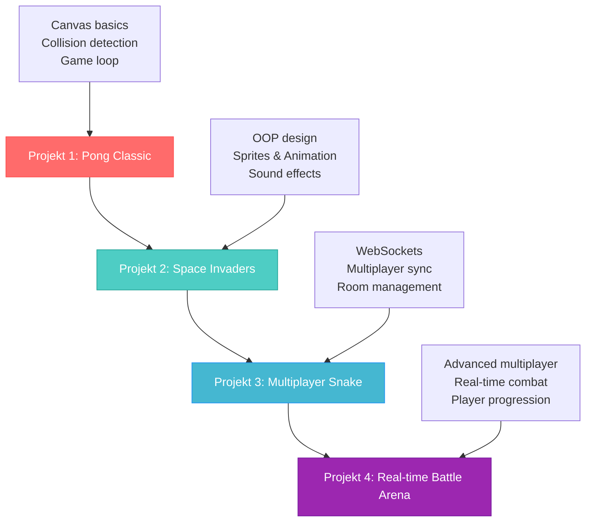

# Praktiska övningar och spelprojekt

Detta kapitel innehåller fyra progressiva spelprojekt som tillsammans täcker alla viktiga koncept inom webbaserad spelutveckling. Varje projekt bygger vidare på kunskaperna från det föregående och introducerar nya tekniker och utmaningar.

## Projektöversikt



---

## Projekt 1: Pong Classic 🏓

**Mål**: Lär dig Canvas fundamentals, grundläggande speloop och kollisionsdetektering
**Tid**: 3-4 timmar
**Svårighetsgrad**: Nybörjare

### Projektbeskrivning

Skapa det klassiska Pong-spelet där två spelare styr racket för att studsa en boll fram och tillbaka. Detta projekt introducerar grundläggande spelkoncepten utan alltför komplex kod.

### Teknikfokus
- Canvas API för ritning
- Grundläggande game loop
- Kollisionsdetektering
- Tangentbordsinput
- Score-system

### Steg-för-steg implementation

**Steg 1: Grundstruktur**
```javascript
class PongGame {
  constructor() {
    this.canvas = document.getElementById('gameCanvas');
    this.ctx = this.canvas.getContext('2d');
    this.canvas.width = 800;
    this.canvas.height = 400;
    
    // Spelstatus
    this.running = false;
    this.score = { player1: 0, player2: 0 };
    
    this.initializeGame();
  }
  
  initializeGame() {
    // Spelare (rackets)
    this.player1 = {
      x: 20,
      y: this.canvas.height / 2 - 40,
      width: 10,
      height: 80,
      speed: 300
    };
    
    this.player2 = {
      x: this.canvas.width - 30,
      y: this.canvas.height / 2 - 40,
      width: 10,
      height: 80,
      speed: 300
    };
    
    // Boll
    this.ball = {
      x: this.canvas.width / 2,
      y: this.canvas.height / 2,
      radius: 8,
      velocityX: 200,
      velocityY: 100
    };
  }
}
```

**Steg 2: Input-hantering**
```javascript
setupInput() {
  this.keys = {};
  
  document.addEventListener('keydown', (e) => {
    this.keys[e.key] = true;
  });
  
  document.addEventListener('keyup', (e) => {
    this.keys[e.key] = false;
  });
}

handleInput(deltaTime) {
  const speed = 300 * (deltaTime / 1000);
  
  // Player 1 (W/S tangenter)
  if (this.keys['w'] && this.player1.y > 0) {
    this.player1.y -= speed;
  }
  if (this.keys['s'] && this.player1.y < this.canvas.height - this.player1.height) {
    this.player1.y += speed;
  }
  
  // Player 2 (Piltangenter)
  if (this.keys['ArrowUp'] && this.player2.y > 0) {
    this.player2.y -= speed;
  }
  if (this.keys['ArrowDown'] && this.player2.y < this.canvas.height - this.player2.height) {
    this.player2.y += speed;
  }
}
```

**Steg 3: Bollphysik och kollision**
```javascript
updateBall(deltaTime) {
  const dt = deltaTime / 1000;
  
  // Uppdatera bollposition
  this.ball.x += this.ball.velocityX * dt;
  this.ball.y += this.ball.velocityY * dt;
  
  // Kollision med topp/botten
  if (this.ball.y <= this.ball.radius || 
      this.ball.y >= this.canvas.height - this.ball.radius) {
    this.ball.velocityY = -this.ball.velocityY;
  }
  
  // Kollision med rackets
  if (this.checkPaddleCollision(this.player1) || 
      this.checkPaddleCollision(this.player2)) {
    this.ball.velocityX = -this.ball.velocityX;
    // Lägg till lite variation baserat på var bollen träffar
    this.ball.velocityY += (Math.random() - 0.5) * 100;
  }
  
  // Poäng när bollen går utanför
  if (this.ball.x < 0) {
    this.score.player2++;
    this.resetBall();
  } else if (this.ball.x > this.canvas.width) {
    this.score.player1++;
    this.resetBall();
  }
}

checkPaddleCollision(paddle) {
  return this.ball.x - this.ball.radius < paddle.x + paddle.width &&
         this.ball.x + this.ball.radius > paddle.x &&
         this.ball.y - this.ball.radius < paddle.y + paddle.height &&
         this.ball.y + this.ball.radius > paddle.y;
}
```

### Utmaningar att lösa
1. **AI-spelare**: Implementera en datorspelare för single-player läge
2. **Power-ups**: Lägg till power-ups som ändrar bollhastighet eller racketstorlek
3. **Partikeleffekter**: Skapa visuella effekter när bollen träffar någonting
4. **Ljud**: Lägg till ljudeffekter för kollisioner och poäng

---

## Projekt 2: Space Invaders 👾

**Mål**: Använda OOP-design, sprites, animationer och ljudeffekter
**Tid**: 6-8 timmar
**Svårighetsgrad**: Medel

### Projektbeskrivning

Skapa en modern version av Space Invaders med objektorienterad design, sprites, animationer och progressiv svårighet. Detta projekt fokuserar på god kodstruktur och visuell polering.

### Teknikfokus
- ES6 klasser och arv
- Sprite-hantering och animation
- Ljud-integration
- Partikeleffekter
- Game states (menu, playing, game over)

### Huvudklasser

```javascript
// Basklasser
class GameObject {
  constructor(x, y, width, height) {
    this.x = x;
    this.y = y;
    this.width = width;
    this.height = height;
    this.isDead = false;
  }
  
  update(deltaTime) {}
  render(ctx) {}
  
  collidesWith(other) {
    return this.x < other.x + other.width &&
           this.x + this.width > other.x &&
           this.y < other.y + other.height &&
           this.y + this.height > other.y;
  }
}

class Player extends GameObject {
  constructor(x, y) {
    super(x, y, 48, 32);
    this.lives = 3;
    this.score = 0;
    this.speed = 250;
    this.lastShot = 0;
    this.shotCooldown = 250; // ms
  }
  
  shoot() {
    const now = Date.now();
    if (now - this.lastShot > this.shotCooldown) {
      const bullet = new PlayerBullet(
        this.x + this.width / 2 - 2,
        this.y
      );
      game.addEntity(bullet);
      this.lastShot = now;
      
      // Spela skjutljud
      audioManager.play('playerShoot');
    }
  }
}

class Invader extends GameObject {
  constructor(x, y, type) {
    super(x, y, 32, 24);
    this.type = type;
    this.points = type * 10;
    this.animationFrame = 0;
    this.animationTime = 0;
  }
  
  update(deltaTime) {
    // Animation
    this.animationTime += deltaTime;
    if (this.animationTime > 500) {
      this.animationFrame = (this.animationFrame + 1) % 2;
      this.animationTime = 0;
    }
  }
}
```

### Game State Management

```javascript
class GameStateManager {
  constructor() {
    this.currentState = 'menu';
    this.states = {
      menu: new MenuState(),
      playing: new PlayingState(),
      gameOver: new GameOverState()
    };
  }
  
  changeState(newState) {
    this.states[this.currentState].exit();
    this.currentState = newState;
    this.states[this.currentState].enter();
  }
  
  update(deltaTime) {
    this.states[this.currentState].update(deltaTime);
  }
  
  render(ctx) {
    this.states[this.currentState].render(ctx);
  }
}
```

### Utmaningar att lösa
1. **Formation Movement**: Få invaders att röra sig i formation
2. **Boss Battles**: Lägg till boss-fiender med speciella angreppsmönster
3. **Weapon Upgrades**: Implementera olika vapentyper
4. **High Score System**: Spara och visa high scores

---

## Projekt 3: Multiplayer Snake 🐍

**Mål**: Implementera WebSocket-baserad multiplayer med room-hantering
**Tid**: 8-10 timmar
**Svårighetsgrad**: Avancerad

### Projektbeskrivning

Skapa en multiplayer-version av Snake där spelare kan skapa och gå med i spelrum. Inkluderar real-time synchronization, spectator-läge och turn-based gameplay.

### Teknikfokus
- WebSockets och realtidssynkronisering
- Client-server arkitektur
- Room management
- State synchronization
- Lobby system

### Server-implementation

```javascript
// server.js
const express = require('express');
const http = require('http');
const WebSocket = require('ws');

class SnakeServer {
  constructor() {
    this.app = express();
    this.server = http.createServer(this.app);
    this.wss = new WebSocket.Server({ server: this.server });
    this.rooms = new Map();
    this.clients = new Map(); // ws -> playerInfo
    
    this.setupWebSocketHandlers();
  }
  
  setupWebSocketHandlers() {
    this.wss.on('connection', (ws) => {
      console.log('Player connected');
      
      ws.on('message', (message) => {
        try {
          const data = JSON.parse(message);
          
          switch (data.type) {
            case 'createRoom':
              const roomId = this.generateRoomId();
              const room = new GameRoom(roomId, data.maxPlayers);
              this.rooms.set(roomId, room);
              this.joinRoom(ws, roomId, data.playerName);
              break;
              
            case 'joinRoom':
              this.joinRoom(ws, data.roomId, data.playerName);
              break;
              
            case 'playerInput':
              const playerRoom = this.findPlayerRoom(ws);
              if (playerRoom) {
                playerRoom.handlePlayerInput(ws, data.input);
              }
              break;
          }
        } catch (error) {
          console.error('Error parsing message:', error);
        }
      });
      
      ws.on('close', () => {
        this.handlePlayerDisconnect(ws);
      });
    });
  }
}

class GameRoom {
  constructor(id, maxPlayers) {
    this.id = id;
    this.maxPlayers = maxPlayers;
    this.players = new Map();
    this.gameState = 'waiting';
    this.board = this.createBoard();
    this.currentTurn = 0;
    this.turnTimer = null;
  }
  
  handlePlayerInput(playerWs, input) {
    if (this.gameState !== 'playing') return;
    
    const currentPlayerWs = this.getCurrentPlayerWs();
    if (currentPlayerWs !== playerWs) return;
    
    const player = this.players.get(playerWs);
    if (this.isValidMove(player, input.direction)) {
      this.movePlayer(player, input.direction);
      this.nextTurn();
    }
  }
  
  broadcast(eventName, data) {
    const message = JSON.stringify({
      type: eventName,
      data: data
    });
    
    this.players.forEach((player, ws) => {
      if (ws.readyState === WebSocket.OPEN) {
        ws.send(message);
      }
    });
  }
}
```

### Client-implementation

```javascript
class MultiplayerSnake {
  constructor() {
    this.socket = null;
    this.gameState = 'lobby';
    this.playerId = null;
    this.room = null;
    
    this.connectToServer();
    this.setupUI();
  }
  
  connectToServer() {
    this.socket = new WebSocket('ws://localhost:3000');
    
    this.socket.onopen = () => {
      console.log('Ansluten till servern');
      this.playerId = Math.random().toString(36).substr(2, 9);
    };
    
    this.socket.onmessage = (event) => {
      try {
        const data = JSON.parse(event.data);
        this.handleServerMessage(data);
      } catch (error) {
        console.error('Error parsing server message:', error);
      }
    };
    
    this.socket.onclose = () => {
      console.log('Frånkopplad från servern');
      this.gameState = 'disconnected';
    };
    
    this.socket.onerror = (error) => {
      console.error('WebSocket-fel:', error);
    };
  }
  
  handleServerMessage(data) {
    switch (data.type) {
      case 'roomJoined':
        this.room = data.data;
        this.gameState = 'room';
        this.updateUI();
        break;
        
      case 'gameStarted':
        this.gameState = 'playing';
        this.board = data.data.board;
        this.players = data.data.players;
        this.startGameLoop();
        break;
        
      case 'gameUpdate':
        this.updateGameState(data.data);
        break;
        
      case 'turnChanged':
        this.currentTurn = data.data.playerId;
        this.turnTimeLeft = data.data.timeLeft;
        break;
    }
  }
  
  sendMove(direction) {
    if (this.gameState === 'playing' && this.currentTurn === this.playerId) {
      if (this.socket && this.socket.readyState === WebSocket.OPEN) {
        this.socket.send(JSON.stringify({
          type: 'playerInput',
          input: { direction }
        }));
      }
    }
  }
}
```

### Utmaningar att lösa
1. **Reconnection**: Hantera när spelare kopplar från och ansluter igen
2. **Spectator Mode**: Låt andra spelare titta på pågående spel
3. **Tournament Mode**: Skapa bracket-system för turneringar
4. **Custom Game Rules**: Låt rum-skapare välja olika spelvarianterar

---

## Projekt 4: Real-time Battle Arena ⚔️

**Mål**: Avancerad multiplayer med real-time combat och character progression
**Tid**: 12-15 timmar
**Svårighetsgrad**: Expert

### Projektbeskrivning

Skapa en top-down battle arena där spelare kan välja karaktärer med olika förmågor, kämpas i real-time och få progression genom spelet. Detta är det mest avancerade projektet som kombinerar alla tidigare koncept.

### Teknikfokus
- Avancerad multiplayer arkitektur
- Real-time combat system
- Character abilities och cooldowns
- Skill trees och progression
- Matchmaking system
- Anti-cheat och input validation

### Avancerade system

**Character System**
```javascript
class Character {
  constructor(type, playerId) {
    this.type = type;
    this.playerId = playerId;
    this.stats = this.getBaseStats(type);
    this.abilities = this.getAbilities(type);
    this.level = 1;
    this.experience = 0;
  }
  
  getBaseStats(type) {
    const statTemplates = {
      warrior: { health: 150, damage: 25, speed: 100, armor: 10 },
      mage: { health: 80, damage: 40, speed: 120, armor: 2 },
      archer: { health: 100, damage: 30, speed: 140, armor: 5 }
    };
    return { ...statTemplates[type] };
  }
  
  useAbility(abilityIndex, targetPosition) {
    const ability = this.abilities[abilityIndex];
    if (this.canUseAbility(ability)) {
      this.castAbility(ability, targetPosition);
      ability.lastUsed = Date.now();
      return true;
    }
    return false;
  }
}
```

**Real-time Combat**
```javascript
class CombatSystem {
  constructor(gameWorld) {
    this.gameWorld = gameWorld;
    this.projectiles = [];
    this.effects = [];
  }
  
  processCombat(deltaTime) {
    // Uppdatera projektiler
    this.projectiles.forEach(projectile => {
      projectile.update(deltaTime);
      
      // Kontrollera träffar
      this.gameWorld.players.forEach(player => {
        if (projectile.playerId !== player.id && 
            projectile.collidesWith(player)) {
          this.applyDamage(player, projectile.damage);
          projectile.destroy();
        }
      });
    });
    
    // Ta bort döda projektiler
    this.projectiles = this.projectiles.filter(p => !p.isDead);
  }
  
  applyDamage(target, damage) {
    const finalDamage = Math.max(1, damage - target.armor);
    target.health -= finalDamage;
    
    // Skicka damage event till alla klienter
    this.gameWorld.broadcast('playerDamaged', {
      playerId: target.id,
      damage: finalDamage,
      health: target.health
    });
    
    if (target.health <= 0) {
      this.handlePlayerDeath(target);
    }
  }
}
```

**Netcode optimering**
```javascript
class NetworkOptimizer {
  constructor() {
    this.updateRate = 20; // 20 updates per sekund
    this.priorityQueue = [];
    this.clientStates = new Map();
  }
  
  optimizeUpdate(gameState, clientId) {
    const clientState = this.clientStates.get(clientId);
    const optimizedState = {
      timestamp: Date.now(),
      players: this.getRelevantPlayers(gameState, clientId),
      projectiles: this.getVisibleProjectiles(gameState, clientId),
      effects: this.getLocalEffects(gameState, clientId)
    };
    
    // Delta compression - skicka bara ändringar
    const deltaState = this.createDelta(clientState, optimizedState);
    this.clientStates.set(clientId, optimizedState);
    
    return deltaState;
  }
  
  getRelevantPlayers(gameState, clientId) {
    const client = gameState.players.get(clientId);
    if (!client) return [];
    
    // Skicka bara spelare inom synfält
    return gameState.players.filter(player => {
      const distance = this.calculateDistance(client, player);
      return distance < client.viewDistance;
    });
  }
}
```

### Utmaningar att lösa
1. **Skill Trees**: Implementera progression system med unlockable abilities
2. **Team Battles**: Stödja team-based combat
3. **Spectator System**: Real-time spectating med camera controls
4. **Leaderboards**: Global ranking system
5. **Replay System**: Spara och spela upp matcher

---

## Bedömningskriterier och feedback

### För varje projekt
**Grundfunktionalitet (40%)**:
- ✅ Alla grundläggande features implementerade
- ✅ Spelet är spelbart från start till slut
- ✅ Inga större buggar eller crashes

**Kodkvalitet (30%)**:
- ✅ Väl strukturerad och kommenterad kod
- ✅ Rätt användning av OOP-principer
- ✅ Separation of concerns

**Användarupplevelse (20%)**:
- ✅ Responsiv kontroller
- ✅ Tydlig visuell feedback
- ✅ Lämplig svårighet och progression

**Innovation (10%)**:
- ✅ Extra features eller förbättringar
- ✅ Kreativa lösningar på problem
- ✅ Polish och detaljer

### Portfoliopresentation

Efter att ha slutfört alla projekt, skapa en portfolio-sida som visar:

1. **Live demos** av alla spel
2. **Kod-genomgångar** som förklarar viktiga tekniska beslut
3. **Reflektion** över vad du lärt dig från varje projekt
4. **Future improvements** - vad du skulle göra annorlunda

## Resurser för vidareutveckling

### Grafik och ljud
- **Kenney Assets**: Gratis sprites och ljud för spel
- **Freesound**: Gratis ljudeffekter
- **Piskel**: Online pixelart editor

### Avancerade tekniker
- **Three.js**: För 3D webspel
- **Matter.js**: Fysikmotor för 2D spel
- **Phaser**: Komplett spelframework
- **ws library**: Native WebSocket server för Node.js

### Deployment
- **Netlify/Vercel**: För frontend hosting
- **Heroku/Railway**: För backend deployment
- **MongoDB Atlas**: För cloud database

Lycka till med dina spelprojekt! 🎮
