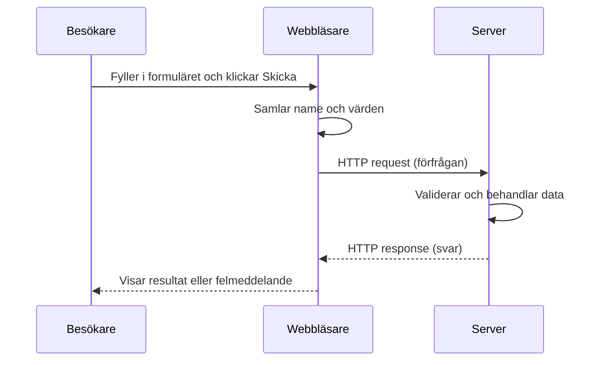

# Formulär: ta emot information från besökaren

Ett formulär låter besökaren skriva, välja och skicka information till en webbplats. Du använder formulär när någon söker, loggar in, skickar ett meddelande eller beställer något.

> **Mål:** Kunna skapa ett enkelt formulär, koppla etiketter till fält och förklara vad som händer när användaren skickar det.

## Börja med ett synligt formulär

`<form>` omsluter fälten. `<label>` förklarar vad användaren ska fylla i och `<input>` är själva fältet. Klicka på etiketten “Namn” i exemplet: fokus flyttas till rätt fält eftersom `for="name"` matchar fältets `id="name"`.

<!-- playground -->
```html
<form>
  <p>
    <label for="name">Namn</label><br>
    <input type="text" id="name" name="name">
  </p>

  <p>
    <label for="email">E-postadress</label><br>
    <input type="email" id="email" name="email">
  </p>

  <button type="submit">Skicka</button>
</form>
```

`name` är fältets namn när webbläsaren skickar data. `id` identifierar fältet på sidan och används här för att koppla ihop fältet med dess etikett.

## Så skickas formulärdata

När besökaren klickar på **Skicka** samlar webbläsaren värdena från fält med ett `name`. Sedan skickar den en HTTP request (förfrågan) till adressen i formulärets `action`. En server tar emot förfrågan, gör något med informationen och skickar ett svar tillbaka.



I detta exempel används `method="get"`. Då blir fälten en del av adressen, till exempel:

```text
/sok?query=pannkakor
```

Det passar bra för en sökning, där länken gärna får gå att spara och dela. Lösenord, personuppgifter och annan känslig information ska **inte** skickas med GET eftersom den kan synas i adressen. Då används normalt `method="post"` över HTTPS, och servern måste fortfarande validera all data.

```html
<form action="/sok" method="get">
  <label for="query">Vad söker du?</label>
  <input type="search" id="query" name="query">
  <button type="submit">Sök</button>
</form>
```

**Prova själv:** Skriv ett sökord och klicka på **Sök**. I en riktig webbplats måste servern ha en route (väg) på `/sok` som kan läsa `query` och skapa ett svar.

<!-- playground -->
```html
<form action="/sok" method="get">
  <label for="query">Vad söker du?</label>
  <input type="search" id="query" name="query">
  <button type="submit">Sök</button>
</form>
```

## Fler vanliga fält

Välj fälttyp efter informationen användaren ska lämna. Webbläsaren kan då ge bättre hjälp, till exempel ett e-posttangentbord på mobilen.

```html
<label for="message">Meddelande</label>
<textarea id="message" name="message"></textarea>

<label for="topic">Ämne</label>
<select id="topic" name="topic">
  <option value="question">Fråga</option>
  <option value="feedback">Feedback</option>
</select>

<label>
  <input type="checkbox" name="terms">
  Jag godkänner villkoren
</label>
```

## Sammanfattning

- `<form>` samlar fält som hör ihop.
- Varje fält behöver en tydlig `<label>`.
- `id` kopplar etiketten till fältet och `name` blir nyckeln när data skickas.
- `action` anger vart data ska skickas och `method` beskriver hur.
- En server måste alltid kontrollera och validera data som kommer från ett formulär.
