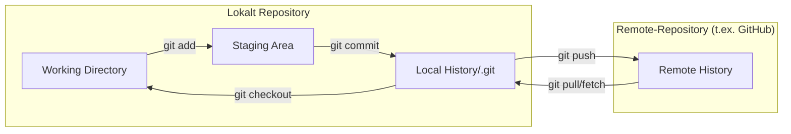

# Introduktion till Git: Varför Versionshantering?

Föreställ dig att du arbetar på ett viktigt dokument. Du gör ändringar, sparar, gör fler ändringar... men så inser du att en ändring du gjorde för två timmar sedan var fel. Hur hittar du tillbaka till den versionen? Eller tänk dig att du vill prova en ny idé, men är rädd för att förstöra det du redan har. Eller ännu värre, tänk om flera personer behöver arbeta på samma dokument samtidigt?

Det är här **versionshantering** (version control) kommer in. Ett versionshanteringssystem (Version Control System, VCS) är ett verktyg som hjälper dig att spåra och hantera ändringar i filer över tid.

**Git** är det absolut mest populära och dominerande distribuerade versionshanteringssystemet idag. Det utvecklades ursprungligen av Linus Torvalds (skaparen av Linux) för att hantera utvecklingen av Linux-kärnan.

> **Motivation:**  
> Git gör det möjligt att experimentera, samarbeta och alltid kunna återställa eller förstå vad som hänt i projektets historik. Det är en grundläggande färdighet för alla som arbetar med kod.

---

## Varför är Git så viktigt för utvecklare?

1. **Historik och återställning:**  
   Git sparar ögonblicksbilder (kallade *commits*) av ditt projekt. Du kan se exakt vem som ändrade vad och när, och du kan enkelt återgå till vilken tidigare version som helst. Det är som en obegränsad "ångra"-knapp för hela ditt projekt.

2. **Förgrening (branching):**  
   Git gör det otroligt enkelt att skapa separata "grenar" (branches) av ditt projekt. Du kan arbeta på en ny funktion eller experimentera på en egen gren utan att påverka huvudversionen (ofta kallad `main`). När du är klar kan du *sammanfoga* (merge) dina ändringar tillbaka till huvudgrenen.

3. **Samarbete:**  
   Git är designat för distribuerat arbete. Varje utvecklare har en komplett kopia av projektets historik. Plattformar som GitHub, GitLab och Bitbucket bygger på Git och gör det enkelt att dela kod, granska varandras ändringar (Pull Requests) och arbeta tillsammans i team.

4. **Trygghet:**  
   Genom att regelbundet spara dina ändringar (committa) och eventuellt skicka dem till en remote server (som GitHub), minskar du risken att förlora arbete på grund av hårddiskkrascher eller misstag.

5. **Industristandard:**  
   Kunskap i Git är i princip ett krav för de flesta utvecklarjobb idag.

---

## Installera Git

Börja med att kontrollera om Git redan finns installerat genom att köra `git --version` i en terminal (appen 'terminal' eller 'powershell' går bra). 

På macOS är Git ofta tillgängligt via Xcode Command Line Tools; om det saknas får du en dialogruta eller installerar med `xcode-select --install` (alternativt via Homebrew: `brew install git`). 

På Windows installerar du enklast via [Git for Windows](https://git-scm.com/download/win), vilket även inkluderar Git Bash. 

På Linux använder du din pakethanterare, till exempel Ubuntu/Debian: `sudo apt install git`.

Verifiera installationen genom att öppna upp en terminal och köra `git --version` igen.

## Grundläggande koncept i Git

- **Repository (repo):** En "behållare" eller mapp som innehåller alla filer för ditt projekt samt hela dess ändringshistorik (i en dold mapp kallad `.git`).
- **Commit:** En sparad ögonblicksbild av ditt projekts filer vid en viss tidpunkt. Varje commit har ett unikt ID och ett meddelande som beskriver ändringarna.
- **Branch:** En oberoende utvecklingslinje. Standardgrenen heter ofta `main`.
- **Checkout:** Processen att byta mellan olika branches eller återställa filer till en specifik commit.
- **Merge:** Processen att kombinera ändringar från en branch till en annan.
- **Clone:** Att skapa en lokal kopia av ett befintligt repository (ofta från en remote server som GitHub).
- **Push:** Att skicka dina lokala commits till ett remote-repository (t.ex. på GitHub).
- **Pull:** Att hämta ändringar från ett remote-repository och integrera dem i din lokala branch.
- **Working directory:** De filer du ser i din projektmapp.
- **Staging area (index):** Ett mellanläge där du förbereder vilka ändringar som ska inkluderas i nästa commit.

---

## Git-arbetsflöde: Så här hänger det ihop

*Diagram: Förenklat arbetsflöde i Git.*

- **Working Directory:** Dina faktiska filer på datorn.
- **Staging Area:** Här samlar du ihop de ändringar du vill spara i nästa commit.
- **Local History (.git):** Här sparas alla commits och projektets historik.
- **Remote History:** Remotekopian av projektet, t.ex. på GitHub.

---

## Sammanfattning

Git är ett kraftfullt versionshanteringssystem som är oumbärligt för modern mjukvaruutveckling. Det hjälper oss att spåra ändringar, samarbeta effektivt, experimentera säkert och undvika dataförlust. Att förstå grundläggande koncept som repository, commit, branch och staging area är nyckeln till att kunna använda Git effektivt.

I nästa avsnitt går vi igenom de vanligaste Git-kommandona du behöver för att komma igång
