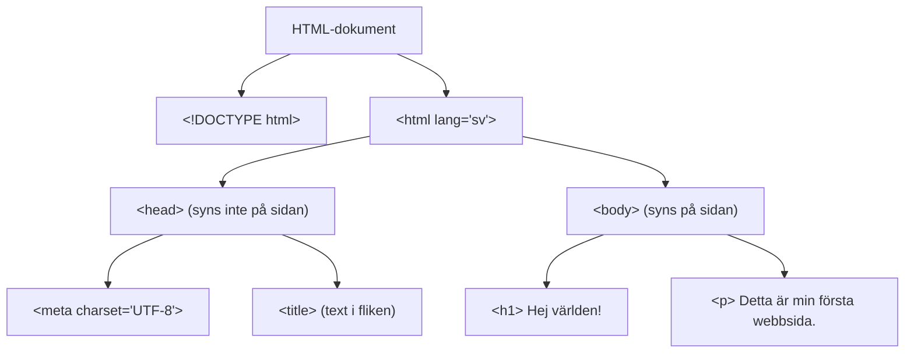

# Grunderna i HTML5: bygg din första sida

När du öppnar en webbsida tolkar webbläsaren en HTML-fil och ritar innehållet på skärmen. HTML (**HyperText Markup Language**) beskriver *vad* innehållet är: en rubrik, en text, en länk eller en lista. CSS, som du lär dig senare, bestämmer hur det ser ut.

> **Mål:** Skapa en enkel HTML-sida, känna igen sidans delar och använda rubriker, text, länkar, bilder och listor.

## Börja med något som syns

Skapa en fil som heter `index.html`, klistra in koden och öppna filen i din webbläsare. Du ska se en rubrik och en kort text.

```html
<!DOCTYPE html>
<html lang="sv">
  <head>
    <meta charset="UTF-8">
    <title>Min första sida</title>
  </head>
  <body>
    <h1>Hej världen!</h1>
    <p>Detta är min första webbsida.</p>
  </body>
</html>
```

**Resultat i webbläsaren:**

<!-- playground -->
```html
<h1>Hej världen!</h1>
<p>Detta är min första webbsida.</p>
```

Ändra orden i editorn och klicka på **Kör**. När du känner igen resultatet blir det lättare att förstå koden.

## En HTML-sida är ett träd

HTML-element ligger inuti varandra, precis som mappar och filer. `<html>` omsluter nästan hela dokumentet. Inuti finns två delar: `<head>` med information *om* sidan och `<body>` med det som besökaren ser.



Läs diagrammet uppifrån och ner: `<h1>` och `<p>` är barn till `<body>`, och `<body>` är barn till `<html>`.

## Vad gör raderna i mallen?

- `<!DOCTYPE html>` säger att filen använder modern HTML.
- `<html lang="sv">` är sidans yttersta element. `lang="sv"` berättar att innehållet är på svenska, vilket hjälper bland annat skärmläsare.
- `<head>` innehåller information som inte ritas ut i själva sidan.
- `<meta charset="UTF-8">` gör att svenska tecken som `å`, `ä` och `ö` visas korrekt.
- `<title>` är texten i webbläsarens flik, inte en rubrik på sidan.
- `<body>` innehåller det som besökaren kan läsa och använda.

> **Kom ihåg:** Skriv synligt innehåll i `<body>`. `title` och `h1` har olika jobb: `title` namnger fliken, medan `h1` är sidans synliga huvudrubrik.

## Taggar, element och attribut

Titta på denna rad:

```html
<a href="https://example.com">Besök vår sida</a>
```

- `<a>` är en **starttagg**.
- `Besök vår sida` är innehållet.
- `</a>` är en **sluttagg**.
- Hela raden är ett **element**.
- `href="https://example.com"` är ett **attribut**: extra information som talar om vart länken går.

De flesta element har både start- och sluttagg. Några är tomma och har inget innehåll, till exempel bilden:

```html

```

Här betyder `src` var bildfilen finns och `alt` beskriver bilden för personer som inte kan se den.

## Bygg innehåll, en bit i taget

### Rubriker och text

Rubriker skapar en tydlig ordning. Använd vanligtvis en `<h1>` som sidans huvudrubrik och `<h2>` för avsnitt under den. Använd `<p>` för vanliga stycken – inte `<br>` för att skapa luft mellan texter.

```html
<h1>Min receptsamling</h1>
<p>Här sparar jag enkla vardagsrecept.</p>

<h2>Pannkakor</h2>
<p>Ett snabbt recept för fyra personer.</p>
```

**Så här blir det:**

<!-- playground -->
```html
<h1>Min receptsamling</h1>
<p>Här sparar jag enkla vardagsrecept.</p>

<h2>Pannkakor</h2>
<p>Ett snabbt recept för fyra personer.</p>
```

### Listor

Använd en oordnad lista (`<ul>`) när ordningen inte spelar roll, till exempel ingredienser. Använd en ordnad lista (`<ol>`) när stegen måste komma i rätt ordning. Varje rad i listan är ett `<li>`-element.

```html
<h2>Ingredienser</h2>
<ul>
  <li>2 ägg</li>
  <li>5 dl mjölk</li>
  <li>2 dl mjöl</li>
</ul>

<h2>Gör så här</h2>
<ol>
  <li>Vispa ihop ingredienserna.</li>
  <li>Stek smeten i en panna.</li>
</ol>
```

**Resultat:**

<!-- playground -->
```html
<h2>Ingredienser</h2>
<ul>
  <li>2 ägg</li>
  <li>5 dl mjölk</li>
  <li>2 dl mjöl</li>
</ul>

<h2>Gör så här</h2>
<ol>
  <li>Vispa ihop ingredienserna.</li>
  <li>Stek smeten i en panna.</li>
</ol>
```

### Länkar

En länk är text som går att klicka på. Skriv vad länken leder till i stället för en vag text som “klicka här”.

```html
<p>
  Läs mer om
  <a href="https://developer.mozilla.org/sv/">HTML på MDN</a>.
</p>
```

**Prova själv:** Ändra både länktexten och `href` i editorn. Observera att resultatet är en klickbar länk.

<!-- playground -->
```html
<p>
  Läs mer om
  <a href="https://developer.mozilla.org/sv/">HTML på MDN</a>.
</p>
```

### Bilder

`` visar en bild. Den behöver alltid `src` och ett `alt`-attribut. Alt-texten ska beskriva bildens innehåll eller funktion, inte bara säga “bild”.

```html

```

Om bilden bara är dekorativ och inte tillför information skriver du `alt=""`. Då kan skärmläsare hoppa över den.

## Min första minisida

Nu sätter vi ihop elementen. Koden nedan är en hel sida. Redigera texten så att sidan handlar om dig, en hobby eller ett intresse. Öppna sedan din egen `index.html` och prova samma sak där.

<!-- playground -->
```html
<h1>Alex gillar att fotografera</h1>
<p>Jag tar gärna bilder i naturen och i staden.</p>

<h2>Mina favoritmotiv</h2>
<ul>
  <li>Solnedgångar</li>
  <li>Gamla byggnader</li>
  <li>Hundar</li>
</ul>

<p>
  <a href="mailto:alex@example.com">Skicka ett mejl till Alex</a>
</p>
```

## Kommentarer

Kommentarer är anteckningar för den som läser koden. De syns inte på webbsidan.

```html
<!-- Lägg till fler recept här senare -->
```

Använd kommentarer för att förklara *varför* något är gjort. Undvik kommentarer som bara upprepar exakt vad koden redan säger.

## Sammanfattning

- HTML beskriver sidans innehåll och struktur.
- Ett dokument har ett `<head>` för information om sidan och ett `<body>` för synligt innehåll.
- HTML är ett träd där element kan ligga inuti andra element.
- Du bygger innehåll med element som `<h1>`, `<p>`, `<ul>`, `<a>` och ``.
- Attribut ger extra information, till exempel `href` för en länk och `alt` för en bild.

I nästa avsnitt bygger du vidare med semantiska element: taggar som beskriver vilken roll varje del av sidan har.
