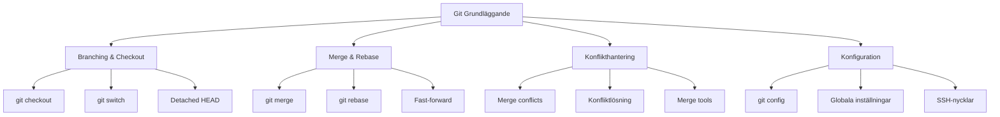
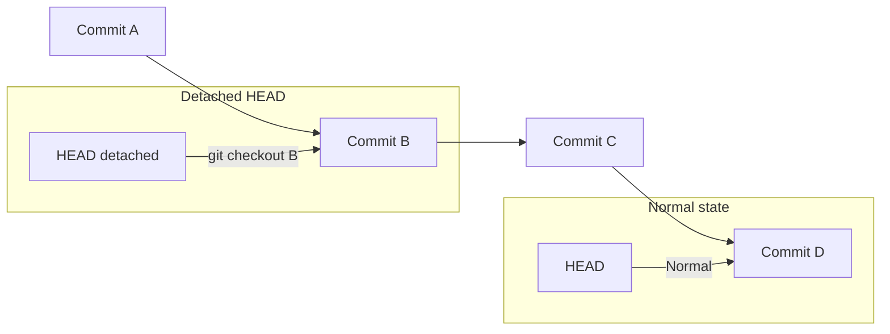
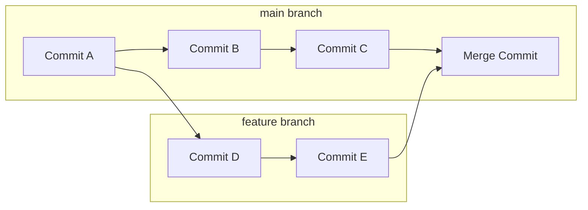
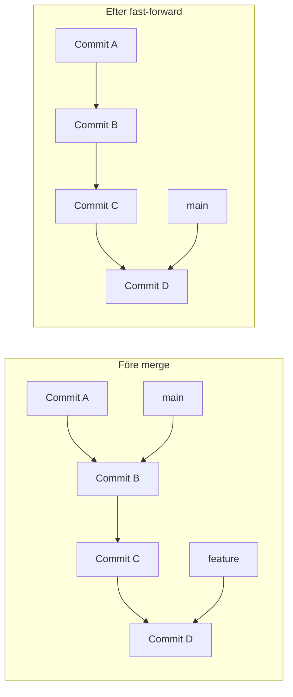
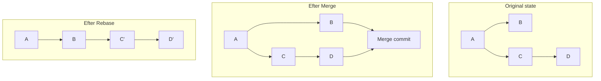
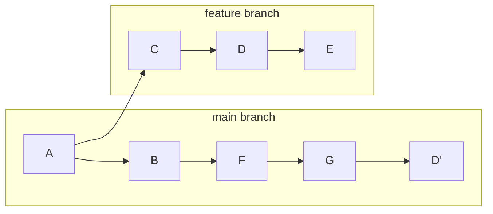

# Mer Git-kommandon

## Introduktion till avancerade Git-tekniker

Nu när du behärskar grunderna i Git är det dags att utforska mer avancerade kommandon och tekniker. Dessa verktyg ger dig större kontroll över ditt versionshanteringssystem och gör dig till en mer effektiv utvecklare.



## Git Checkout - Navigera mellan brancher och commits

`git checkout` är ett mångsidigt kommando som låter dig "hoppa" mellan olika versioner av ditt projekt.

### Växla mellan brancher
```bash
# Visa alla brancher
git branch

# Skapa och växla till ny branch
git checkout -b ny-funktion

# Växla till befintlig branch
git checkout main
git checkout utveckling

# Kort för att skapa branch från specifik commit
git checkout -b bugfix-123 abc1234
```

### Checkout till specifika commits
```bash
# Visa commit-historik
git log --oneline

# Gå till specifik commit (skapar "detached HEAD")
git checkout abc1234

# Gå tillbaka till senaste commit på current branch
git checkout main
```

### Detached HEAD State
När du gör `checkout` till en specifik commit hamnar du i "detached HEAD" tillstånd:



```bash
# Om du är i detached HEAD och vill behålla ändringar
git switch -c ny-branch-namn

# Eller gå tillbaka utan att spara ändringar
git switch main
```

### Återställa filer med checkout
```bash
# Återställ en specifik fil till senaste commit
git checkout -- fil.txt

# Återställ fil till specifik commit
git checkout abc1234 -- fil.txt

# Återställ alla filer i katalog
git checkout -- .
```

## Git Switch - Modernare sätt att växla branches

`git switch` introducerades i Git 2.23 som ett tydligare alternativ till `git checkout` för branch-hantering:

```bash
# Växla till befintlig branch
git switch main
git switch utveckling

# Skapa och växla till ny branch
git switch -c ny-funktion

# Växla tillbaka till föregående branch
git switch -

# Återgå till main från detached HEAD
git switch main
```

**Fördelar med `git switch`:**
- Tydligare syfte (endast för brancher)
- Säkrare (mindre risk för misstag)
- Modernare syntax

## Merge och Rebase - Kombinera ändringar

### Git Merge - Traditionell sammanfogning

```bash
# Gå till target branch (oftast main)
git switch main

# Hämta senaste ändringar
git pull origin main

# Merge in branch
git merge funktions-branch

# Push merged result
git push origin main
```

#### Merge-strategier visualiserade



#### Fast-forward merge
När target branch inte har nya commits:

```bash
# Main branch har inga nya commits sedan branch skapades
git merge funktions-branch
# Resulterar i fast-forward (ingen merge commit)
```



### Git Rebase - Omskrivning av historik

Rebase "flyttar" dina commits till toppen av target branch:

```bash
# Gå till din feature branch
git switch funktions-branch

# Rebase mot main
git rebase main

# Om inga konflikter: push (kan kräva force)
git push --force-with-lease origin funktions-branch
```

#### Rebase vs Merge visualiserat



#### Interaktiv rebase
```bash
# Redigera de senaste 3 commits
git rebase -i HEAD~3

# Öppnar editor med alternativ:
# pick = använd commit
# reword = ändra commit-meddelande  
# edit = redigera commit
# squash = kombinera med föregående commit
# drop = ta bort commit
```

**När ska du använda vad?**
- **Merge**: Bevarar historik, säkrare, bra för publika branches
- **Rebase**: Renare historik, linjär utveckling, bra för feature branches

## Konflikthantering (Merge Conflicts)

Konflikter uppstår när Git inte kan automatiskt kombinera ändringar.

### Förstå konflikter
```bash
# När merge skapar konflikter
git merge funktions-branch
# Output: CONFLICT (content): Merge conflict in fil.txt
```

### Konfliktmarkering i filer
```javascript
// fil.txt efter konflikt
function calculateTotal(items) {
<<<<<<< HEAD
    return items.reduce((sum, item) => sum + item.price, 0);
=======
    return items.reduce((total, item) => total + item.cost, 0);
>>>>>>> funktions-branch
}
```

**Förklaring:**
- `<<<<<<< HEAD`: Början på dina ändringar (current branch)
- `=======`: Skiljelinje mellan versioner
- `>>>>>>> branch-name`: Slut på den andra branchens ändringar

### Lösa konflikter

#### Manuell lösning
```bash
# 1. Öppna fil och redigera manuellt
# Ta bort konfliktmarkeringar och välj önskad version

# 2. Lägg till den lösta filen
git add fil.txt

# 3. Slutför merge
git commit
# (eller för rebase: git rebase --continue)
```

#### Använda merge tools
```bash
# Konfigurera merge tool (en gång)
git config --global merge.tool vimdiff
# eller: vscode, meld, kdiff3, etc.

# Starta merge tool vid konflikt
git mergetool

# Efter lösning av alla konflikter
git commit
```

### Förebygga konflikter
```bash
# Håll din branch uppdaterad
git switch main
git pull origin main
git switch funktions-branch
git rebase main  # eller git merge main

# Små, frekventa commits
# Kommunicera med teamet om stora ändringar
# Använd .gitattributes för specifika filtyper
```

## Git Config - Anpassa din Git-miljö

### Nivåer av konfiguration
Git har tre nivåer av konfiguration:

```bash
# System-nivå (alla användare)
git config --system

# Global nivå (din användare)
git config --global

# Repository-nivå (endast detta projekt)
git config --local
```

### Grundläggande konfiguration
```bash
# Sätt användarinfo (obligatoriskt)
git config --global user.name "Ditt Namn"
git config --global user.email "din.email@example.com"

# Standardeditor
git config --global core.editor "code --wait"  # VS Code
git config --global core.editor "vim"          # Vim
git config --global core.editor "nano"         # Nano

# Standardbranch-namn
git config --global init.defaultBranch main

# Radslut-hantering (viktigt för Windows/Mac/Linux)
git config --global core.autocrlf input     # Mac/Linux
git config --global core.autocrlf true      # Windows
```

### Alias för vanliga kommandon
```bash
# Skapa användbara alias
git config --global alias.st status
git config --global alias.co checkout
git config --global alias.br branch
git config --global alias.ci commit

# Avancerade alias
git config --global alias.unstage 'reset HEAD --'
git config --global alias.last 'log -1 HEAD'
git config --global alias.visual '!gitk'

# Vacker log output
git config --global alias.lg "log --oneline --decorate --graph --all"

# Använd alias
git st        # istället för git status
git lg        # vacker log output
```

### Konfigurationsfil
```bash
# Visa all konfiguration
git config --list

# Visa var konfiguration kommer ifrån
git config --list --show-origin

# Redigera global konfiguration direkt
git config --global --edit
```

Exempel på `.gitconfig` fil:
```ini
[user]
    name = Ditt Namn
    email = din.email@example.com

[core]
    editor = code --wait
    autocrlf = input

[init]
    defaultBranch = main

[alias]
    st = status
    co = checkout
    br = branch
    ci = commit
    lg = log --oneline --decorate --graph --all

[push]
    default = simple

[pull]
    rebase = false
```

## SSH-nycklar för GitHub/GitLab

### Generera SSH-nyckel
```bash
# Generera ny SSH-nyckel
ssh-keygen -t ed25519 -C "din.email@example.com"

# För äldre system som inte stödjer ed25519
ssh-keygen -t rsa -b 4096 -C "din.email@example.com"

# Starta SSH agent
eval "$(ssh-agent -s)"

# Lägg till nyckel till agent
ssh-add ~/.ssh/id_ed25519
```

### Konfiguration för GitHub
```bash
# Kopiera publik nyckel (Mac)
pbcopy < ~/.ssh/id_ed25519.pub

# Linux
cat ~/.ssh/id_ed25519.pub

# Lägg till i GitHub under Settings > SSH and GPG keys

# Testa anslutningen
ssh -T git@github.com
```

## Avancerade Git-kommandon för nyfikna

### Git Cherry-pick
Välj specifika commits från andra branches:

```bash
# Applicera en specifik commit på current branch
git cherry-pick abc1234

# Cherry-pick flera commits
git cherry-pick abc1234 def5678

# Cherry-pick ett intervall
git cherry-pick abc1234..def5678
```



### Git Stash - Temporär lagring
```bash
# Spara ändringar temporärt
git stash

# Spara med meddelande
git stash push -m "Work in progress på login"

# Lista alla stashes
git stash list

# Applicera senaste stash
git stash pop

# Applicera specifik stash
git stash apply stash@{2}

# Ta bort stash utan att applicera
git stash drop stash@{1}
```

### Git Worktree - Flera arbetsytor
```bash
# Skapa ny worktree för branch
git worktree add ../projekt-hotfix hotfix-branch

# Lista alla worktrees
git worktree list

# Ta bort worktree
git worktree remove ../projekt-hotfix
```

### Git Reflog - Återhämtning
```bash
# Visa vad som hänt med HEAD
git reflog

# Återställ till tidigare state
git reset --hard HEAD@{2}

# Hitta "förlorade" commits
git reflog --all
```

### Git Bisect - Hitta buggar
```bash
# Starta bisect-session
git bisect start

# Markera aktuell commit som dålig
git bisect bad

# Markera tidigare bra commit
git bisect good abc1234

# Git checkar ut commit i mitten - testa och markera
git bisect bad    # eller git bisect good

# Fortsätt tills Git hittar problematisk commit
git bisect reset  # avsluta
```

### Git Hooks - Automatisering
```bash
# Navigera till hooks-mappen
cd .git/hooks

# Skapa pre-commit hook
nano pre-commit

# Exempel: Kör tests innan commit
#!/bin/bash
npm test
if [ $? -ne 0 ]; then
    echo "Tests failed, commit aborted"
    exit 1
fi

# Gör executable
chmod +x pre-commit
```

## Git Submodules - Externa repositories
```bash
# Lägg till submodule
git submodule add https://github.com/user/repo.git libs/external

# Klona projekt med submodules
git clone --recurse-submodules https://github.com/user/project.git

# Uppdatera submodules
git submodule update --remote
```

## Bästa praxis och tips

### Commit-meddelanden
```bash
# Bra struktur för commit-meddelanden
# <typ>: <kort beskrivning>
# 
# <längre beskrivning vid behov>
# 
# <referenser till issues>

# Exempel:
feat: add user authentication system

Implement login/logout functionality with JWT tokens.
Includes password hashing and session management.

Fixes #123
```

### Branch-namngivning
```bash
# Bra branch-namns konventioner
feature/user-authentication
bugfix/login-error-handling
hotfix/security-vulnerability
release/v2.1.0
```

### Git Flow vs GitHub Flow
**Git Flow** - Komplexare, strukturerad:
- `main` - produktionskod
- `develop` - utvecklingsbranch
- `feature/*` - nya funktioner
- `release/*` - release förberedelser
- `hotfix/*` - kritiska fixes

**GitHub Flow** - Enklare, snabbare:
- `main` - alltid deploybar
- `feature/*` - korta feature branches
- Pull requests för review
- Deploy direkt från main

## Felsökning och problemlösning

### Vanliga problem och lösningar

#### Undo senaste commit (behåll ändringar)
```bash
git reset --soft HEAD~1
```

#### Undo senaste commit (ta bort ändringar)
```bash
git reset --hard HEAD~1
```

#### Ändra senaste commit-meddelande
```bash
git commit --amend -m "Nytt meddelande"
```

#### Lägg till fil till senaste commit
```bash
git add glömd-fil.txt
git commit --amend --no-edit
```

#### Återställa fil till specifik version
```bash
git checkout abc1234 -- fil.txt
```

#### Push refuseras (diverged history)
```bash
# Se vad som skiljer
git log --oneline origin/main..main

# Option 1: Pull och merge
git pull origin main

# Option 2: Pull och rebase
git pull --rebase origin main

# Option 3: Force push (FARLIGT - använd bara på egna branches)
git push --force-with-lease origin main
```

### Debug Git-kommandon
```bash
# Visa vad Git gör
export GIT_TRACE=1
git status

# Debug merge
export GIT_MERGE_VERBOSITY=2
git merge branch-name

# Visa konfiguration
git config --list --show-origin
```

## Sammanfattning

Du har nu lärt dig avancerade Git-tekniker som gör dig till en mer kompetent utvecklare:

- **Checkout och Switch**: Navigera mellan branches och commits säkert
- **Merge vs Rebase**: Förstå när och hur du ska kombinera ändringar
- **Konflikthantering**: Lösa merge conflicts effektivt
- **Konfiguration**: Anpassa Git för din arbetsrutation
- **Avancerade verktyg**: Cherry-pick, stash, reflog och mer

### Nästa steg
- Experimentera med dessa kommandon i test-repositories
- Lär dig Git hooks för automatisering
- Utforska Git GUIs som Sourcetree eller GitKraken
- Fördjupa dig i Git internals för ännu djupare förståelse

Git är ett kraftfullt verktyg - med dessa kunskaper kan du hantera även komplexa utvecklingsprojekt med självförtroende!
