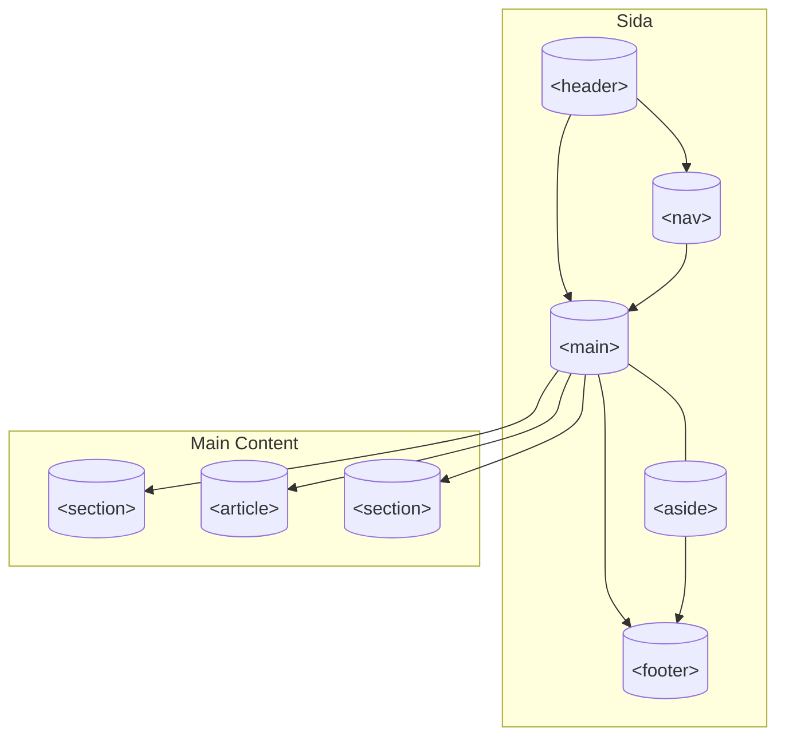

# Strukturera och Semantisera Webbinnehåll med HTML5

Vi har lärt oss de grundläggande HTML-taggarna för att skapa innehåll. Men hur organiserar vi innehållet på ett logiskt sätt? Och hur kan vi ge innehållet *mening* utöver bara dess utseende? Det är här **struktur** och **semantik** kommer in i bilden.

*   **Struktur:** Handlar om hur vi organiserar och grupperar innehållet på sidan med hjälp av olika HTML-element.
*   **Semantik:** Handlar om att använda HTML-element som korrekt beskriver *innebörden* eller *syftet* med innehållet de omsluter.

**Varför är detta viktigt?**

1.  **Tillgänglighet (Accessibility):** Skärmläsare och andra hjälpmedel använder HTML-strukturen och semantiken för att förstå och navigera på sidan. Korrekt semantik gör webbplatsen användbar för fler människor.
2.  **Sökmotoroptimering (SEO):** Sökmotorer som Google analyserar HTML-strukturen för att förstå vad sidan handlar om och rangordna den i sökresultaten. Semantisk HTML hjälper dem att göra ett bättre jobb.
3.  **Underhållbarhet:** En välstrukturerad och semantisk kodbas är lättare att läsa, förstå och underhålla för dig själv och andra utvecklare.
4.  **Styling med CSS:** Även om CSS styr utseendet, ger en bra HTML-struktur tydliga "krokar" som CSS kan fästa vid för att applicera stilar.

## Generiska Strukturelement: `<div>` och `<span>`

Historiskt (och fortfarande idag) används ofta två generiska element för att gruppera innehåll:

*   `<div>` (Division): Ett **blocknivå-element**. Det används för att gruppera större sektioner av innehåll eller för layoutändamål. Det börjar på en ny rad och tar upp hela tillgängliga bredden.
*   `<span>`: Ett **inline-element**. Det används för att gruppera mindre delar av text eller annat inline-innehåll, ofta för att applicera specifik styling (t.ex. en annan färg på ett ord) eller för att identifiera en textdel med JavaScript. Det börjar *inte* på en ny rad.

**Problem:** `<div>` och `<span>` är **icke-semantiska**. De säger ingenting om *vad* innehållet de omsluter faktiskt representerar.

```html
<!-- Icke-semantiskt exempel -->
<div id="header">...</div>
<div id="nav">...</div>
<div class="article">
  <div class="headline">Artikelrubrik</div>
  <p>...</p>
</div>
<div id="footer">...</div>
```

Detta fungerar, men det kräver att man inspekterar `id` eller `class`-attribut för att gissa sig till syftet.

## HTML5 Semantiska Strukturelement

HTML5 introducerade nya element specifikt för att ge semantisk mening åt olika delar av en webbsidas struktur. Dessa gör koden tydligare och mer meningsfull.


*Diagram: Vanlig sidlayout med HTML5 semantiska element.* 

Här är de viktigaste:

*   `<header>`: Representerar introducerande innehåll för en sida eller en sektion. Innehåller ofta sidans logotyp, huvudrubrik (`<h1>`), och kanske primär navigering.
*   `<nav>`: Representerar en sektion med navigeringslänkar (t.ex. huvudmenyn, länkar inom sidan).
*   `<main>`: Representerar **huvudinnehållet** i dokumentet. Det ska bara finnas *ett* `<main>`-element per sida, och det ska inte placeras inuti `<article>`, `<aside>`, `<header>`, `<nav>`, eller `<footer>`.
*   `<article>`: Representerar en **fristående**, komplett innehållsdel som skulle kunna distribueras oberoende av resten av sidan (t.ex. ett blogginlägg, en forumkommentar, en nyhetsartikel).
*   `<section>`: Representerar en **tematisk gruppering** av innehåll, vanligtvis med en egen rubrik (`<h2>`-`<h6>`). Används när det inte finns något mer specifikt semantiskt element (som `<article>` eller `<nav>`). Tänk på det som ett kapitel i en bok.
*   `<aside>`: Representerar innehåll som är **tangentiellt relaterat** till innehållet runt omkring det (t.ex. en sidopanel med relaterade länkar, författarinformation, reklam). Kan ses som en fotnot eller en sidnotering.
*   `<footer>`: Representerar sidfoten för en sida eller sektion. Innehåller ofta copyrightinformation, länkar till sekretesspolicy, kontaktuppgifter.

**Semantiskt Exempel (Motsvarar det icke-semantiska ovan):**

```html
<header>
  <h1>Webbplatsens Titel</h1>
  <nav>
    <ul>
      <li><a href="/">Hem</a></li>
      <li><a href="/om">Om oss</a></li>
    </ul>
  </nav>
</header>

<main>
  <article>
    <h2>Artikelrubrik</h2>
    <p>...</p>
    <section>
      <h3>Kommentarer</h3>
      <p>...</p>
    </section>
  </article>

  <aside>
    <h3>Relaterade Länkar</h3>
    <ul>...</ul>
  </aside>
</main>

<footer>
  <p>&copy; 2024 Webbplats AB</p>
</footer>
```

Denna version är mycket tydligare. Bara genom att titta på taggarna förstår vi syftet med de olika sektionerna.

## När ska man använda `<div>`?

Även med de semantiska elementen finns det fortfarande tillfällen då `<div>` är lämpligt:

*   **Endast för styling/layout:** Om du behöver gruppera element *enbart* för att applicera CSS-regler (t.ex. skapa en container för att centrera innehåll) och det inte finns något semantiskt element som passar, är `<div>` rätt val.
*   **JavaScript-krokar:** Om du behöver ett element att fästa JavaScript-funktionalitet vid och ingen semantisk tagg passar.

Försök dock alltid att först använda ett semantiskt element om det finns ett som beskriver innehållets syfte.

## Sammanfattning

Att använda semantisk HTML handlar om att välja de HTML-element som bäst beskriver innebörden av ditt innehåll. HTML5 erbjuder specifika element som `<header>`, `<nav>`, `<main>`, `<article>`, `<section>`, `<aside>`, och `<footer>` för att strukturera sidans huvuddelar på ett meningsfullt sätt. Detta förbättrar tillgänglighet, SEO och kodens läsbarhet jämfört med att bara använda generiska `<div>`-element.

I nästa avsnitt fokuserar vi specifikt på hur HTML-element bidrar till att göra webbplatser mer tillgängliga.
