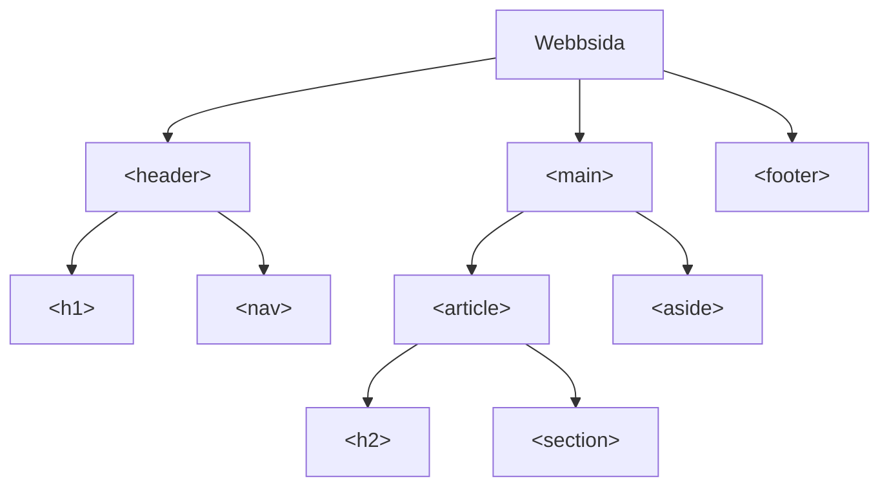

# Struktur och semantisk HTML

Du kan bygga en sida med bara `<div>`-element, men då måste både människor och hjälpmedel gissa vad varje del är till för. **Semantisk HTML** betyder att du väljer en tagg som beskriver innehållets syfte: navigering är `<nav>`, sidans huvuddel är `<main>` och sidfoten är `<footer>`.

> **Mål:** Kunna dela in en enkel sida i tydliga delar och välja semantiska element före generiska `<div>` när det passar.

## Se sidans delar först

Tänk på en enkel receptsida. Den har en rubrik och meny högst upp, ett huvudinnehåll och en sidfot. Det är sidans struktur – inte dess design.


```mermaid
graph TD
    Page["Webbsida"] --> Header["&lt;header&gt;"]
    Header --> H1["&lt;h1&gt;"]
    Header --> Nav["&lt;nav&gt;"]
    Page --> Main["&lt;main&gt;"]
    Main --> Article["&lt;article&gt;"]
    Article --> H2["&lt;h2&gt;"]
    Article --> Section["&lt;section&gt;"]
    Main --> Aside["&lt;aside&gt;"]
    Page --> Footer["&lt;footer&gt;"]
```

Här är samma idé som HTML. Klicka på **Kör** för att se vad som faktiskt visas i webbläsaren. Taggarna i sig ger nästan ingen form – CSS tar hand om utseendet senare.

<!-- playground -->
```html
<header>
  <h1>Enkla vardagsrecept</h1>
  <nav>
    <a href="#recept">Recept</a> |
    <a href="#kontakt">Kontakt</a>
  </nav>
</header>

<main>
  <article id="recept">
    <h2>Pannkakor</h2>
    <p>Ett snabbt recept för fyra personer.</p>

    <section>
      <h3>Ingredienser</h3>
      <ul>
        <li>2 ägg</li>
        <li>5 dl mjölk</li>
      </ul>
    </section>
  </article>

  <aside>
    <h2>Tips</h2>
    <p>Servera med bär.</p>
  </aside>
</main>

<footer id="kontakt">
  <p>© 2026 Enkla vardagsrecept</p>
</footer>
```

## Varför välja rätt element?

- **Personer som använder skärmläsare** kan hoppa direkt till navigeringen eller huvudinnehållet.
- **Du och dina kurskamrater** kan läsa koden och förstå dess delar snabbare.
- **Sökmotorer** får bättre information om vad sidan innehåller.

Det handlar alltså inte om att få sidan att se finare ut. Det handlar om att beskriva den tydligt.

---
## Allmänna strukturelement: `<div>` och `<span>`

Historiskt (och fortfarande idag) används ofta två allmänna (generiska) element för att gruppera innehåll:

- `<div>` (division): Ett **blockelement** (block-level element). Används för att gruppera större sektioner av innehåll eller för layoutändamål. Börjar på en ny rad och tar upp hela tillgängliga bredden.
- `<span>`: Ett **inline-element**. Används för att gruppera mindre delar av text eller annat inline-innehåll, ofta för att applicera specifik styling eller för att identifiera en textdel med JavaScript. Börjar *inte* på en ny rad.

**Problem:** `<div>` och `<span>` är **icke-semantiska**. De säger ingenting om *vad* innehållet de omsluter faktiskt representerar.

```html
<!-- Icke-semantiskt exempel -->
<div id="header">...</div>
<div id="nav">...</div>
<div class="article">
  <div class="headline">Artikelrubrik</div>
  <p>...</p>
</div>
<div id="footer">...</div>
```

Detta fungerar, men det kräver att man inspekterar `id` eller `class`-attribut för att gissa sig till syftet.

---

## De viktigaste strukturelementen

Välj element utifrån innehållets roll:

- `<header>`: Inledning för en sida eller del av en sida, ofta logotyp, rubrik och meny.
- `<nav>`: En grupp viktiga navigeringslänkar, till exempel huvudmenyn.
- `<main>`: Sidans unika huvudinnehåll. Använd ett `<main>` per sida.
- `<article>`: Ett fristående innehåll, till exempel ett blogginlägg, recept eller en nyhetsartikel.
- `<section>`: En tydlig del av innehållet, normalt med en egen rubrik.
- `<aside>`: Innehåll som hör ihop med huvudinnehållet men inte är dess kärna, till exempel ett tips eller relaterade länkar.
- `<footer>`: Avslutning för sidan eller en del av den, ofta kontaktuppgifter eller copyright.

---

## Exempel: Strukturera och ge semantisk betydelse

```html
<header>
  <h1>Webbplatsens Titel</h1>
  <nav>
    <ul>
      <li><a href="/">Hem</a></li>
      <li><a href="/om">Om oss</a></li>
    </ul>
  </nav>
</header>

<main>
  <article>
    <h2>Artikelrubrik</h2>
    <p>...</p>
    <section>
      <h3>Kommentarer</h3>
      <p>...</p>
    </section>
  </article>

  <aside>
    <h3>Relaterade länkar</h3>
    <ul>...</ul>
  </aside>
</main>

<footer>
  <p>&copy; 2024 Webbplats AB</p>
</footer>
```

Denna version är mycket tydligare. Bara genom att titta på taggarna förstår vi syftet med de olika sektionerna.

---

## När ska man använda `<div>`?

Även med de semantiska elementen finns det fortfarande tillfällen då `<div>` är lämpligt:

- **Endast för styling/layout:** Om du behöver gruppera element *enbart* för att applicera CSS-regler (t.ex. skapa en container för att centrera innehåll) och det inte finns något semantiskt element som passar, är `<div>` rätt val.
- **JavaScript-krokar:** Om du behöver ett element att fästa JavaScript-funktionalitet vid och ingen semantisk tagg passar.

Försök dock alltid att först använda ett semantiskt element om det finns ett som beskriver innehållets syfte.

---

## Sammanfattning

Att använda semantisk HTML handlar om att välja det element som bäst beskriver innehållets roll. Element som `<header>`, `<nav>`, `<main>`, `<article>`, `<section>`, `<aside>` och `<footer>` gör sidan lättare att förstå än en samling generiska `<div>`-element.

I nästa avsnitt ser du hur samma val gör webbplatsen mer tillgänglig.
