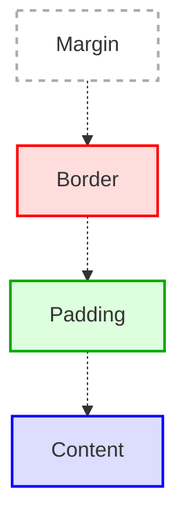

# Box model och grundläggande layout i CSS

Att förstå **CSS box model** är avgörande för att kunna skapa tydliga och flexibla layouter på webbsidor. Box model beskriver hur varje HTML-element ritas upp som en rektangulär låda och hur dess storlek och avstånd till andra element beräknas.

> **Motivation:**  
> Med kunskap om box model kan du styra exakt hur mycket plats ett element tar, hur det placeras och hur det samspelar med andra delar av sidan. Det är grunden för all layout i CSS.

---

## Box model: delar

Varje låda i CSS består av fyra lager, utifrån och in:

1. **Margin (marginal):**  
   Yttersta lagret. Skapar ett genomskinligt utrymme *utanför* elementets kantlinje (border). Används för att skapa avstånd mellan olika element.

2. **Border (kantlinje):**  
   Ramen runt elementet. Har tjocklek, stil (t.ex. solid, dashed) och färg.

3. **Padding (utfyllnad):**  
   Genomskinligt utrymme *innanför* kantlinjen, men *utanför* innehållet. Skapar luft mellan kanten och innehållet.

4. **Content (innehåll):**  
   Själva innehållet i elementet (t.ex. text eller bild). Dimensionerna styrs av `width` och `height` (eller av innehållet om inget anges).

---

## Visualisering


*Diagram: Visualisering av CSS box model.*

---

## CSS-egenskaper för box model

- `width`, `height`: Anger bredd och höjd för **content**-området.
- `padding`: Luft innanför kantlinjen.
- `border`: Själva ramen runt elementet.
- `margin`: Luft utanför kantlinjen.

---

## Exempel 1: Enkel box

```css
.box {
  width: 200px;
  padding: 16px;
  border: 2px solid #333;
  margin: 24px;
  background-color: #eef;
}
```

```html
<div class="box">
  Detta är en enkel box med padding, border och margin.
</div>
```

---

## Exempel 2: Jämförelse mellan content-box och border-box

```css
.box-content {
  width: 200px;
  padding: 20px;
  border: 4px solid #0077cc;
  margin: 16px;
  box-sizing: content-box;
  background: #d0f0ff;
}

.box-border {
  width: 200px;
  padding: 20px;
  border: 4px solid #cc7700;
  margin: 16px;
  box-sizing: border-box;
  background: #fff0d0;
}
```

```html
<div class="box-content">
  box-sizing: content-box (standard)<br>
  Total bredd: 200px + 2×20px (padding) + 2×4px (border) = 248px
</div>
<div class="box-border">
  box-sizing: border-box<br>
  Total bredd: 200px (inklusive padding och border)
</div>
```

---

## Exempel 3: Flera boxar med olika margin och padding

```css
.box-small {
  width: 120px;
  padding: 8px;
  border: 2px dashed #888;
  margin: 8px;
  background: #f9f9f9;
}

.box-large {
  width: 240px;
  padding: 32px;
  border: 4px solid #444;
  margin: 32px;
  background: #e0e0e0;
}
```

```html
<div class="box-small">
  Liten box med liten padding och margin.
</div>
<div class="box-large">
  Stor box med stor padding och margin.
</div>
```

---

## Exempel 4: Ärftlighet och box model

Vissa egenskaper, som `color` och `font-family`, ärvs av barn-element. Andra, som `margin` och `padding`, ärvs inte.

```css
.parent-box {
  color: darkblue;
  font-family: Verdana, sans-serif;
  border: 2px solid #222;
  padding: 12px;
  margin: 20px;
}
.child-box {
  border: 1px dotted #555;
  padding: 8px;
  margin: 10px;
}
```

```html
<div class="parent-box">
  Förälder (parent-box)
  <div class="child-box">
    Barn (child-box) ärver färg och font, men har egna margin och padding.
  </div>
</div>
```

---

## Analogier

Tänk dig box model som en flyttkartong:
- **Content:** Själva sakerna i kartongen.
- **Padding:** Bubbelplast runt sakerna.
- **Border:** Själva kartongen.
- **Margin:** Luft mellan kartongen och andra kartonger.

---

## Sammanfattning

- Box model styr hur HTML-element tar plats och placeras på sidan.
- Den består av margin, border, padding och content.
- Med rätt användning av box model kan du skapa flexibla och snygga layouter.
- Använd gärna `box-sizing: border-box;` för enklare storleksberäkningar.

---

# Blockelement och inline-element i CSS

## Vad är blockelement?

Blockelement (block elements) är HTML-element som automatiskt tar upp hela bredden av sin förälder och börjar på en ny rad. Exempel på blockelement är `<div>`, `<p>`, `<h1>`, `<ul>`, och `<li>`. De används för att bygga sidans struktur.

**Egenskaper för blockelement:**
- Börjar alltid på en ny rad.
- Tar upp hela tillgängliga bredden.
- Det går att ange `width`, `height`, `margin` och `padding`.

**Exempel:**
```html
<div style="background: #e0e0ff; margin-bottom: 8px;">Detta är ett blockelement</div>
<p style="background: #ffe0e0;">Detta är också ett blockelement</p>
```

---

## Vad är inline-element?

Inline-element (inline elements) är HTML-element som bara tar upp så mycket plats som behövs för sitt innehåll och ligger kvar på samma rad som andra element. Exempel på inline-element är `<span>`, `<a>`, `<strong>`, och `<em>`.

**Egenskaper för inline-element:**
- Börjar inte på en ny rad.
- Tar bara upp så mycket plats som behövs.
- `width` och `height` har ingen effekt.
- Endast horisontell `padding` och `margin` fungerar som väntat.

**Exempel:**
```html
<p>
  Detta är <span style="background: #e0ffe0;">ett inline-element</span> mitt i en text.
</p>
```

---

## Jämförelse: block vs inline

| Egenskap         | Blockelement         | Inline-element         |
|------------------|---------------------|-----------------------|
| Ny rad           | Ja                  | Nej                   |
| Bredd            | Hela förälderns     | Innehållets bredd     |
| `width`/`height` | Ja                  | Nej                   |
| `margin`/`padding` | Ja                | Endast horisontellt   |

---

# Positionering av element med CSS

CSS erbjuder flera sätt att positionera element på en webbsida. Här är de vanligaste positioneringsmetoderna:

## 1. Static (standard)

Alla element har `position: static;` som standard. De placeras i sidans normala flöde.

```css
.static-box {
  position: static;
}
```

---

## 2. Relative

Med `position: relative;` kan du flytta ett element i förhållande till dess ursprungliga plats med hjälp av `top`, `right`, `bottom` och `left`.

```css
.relative-box {
  position: relative;
  left: 30px;
  top: 10px;
  background: #d0ffd0;
}
```

---

## 3. Absolute

`position: absolute;` placerar elementet i förhållande till närmaste förfader med `position: relative;` (eller till sidans kant om ingen sådan finns). Elementet tas bort från det normala flödet.

```css
.parent {
  position: relative;
  width: 300px;
  height: 200px;
  background: #f0f0f0;
}
.child {
  position: absolute;
  top: 20px;
  left: 40px;
  background: #ffd0d0;
  padding: 8px;
}
```

```html
<div class="parent">
  <div class="child">Absolut positionerad</div>
</div>
```

---

## 4. Fixed

Med `position: fixed;` placeras elementet i förhållande till webbläsarfönstret och stannar kvar även när du scrollar.

```css
.fixed-box {
  position: fixed;
  bottom: 10px;
  right: 10px;
  background: #d0e0ff;
  padding: 10px;
}
```

---

## 5. Sticky

`position: sticky;` gör att elementet beter sig som `relative` tills du scrollar till en viss punkt, då blir det `fixed`.

```css
.sticky-header {
  position: sticky;
  top: 0;
  background: #fffbe0;
  padding: 10px;
}
```

---

## Illustration: CSS-positionering

```mermaid
flowchart TD
    A[Normalt sidflöde]
    B[Blockelement<br>(position: static)]
    C[Relativt flyttat<br>(position: relative;<br>top/left)]
    D[Absolut placerat<br>(position: absolute;<br>top/left)]
    E[Fast placerat<br>(position: fixed;<br>bottom/right)]
    F[Klistrigt<br>(position: sticky;<br>top: 0)]

    A --> B
    B -. Flyttas från ursprunglig plats .-> C
    A -. Tas ur sidflödet .-> D
    A -. Följer fönstret .-> E
    A -. Bete sig som static tills scroll .-> F
```

---

## Sammanfattning

- **Blockelement** bygger sidans grundstruktur och tar upp hela bredden.
- **Inline-element** ligger kvar på samma rad och tar bara upp så mycket plats som behövs.
- Med **position** kan du styra exakt var element hamnar på sidan.
- Kombinera block/inline och positionering för att skapa flexibla och responsiva layouter.