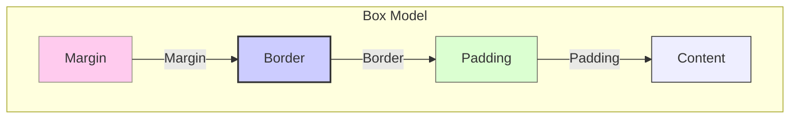

# Boxmodellen och Grundläggande Layout i CSS

För att kunna skapa layouter och positionera element på en webbsida måste vi förstå **CSS Box Model** (boxmodellen). Den beskriver hur varje HTML-element renderas som en rektangulär låda på sidan och hur dess dimensioner och avstånd till andra element beräknas.

**Mål:** Förstå de olika delarna av boxmodellen (content, padding, border, margin), hur `display`-egenskapen påverkar layout, och grunderna i positionering.

## Boxmodellens Delar

Varje låda i CSS består av fyra lager, utifrån och in:

1.  **Margin (Marginal):** Det yttersta lagret. Skapar ett **genomskinligt** utrymme *utanför* elementets kant (border). Används för att skapa avstånd *mellan* olika element.
2.  **Border (Kantlinje):** En linje som ritas *runt* elementets padding och innehåll. Den har en tjocklek, stil (t.ex. solid, dashed) och färg.
3.  **Padding (Utfyllnad):** Ett **genomskinligt** utrymme *innanför* elementets kant (border), men *utanför* själva innehållet. Används för att skapa luft mellan kanten och innehållet.
4.  **Content (Innehåll):** Det faktiska innehållet i elementet (text, bilder, etc.). Dess dimensioner bestäms av `width`- och `height`-egenskaperna (eller av innehållet självt).


*Diagram: Visualisering av CSS Box Model.* 

**CSS-egenskaper för Boxmodellen:**

*   `width`, `height`: Anger bredd och höjd för **content**-området.
*   `padding`: Anger utfyllnaden. Kan anges för alla sidor (`padding: 10px;`), separat för topp/botten och vänster/höger (`padding: 10px 20px;`), eller för varje sida individuellt (`padding-top`, `padding-right`, `padding-bottom`, `padding-left`).
*   `border`: En samlingsegenskap för att sätta kantlinjens tjocklek, stil och färg (`border: 1px solid black;`). Kan också specificeras per sida (`border-top`, `border-left`, etc.) eller med separata egenskaper (`border-width`, `border-style`, `border-color`).
*   `margin`: Anger marginalen. Fungerar som `padding` med möjlighet att ange för alla sidor, topp/botten + vänster/höger, eller individuellt (`margin-top`, etc.).

**Exempel:**

```html
<div class="box">Mitt Innehåll</div>
```

```css
.box {
  width: 200px;
  height: 100px;
  padding: 20px; /* 20px utfyllnad på alla sidor */
  border: 2px solid red; /* Röd, solid kantlinje, 2px tjock */
  margin: 30px; /* 30px marginal på alla sidor */
  background-color: lightyellow; /* Bakgrundsfärg appliceras på content + padding */
}
```

**Box-sizing:** Som standard (`box-sizing: content-box;`) läggs `padding` och `border` *utanpå* den angivna `width` och `height`. Detta kan göra layoutberäkningar krångliga. Det är mycket vanligt att man globalt ändrar detta till `border-box`:

```css
* { /* Väljer alla element */
  box-sizing: border-box;
}
```

Med `box-sizing: border-box;` inkluderas `padding` och `border` i elementets totala `width` och `height`. Om du sätter `width: 200px;` och `padding: 20px;`, blir content-området 160px brett (200 - 20*2). Detta är oftast mer intuitivt.

## Display-egenskapen: Block vs Inline

`display`-egenskapen bestämmer hur ett element beter sig i layoutflödet:

*   `display: block;`
    *   Elementet börjar på en **ny rad**.\
    *   Tar upp **hela tillgängliga bredden** (om inte `width` anges).\
    *   Respekterar `width`, `height`, `margin` (topp/botten/vänster/höger), och `padding`.\
    *   Exempel på block-element: `<h1>`-`<h6>`, `<p>`, `<div>`, `<ul>`, `<ol>`, `<li>`, `<section>`, `<article>`, etc.\

*   `display: inline;`
    *   Elementet börjar **inte** på en ny rad; det flödar med texten.\
    *   Tar bara upp **så mycket bredd som innehållet kräver**.\
    *   Respekterar **endast** `margin-left`, `margin-right`, `padding-left`, `padding-right`.\
    *   **Ignorerar** `width`, `height`, `margin-top`, `margin-bottom`, `padding-top`, `padding-bottom`.\
    *   Exempel på inline-element: `<a>`, `<span>`, ``, `<strong>`, `<em>`.\

*   `display: inline-block;`
    *   En hybrid: Elementet flödar som ett **inline**-element (börjar inte på ny rad).\
    *   Men... det respekterar `width`, `height`, `margin` (alla sidor), och `padding` (alla sidor), precis som ett **block**-element.\
    *   Användbart för att placera blockliknande element bredvid varandra.\

*   `display: none;`
    *   Elementet tas bort helt från sidan och påverkar inte layouten alls (det döljs inte bara, det finns inte där för webbläsaren).\

Det finns fler `display`-värden, framför allt `flex` och `grid`, som är grunden för moderna layouttekniker (introduceras kort senare).

## Grundläggande Positionering

`position`-egenskapen låter oss flytta element från deras normala plats i flödet.

*   `position: static;` (Standardvärde)
    *   Elementet följer det normala sidflödet. Egenskaperna `top`, `right`, `bottom`, `left` har ingen effekt.

*   `position: relative;`
    *   Elementet följer fortfarande det normala flödet, men du kan nu förskjuta det relativt till dess *ursprungliga* position med `top`, `right`, `bottom`, `left`. Utrymmet där elementet *skulle* ha varit lämnas tomt.

*   `position: absolute;`
    *   Elementet tas **helt ur** det normala flödet.\
    *   Det positioneras relativt till sitt närmaste *positionerade* förälderelement (ett element med `position` satt till något annat än `static`). Om ingen sådan förälder finns, positioneras det relativt till `<body>`.\
    *   Används ofta för att placera element ovanpå andra, skapa popups, etc.\

*   `position: fixed;`
    *   Liknar `absolute` (tas ur flödet), men elementet positioneras relativt till **webbläsarfönstret** (viewport).\
    *   Det stannar kvar på samma plats även när sidan scrollas. Används för fasta menyer, "tillbaka till toppen"-knappar, etc.\

*   `position: sticky;`
    *   En hybrid mellan `relative` och `fixed`. Elementet beter sig som `relative` tills det når en viss scrollposition (definierad med `top`, `right`, etc.), därefter beter det sig som `fixed`.

För element med `position: relative`, `absolute`, `fixed`, eller `sticky`, används `top`, `right`, `bottom`, `left` för att ange avståndet från respektive kant av dess positioneringskontext. `z-index` kan användas för att styra vilket element som ligger överst om de överlappar.

## Sammanfattning

Boxmodellen (margin, border, padding, content) definierar hur utrymme hanteras runt varje HTML-element. `box-sizing: border-box;` rekommenderas för mer intuitiva storleksberäkningar. `display`-egenskapen (`block`, `inline`, `inline-block`, `none`) styr hur element beter sig i layoutflödet. `position`-egenskapen (`relative`, `absolute`, `fixed`, `sticky`) ger oss möjlighet att placera element utanför det normala flödet.

Att förstå dessa koncept är avgörande för att kunna bygga layouter i CSS. I nästa avsnitt tittar vi på hur vi gör våra layouter responsiva.
