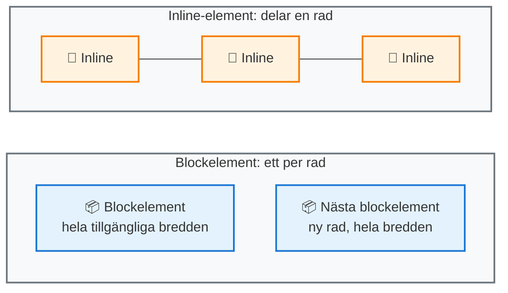
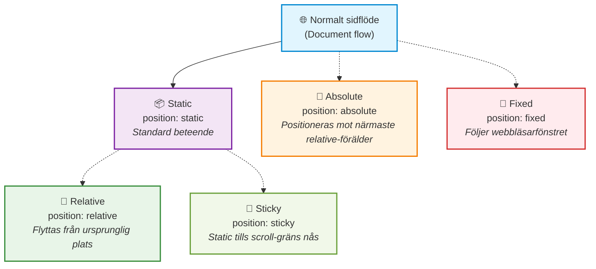

# Box model och grundläggande layout i CSS

Att förstå **CSS box model** är avgörande för att kunna skapa tydliga och flexibla layouter på webbsidor. Box model beskriver hur varje HTML-element ritas upp som en rektangulär låda och hur dess storlek och avstånd till andra element beräknas.

> **Motivation:**  
> Med kunskap om box model kan du styra exakt hur mycket plats ett element tar, hur det placeras och hur det samspelar med andra delar av sidan. Det är grunden för all layout i CSS.

---

## Box model: delar

Varje låda i CSS består av fyra lager, utifrån och in:

1. **Margin (marginal):**  
   Yttersta lagret. Skapar ett genomskinligt utrymme *utanför* elementets kantlinje (border). Används för att skapa avstånd mellan olika element.

2. **Border (kantlinje):**  
   Ramen runt elementet. Har tjocklek, stil (t.ex. solid, dashed) och färg.

3. **Padding (utfyllnad):**  
   Genomskinligt utrymme *innanför* kantlinjen, men *utanför* innehållet. Skapar luft mellan kanten och innehållet.

4. **Content (innehåll):**  
   Själva innehållet i elementet (t.ex. text eller bild). Dimensionerna styrs av `width` och `height` (eller av innehållet om inget anges).

---

## Visualisering av CSS Box Model


*Diagram: CSS box model visar hur varje element består av fyra lager som omsluter varandra.*

---

## CSS-egenskaper för box model

- `width`, `height`: Anger bredd och höjd för **content**-området.
- `padding`: Luft innanför kantlinjen.
- `border`: Själva ramen runt elementet.
- `margin`: Luft utanför kantlinjen.

---

## Exempel 1: Enkel box

```css
.box {
  width: 200px;
  padding: 16px;
  border: 2px solid #333;
  margin: 24px;
  background-color: #eef;
}
```

```html
<div class="box">
  Detta är en enkel box med padding, border och margin.
</div>
```

**Prova själv:** Ändra `padding`, `border` eller `margin` och klicka på **Kör** för att se hur lådan förändras.

<!-- playground:start -->
```html
<div class="box">
  Detta är en enkel box med padding, border och margin.
</div>
```
```css
.box {
  width: 200px;
  padding: 16px;
  border: 2px solid #333;
  margin: 24px;
  background-color: #eef;
}
```
<!-- playground:end -->

---

## Exempel 2: Jämförelse mellan content-box och border-box

```css
.box-content {
  width: 200px;
  padding: 20px;
  border: 4px solid #0077cc;
  margin: 16px;
  box-sizing: content-box;
  background: #d0f0ff;
}

.box-border {
  width: 200px;
  padding: 20px;
  border: 4px solid #cc7700;
  margin: 16px;
  box-sizing: border-box;
  background: #fff0d0;
}
```

```html
<div class="box-content">
  box-sizing: content-box (standard)<br>
  Total bredd: 200px + 2×20px (padding) + 2×4px (border) = 248px
</div>
<div class="box-border">
  box-sizing: border-box<br>
  Total bredd: 200px (inklusive padding och border)
</div>
```

---

## Exempel 3: Flera boxar med olika margin och padding

```css
.box-small {
  width: 120px;
  padding: 8px;
  border: 2px dashed #888;
  margin: 8px;
  background: #f9f9f9;
}

.box-large {
  width: 240px;
  padding: 32px;
  border: 4px solid #444;
  margin: 32px;
  background: #e0e0e0;
}
```

```html
<div class="box-small">
  Liten box med liten padding och margin.
</div>
<div class="box-large">
  Stor box med stor padding och margin.
</div>
```

---

## Exempel 4: Ärftlighet och box model

Vissa egenskaper, som `color` och `font-family`, ärvs av barn-element. Andra, som `margin` och `padding`, ärvs inte.

```css
.parent-box {
  color: darkblue;
  font-family: Verdana, sans-serif;
  border: 2px solid #222;
  padding: 12px;
  margin: 20px;
}
.child-box {
  border: 1px dotted #555;
  padding: 8px;
  margin: 10px;
}
```

```html
<div class="parent-box">
  Förälder (parent-box)
  <div class="child-box">
    Barn (child-box) ärver färg och font, men har egna margin och padding.
  </div>
</div>
```

---

## Analogier

Tänk dig box model som en flyttkartong:
- **Content:** Själva sakerna i kartongen.
- **Padding:** Bubbelplast runt sakerna.
- **Border:** Själva kartongen.
- **Margin:** Luft mellan kartongen och andra kartonger.

---

## Sammanfattning

- Box model styr hur HTML-element tar plats och placeras på sidan.
- Den består av margin, border, padding och content.
- Med rätt användning av box model kan du skapa flexibla och snygga layouter.
- Använd gärna `box-sizing: border-box;` för enklare storleksberäkningar.

---

# Blockelement och inline-element i CSS

> **Motivation:**  
> När du bygger webbsidor behöver du förstå hur olika HTML-element beter sig i layouten. Vissa element tar upp hela bredden (block), medan andra bara tar den plats de behöver (inline). Denna kunskap är grundläggande för att kunna skapa välstrukturerade och snygga webbsidor.

## Vad är blockelement?

Blockelement (block elements) är HTML-element som automatiskt tar upp hela bredden av sin förälder och börjar på en ny rad. Exempel på blockelement är `<div>`, `<p>`, `<h1>`, `<ul>`, och `<li>`. De används för att bygga sidans struktur.

**Egenskaper för blockelement:**
- Börjar alltid på en ny rad.
- Tar upp hela tillgängliga bredden.
- Det går att ange `width`, `height`, `margin` och `padding`.

**Exempel:**
```html
<div style="background: #e0e0ff; margin-bottom: 8px;">Detta är ett blockelement</div>
<p style="background: #ffe0e0;">Detta är också ett blockelement</p>
```

---

## Vad är inline-element?

Inline-element (inline elements) är HTML-element som bara tar upp så mycket plats som behövs för sitt innehåll och ligger kvar på samma rad som andra element. Exempel på inline-element är `<span>`, `<a>`, `<strong>`, och `<em>`.

**Egenskaper för inline-element:**
- Börjar inte på en ny rad.
- Tar bara upp så mycket plats som behövs.
- `width` och `height` har ingen effekt.
- Endast horisontell `padding` och `margin` fungerar som väntat.

**Exempel:**
```html
<p>
  Detta är <span style="background: #e0ffe0;">ett inline-element</span> mitt i en text.
</p>
```

---

## Jämförelse: block vs inline

| Egenskap         | Blockelement         | Inline-element         |
|------------------|---------------------|-----------------------|
| Ny rad           | Ja                  | Nej                   |
| Bredd            | Hela förälderns     | Innehållets bredd     |
| `width`/`height` | Ja                  | Nej                   |
| `margin`/`padding` | Ja                | Endast horisontellt   |

### Visualisering: Block vs Inline


```mermaid
flowchart LR
    subgraph container1 ["Blockelement: ett per rad"]
        direction TB
        block1["📦 Blockelement<br/>hela tillgängliga bredden"]
        block2["📦 Nästa blockelement<br/>ny rad, hela bredden"]
    end
    
    subgraph container2 ["Inline-element: delar en rad"]
        direction LR
        inline1["📝 Inline"] --- inline2["📝 Inline"] --- inline3["📝 Inline"]
    end
    
    style container1 fill:#f8f9fa,stroke:#6c757d,stroke-width:2px
    style container2 fill:#f8f9fa,stroke:#6c757d,stroke-width:2px
    style block1 fill:#e3f2fd,stroke:#1976d2,stroke-width:2px
    style block2 fill:#e3f2fd,stroke:#1976d2,stroke-width:2px
    style inline1 fill:#fff3e0,stroke:#f57c00,stroke-width:2px
    style inline2 fill:#fff3e0,stroke:#f57c00,stroke-width:2px
    style inline3 fill:#fff3e0,stroke:#f57c00,stroke-width:2px
```

*Diagram: Block-element tar upp hela bredden och börjar på ny rad, medan inline-element ligger på samma rad.*

---

# Positionering av element med CSS

> **Motivation:**  
> Ibland räcker det inte med det normala flödet av element på en webbsida. Du kanske vill placera en meny som följer med när användaren scrollar, eller positionera en popup exakt där du vill ha den. CSS positionering ger dig full kontroll över var element hamnar på sidan.

CSS erbjuder flera sätt att positionera element på en webbsida. Här är de vanligaste positioneringsmetoderna:

## 1. Static (standard)

Alla element har `position: static;` som standard. De placeras i sidans normala flöde.

```css
.static-box {
  position: static;
}
```

---

## 2. Relative

Med `position: relative;` kan du flytta ett element i förhållande till dess ursprungliga plats med hjälp av `top`, `right`, `bottom` och `left`.

```css
.relative-box {
  position: relative;
  left: 30px;
  top: 10px;
  background: #d0ffd0;
}
```

---

## 3. Absolute

`position: absolute;` placerar elementet i förhållande till närmaste förfader med `position: relative;` (eller till sidans kant om ingen sådan finns). Elementet tas bort från det normala flödet.

```css
.parent {
  position: relative;
  width: 300px;
  height: 200px;
  background: #f0f0f0;
}
.child {
  position: absolute;
  top: 20px;
  left: 40px;
  background: #ffd0d0;
  padding: 8px;
}
```

```html
<div class="parent">
  <div class="child">Absolut positionerad</div>
</div>
```

---

## 4. Fixed

Med `position: fixed;` placeras elementet i förhållande till webbläsarfönstret och stannar kvar även när du scrollar.

```css
.fixed-box {
  position: fixed;
  bottom: 10px;
  right: 10px;
  background: #d0e0ff;
  padding: 10px;
}
```

---

## 5. Sticky

`position: sticky;` gör att elementet beter sig som `relative` tills du scrollar till en viss punkt, då blir det `fixed`.

```css
.sticky-header {
  position: sticky;
  top: 0;
  background: #fffbe0;
  padding: 10px;
}
```

---

### Resultat: static

`static` är standard. Rutorna följer dokumentets vanliga flöde och hamnar efter varandra.

<!-- playground:start -->
```html
<div class="box">Första rutan</div>
<div class="box">Andra rutan</div>
```
```css
.box {
  position: static;
  padding: 12px;
  margin-bottom: 8px;
  background: #e3f2fd;
  border: 2px solid #1976d2;
}
```
<!-- playground:end -->

### Resultat: relative

Ändra `left` och se att rutan flyttas, men att dess ursprungliga plats fortfarande finns kvar i flödet.

<!-- playground:start -->
```html
<div class="box">Vanlig ruta</div>
<div class="box moved">Relative: flyttad åt höger</div>
<div class="box">Nästa ruta</div>
```
```css
.box {
  padding: 12px;
  margin-bottom: 8px;
  background: #e8f5e9;
  border: 2px solid #388e3c;
}

.moved {
  position: relative;
  left: 32px;
}
```
<!-- playground:end -->

### Resultat: absolute

Den röda rutan placeras mot den streckade föräldern. Den tar inte längre någon egen plats i det vanliga flödet.

<!-- playground:start -->
```html
<div class="parent">
  Förälder med position: relative
  <div class="child">Absolute</div>
</div>
```
```css
.parent {
  position: relative;
  height: 140px;
  padding: 12px;
  border: 2px dashed #555;
  background: #f5f5f5;
}

.child {
  position: absolute;
  right: 12px;
  bottom: 12px;
  padding: 10px;
  background: #ffcdd2;
  border: 2px solid #c62828;
}
```
<!-- playground:end -->

### Resultat: fixed

Klicka på **Kör**. Den blå rutan är fäst i förhandsvisningens nedre högra hörn, även när du scrollar boksidan.

<!-- playground:start -->
```html
<p>Scrolla boksidan efter att du har kört exemplet.</p>
<div class="fixed-box">Fixed: fast i hörnet</div>
```
```css
.fixed-box {
  position: fixed;
  right: 12px;
  bottom: 12px;
  padding: 10px;
  background: #d0e0ff;
  border: 2px solid #1565c0;
}
```
<!-- playground:end -->

### Resultat: sticky

Scrolla i den grå ytan. Den gula rubriken följer med tills du når slutet av just den ytan.

<!-- playground:start -->
```html
<div class="scroll-area">
  <h3>Sticky: jag följer med</h3>
  <p>Scrolla nedåt i den här rutan.</p>
  <p class="space">Mer innehåll …</p>
  <p class="space">Ännu mer innehåll …</p>
</div>
```
```css
.scroll-area {
  height: 220px;
  overflow: auto;
  padding: 12px;
  background: #f1f3f5;
  border: 2px solid #adb5bd;
}

h3 {
  position: sticky;
  top: 0;
  margin: 0;
  padding: 10px;
  background: #fff3bf;
  border: 2px solid #f9a825;
}

.space {
  height: 120px;
}
```
<!-- playground:end -->

> **Viktigt:** `absolute`, `fixed` och `sticky` används för särskilda situationer. Börja normalt med sidans vanliga flöde, Flexbox eller Grid; positionering är inte en generell layoutlösning.

---

## Illustration: CSS-positionering


```mermaid
flowchart TD
    A["🌐 Normalt sidflöde<br/>(Document flow)"]
    B["📦 Static<br/>position: static<br/><i>Standard beteende</i>"]
    C["📍 Relative<br/>position: relative<br/><i>Flyttas från ursprunglig plats</i>"]
    D["🎯 Absolute<br/>position: absolute<br/><i>Positioneras mot närmaste relative-förälder</i>"]
    E["📌 Fixed<br/>position: fixed<br/><i>Följer webbläsarfönstret</i>"]
    F["🔗 Sticky<br/>position: sticky<br/><i>Static tills scroll-gräns nås</i>"]

    A --> B
    B -.-> C
    A -.-> D
    A -.-> E
    B -.-> F

    style A fill:#e1f5fe,stroke:#0288d1,stroke-width:2px
    style B fill:#f3e5f5,stroke:#7b1fa2,stroke-width:2px
    style C fill:#e8f5e8,stroke:#388e3c,stroke-width:2px
    style D fill:#fff3e0,stroke:#f57c00,stroke-width:2px
    style E fill:#ffebee,stroke:#d32f2f,stroke-width:2px
    style F fill:#f1f8e9,stroke:#689f38,stroke-width:2px
```

*Diagram: Olika positioneringsmetoder i CSS och hur de förhåller sig till det normala sidflödet.*

---

## Praktiskt exempel: Skapa en enkel header med navigation

Här är ett praktiskt exempel som kombinerar box model, block/inline-element och positionering:

```css
/* Header som följer med när man scrollar */
.header {
  position: sticky;
  top: 0;
  background: #2c3e50;
  padding: 16px 24px;
  margin: 0;
  border-bottom: 3px solid #3498db;
  box-sizing: border-box;
}

/* Logo som blockelement */
.logo {
  display: inline-block;
  color: white;
  font-size: 24px;
  margin: 0;
  padding: 8px 0;
}

/* Navigation med inline-element */
.nav {
  float: right;
}

.nav a {
  display: inline-block;
  color: white;
  text-decoration: none;
  padding: 12px 16px;
  margin: 0 4px;
  border-radius: 4px;
}

.nav a:hover {
  background: #34495e;
}
```

```html
<header class="header">
  <h1 class="logo">Min Webbsida</h1>
  <nav class="nav">
    <a href="#hem">Hem</a>
    <a href="#om">Om oss</a>
    <a href="#kontakt">Kontakt</a>
  </nav>
</header>
```

**Förklaring av exemplet:**
- `position: sticky` gör att headern följer med när användaren scrollar
- `box-sizing: border-box` inkluderar padding och border i den totala bredden
- Logo använder `display: inline-block` för att kunna styra storlek men ligga på samma rad som navigationen
- Navigation-länkar använder `padding` för klickbar yta och `margin` för avstånd mellan länkar

---

## Sammanfattning

- **Box model** styr hur HTML-element tar plats och placeras på sidan
- **Blockelement** bygger sidans grundstruktur och tar upp hela bredden
- **Inline-element** ligger kvar på samma rad och tar bara upp så mycket plats som behövs
- Med **position** kan du styra exakt var element hamnar på sidan
- Kombinera dessa tekniker för att skapa flexibla och responsiva layouter
- Använd `box-sizing: border-box` för enklare storleksberäkningar i moderna webbsidor