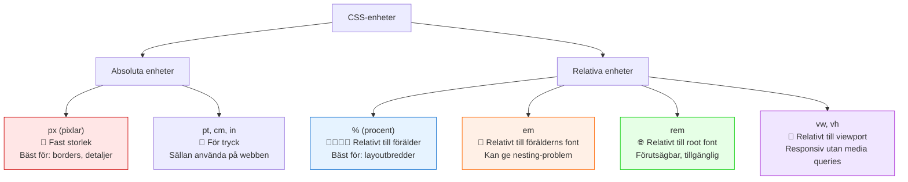

# CSS-enheter: Absoluta och relativa mått

Att förstå olika CSS-enheter är avgörande för att skapa flexibla, responsiva och tillgängliga webbsidor. CSS erbjuder många olika enheter för att mäta storlekar, avstånd och positioner. Att välja rätt enhet för rätt situation gör skillnaden mellan en sida som fungerar bra på alla enheter och en som bara fungerar på en specifik skärmstorlek.

> **Motivation:**  
> Med kunskap om olika CSS-enheter kan du skapa webbsidor som anpassar sig till användarens inställningar, fungerar på alla enheter och är tillgängliga för alla användare. Du lär dig när du ska använda pixlar, procent, rem eller andra enheter.

---

## Kategorier av CSS-enheter

CSS-enheter delas in i två huvudkategorier:

1. **Absoluta enheter (absolute units):** Har en fast storlek som inte ändras baserat på andra element eller inställningar.
2. **Relativa enheter (relative units):** Storlek som beräknas i förhållande till något annat (t.ex. förälderelementet, fontstorlek eller viewport).

---

## Absoluta enheter

Absoluta enheter har alltid samma storlek, oavsett kontext. De är mest användbara för media som har en känd, fast storlek (som tryck).

### Pixlar (px) – Den vanligaste absoluta enheten

- **Vad det är:** En pixel på skärmen. I CSS är 1px definierat som 1/96 av en tum.
- **Användning:** Borders, små detaljer, exakt positionering.

```css
.border-example {
  border: 2px solid #333;  /* Exakt 2 pixlar bred border */
  box-shadow: 0 4px 8px rgba(0,0,0,0.1);  /* Skugga med pixlar */
}

.precise-spacing {
  margin-top: 24px;  /* Exakt avstånd */
}
```

### Andra absoluta enheter (sällan använda på webben)

```css
/* Dessa används främst för tryck, inte webben */
.print-example {
  width: 2in;    /* Tum (inches) */
  height: 5cm;   /* Centimeter */
  font-size: 12pt; /* Punkter (points) */
}
```

> **Tips:** Använd främst `px` bland de absoluta enheterna för webbutveckling. De andra är mest relevanta för tryckta medier.

---

## Relativa enheter

Relativa enheter anpassar sig till sin kontext, vilket gör dem perfekta för responsiv design och tillgänglighet.

### Procent (%) – Relativt till förälderelement

- **Vad det är:** Procent av förälderelement motsvarande egenskap.
- **Användning:** Bredder i responsiva layouter, höjder, positionering.

```css
.container {
  width: 80%;        /* 80% av förälderns bredd */
  max-width: 1200px; /* Men aldrig mer än 1200px */
  margin: 0 auto;    /* Centrerar containern */
}

.sidebar {
  width: 25%;        /* En fjärdedel av förälderns bredd */
  float: left;
}

.main-content {
  width: 75%;        /* Tre fjärdedelar av förälderns bredd */
  float: right;
}
```

### Em (em) – Relativt till förälderns fontstorlek

- **Vad det är:** 1em = förälderelement `font-size`.
- **Problem:** Kan ge oväntade resultat vid nesting (kapsling).
- **Användning:** Padding och margin som ska skala med text.

```css
.parent {
  font-size: 20px;
}

.child {
  font-size: 1.5em;    /* 1.5 × 20px = 30px */
  padding: 0.5em;      /* 0.5 × 30px = 15px (baserat på EGEN font-size!) */
  margin-bottom: 1em;  /* 1 × 30px = 30px */
}
```

### Root Em (rem) – Relativt till rotfontstorlek

- **Vad det är:** 1rem = root-elementets (`<html>`) `font-size` (standard 16px).
- **Fördelar:** Förutsägbar, respekterar användarinställningar, ingen nesting-problematik.
- **Användning:** Fontstorlekar, padding, margin, spacing.

```css
html {
  font-size: 16px; /* Bas-fontstorlek (ofta webbläsarens standard) */
}

.heading {
  font-size: 2rem;     /* 2 × 16px = 32px */
  margin-bottom: 1rem; /* 1 × 16px = 16px */
}

.small-text {
  font-size: 0.875rem; /* 0.875 × 16px = 14px */
  padding: 0.5rem;     /* 0.5 × 16px = 8px */
}
```

### Viewport-enheter – Relativt till skärmstorlek

Dessa enheter baseras på webbläsarfönstrets (viewport) dimensioner:

- **vw (viewport width):** 1vw = 1% av viewport-bredden
- **vh (viewport height):** 1vh = 1% av viewport-höjden  
- **vmin:** 1vmin = 1% av den *mindre* dimensionen (bredd eller höjd)
- **vmax:** 1vmax = 1% av den *större* dimensionen

```css
.hero-section {
  height: 100vh;        /* Tar upp hela skärmhöjden */
  background: linear-gradient(45deg, #667eea 0%, #764ba2 100%);
}

.full-width-text {
  font-size: 5vw;       /* Text som skalas med skärmbredd */
  max-font-size: 3rem;  /* Men inte större än 3rem */
}

.square {
  width: 50vmin;        /* Kvadrat som alltid får plats på skärmen */
  height: 50vmin;
  background: coral;
}
```

---

## Jämförelse av enheter: Visualisering



*Diagram: Översikt över CSS-enheter och deras användningsområden.*

---

## Praktiska exempel och användningsfall

### Exempel 1: Responsiv typografi med rem

```css
/* Bas-fontstorlek som användaren kan ändra */
html {
  font-size: 16px; /* Fallback för äldre webbläsare */
  font-size: 1rem; /* Respekterar användarens inställningar */
}

/* Typografisk skala med rem */
.text-xs { font-size: 0.75rem; }  /* 12px */
.text-sm { font-size: 0.875rem; } /* 14px */
.text-base { font-size: 1rem; }   /* 16px */
.text-lg { font-size: 1.125rem; } /* 18px */
.text-xl { font-size: 1.25rem; }  /* 20px */
.text-2xl { font-size: 1.5rem; }  /* 24px */
.text-3xl { font-size: 1.875rem; }/* 30px */

/* Spacing som följer samma skala */
.spacing-sm { margin: 0.5rem; }   /* 8px */
.spacing-md { margin: 1rem; }     /* 16px */
.spacing-lg { margin: 1.5rem; }   /* 24px */
```

### Exempel 2: Flexibel layout med procent och max-width

```css
.page-layout {
  width: 100%;           /* Full bredd på små skärmar */
  max-width: 1200px;     /* Begränsa på stora skärmar */
  margin: 0 auto;        /* Centrera */
  padding: 0 5%;         /* Responsive padding */
}

.two-column {
  width: 100%;
  overflow: hidden;      /* Clearfix för floats */
}

.main-content {
  width: 65%;            /* 65% av containerns bredd */
  float: left;           /* Placera till vänster */
  padding-right: 2rem;   /* Avstånd till sidebar */
}

.sidebar {
  width: 30%;            /* 30% av containerns bredd */
  float: right;          /* Placera till höger */
}
```

### Exempel 3: Viewport-enheter för hero-sektion

```css
.hero {
  height: 100vh;               /* Full skärmhöjd */
  background: linear-gradient(135deg, #667eea 0%, #764ba2 100%);
  text-align: center;
  padding-top: 20vh;           /* Padding i viewport-enheter */
}

.hero-title {
  font-size: 5vw;              /* Text som skalas med skärmbredd */
  color: white;
  margin: 0;
  max-width: 800px;            /* Begränsa textbredden */
  margin: 0 auto;              /* Centrera texten */
}

.hero-subtitle {
  font-size: 2.5vw;
  margin-top: 1rem;
  opacity: 0.9;
  color: white;
}
```

### Exempel 4: Kombinera enheter för optimal design

```css
.card {
  width: 100%;                    /* Full bredd i container */
  max-width: 400px;               /* Max-bredd i px */
  padding: 1.5rem;                /* Padding i rem */
  margin-bottom: 2rem;            /* Margin i rem */
  border: 1px solid #e0e0e0;      /* Border i px */
  border-radius: 0.5rem;          /* Border-radius i rem */
  box-shadow: 0 2px 10px rgba(0,0,0,0.1); /* Skugga i px */
  float: left;                    /* För att placera kort bredvid varandra */
  margin-right: 2%;               /* Margin i procent för responsive avstånd */
}

.card-title {
  font-size: 1.25rem;             /* Titel i rem */
  margin-bottom: 0.75rem;         /* Margin i rem */
  color: #333;
}

.card-text {
  font-size: 1rem;                /* Text i rem */
  line-height: 1.6;               /* Unitless line-height */
  color: #666;
}
```

---

## Grundläggande övningar med CSS-enheter

Nu är det dags att praktisera! Här följer övningar som fokuserar på att förstå och använda olika CSS-enheter i verkliga situationer.

---

## Bästa praxis för CSS-enheter

### 1. Typografi och spacing

```css
/* ✅ Rekommenderat: rem för text och spacing */
.good-typography {
  font-size: 1.125rem;      /* 18px om root är 16px */
  line-height: 1.6;         /* Unitless för bästa resultat */
  margin-bottom: 1.5rem;    /* 24px spacing */
  padding: 1rem 1.5rem;     /* Padding som skalas med text */
}
```

### 2. Layouter och containrar

```css
/* ✅ Rekommenderat: procent med max-width */
.good-layout {
  width: 100%;              /* Flexibel bredd */
  max-width: 1200px;        /* Begränsa på stora skärmar */
  margin: 0 auto;           /* Centrera */
  padding: 0 5%;            /* Responsive padding */
}
```

### 3. Detaljer och borders

```css
/* ✅ Rekommenderat: px för exakta detaljer */
.good-details {
  border: 1px solid #ccc;   /* Exakt border */
  box-shadow: 0 2px 4px rgba(0,0,0,0.1); /* Exakt skugga */
  border-radius: 0.25rem;   /* Rundade hörn i rem */
}
```

### 4. Responsiv design med viewport-enheter

```css
/* ✅ Rekommenderat: viewport-enheter för responsiv design */
.good-responsive {
  font-size: 3vw;              /* Text som skalas med skärmbredd */
  padding: 4vw 2vw;            /* Responsiv padding */
  width: 90%;                  /* Flexibel bredd */
  max-width: 800px;            /* Men begränsa på stora skärmar */
}
```

---

## Vanliga misstag och hur man undviker dem

### ❌ Misstag 1: Använd em för allt

```css
/* Problematiskt: em kan ge oväntade resultat vid nesting */
.parent {
  font-size: 1.2em;
}
.child {
  font-size: 1.2em; /* Blir 1.2 × 1.2 = 1.44× större än förväntat */
}
```

### ✅ Lösning: Använd rem för förutsägbarhet

```css
.parent {
  font-size: 1.2rem; /* 1.2 × root font-size */
}
.child {
  font-size: 1.2rem; /* Samma som parent, förutsägbart */
}
```

### ❌ Misstag 2: Fasta höjder med vh på mobil

```css
/* Problematiskt: mobila webbläsare ändrar vh när UI visas/döljs */
.mobile-hero {
  height: 100vh; /* Kan orsaka scrollbars på mobil */
}
```

### ✅ Lösning: Använd min-height istället

```css
.mobile-hero {
  min-height: 100vh;     /* Minst full höjd, undviker scrollbars */
  padding: 2rem 0;       /* Säkerställ lite padding */
}
```

---

## Praktiska övningar

### Övning 1: Typografisk skala med rem

Skapa en typografisk skala som respekterar användarinställningar:

```html
<div class="typography-example">
  <h1 class="text-3xl">Stor rubrik</h1>
  <h2 class="text-2xl">Mellan rubrik</h2>
  <h3 class="text-xl">Liten rubrik</h3>
  <p class="text-base">Vanlig brödtext med bra läsbarhet.</p>
  <small class="text-sm">Liten text för fotnoter.</small>
</div>
```

```css
/* Din uppgift: Skapa en sammanhängande typografisk skala */
.text-sm { 
  font-size: /* 0.875rem (14px om root är 16px) */; 
}
.text-base { 
  font-size: 1rem; /* 16px om root är 16px */
  line-height: 1.6; /* Bra radavstånd */
}
.text-xl { 
  font-size: /* 1.25rem (20px) */; 
}
.text-2xl { 
  font-size: /* 1.5rem (24px) */; 
}
.text-3xl { 
  font-size: /* 1.875rem (30px) */; 
}

/* Bonusuppgift: Lägg till margin-bottom som skalas med textstorleken */
```

### Övning 2: Responsiv layout med procent och float

Skapa en tvåkolumnslayout som fungerar på olika skärmstorlekar:

```html
<div class="page-wrapper">
  <div class="container">
    <main class="main-content">
      <h1>Huvudinnehåll</h1>
      <p>Detta innehåll ska ta upp större delen av utrymmet...</p>
    </main>
    <aside class="sidebar">
      <h2>Sidebar</h2>
      <p>Extra information som tar mindre plats...</p>
    </aside>
    <div class="clearfix"></div>
  </div>
</div>
```

```css
/* Din uppgift: Gör denna layout responsiv med procent och float */
.container {
  width: /* 90% för små skärmar */;
  max-width: /* 1200px för stora skärmar */;
  margin: /* centrera med auto */;
  padding: /* 2rem i rem-enheter */;
}

.main-content {
  width: /* 70% av containerns bredd */;
  float: /* placera till vänster */;
  padding-right: /* 2rem för avstånd till sidebar */;
}

.sidebar {
  width: /* 25% av containerns bredd */;
  float: /* placera till höger */;
  background-color: #f8f9fa;
  padding: /* 1rem */;
}

.clearfix {
  clear: both; /* Rensa floats */
}
```

### Övning 3: Viewport-enheter för hero-sektion

Skapa en hero-sektion som anpassar sig till skärmstorlek:

```html
<section class="hero">
  <div class="hero-content">
    <h1 class="hero-title">Välkommen till vår webbsida</h1>
    <p class="hero-text">En underrubrik som beskriver vad vi gör</p>
    <button class="hero-button">Kom igång</button>
  </div>
</section>
```

```css
/* Din uppgift: Använd viewport-enheter för responsiv hero-sektion */
.hero {
  height: /* 100vh för full skärmhöjd */;
  background: linear-gradient(135deg, #667eea 0%, #764ba2 100%);
  text-align: center;
  padding-top: /* 25vh för att centrera innehållet */;
  color: white;
}

.hero-title {
  font-size: /* 6vw för text som skalas med skärmbredd */;
  margin: 0 0 1rem 0;
  max-width: /* 800px för att begränsa på stora skärmar */;
  margin-left: auto;
  margin-right: auto;
}

.hero-text {
  font-size: /* 2.5vw för mindre text */;
  margin-bottom: /* 2rem */;
  opacity: 0.9;
}

.hero-button {
  padding: /* 1rem 2rem i rem */;
  font-size: /* 1.125rem */;
  background: white;
  color: #667eea;
  border: none;
  border-radius: /* 0.5rem */;
}
```

### Övning 4: Kort-layout med olika enheter

Skapa kort som använder olika enheter för optimal design:

```html
<div class="cards-container">
  <div class="card">
    <h3 class="card-title">Kort 1</h3>
    <p class="card-text">Beskrivning av innehåll i detta kort.</p>
  </div>
  <div class="card">
    <h3 class="card-title">Kort 2</h3>
    <p class="card-text">Beskrivning av innehåll i detta kort.</p>
  </div>
  <div class="card">
    <h3 class="card-title">Kort 3</h3>
    <p class="card-text">Beskrivning av innehåll i detta kort.</p>
  </div>
</div>
```

```css
/* Din uppgift: Kombinera olika enheter för optimal design */
.cards-container {
  width: /* 100% */;
  max-width: /* 1200px */;
  margin: /* 0 auto för centrering */;
  padding: /* 2rem */;
  overflow: hidden; /* Clearfix för floats */
}

.card {
  width: /* 30% för tre kort per rad */;
  float: left;
  margin-right: /* 5% för avstånd mellan kort */;
  margin-bottom: /* 2rem */;
  padding: /* 1.5rem i rem */;
  border: /* 1px solid #e0e0e0 i px */;
  border-radius: /* 0.5rem */;
  box-shadow: /* 0 2px 4px rgba(0,0,0,0.1) i px */;
}

.card:nth-child(3n) {
  margin-right: 0; /* Ta bort margin från varje tredje kort */
}

.card-title {
  font-size: /* 1.25rem */;
  margin-bottom: /* 0.75rem */;
  color: #333;
}

.card-text {
  font-size: /* 1rem */;
  line-height: /* 1.6 unitless */;
  color: #666;
  margin: 0;
}
```

### Övning 5: Navigationsbar med procent och rem

Skapa en navigationsbar som kombinerar olika enheter:

```html
<nav class="navbar">
  <div class="nav-container">
    <div class="nav-logo">Min Webbsida</div>
    <ul class="nav-menu">
      <li class="nav-item"><a href="#" class="nav-link">Hem</a></li>
      <li class="nav-item"><a href="#" class="nav-link">Om oss</a></li>
      <li class="nav-item"><a href="#" class="nav-link">Tjänster</a></li>
      <li class="nav-item"><a href="#" class="nav-link">Kontakt</a></li>
    </ul>
  </div>
</nav>
```

```css
/* Din uppgift: Skapa en responsiv navbar */
.navbar {
  width: /* 100% */;
  background-color: #333;
  padding: /* 1rem 0 i rem */;
}

.nav-container {
  width: /* 90% */;
  max-width: /* 1200px */;
  margin: /* 0 auto */;
  overflow: hidden; /* Clearfix */
}

.nav-logo {
  float: left;
  color: white;
  font-size: /* 1.5rem */;
  font-weight: bold;
  padding: /* 0.5rem 0 */;
}

.nav-menu {
  float: right;
  list-style: none;
  margin: 0;
  padding: 0;
}

.nav-item {
  float: left;
  margin-left: /* 2rem */;
}

.nav-link {
  color: white;
  text-decoration: none;
  padding: /* 0.5rem 1rem */;
  display: block;
  font-size: /* 1rem */;
}

.nav-link:hover {
  background-color: #555;
  border-radius: /* 0.25rem */;
}
```

---

## Sammanfattning

- **Absoluta enheter** (`px`) är bäst för exakta detaljer som borders, skuggor och små justeringar.
- **Relativa enheter** (`rem`, `%`, `vw/vh`) skapar flexibla, responsiva och tillgängliga designer.
- **rem** är ofta det bästa valet för typografi och spacing eftersom det är förutsägbart och respekterar användarinställningar.
- **Procent** är perfekt för layoutbredder i kombination med `max-width` och `margin: 0 auto` för centrering.
- **Viewport-enheter** (`vw`, `vh`) gör det möjligt att skapa element som skalas med skärmstorlek.
- **Float och clearfix** är grundläggande tekniker för att skapa layouter med procent-baserade bredder.
- Att kombinera olika enheter (px för borders, rem för text, % för bredder) ger optimal flexibilitet och kontroll.

Genom att välja rätt enhet för varje situation och förstå hur de fungerar tillsammans skapar du webbsidor som fungerar bra för alla användare på alla enheter.

---

*I nästa avsnitt tittar vi på boxmodellen, som beskriver hur utrymme hanteras runt HTML-element.*
