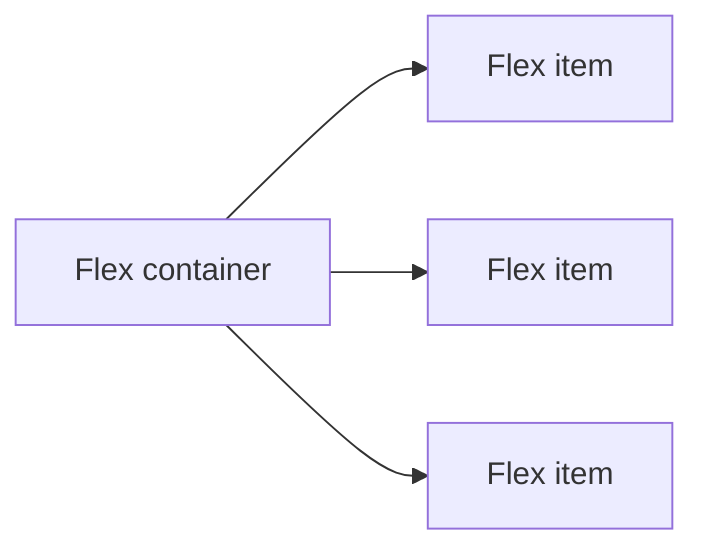
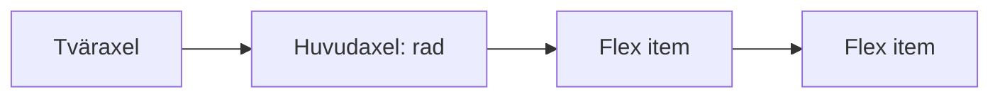
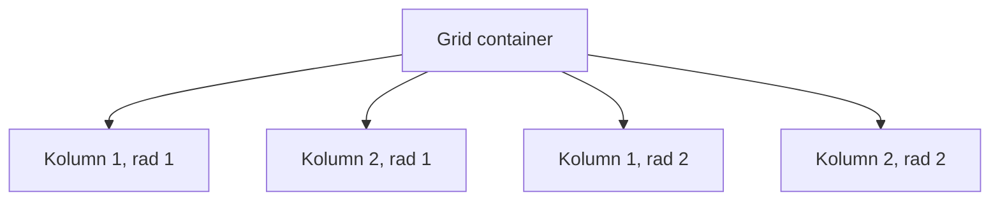

# Flexbox och CSS Grid

När HTML-element följer sidans vanliga flöde hamnar blockelement under varandra. Det är en bra start, men en navigering, en rad med knappar eller flera kort behöver ofta en tydligare layout. Då använder vi **Flexbox** (Flexible Box Layout) eller **CSS Grid** (rutnatslayout).

> **Mål:**
> Kunna välja mellan Flexbox och Grid, skapa en enkel layout med `gap` och felsöka om en layoutregel hamnar på fel element.

## Börja med att förutsäga

Titta på HTML-koden. Kortens förälder har klassen `cards`. Vilken CSS-regel måste ligga på `.cards` för att korten ska hamna bredvid varandra?

<!-- playground:start -->

```html
<section class="cards">
  <article>Första kortet</article>
  <article>Andra kortet</article>
  <article>Tredje kortet</article>
</section>
```

```css
.cards {
  display: flex;
  gap: 1rem;
}

article {
  padding: 1rem;
  border: 2px solid #176b87;
  background: #e7f6f2;
}
```

<!-- playground:end -->

Ändra `flex` till `block`, sedan tillbaka till `flex`. Prova också att ändra `gap`. Regeln ligger på föräldern eftersom den bestämmer hur barnen placeras.

---

## Flexbox: en riktning i taget

Flexbox passar när du vill styra innehåll längs **en axel**: antingen en rad eller en kolumn. Föräldern blir en **flex container** när den får `display: flex`. Dess direkta barn blir **flex items**.



Standardriktningen är en rad. Då går huvudaxeln från vänster till höger och tväraxeln uppifrån och ned.



### De viktigaste reglerna

```css
.toolbar {
  display: flex;
  flex-direction: row;
  justify-content: space-between;
  align-items: center;
  gap: 1rem;
}
```

- `display: flex` aktiverar Flexbox på föräldern.
- `flex-direction` anger riktning: `row` är standard och `column` staplar barnen.
- `justify-content` fördelar barnen längs huvudaxeln.
- `align-items` justerar barnen längs tväraxeln.
- `gap` skapar avstånd mellan barnen. Använd det hellre än att ge varje barn egen `margin` för samma mellanrum.

**Prova själv:** Byt från `row` till `column`. Vilken egenskap centrerar nu innehållet vågrätt: `justify-content` eller `align-items`?

<!-- playground:start -->

```html
<nav class="toolbar" aria-label="Exempelnavigering">
  <a href="#start">Start</a>
  <a href="#about">Om sidan</a>
  <a href="#contact">Kontakt</a>
</nav>
```

```css
.toolbar {
  display: flex;
  justify-content: space-between;
  align-items: center;
  gap: 1rem;
  padding: 1rem;
  background: #f7e8d0;
}

.toolbar a {
  color: #1b4965;
}
```

<!-- playground:end -->

<details>
<summary>Svar</summary>

När riktningen är `column` går huvudaxeln uppifrån och ned. `align-items` justerar därför innehållet vågrätt.

</details>

### När passar Flexbox?

Använd Flexbox för exempelvis en navigering, en knappgrupp eller en rad där innehållet ska fördelas och justeras i en riktning. Fråga dig: *Behöver jag främst styra en rad eller en kolumn?* Om svaret är ja är Flexbox ofta ett bra val.

---

## CSS Grid: rader och kolumner samtidigt

CSS Grid passar när du vill styra **två dimensioner** samtidigt: både rader och kolumner. Föräldern blir en **grid container** med `display: grid`. De direkta barnen placeras i rutnätets celler.



```css
.gallery {
  display: grid;
  grid-template-columns: 1fr 1fr;
  gap: 1rem;
}
```

- `display: grid` aktiverar Grid på föräldern.
- `grid-template-columns` anger kolumnerna.
- `1fr` betyder en andel av det lediga utrymmet. `1fr 1fr` skapar två lika breda kolumner.
- `gap` skapar avstånd mellan både rader och kolumner.

**Prova själv:** Ändra `1fr 1fr` till `1fr 2fr`. Vilket kort blir bredast? Prova sedan `repeat(3, 1fr)` och se hur många kolumner du får.

<!-- playground:start -->

```html
<section class="gallery">
  <article>HTML</article>
  <article>CSS</article>
  <article>JavaScript</article>
  <article>Tillganglighet</article>
</section>
```

```css
.gallery {
  display: grid;
  grid-template-columns: 1fr 1fr;
  gap: 1rem;
}

.gallery article {
  min-height: 4rem;
  padding: 1rem;
  background: #dbeafe;
  border: 2px solid #1d4ed8;
}
```

<!-- playground:end -->

<details>
<summary>Svar</summary>

I `1fr 2fr` får den andra kolumnen två delar av det lediga utrymmet och blir därför bredast. `repeat(3, 1fr)` skapar tre lika breda kolumner.

</details>

### När passar Grid?

Använd Grid när flera element ska få en gemensam struktur i rader och kolumner, till exempel en samling kort eller sidans större innehållsområden. Fråga dig: *Behöver både rader och kolumner styras?* Om svaret är ja är Grid ofta ett bra val.

---

## Välj teknik

| Situation | Bra start |
| --- | --- |
| Länkar i en navigering | Flexbox |
| Knappar i en rad eller kolumn | Flexbox |
| Kort som ska ligga i kolumner och nya rader | Grid |
| Sidans innehållsområden i ett rutnät | Grid |

Flexbox och Grid går också att kombinera. En sida kan ha Grid för sina kort, medan innehållet i varje kort använder Flexbox för att placera en rubrik och en knapp. Börja med den teknik som löser det tydligaste layoutproblemet.

---

## Felsök: varför händer inget?

I koden nedan ska två kort placeras sida vid sida, men de hamnar under varandra. Hitta felet innan du öppnar lösningen.

```html
<section class="card-list">
  <article class="card">Första kortet</article>
  <article class="card">Andra kortet</article>
</section>
```

```css
.card {
  display: flex;
  gap: 1rem;
}
```

<details>
<summary>Lösningsförslag</summary>

`display: flex` och `gap` ska ligga på föräldern `.card-list`, eftersom den styr placeringen av sina barn.

```css
.card-list {
  display: flex;
  gap: 1rem;
}
```

</details>

När en layoutregel inte verkar fungera, kontrollera först:

1. Har rätt förälder fått `display: flex` eller `display: grid`?
2. Är elementen du vill placera direkta barn till containern?
3. Har du skrivit egenskapen på rätt element?

---

## Tillganglig layout

Flexbox och Grid ändrar bara det visuella utseendet. HTML ska fortfarande komma i en logisk ordning för den som använder tangentbord eller skärmläsare.

### Uppgift: kontrollera ordningen

1. Skapa en liten sida med en rubrik, en navigering och en huvuddel i den ordningen i HTML.
2. Använd Grid eller Flexbox för att ändra sidans visuella layout på bred skärm.
3. Tryck på `Tab` i webbläsaren. Fokus ska följa samma meningsfulla ordning som innehållet i HTML.
4. Ändra inte ordningen med CSS-egenskapen `order` för att bara få en snyggare layout. Ändra i stället HTML om innehållets verkliga ordning behöver ändras.

**Checkpoint:** En tangentbordsanvändare ska möta sidans innehåll i en logisk ordning, även om layouten ser annorlunda ut på en stor skärm.

---

## Sammanfattning

- Flexbox styr innehåll i en riktning: rad eller kolumn.
- CSS Grid styr rader och kolumner samtidigt.
- Lägg `display`, `gap` och övriga layoutregler på containern som styr sina direkta barn.
- Välj först teknik utifrån layoutproblemet och kontrollera sedan resultatet i webbläsaren.
- Visuell placering får inte skapa en ologisk fokus- eller läsordning.
