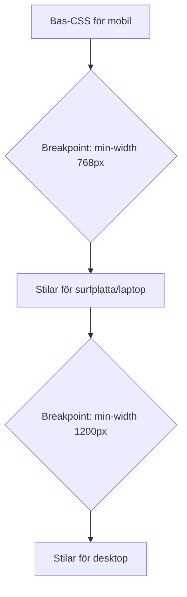

# Responsiv design med Media Queries

Idag surfar människor på webben från en mängd olika enheter: stora datorskärmar, bärbara datorer, surfplattor och mobiler av alla storlekar. En modern webbplats måste kunna anpassa sin layout och sitt innehåll för att se bra ut och vara användbar på alla dessa skärmar. Detta kallas **responsiv web design (responsive web design, RWD)**.

> **Motivation:**  
> Responsiv design gör att din webbplats fungerar och ser bra ut på alla enheter, vilket förbättrar användarupplevelsen och gör sidan mer tillgänglig.

---

## Varför responsiv design?

- **Användarupplevelse:** En sida som är designad för en stor skärm blir ofta svår att använda på en mobil (pyttesmå texter, knappar som är svåra att träffa, behov av att zooma och panorera). Responsiv design ger en optimerad upplevelse oavsett enhet.
- **SEO:** Google prioriterar mobilvänliga webbplatser i sina sökresultat.
- **Underhåll:** Istället för att bygga och underhålla separata webbplatser för dator och mobil (vilket var vanligt förr), har man en enda kodbas som anpassar sig.

---

## Nyckelkomponenter i responsiv design

1. **Flexibel grid-baserad layout:** Använd relativa enheter (som procent `%`, `fr` i CSS Grid eller Flexbox) istället för fasta pixelvärden för att skapa kolumner och layoutelement som kan ändra storlek.
2. **Flexibla bilder och media:** Se till att bilder och andra mediafiler skalar ner proportionerligt för att passa mindre skärmar, t.ex. med `max-width: 100%;`.
3. **Media Queries:** Använd CSS Media Queries för att applicera olika stilregler vid olika skärmstorlekar eller andra enhetsegenskaper.

---

## Viewport meta-taggen

Det allra första steget för att göra en sida responsiv är att inkludera **viewport meta-taggen** i HTML-dokumentets `<head>`:

```html
<meta name="viewport" content="width=device-width, initial-scale=1.0">
```

- **Vad den gör:** Talar om för webbläsaren (särskilt på mobila enheter) hur den ska hantera sidans dimensioner och skalning.
    - `width=device-width`: Sätter sidans bredd till att vara densamma som enhetens skärmbredd.
    - `initial-scale=1.0`: Sätter den initiala zoomnivån till 100% (ingen zoom från start).
- **Utan denna tagg** kommer mobila webbläsare ofta att försöka visa sidan som om den vore på en datorskärm och sedan förminska den, vilket leder till oläslig text och dålig användarupplevelse.

---

## Media Queries: Anpassa stilar för olika skärmar

Media Queries är kärnan i hur vi applicerar olika CSS-regler baserat på enhetens egenskaper. Den vanligaste egenskapen att titta på är skärmens bredd.

- **Syntax:** En Media Query skrivs med `@media` följt av en eller flera villkor inom parentes. CSS-reglerna som ska gälla *endast* när villkoret är uppfyllt placeras inom måsvingar (`{ }`).

```css
/* Standardstilar (gäller alltid, ofta för mindre skärmar först – mobile-first design) */
body {
  font-size: 16px;
}
.container {
  width: 95%; /* Smalare på små skärmar */
  margin: 0 auto;
}

/* Stilar som appliceras ENDAST när skärmbredden är 768px ELLER MER */
@media (min-width: 768px) {
  body {
    font-size: 18px; /* Lite större text på större skärmar */
  }
  .container {
    width: 80%; /* Bredare container på större skärmar */
    max-width: 960px; /* Men inte bredare än 960px */
  }
  /* Fler regler för layout, t.ex. visa element sida vid sida */
}

/* Stilar som appliceras ENDAST när skärmbredden är 1200px ELLER MER */
@media (min-width: 1200px) {
  body {
    background-color: lightblue;
  }
  /* Ännu fler anpassningar för riktigt stora skärmar */
}
```

- **Vanliga villkor:**
    - `min-width`: Applicerar reglerna när skärmbredden är *minst* det angivna värdet.
    - `max-width`: Applicerar reglerna när skärmbredden är *högst* det angivna värdet.
    - Man kan kombinera villkor med `and`, `or`, `not`.
    - Man kan också testa andra egenskaper som `orientation` (portrait/landscape), `resolution`, etc.

- **Breakpoints (brytpunkter):** De specifika skärmbredder där layouten eller stilarna ändras (t.ex. `768px`, `1200px` i exemplet ovan) kallas **breakpoints**. Valet av breakpoints beror på designen och innehållet, inte nödvändigtvis på specifika enheters exakta dimensioner. Vanliga breakpoints kan vara runt t.ex. 600px, 768px, 992px, 1200px.

---

## Relativa enheter

För att skapa flexibla och responsiva designer är det ofta bättre att använda **relativa CSS-enheter** istället för fasta (`px`):

- `%` (procent): Relativt till förälderelementets motsvarande egenskap (t.ex. `width: 50%;` tar upp halva förälderns bredd).
- `em`: Relativt till *förälderelementets* `font-size`.
- `rem` (root em): Relativt till **rot-elementets** (`<html>`) `font-size`. **Rekommenderas ofta** för textstorlekar och ibland för padding/margin, eftersom det gör det enkelt att skala hela gränssnittet genom att bara ändra rot-fontstorleken (vilket också respekterar användarens webbläsarinställningar).
- `vw` (viewport width): 1vw är 1% av webbläsarfönstrets bredd.
- `vh` (viewport height): 1vh är 1% av webbläsarfönstrets höjd.

Genom att använda dessa enheter kan element och text anpassa sin storlek mer flytande när fönsterstorleken ändras.

---

## Illustration: Media Queries och breakpoints



---

## Sammanfattning

- Responsiv design handlar om att skapa webbplatser som fungerar bra på alla enheter.
- Detta uppnås genom flexibla layouter, flexibla bilder och framför allt **Media Queries**.
- Glöm inte **viewport meta-taggen** i HTML:ens `<head>`.
- Media Queries (`@media`) låter oss applicera olika CSS-regler vid specifika **breakpoints** (oftast baserat på `min-width` eller `max-width`).
- Att använda **relativa enheter** som `rem` och `%` bidrar också till flexibiliteten.

I nästa avsnitt tittar vi specifikt på mobile-first design
