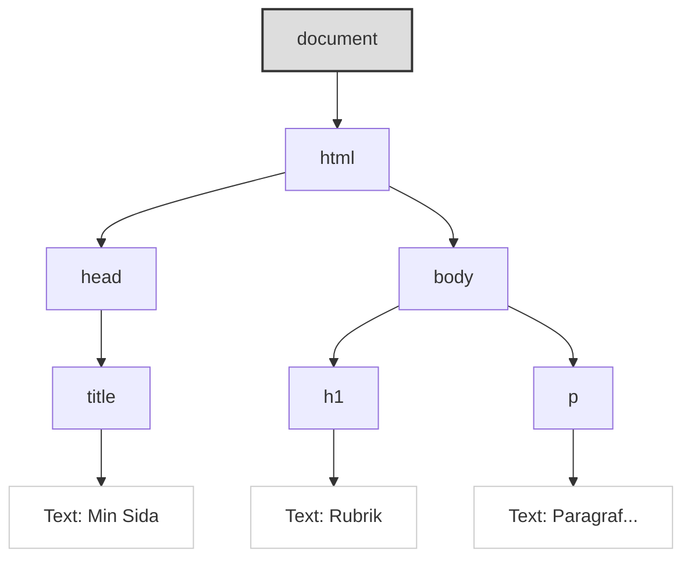

# DOM-manipulation och Events: Interagera med Sidan

JavaScript blir riktigt kraftfullt när vi använder det för att interagera med och ändra innehållet och strukturen på vår HTML-sida *efter* att den har laddats. Detta görs genom **DOM (Document Object Model)**. Vi behöver också kunna reagera på användarens handlingar, vilket vi gör genom att hantera **Events (Händelser)**.

**Mål:** Förstå vad DOM är, lära oss hur man väljer ut (selectar) HTML-element med JavaScript, hur man manipulerar (ändrar) deras innehåll, attribut och stilar, samt hur man kopplar händelselyssnare (`addEventListener`) för att reagera på användarinteraktioner som klick.

## Vad är DOM (Document Object Model)?

När en webbläsare laddar en HTML-sida skapar den en **modell** av sidans struktur i minnet. Denna modell kallas DOM. DOM representerar HTML-dokumentet som ett **träd av objekt (noder)**, där varje HTML-element (`<body>`, `<h1>`, `<p>`, `<div>`, etc.), textinnehåll och attribut blir ett objekt i trädet.


*Diagram: Förenklat exempel på DOM-trädet för en enkel HTML-sida.*

**Varför är DOM viktigt?** JavaScript kan komma åt och **manipulera** detta DOM-träd. Det betyder att vi med JavaScript kan:

*   Hitta specifika HTML-element.
*   Ändra deras textinnehåll.
*   Ändra deras attribut (som `src` på en bild eller `href` på en länk).
*   Ändra deras CSS-stilar.
*   Lägga till nya element.
*   Ta bort befintliga element.

Allt detta kan göras *utan att behöva ladda om sidan*. Det är grunden för dynamiska webbapplikationer.

## Välja Element från DOM

För att kunna manipulera ett element måste vi först "hitta" det i DOM-trädet. Detta görs med olika metoder på det globala `document`-objektet:

**Moderna Metoder (Rekommenderas):**

*   **`document.querySelector(cssSelektor)`:**
    *   Returnerar det **första** elementet i dokumentet som matchar den angivna CSS-selektorn (samma syntax som i CSS, t.ex. `#minId`, `.minKlass`, `p`, `nav > ul > li`).
    *   Om ingen matchning hittas returneras `null`.
    *   **Mycket flexibel och användbar!**
        ```javascript
        const mainHeading = document.querySelector('#main-title'); // Väljer element med id="main-title"
        const firstButton = document.querySelector('.btn'); // Väljer FÖRSTA elementet med class="btn"
        const navLink = document.querySelector('nav ul li a'); // Väljer första länken i en lista i nav
        ```

*   **`document.querySelectorAll(cssSelektor)`:**
    *   Returnerar en **`NodeList`** (en samling som liknar en array) med **alla** element i dokumentet som matchar den angivna CSS-selektorn.
    *   Om inga matchningar hittas returneras en tom `NodeList`.
    *   Perfekt när du behöver arbeta med flera element av samma typ eller klass.
        ```javascript
        const allParagraphs = document.querySelectorAll('p');
        const allButtons = document.querySelectorAll('.btn');

        // Man kan iterera över en NodeList med forEach
        allButtons.forEach(button => {
          console.log("Hittade en knapp!");
          // Gör något med varje knapp här
        });
        ```

**Äldre Metoder (Fortfarande vanliga, men mindre flexibla):**

*   `document.getElementById(id)`: Returnerar elementet med det angivna ID:t (eller `null`).
*   `document.getElementsByClassName(klassnamn)`: Returnerar en **`HTMLCollection`** (en *live*-samling, liknar array men inte exakt samma) med alla element som har den angivna klassen.
*   `document.getElementsByTagName(taggnamn)`: Returnerar en **`HTMLCollection`** med alla element av den angivna taggtypen (t.ex. 'p', 'div').

**Skillnad `NodeList` vs `HTMLCollection`:** En `NodeList` (från `querySelectorAll`) är oftast statisk, medan en `HTMLCollection` (från `getElementsByClassName/TagName`) är *live*, vilket betyder att den uppdateras automatiskt om DOM ändras. `NodeList` har också `forEach`-metoden inbyggd, vilket `HTMLCollection` ofta saknar (man behöver konvertera den till en array först för att använda `forEach`). För enkelhetens skull är `querySelector` och `querySelectorAll` oftast att föredra.

## Manipulera Element

När du väl har valt ett eller flera element och sparat dem i en variabel, kan du ändra dem:

*   **Ändra Textinnehåll:**
    *   `element.textContent`: Hämtar eller sätter textinnehållet för ett element och dess ättlingar, *utan* HTML-taggar. Snabb och säker.
    *   `element.innerText`: Liknar `textContent`, men tar hänsyn till CSS-styling (renderat utseende) och inkluderar inte text från dolda element. Används mer sällan.
        ```javascript
        const heading = document.querySelector('h1');
        console.log(heading.textContent); // Visar nuvarande text
        heading.textContent = "Ny Rubrik från JS!"; // Ändrar texten
        ```

*   **Ändra HTML-innehåll:**
    *   `element.innerHTML`: Hämtar eller sätter HTML-koden *inuti* ett element. Kraftfullt, men **var försiktig!** Om du sätter `innerHTML` med text som kommer från en användare utan att sanera den, öppnar du upp för **Cross-Site Scripting (XSS)**-attacker.
        ```javascript
        const contentDiv = document.querySelector('#content');
        // contentDiv.innerHTML = "<h2>Nytt innehåll</h2><p>Detta är en paragraf.</p>";
        // OBS: Använd med försiktighet, speciellt med osäker data!
        ```

*   **Ändra Attribut:**
    *   `element.setAttribute('attributnamn', 'nyttVärde')`: Sätter värdet på ett attribut.
    *   `element.getAttribute('attributnamn')`: Hämtar värdet på ett attribut.
    *   För vanliga attribut som `id`, `src`, `href`, `class` kan man ofta komma åt dem direkt som egenskaper på element-objektet.
        ```javascript
        const link = document.querySelector('a');
        link.href = "https://www.google.com"; // Ändrar href direkt
        link.target = "_blank"; // Öppnas i ny flik

        const image = document.querySelector('img');
        image.setAttribute('src', 'nybild.jpg');
        image.alt = "Beskrivning av ny bild"; // Ändrar alt direkt
        ```

*   **Ändra CSS-Stilar:**
    *   `element.style.cssEgenskap = 'värde'`: Ändrar inline-stilen för ett element. CSS-egenskaper skrivs i **camelCase** (t.ex. `backgroundColor`, `fontSize`, `borderLeft`).
        ```javascript
        const box = document.querySelector('.box');
        box.style.backgroundColor = 'lightblue';
        box.style.padding = '20px';
        box.style.border = '1px solid blue';
        ```
    *   **Bättre metod för större ändringar:** Ändra istället elementets klass med `element.classList`.
        *   `element.classList.add('ny-klass')`: Lägger till en CSS-klass.
        *   `element.classList.remove('gammal-klass')`: Tar bort en CSS-klass.
        *   `element.classList.toggle('aktiv-klass')`: Lägger till klassen om den inte finns, tar bort den om den finns.
        *   `element.classList.contains('viss-klass')`: Kollar om elementet har en viss klass (returnerar `true`/`false`).
        ```css
        /* I style.css */
        .highlight {
          background-color: yellow;
          font-weight: bold;
        }
        ```
        ```javascript
        // I script.js
        const importantText = document.querySelector('.important');
        importantText.classList.add('highlight'); // Lägger till highlight-klassen
        ```

*   **Skapa och Lägga till Element:**
    *   `document.createElement('taggnamn')`: Skapar ett nytt HTML-element (men lägger inte till det i DOM än).
    *   `parentElement.appendChild(newElement)`: Lägger till `newElement` som det *sista* barnet till `parentElement`.
    *   `parentElement.insertBefore(newElement, referenceElement)`: Infogar `newElement` före `referenceElement` inuti `parentElement`.
    *   `element.remove()`: Tar bort elementet från DOM.
        ```javascript
        // Skapa ett nytt listelement (li)
        const newItem = document.createElement('li');
        newItem.textContent = "Ny punkt";

        // Hitta listan (ul) och lägg till det nya elementet
        const list = document.querySelector('#myList');
        list.appendChild(newItem);
        ```

## Händelsehantering (Event Handling)

Events är händelser som inträffar i webbläsaren, oftast initierade av användaren (klick, tangenttryck, musrörelser) men också av webbläsaren själv (t.ex. att sidan laddats klart).

JavaScript låter oss "lyssna" efter dessa händelser och köra en funktion (en **event handler** eller **callback function**) när händelsen inträffar.

*   **`element.addEventListener(eventType, eventHandlerFunction)`:**
    *   Den moderna och rekommenderade metoden för att koppla en händelselyssnare.
    *   `eventType`: En sträng som anger vilken typ av händelse vi lyssnar efter (t.ex. `'click'`, `'mouseover'`, `'keydown'`, `'submit'`).
    *   `eventHandlerFunction`: Funktionen som ska köras när händelsen inträffar. Denna funktion får automatiskt ett **event-objekt** som argument, vilket innehåller information om händelsen (t.ex. vilket element som klickades, vilken tangent som trycktes ner).

    ```javascript
    const myButton = document.querySelector('#myButton');

    // Definiera en funktion som ska köras vid klick
    function handleButtonClick(event) {
      console.log("Knappen klickades!");
      console.log("Händelseobjekt:", event); // Inspektera event-objektet i konsolen
      // event.target refererar till elementet som utlöste händelsen (knappen)
      event.target.textContent = "Klickad!";
      event.target.style.backgroundColor = 'lightgreen';
    }

    // Koppla funktionen till knappens 'click'-händelse
    myButton.addEventListener('click', handleButtonClick);

    // Alternativt med en anonym arrow function direkt
    const anotherButton = document.querySelector('#otherBtn');
    anotherButton.addEventListener('click', (event) => {
      console.log("Annan knapp klickad!");
      event.target.classList.toggle('active'); // Växla en klass
    });
    ```

*   **Vanliga Händelsetyper:**
    *   **Mus-händelser:** `click`, `dblclick`, `mouseover`, `mouseout`, `mousedown`, `mouseup`, `mousemove`
    *   **Tangentbords-händelser:** `keydown`, `keyup`, `keypress`
    *   **Formulär-händelser:** `submit` (på `<form>`-elementet), `input` (värde ändras i `<input>`, `<textarea>`), `change` (värde ändras och elementet tappar fokus), `focus`, `blur`
    *   **Fönster/Dokument-händelser:** `load` (sidan och alla resurser laddats klart), `DOMContentLoaded` (HTML-trädet är byggt, körs före `load`), `resize`, `scroll`

*   **`event.preventDefault()`:** Inuti en event handler-funktion kan du anropa `event.preventDefault()`. Detta förhindrar webbläsarens standardbeteende för händelsen. Används ofta för `submit`-händelsen på formulär för att stoppa sidan från att laddas om, så att JavaScript kan hantera datan istället (t.ex. skicka den med Fetch API).
    ```javascript
    const myForm = document.querySelector('#myForm');
    myForm.addEventListener('submit', (event) => {
      event.preventDefault(); // Stoppa standardformulärinskickning
      console.log("Formulär skulle ha skickats, men vi stoppade det!");
      // Hämta formulärdata och gör något annat här...
    });
    ```

## Sammanfattning

DOM är webbläsarens representation av HTML-sidan som ett träd av objekt. JavaScript kan interagera med DOM för att:

*   **Välja element:** Med `querySelector` (första matchningen) och `querySelectorAll` (alla matchningar) baserat på CSS-selektorer.
*   **Manipulera element:** Ändra `textContent`, `innerHTML` (försiktigt!), attribut (`setAttribute`, direkta egenskaper), stilar (`element.style` eller, bättre, `element.classList`).
*   **Skapa och ta bort element:** Med `createElement`, `appendChild`, `remove`.

**Events** är händelser som inträffar i webbläsaren. Med `element.addEventListener('eventType', handlerFunction)` kan vi köra JavaScript-kod som svar på dessa händelser (t.ex. `click`), vilket gör våra sidor interaktiva. `event.preventDefault()` kan stoppa webbläsarens standardbeteende.

Att behärska DOM-manipulation och händelsehantering är centralt för frontend-utveckling med JavaScript.
