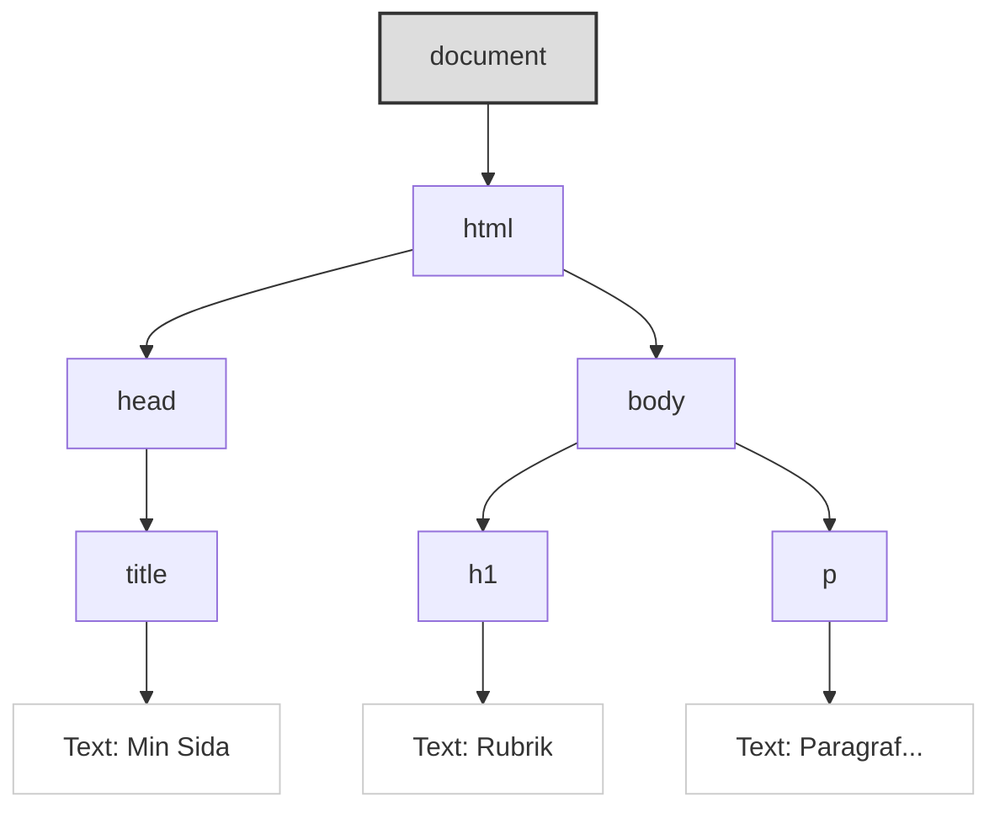

# DOM-manipulation och Events: Interagera med Sidan

JavaScript blir riktigt kraftfullt när vi använder det för att interagera med och ändra innehållet och strukturen på vår HTML-sida *efter* att den har laddats. Detta görs genom **DOM (Document Object Model)**. Vi behöver också kunna reagera på användarens handlingar, vilket vi gör genom att hantera **Events (Händelser)**.

**Mål:** Förstå vad DOM är, lära oss hur man väljer ut (selectar) HTML-element med JavaScript, hur man manipulerar (ändrar) deras innehåll, attribut och stilar, samt hur man kopplar händelselyssnare (`addEventListener`) för att reagera på användarinteraktioner som klick.

---

## Vad är DOM (Document Object Model)?

När en webbläsare laddar en HTML-sida skapar den en **modell** av sidans struktur i minnet. Denna modell kallas DOM. DOM representerar HTML-dokumentet som ett **träd av objekt (noder)**, där varje HTML-element (`<body>`, `<h1>`, `<p>`, `<div>`, etc.), textinnehåll och attribut blir ett objekt i trädet.


*Diagram: Förenklat exempel på DOM-trädet för en enkel HTML-sida.*

**Varför är DOM viktigt?**  
JavaScript kan komma åt och **manipulera** detta DOM-träd. Det betyder att vi med JavaScript kan:

- Hitta specifika HTML-element.
- Ändra deras textinnehåll.
- Ändra deras attribut (som `src` på en bild eller `href` på en länk).
- Ändra deras CSS-stilar.
- Lägga till nya element.
- Ta bort befintliga element.

Allt detta kan göras *utan att behöva ladda om sidan*. Det är grunden för dynamiska webbapplikationer.

---

## Välja element från DOM

För att kunna manipulera ett element måste vi först "hitta" det i DOM-trädet. Detta görs med olika metoder på det globala `document`-objektet:

### Moderna metoder (rekommenderas)

- **`document.querySelector(cssSelektor)`**  
  Returnerar det **första** elementet i dokumentet som matchar den angivna CSS-selektorn (t.ex. `#minId`, `.minKlass`, `p`, `nav > ul > li`).  
  Om ingen matchning hittas returneras `null`.  
  **Exempel:**
  ```javascript
  const mainHeading = document.querySelector('#main-title');
  const firstButton = document.querySelector('.btn');
  const navLink = document.querySelector('nav ul li a');
  ```

- **`document.querySelectorAll(cssSelektor)`**  
  Returnerar en **NodeList** (en samling som liknar en array) med **alla** element som matchar selektorn.  
  Om inga matchningar hittas returneras en tom NodeList.  
  **Exempel:**
  ```javascript
  const allParagraphs = document.querySelectorAll('p');
  const allButtons = document.querySelectorAll('.btn');

  allButtons.forEach(button => {
    console.log("Hittade en knapp!");
    // Gör något med varje knapp här
  });
  ```

### Äldre metoder (fortfarande vanliga)

- `document.getElementById(id)` – Returnerar elementet med det angivna ID:t (eller `null`).
- `document.getElementsByClassName(klassnamn)` – Returnerar en **HTMLCollection** (en *live*-samling) med alla element som har den angivna klassen.
- `document.getElementsByTagName(taggnamn)` – Returnerar en **HTMLCollection** med alla element av den angivna taggtypen (t.ex. 'p', 'div').

**Skillnad NodeList vs HTMLCollection:**  
En NodeList (från `querySelectorAll`) är oftast statisk, medan en HTMLCollection (från `getElementsByClassName`/`TagName`) är *live* och uppdateras automatiskt om DOM ändras. NodeList har också `forEach`-metoden inbyggd, vilket HTMLCollection ofta saknar.

---

## Manipulera element

När du väl har valt ett eller flera element och sparat dem i en variabel, kan du ändra dem:

### Ändra textinnehåll

- `element.textContent` – Hämtar eller sätter textinnehållet för ett element och dess ättlingar, *utan* HTML-taggar.
- `element.innerText` – Liknar `textContent`, men tar hänsyn till CSS-styling och inkluderar inte text från dolda element.

```javascript
const heading = document.querySelector('h1');
console.log(heading.textContent); // Visar nuvarande text
heading.textContent = "Ny Rubrik från JS!"; // Ändrar texten
```

### Ändra HTML-innehåll

- `element.innerHTML` – Hämtar eller sätter HTML-koden *inuti* ett element.  
  **OBS:** Använd med försiktighet, speciellt med osäker data (risk för XSS).

```javascript
const contentDiv = document.querySelector('#content');
// contentDiv.innerHTML = "<h2>Nytt innehåll</h2><p>Detta är en paragraf.</p>";
```

### Ändra attribut

- `element.setAttribute('attributnamn', 'nyttVärde')` – Sätter värdet på ett attribut.
- `element.getAttribute('attributnamn')` – Hämtar värdet på ett attribut.
- För vanliga attribut som `id`, `src`, `href`, `class` kan man ofta komma åt dem direkt som egenskaper.

```javascript
const link = document.querySelector('a');
link.href = "https://www.google.com";
link.target = "_blank";

const image = document.querySelector('img');
image.setAttribute('src', 'nybild.jpg');
image.alt = "Beskrivning av ny bild";
```

### Ändra CSS-stilar

- `element.style.cssEgenskap = 'värde'` – Ändrar inline-stilen för ett element. CSS-egenskaper skrivs i **camelCase** (t.ex. `backgroundColor`).
    ```javascript
    const box = document.querySelector('.box');
    box.style.backgroundColor = 'lightblue';
    box.style.padding = '20px';
    box.style.border = '1px solid blue';
    ```
- **Bättre metod:** Ändra elementets klass med `element.classList`:
  - `element.classList.add('ny-klass')`
  - `element.classList.remove('gammal-klass')`
  - `element.classList.toggle('aktiv-klass')`
  - `element.classList.contains('viss-klass')`

```css
/* I style.css */
.highlight {
  background-color: yellow;
  font-weight: bold;
}
```
```javascript
const importantText = document.querySelector('.important');
importantText.classList.add('highlight');
```

### Skapa och lägga till element

- `document.createElement('taggnamn')` – Skapar ett nytt HTML-element.
- `parentElement.appendChild(newElement)` – Lägger till `newElement` som sista barnet till `parentElement`.
- `parentElement.insertBefore(newElement, referenceElement)` – Infogar `newElement` före `referenceElement`.
- `element.remove()` – Tar bort elementet från DOM.

```javascript
const newItem = document.createElement('li');
newItem.textContent = "Ny punkt";
const list = document.querySelector('#myList');
list.appendChild(newItem);
```

---

## Hantera händelser

Events är händelser som inträffar i webbläsaren, oftast initierade av användaren (klick, tangenttryck, musrörelser) men också av webbläsaren själv (t.ex. att sidan laddats klart).

JavaScript låter oss "lyssna" efter dessa händelser och köra en funktion (en **event handler** eller **callback function**) när händelsen inträffar.

### Koppla händelselyssnare

- `element.addEventListener(eventType, eventHandlerFunction)`  
  Den moderna och rekommenderade metoden för att koppla en händelselyssnare.

```javascript
const myButton = document.querySelector('#myButton');

function handleButtonClick(event) {
  console.log("Knappen klickades!");
  event.target.textContent = "Klickad!";
  event.target.style.backgroundColor = 'lightgreen';
}

myButton.addEventListener('click', handleButtonClick);

const anotherButton = document.querySelector('#otherBtn');
anotherButton.addEventListener('click', (event) => {
  event.target.classList.toggle('active');
});
```

### Vanliga händelsetyper

- **Mus-händelser:** `click`, `dblclick`, `mouseover`, `mouseout`, `mousedown`, `mouseup`, `mousemove`
- **Tangentbords-händelser:** `keydown`, `keyup`, `keypress`
- **Formulär-händelser:** `submit`, `input`, `change`, `focus`, `blur`
- **Fönster/Dokument-händelser:** `load`, `DOMContentLoaded`, `resize`, `scroll`

### Förhindra standardbeteende

- `event.preventDefault()` – Stoppar webbläsarens standardbeteende för händelsen.  
  Används ofta för att hantera formulär med JavaScript.

```javascript
const myForm = document.querySelector('#myForm');
myForm.addEventListener('submit', (event) => {
  event.preventDefault();
  console.log("Formulär skulle ha skickats, men vi stoppade det!");
  // Hantera formulärdata här...
});
```

---

## Sammanfattning

DOM är webbläsarens representation av HTML-sidan som ett träd av objekt. JavaScript kan interagera med DOM för att:

- **Välja element:** Med `querySelector` (första matchningen) och `querySelectorAll` (alla matchningar) baserat på CSS-selektorer.
- **Manipulera element:** Ändra `textContent`, `innerHTML` (försiktigt!), attribut (`setAttribute`, direkta egenskaper), stilar (`element.style` eller, bättre, `element.classList`).
- **Skapa och ta bort element:** Med `createElement`, `appendChild`, `remove`.
- **Reagera på events:** Med `addEventListener` kan du köra JavaScript-kod när användaren interagerar med sidan.

Att behärska DOM-manipulation och händelsehantering är centralt för frontend-utveckling med JavaScript.
