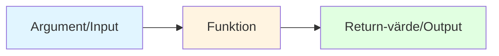

# Funktioner i JavaScript

Funktioner är en av de viktigaste byggstenarna i JavaScript. De gör det möjligt att återanvända kod, strukturera programmet och dela upp logik i mindre, hanterbara delar.

Tänk på en funktion som en **recept** – en instruktion för hur man gör något. När du behöver göra det, anropar du receptet (funktionen) och får tillbaka resultatet.

---

## Vad är en funktion?

En **funktion** är en namngiven kodblock som kan köras (anropas) flera gånger. Du kan skicka in värden (argument) till funktionen och få tillbaka ett resultat (return-värde).

Istället för att upprepa samma kod på flera ställen, kan du skriva koden en gång i en funktion och anropa den när du behöver den.



**Förklaring:**
- Funktionen tar emot **argument** (input) – värden som skickas in när funktionen anropas.
- Funktionen **utför en uppgift** – kör koden som finns inuti funktionen.
- Funktionen **returnerar ett värde** (output) – skickar tillbaka ett resultat till den som anropade funktionen.

**Exempel:**
```javascript
function add(a, b) {
  return a + b;  // Returnerar summan
}

let result = add(3, 5);  // Skickar in 3 och 5, får tillbaka 8
```

---

## Skapa en funktion

För att skapa en funktion använder du nyckelordet `function` följt av funktionens namn. Efter namnet kommer parenteser `()` där du kan ange parametrar (argument som funktionen tar emot), och sedan ett klammerpar `{}` som innehåller koden som ska köras.

**Grundstruktur:**
```javascript
function functionName() {
  // Din kod här
}
```

### Uppgift 1: Skapa din första funktion

Skapa en funktion som heter `greet` och som skriver ut "Hej!" i konsolen.

```javascript
// Skriv din funktion här
```

<details>
<summary>Lösningsförslag</summary>

```javascript
function greet() {
  console.log("Hej!");
}
```
</details>

---

## Anropa en funktion

När du har skapat en funktion, anropar du den genom att skriva funktionens namn följt av parenteser `()`.

```javascript
greet(); // Anropar funktionen greet
```

### Uppgift 2: Anropa din funktion

I uppgift 1 skapade du funktionen `greet`. Anropa den nu så att "Hej!" skrivs ut i konsolen.

```javascript
function greet() {
  console.log("Hej!");
}

// Anropa funktionen här
```

<details>
<summary>Lösningsförslag</summary>

```javascript
function greet() {
  console.log("Hej!");
}

greet(); // Skriver ut: Hej!
```
</details>

---

## Funktioner med argument (parametrar)

Funktioner kan ta emot värden som kallas **argument** eller **parametrar**. Dessa värden kan användas inuti funktionen.

När du deklarerar funktionen anger du parametrarnas namn i parenteserna:

```javascript
function greet(name) {
  // name är en parameter som funktionen tar emot
}
```

### Uppgift 3: Hälsa på någon

Skapa en funktion `sayHello` som tar emot en parameter `name` och skriver ut "Hej, [namn]!" där [namn] är värdet som skickas in.

```javascript
// Skriv din funktion här
sayHello("Anna"); // Ska skriva ut: Hej, Anna!
```

<details>
<summary>Lösningsförslag</summary>

```javascript
function sayHello(name) {
  console.log("Hej, " + name + "!");
}

sayHello("Anna"); // Skriver ut: Hej, Anna!
sayHello("Erik"); // Skriver ut: Hej, Erik!
```
</details>

### Uppgift 4: Funktion med flera argument

Skapa en funktion `introduce` som tar emot två parametrar: `firstName` och `lastName`, och skriver ut "Hej, jag heter [förnamn] [efternamn]".

```javascript
// Skriv din funktion här
introduce("Anna", "Andersson"); // Ska skriva ut: Hej, jag heter Anna Andersson
```

<details>
<summary>Lösningsförslag</summary>

```javascript
function introduce(firstName, lastName) {
  console.log("Hej, jag heter " + firstName + " " + lastName);
}

introduce("Anna", "Andersson"); // Skriver ut: Hej, jag heter Anna Andersson
```
</details>

---

## Returnera värden

En funktion kan returnera ett värde med nyckelordet `return`. När `return` körs avslutas funktionen och värdet skickas tillbaka till den som anropade funktionen.

**Viktigt:** När `return` körs, avslutas funktionen direkt. Ingen kod efter `return` i samma funktion kommer att köras.

Om inget `return` anges returnerar funktionen automatiskt `undefined`.

### Uppgift 5: Returnera ett värde

Skapa en funktion `add` som tar två parametrar `a` och `b`, och returnerar summan av dem.

```javascript
// Skriv din funktion här
let result = add(3, 5);
console.log(result); // Ska skriva ut: 8
```

<details>
<summary>Lösningsförslag</summary>

```javascript
function add(a, b) {
  return a + b;
}

let result = add(3, 5);
console.log(result); // Skriver ut: 8
```
</details>

### Uppgift 6: Beräkna area

Skapa en funktion `calculateArea` som tar två parametrar: `width` och `height`, och returnerar arean (bredd × höjd).

```javascript
// Skriv din funktion här
let area = calculateArea(5, 10);
console.log(area); // Ska skriva ut: 50
```

<details>
<summary>Lösningsförslag</summary>

```javascript
function calculateArea(width, height) {
  return width * height;
}

let area = calculateArea(5, 10);
console.log(area); // Skriver ut: 50
```
</details>

---

## Funktioner som variabler (funktionella uttryck)

Du kan också spara en funktion i en variabel. Detta kallas för ett **funktionellt uttryck** (function expression).

Istället för:
```javascript
function subtract(a, b) {
  return a - b;
}
```

Kan du skriva:
```javascript
const subtract = function(a, b) {
  return a - b;
};
```

Funktionen kan anropas på samma sätt som vanliga funktioner.

### Uppgift 7: Funktionellt uttryck

Skapa en funktion `multiply` som ett funktionellt uttryck (spara i en variabel). Funktionen ska ta två parametrar och returnera deras produkt.

```javascript
// Skriv din funktion här som ett funktionellt uttryck
let product = multiply(4, 7);
console.log(product); // Ska skriva ut: 28
```

<details>
<summary>Lösningsförslag</summary>

```javascript
const multiply = function(a, b) {
  return a * b;
};

let product = multiply(4, 7);
console.log(product); // Skriver ut: 28
```
</details>

---

## Arrow functions

Ett modernt och kortare sätt att skriva funktioner är med **arrow functions** (pilfunktioner). De använder syntaxen `() => {}`.

Istället för:
```javascript
const divide = function(a, b) {
  return a / b;
};
```

Kan du skriva:
```javascript
const divide = (a, b) => {
  return a / b;
};
```

### Kortare syntax för arrow functions

Om funktionen bara returnerar ett värde (har en enda `return`-sats), kan du skriva ännu kortare:

```javascript
const double = (x) => x * 2;
// eller utan parenteser runt en parameter:
const double = x => x * 2;
```

Detta är samma som:
```javascript
const double = (x) => {
  return x * 2;
};
```

### Uppgift 8: Arrow function

Skriv om funktionen `add` från uppgift 5 som en arrow function.

```javascript
// Skriv din arrow function här
let sum = add(10, 5);
console.log(sum); // Ska skriva ut: 15
```

<details>
<summary>Lösningsförslag</summary>

```javascript
const add = (a, b) => {
  return a + b;
};

let sum = add(10, 5);
console.log(sum); // Skriver ut: 15
```

Eller med kortare syntax:
```javascript
const add = (a, b) => a + b;

let sum = add(10, 5);
console.log(sum); // Skriver ut: 15
```
</details>

### Uppgift 9: Kort arrow function

Skapa en arrow function `square` som tar ett tal och returnerar talet i kvadrat. Använd den korta syntaxen (utan `return` och klammerpar).

```javascript
// Skriv din arrow function här
let result = square(4);
console.log(result); // Ska skriva ut: 16
```

<details>
<summary>Lösningsförslag</summary>

```javascript
const square = x => x * x;

let result = square(4);
console.log(result); // Skriver ut: 16
```
</details>

---

## Funktioner och scope

Variabler som deklareras inuti en funktion är **lokala** för den funktionen och kan inte nås utanför. Detta kallas för **scope** (räckvidd).

```javascript
function testScope() {
  let lokal = "Jag finns bara här";
  console.log(lokal); // Fungerar
}
testScope();
// console.log(lokal); // Fel! lokal är inte definierad här
```

Variabler som deklareras utanför funktioner är **globala** och kan nås överallt.

### Uppgift 10: Förstå scope

Titta på koden nedan. Vad kommer att skrivas ut i konsolen? Försök tänka igenom det innan du testar.

```javascript
let global = "Jag är global";

function test() {
  let local = "Jag är lokal";
  console.log(global); // Vad kommer att hända här?
  console.log(local);  // Och här?
}

test();
console.log(global); // Vad kommer att hända här?
// console.log(local); // Vad händer om du tar bort kommentaren?
```

<details>
<summary>Lösningsförslag</summary>

```javascript
let global = "Jag är global";

function test() {
  let local = "Jag är lokal";
  console.log(global); // Skriver ut: "Jag är global" (global kan nås)
  console.log(local);  // Skriver ut: "Jag är lokal" (local finns i funktionen)
}

test();
console.log(global); // Skriver ut: "Jag är global" (global kan nås)
// console.log(local); // Fel! local finns inte utanför funktionen
```

**Förklaring:**
- `global` kan nås både inuti och utanför funktionen eftersom den är global.
- `local` kan bara nås inuti funktionen där den deklareras.
</details>

---

## Funktioner som argument (callback functions)

Funktioner kan skickas som argument till andra funktioner. Detta är vanligt i t.ex. eventhantering och array-metoder. En funktion som skickas som argument kallas ofta för en **callback function**.

### Uppgift 11: Enkel callback

Skapa en funktion `processNumber` som tar två parametrar: ett tal `num` och en funktion `callback`. Funktionen ska anropa `callback` med `num` som argument.

Anropa sedan `processNumber` med talet 5 och en callback-funktion som skriver ut talet multiplicerat med 2.

```javascript
function processNumber(num, callback) {
  // Skriv din kod här
}

// Anropa processNumber med talet 5 och en callback
// Callback ska skriva ut: 10
```

<details>
<summary>Lösningsförslag</summary>

```javascript
function processNumber(num, callback) {
  callback(num);
}

// Med en namngiven funktion:
function double(x) {
  console.log(x * 2);
}
processNumber(5, double); // Skriver ut: 10

// Eller med en anonym funktion:
processNumber(5, function(x) {
  console.log(x * 2);
}); // Skriver ut: 10

// Eller med arrow function:
processNumber(5, (x) => console.log(x * 2)); // Skriver ut: 10
```
</details>

---

## Sammanfattning

- Funktioner gör det möjligt att återanvända och strukturera kod.
- Du kan skapa funktioner med `function`-syntax, funktionella uttryck eller arrow functions.
- Funktioner kan ta emot argument (parametrar) och returnera värden med `return`.
- Variabler inuti funktioner är lokala (scope) och kan inte nås utanför.
- Funktioner kan skickas som argument till andra funktioner (callback functions).
- Arrow functions (`() => {}`) är ett modernt och kortare sätt att skriva funktioner.

Att förstå och använda funktioner är avgörande för att skriva effektiv och läsbar JavaScript.

---

## Övningar

### Övning 1: Hälsningsfunktion
Skapa en funktion `greetUser` som tar emot ett namn och en tidpunkt (t.ex. "morgon" eller "kväll") och returnerar en hälsning. Till exempel: "God morgon, Anna!" eller "God kväll, Erik!".

```javascript
// Skriv din funktion här
let greeting = greetUser("Anna", "morgon");
console.log(greeting); // Ska skriva ut: "God morgon, Anna!"
```

<details>
<summary>Lösningsförslag</summary>

```javascript
function greetUser(name, time) {
  if (time === "morgon") {
    return "God morgon, " + name + "!";
  } else if (time === "kväll") {
    return "God kväll, " + name + "!";
  } else {
    return "Hej, " + name + "!";
  }
}

let greeting = greetUser("Anna", "morgon");
console.log(greeting); // Skriver ut: "God morgon, Anna!"
```

Eller med arrow function:
```javascript
const greetUser = (name, time) => {
  if (time === "morgon") {
    return "God morgon, " + name + "!";
  } else if (time === "kväll") {
    return "God kväll, " + name + "!";
  } else {
    return "Hej, " + name + "!";
  }
};
```
</details>

---

### Övning 2: Beräkna medelvärde
Skapa en funktion `calculateAverage` som tar emot en array med tal och returnerar medelvärdet. Tänk på att använda en loop för att summera alla tal.

```javascript
// Skriv din funktion här
let numbers = [10, 20, 30, 40, 50];
let average = calculateAverage(numbers);
console.log(average); // Ska skriva ut: 30
```

<details>
<summary>Lösningsförslag</summary>

```javascript
function calculateAverage(numbers) {
  let sum = 0;
  for (let i = 0; i < numbers.length; i++) {
    sum += numbers[i];
  }
  return sum / numbers.length;
}

let numbers = [10, 20, 30, 40, 50];
let average = calculateAverage(numbers);
console.log(average); // Skriver ut: 30
```

Eller med arrow function:
```javascript
const calculateAverage = (numbers) => {
  let sum = 0;
  for (let num of numbers) {
    sum += num;
  }
  return sum / numbers.length;
};
```
</details>

---

### Övning 3: Kontrollera jämnt/udda
Skapa en funktion `isEven` som tar emot ett tal och returnerar `true` om talet är jämnt, annars `false`. Använd arrow function.

```javascript
// Skriv din funktion här
console.log(isEven(4));  // Ska skriva ut: true
console.log(isEven(7));  // Ska skriva ut: false
```

<details>
<summary>Lösningsförslag</summary>

```javascript
const isEven = (num) => {
  return num % 2 === 0;
};

console.log(isEven(4));  // Skriver ut: true
console.log(isEven(7));  // Skriver ut: false
```

Eller med kortare syntax:
```javascript
const isEven = num => num % 2 === 0;
```
</details>

---

### Övning 4: Funktioner i en array
Skapa tre funktioner: `add`, `subtract` och `multiply`. Sedan skapa en array som innehåller dessa funktioner och använd en loop för att anropa alla funktioner med talen 10 och 5.

```javascript
// Skriv dina funktioner här

// Skapa array med funktioner

// Använd loop för att anropa alla funktioner
// Förväntad utskrift:
// 15 (10 + 5)
// 5 (10 - 5)
// 50 (10 * 5)
```

<details>
<summary>Lösningsförslag</summary>

```javascript
const add = (a, b) => a + b;
const subtract = (a, b) => a - b;
const multiply = (a, b) => a * b;

const operations = [add, subtract, multiply];

for (let operation of operations) {
  console.log(operation(10, 5));
}
// Skriver ut:
// 15
// 5
// 50
```
</details>

---

### Övning 5: Funktion som returnerar en funktion
Skapa en funktion `createMultiplier` som tar ett tal som parameter och returnerar en ny funktion. Den returnerade funktionen ska multiplicera ett tal med det tal som skickades in till `createMultiplier`.

```javascript
// Skriv din funktion här
let double = createMultiplier(2);
let triple = createMultiplier(3);

console.log(double(5));  // Ska skriva ut: 10
console.log(triple(4));  // Ska skriva ut: 12
```

<details>
<summary>Lösningsförslag</summary>

```javascript
function createMultiplier(multiplier) {
  return function(num) {
    return num * multiplier;
  };
}

let double = createMultiplier(2);
let triple = createMultiplier(3);

console.log(double(5));  // Skriver ut: 10
console.log(triple(4));  // Skriver ut: 12
```

Eller med arrow functions:
```javascript
const createMultiplier = (multiplier) => {
  return (num) => num * multiplier;
};

// Eller kortare:
const createMultiplier = multiplier => num => num * multiplier;
```
</details>

---

### Övning 6: Filterfunktion
Skapa en funktion `filterArray` som tar emot en array med tal och en funktion som filter. Funktionen ska returnera en ny array med alla tal som uppfyller filtervillkoret.

```javascript
// Skriv din funktion här
let numbers = [1, 2, 3, 4, 5, 6, 7, 8, 9, 10];

// Filtrera alla jämna tal
let evenNumbers = filterArray(numbers, /* din filter-funktion */);
console.log(evenNumbers); // Ska skriva ut: [2, 4, 6, 8, 10]

// Filtrera alla tal större än 5
let largeNumbers = filterArray(numbers, /* din filter-funktion */);
console.log(largeNumbers); // Ska skriva ut: [6, 7, 8, 9, 10]
```

<details>
<summary>Lösningsförslag</summary>

```javascript
function filterArray(arr, filterFn) {
  let result = [];
  for (let item of arr) {
    if (filterFn(item)) {
      result.push(item);
    }
  }
  return result;
}

let numbers = [1, 2, 3, 4, 5, 6, 7, 8, 9, 10];

// Filtrera alla jämna tal
let evenNumbers = filterArray(numbers, (num) => num % 2 === 0);
console.log(evenNumbers); // Skriver ut: [2, 4, 6, 8, 10]

// Filtrera alla tal större än 5
let largeNumbers = filterArray(numbers, (num) => num > 5);
console.log(largeNumbers); // Skriver ut: [6, 7, 8, 9, 10]
```
</details>

---

### Övning 7: Kalkylator med funktioner
Skapa en enkel kalkylator med funktioner. Skapa funktioner för de fyra räknesätten: `add`, `subtract`, `multiply`, `divide`. Skapa sedan en funktion `calculate` som tar tre parametrar: två tal och en operator (som sträng, t.ex. "+", "-", "*", "/") och använder rätt funktion baserat på operatorn.

```javascript
// Skriv dina funktioner här
console.log(calculate(10, 5, "+"));  // Ska skriva ut: 15
console.log(calculate(10, 5, "-"));  // Ska skriva ut: 5
console.log(calculate(10, 5, "*"));  // Ska skriva ut: 50
console.log(calculate(10, 5, "/"));  // Ska skriva ut: 2
```

<details>
<summary>Lösningsförslag</summary>

```javascript
const add = (a, b) => a + b;
const subtract = (a, b) => a - b;
const multiply = (a, b) => a * b;
const divide = (a, b) => a / b;

function calculate(a, b, operator) {
  if (operator === "+") {
    return add(a, b);
  } else if (operator === "-") {
    return subtract(a, b);
  } else if (operator === "*") {
    return multiply(a, b);
  } else if (operator === "/") {
    return divide(a, b);
  } else {
    return "Okänd operator";
  }
}

console.log(calculate(10, 5, "+"));  // Skriver ut: 15
console.log(calculate(10, 5, "-"));  // Skriver ut: 5
console.log(calculate(10, 5, "*"));  // Skriver ut: 50
console.log(calculate(10, 5, "/"));  // Skriver ut: 2
```

Alternativ med switch:
```javascript
function calculate(a, b, operator) {
  switch (operator) {
    case "+":
      return add(a, b);
    case "-":
      return subtract(a, b);
    case "*":
      return multiply(a, b);
    case "/":
      return divide(a, b);
    default:
      return "Okänd operator";
  }
}
```
</details>

---

### Övning 8: Funktion med valfritt antal argument
Skapa en funktion `sum` som kan ta emot ett valfritt antal argument och returnera summan av alla. Tips: Använd `arguments`-objektet eller rest-parametern (`...`).

```javascript
// Skriv din funktion här
console.log(sum(1, 2, 3));           // Ska skriva ut: 6
console.log(sum(1, 2, 3, 4, 5));    // Ska skriva ut: 15
console.log(sum(10));                // Ska skriva ut: 10
```

<details>
<summary>Lösningsförslag</summary>

Med rest-parameter (rekommenderat):
```javascript
function sum(...numbers) {
  let total = 0;
  for (let num of numbers) {
    total += num;
  }
  return total;
}

console.log(sum(1, 2, 3));           // Skriver ut: 6
console.log(sum(1, 2, 3, 4, 5));    // Skriver ut: 15
console.log(sum(10));                // Skriver ut: 10
```

Med arrow function:
```javascript
const sum = (...numbers) => {
  let total = 0;
  for (let num of numbers) {
    total += num;
  }
  return total;
};
```

Med `arguments`-objektet (äldre metod):
```javascript
function sum() {
  let total = 0;
  for (let i = 0; i < arguments.length; i++) {
    total += arguments[i];
  }
  return total;
}
```
</details>
