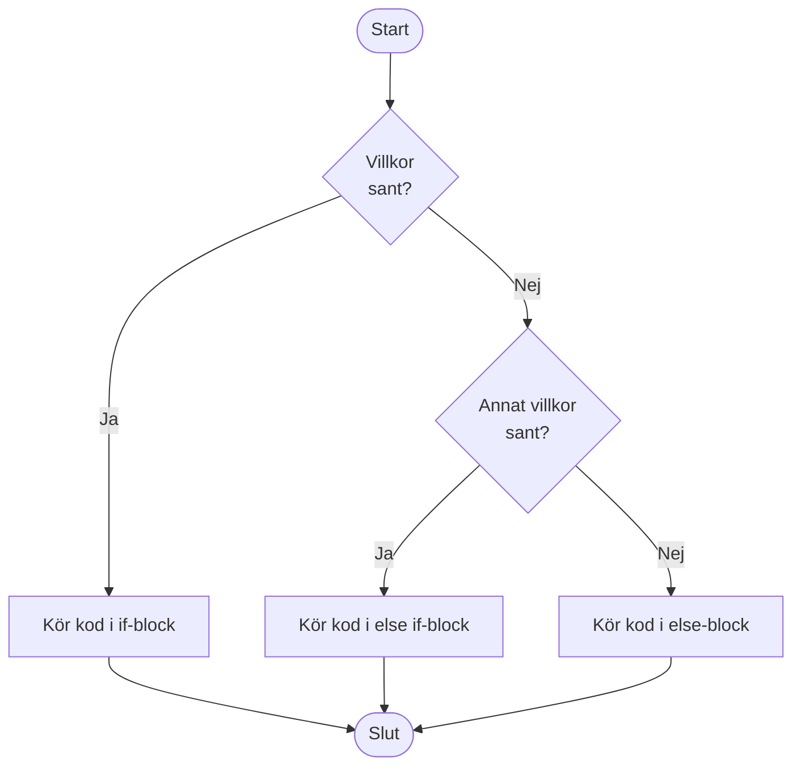
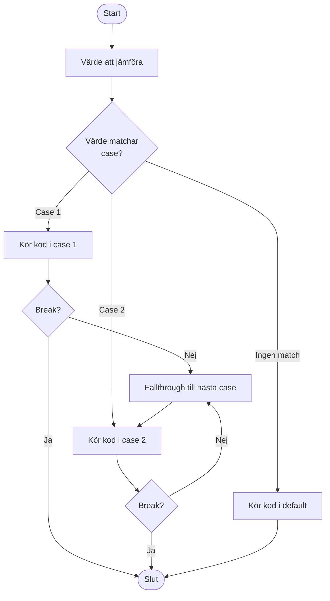
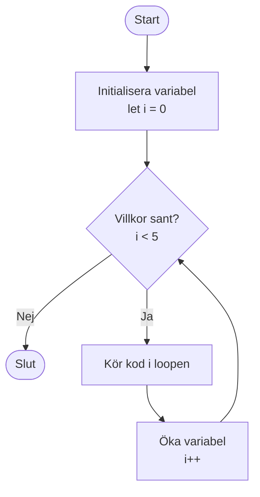
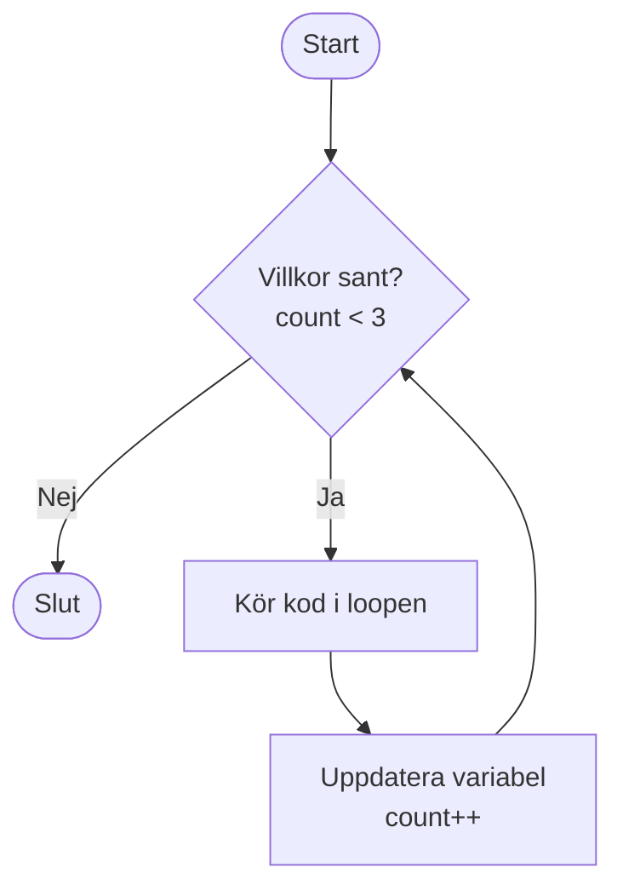
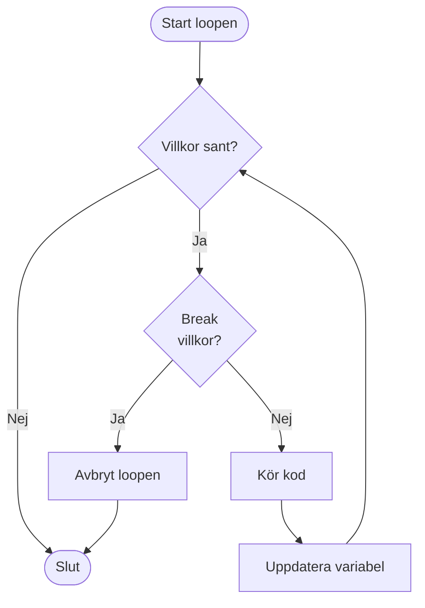
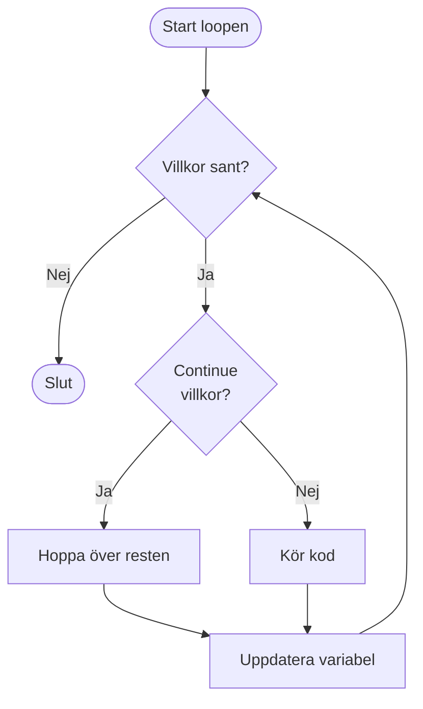

# Kontrollstrukturer i JavaScript

Kontrollstrukturer är byggstenarna som styr **flödet** i ett program. Med hjälp av dessa kan vi bestämma *vilken kod* som ska köras, *när* och *hur många gånger*. 

Tänk dig att du är en vägvisare på en korsning: beroende på vilken väg en bil tar kommer den att hamna på olika platser. På samma sätt kan ditt program ta olika vägar beroende på villkor och upprepa handlingar när det behövs.

De vanligaste kontrollstrukturerna är **villkorssatser** (if/else) och **loopar** (for, while).

> **Mål:**
> Kunna låta ett program välja väg med `if`/`else` och upprepa ett tydligt antal gånger med en `for`-loop.

**Prova först:** Ändra åldern och klicka på **Kör**. Konsolen visar vilken väg programmet väljer.

<!-- playground -->
```js
const age = 17;

if (age >= 18) {
  console.log("Du är myndig.");
} else {
  console.log("Du är inte myndig ännu.");
}
```

---

## Villkorssatser (if, else if, else)

Med villkorssatser kan vi utföra olika kod beroende på om ett visst villkor är sant eller falskt. Det är som att fatta beslut: "Om det regnar, ta med ett paraply. Annars, gå ut som vanligt."

### Grundstrukturen

En `if`-sats börjar alltid med ett villkor. Om villkoret är sant, körs koden inuti måsvingarna `{}`.

Prova att skriva en enkel if-sats som kontrollerar om en ålder är större än eller lika med 18. Om det är sant, skriv ut "Du är myndig.":

```javascript
let age = 18;

// Skriv din if-sats här
```

<details>
<summary>Lösningsförslag</summary>

```javascript
let age = 18;

if (age >= 18) {
  console.log("Du är myndig.");
}
```

</details>

### Lägg till else

Nu ska vi lägga till en `else`-sats som körs om villkoret inte är sant. Komplettera koden så att den även hanterar fallet när personen inte är myndig:

```javascript
let age = 15;

if (age >= 18) {
  // Skriv vad som ska hända här
} else {
  // Skriv vad som ska hända här
}
```

<details>
<summary>Lösningsförslag</summary>

```javascript
let age = 15;

if (age >= 18) {
  console.log("Du är myndig.");
} else {
  console.log("Du är inte myndig.");
}
```

</details>

### Använd else if för flera villkor

Ibland behöver vi kontrollera flera olika villkor. Då kan vi använda `else if`. Skriv en kod som kontrollerar om temperaturen är kall (mindre än 10), lagom (mellan 10 och 25), eller varm (över 25):

```javascript
let temp = 20;

// Skriv din if-else if-else struktur här
```

<details>
<summary>Lösningsförslag</summary>

```javascript
let temp = 20;

if (temp < 10) {
  console.log("Det är kallt!");
} else if (temp <= 25) {
  console.log("Lagom varmt!");
} else {
  console.log("Det är varmt!");
}
```

</details>

### Flödesdiagram för if/else

Här är ett diagram som visar hur flödet går i en if/else-sats:


```mermaid
flowchart TD
    Start([Start]) --> Villkor{Villkor<br/>sant?}
    Villkor -->|Ja| Kod1[Kör kod i if-block]
    Villkor -->|Nej| Villkor2{Annat villkor<br/>sant?}
    Villkor2 -->|Ja| Kod2[Kör kod i else if-block]
    Villkor2 -->|Nej| Kod3[Kör kod i else-block]
    Kod1 --> Slut([Slut])
    Kod2 --> Slut
    Kod3 --> Slut
```

---

## Jämförelseoperatorer

För att skapa villkor använder vi jämförelseoperatorer. Dessa operatorer jämför värden och returnerar `true` eller `false`.

### Operatorer

- `===`  lika med (värde och typ) - använd denna!
- `!==`  inte lika med (värde och typ)
- `>`    större än
- `<`    mindre än
- `>=`   större än eller lika med
- `<=`   mindre än eller lika med

**Viktigt:** I modern JavaScript använder vi `===` istället för `==` eftersom `===` kontrollerar både värde och typ, vilket ger mer förutsägbara resultat.

### Övning med operatorer

Skriv en if-sats som kontrollerar om variabeln `x` är lika med 5. Om det är sant, skriv ut "x är 5":

```javascript
let x = 5;

// Skriv din if-sats här
```

<details>
<summary>Lösningsförslag</summary>

```javascript
let x = 5;

if (x === 5) {
  console.log("x är 5");
}
```

</details>

Nu ska du kontrollera om `x` är större än 3. Skriv en if-sats för det:

```javascript
let x = 5;

// Skriv din if-sats här
```

<details>
<summary>Lösningsförslag</summary>

```javascript
let x = 5;

if (x > 3) {
  console.log("x är större än 3");
}
```

</details>

---

## Logiska operatorer

Ibland behöver vi kombinera flera villkor. Då använder vi logiska operatorer:

- `&&`  och (båda villkoren måste vara sanna)
- `||`  eller (minst ett villkor måste vara sant)
- `!`   inte (vänder på sant/falskt)

### Övning med && (och)

Skriv en if-sats som kontrollerar om temperaturen är mellan 15 och 25 grader. Använd operatorn `&&`:

```javascript
let temp = 20;

// Skriv din if-sats här
```

<details>
<summary>Lösningsförslag</summary>

```javascript
let temp = 20;

if (temp > 15 && temp < 25) {
  console.log("Lagom varmt!");
}
```

</details>

### Övning med || (eller)

Skriv en if-sats som kontrollerar om åldern är mindre än 13 eller större än 65. Om något av villkoren är sant, skriv ut "Du kan få rabatt":

```javascript
let age = 12;

// Skriv din if-sats här
```

<details>
<summary>Lösningsförslag</summary>

```javascript
let age = 12;

if (age < 13 || age > 65) {
  console.log("Du kan få rabatt");
}
```

</details>

---

## Switch-sats

När du har många möjliga värden att jämföra mot kan `switch` vara tydligare än många `if/else`. Det är som en växelspår: beroende på vilket spår växeln är på, tar tåget olika vägar.

### Grundstrukturen

En `switch`-sats börjar med värdet som ska jämföras, sedan följer olika `case`-block. Glöm inte `break` efter varje case, annars fortsätter koden att köra in i nästa case!

### Flödesdiagram för switch

Här är ett diagram som visar hur flödet går i en switch-sats:


```mermaid
flowchart TD
    Start([Start]) --> Värdet[Värde att jämföra]
    Värdet --> Jämför{Värde matchar<br/>case?}
    Jämför -->|Case 1| Kod1[Kör kod i case 1]
    Jämför -->|Case 2| Kod2[Kör kod i case 2]
    Jämför -->|Ingen match| Kod3[Kör kod i default]
    Kod1 --> Break1{Break?}
    Kod2 --> Break2{Break?}
    Break1 -->|Ja| Slut([Slut])
    Break1 -->|Nej| Fallthrough[Fallthrough till nästa case]
    Break2 -->|Ja| Slut
    Break2 -->|Nej| Fallthrough
    Fallthrough --> Kod2
    Kod3 --> Slut
```

Skriv en switch-sats som kontrollerar värdet av `day` och skriver ut olika meddelanden för "måndag", "tisdag" och alla andra dagar (använd `default`):

```javascript
let day = "tisdag";

// Skriv din switch-sats här
```

<details>
<summary>Lösningsförslag</summary>

```javascript
let day = "tisdag";

switch (day) {
  case "måndag":
    console.log("Ny vecka!");
    break;
  case "tisdag":
    console.log("Andra dagen.");
    break;
  default:
    console.log("Någon annan dag.");
}
```

</details>

---

## Loopar

Loopar används för att upprepa kod flera gånger. Det är som att säga "Gör detta igen och igen tills ett villkor är uppfyllt."

### For-loop

En `for`-loop har tre delar:
1. **Start**: Var börjar vi? (t.ex. `let i = 0`)
2. **Villkor**: När ska vi sluta? (t.ex. `i < 5`)
3. **Steg**: Hur ändrar vi värdet? (t.ex. `i++`)

### Flödesdiagram för for-loop

Här är ett diagram som visar hur flödet går i en for-loop:


```mermaid
flowchart TD
    Start([Start]) --> Init[Initialisera variabel<br/>let i = 0]
    Init --> Villkor{Villkor sant?<br/>i < 5}
    Villkor -->|Nej| Slut([Slut])
    Villkor -->|Ja| Kod[Kör kod i loopen]
    Kod --> Steg[Öka variabel<br/>i++]
    Steg --> Villkor
```

Skriv en for-loop som räknar från 0 till 4 och skriver ut varje tal:

```javascript
// Skriv din for-loop här
```

<details>
<summary>Lösningsförslag</summary>

```javascript
for (let i = 0; i < 5; i++) {
  console.log("i är nu: " + i);
}
```

</details>

Nu ska du skriva en for-loop som räknar från 1 till 10:

```javascript
// Skriv din for-loop här
```

<details>
<summary>Lösningsförslag</summary>

```javascript
for (let i = 1; i <= 10; i++) {
  console.log(i);
}
```

</details>

### While-loop

En `while`-loop körs så länge ett villkor är sant. Det är som att säga "Gör detta så länge villkoret är sant."

### Flödesdiagram för while-loop

Här är ett diagram som visar hur flödet går i en while-loop:


```mermaid
flowchart TD
    Start([Start]) --> Villkor{Villkor sant?<br/>count < 3}
    Villkor -->|Nej| Slut([Slut])
    Villkor -->|Ja| Kod[Kör kod i loopen]
    Kod --> Uppdatera[Uppdatera variabel<br/>count++]
    Uppdatera --> Villkor
```

Skriv en while-loop som räknar från 0 till 2 och skriver ut varje tal. Kom ihåg att öka räknaren inuti loopen:

```javascript
let count = 0;

// Skriv din while-loop här
```

<details>
<summary>Lösningsförslag</summary>

```javascript
let count = 0;
while (count < 3) {
  console.log("Räknare: " + count);
  count++;
}
```

</details>

### När använder man for vs while?

- Använd `for` när du vet hur många gånger loopen ska köras.
- Använd `while` när du inte vet exakt hur många gånger, men vet ett villkor som måste vara sant.

---

## Break och continue

Ibland behöver vi extra kontroll i våra loopar:

- `break` – Avbryter loopen direkt och hoppar ut.
- `continue` – Hoppar över resten av koden i loopen och går till nästa varv.

### Flödesdiagram för break och continue

Här är diagram som visar hur `break` och `continue` påverkar flödet:

**Break:**

```mermaid
flowchart TD
    Start([Start loopen]) --> Villkor{Villkor sant?}
    Villkor -->|Nej| Slut([Slut])
    Villkor -->|Ja| BreakVillkor{Break<br/>villkor?}
    BreakVillkor -->|Ja| Avbryt[Avbryt loopen]
    BreakVillkor -->|Nej| Kod[Kör kod]
    Avbryt --> Slut
    Kod --> Uppdatera[Uppdatera variabel]
    Uppdatera --> Villkor
```

**Continue:**

```mermaid
flowchart TD
    Start([Start loopen]) --> Villkor{Villkor sant?}
    Villkor -->|Nej| Slut([Slut])
    Villkor -->|Ja| ContinueVillkor{Continue<br/>villkor?}
    ContinueVillkor -->|Ja| HoppaÖver[Hoppa över resten]
    ContinueVillkor -->|Nej| Kod[Kör kod]
    HoppaÖver --> Uppdatera[Uppdatera variabel]
    Kod --> Uppdatera
    Uppdatera --> Villkor
```

### Övning med break

Skriv en for-loop som går från 0 till 5, men avbryter när `i` är lika med 3. Vad tror du kommer att skrivas ut?

```javascript
// Skriv din for-loop med break här
```

<details>
<summary>Lösningsförslag</summary>

```javascript
for (let i = 0; i < 5; i++) {
  if (i === 3) break;
  console.log(i);
}
// Utskrift: 0, 1, 2
```

</details>

### Övning med continue

Skriv en for-loop som går från 0 till 5, men hoppar över när `i` är lika med 2. Vad tror du kommer att skrivas ut?

```javascript
// Skriv din for-loop med continue här
```

<details>
<summary>Lösningsförslag</summary>

```javascript
for (let i = 0; i < 5; i++) {
  if (i === 2) continue;
  console.log(i);
}
// Utskrift: 0, 1, 3, 4
```

</details>

---

## Sammanfattning

- Kontrollstrukturer styr flödet i programmet.
- Använd `if`, `else if`, `else` och `switch` för att fatta beslut.
- Använd `for` och `while` för att upprepa kod.
- Jämförelse- och logiska operatorer hjälper dig att skapa villkor.
- `break` och `continue` ger extra kontroll i loopar.

Att behärska kontrollstrukturer är avgörande för att kunna skriva logisk och flexibel kod. I nästa avsnitt ska vi se hur JavaScript kan interagera med själva HTML-sidan.

> **Kör nu i `portfolio-site`:** Skriv en `if`-sats i `script.js` som kontrollerar om en variabel `visitorCount` är större än 0 och skriver ut ett välkomstmeddelande i konsolen.

Fler övningar finns i [Praktiska övningar](./ovningar.md).