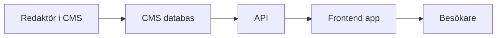
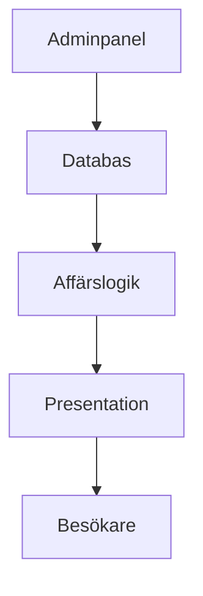

# Introduktion till CMS

När en webbplats växer blir det snabbt svårt att hantera allt innehåll direkt i kodfiler. Ett CMS (content management system, innehållshanteringssystem) löser det genom att separera innehåll från presentation och ge redaktörer ett gränssnitt för att arbeta utan att ändra källkod.

## Förkunskaper

Innan du börjar bör du ha grundläggande förståelse för:

- HTML och CSS
- Hur en webbplats publiceras och hostas
- Skillnaden mellan frontend och backend

## Vad är ett CMS?

Ett CMS är ett system för att skapa, redigera, organisera och publicera innehåll.

Vanliga funktioner i ett CMS:

- Inloggning och användarroller
- Editor för sidor och inlägg
- Mediabibliotek för bilder och filer
- Publiceringsflöde (utkast, granskning, publicerat)
- Hantering av menyer och navigering

### Varför används CMS?

Ett CMS passar bra när flera personer behöver arbeta med innehåll och när webbplatsen uppdateras ofta.

Exempel:

- Företagssidor
- Bloggar och nyhetssidor
- Skol- och organisationswebbplatser

## Olika CMS-alternativ

Det finns många CMS, men de kan grovt delas in i två grupper.

### Traditionella CMS

Exempel: WordPress, Joomla, Drupal.

- Innehåll, adminpanel och rendering ligger i samma system.
- Snabbt att komma igång med teman och tillägg.
- Bra när du vill bygga en komplett webbplats med liten initial kodinsats.

### Headless CMS

Exempel: Strapi, Contentful, Sanity.

- CMS:et hanterar innehåll och API.
- Frontend byggs separat, till exempel i React eller Next.js.
- Ger större flexibilitet i frontend men kräver mer utvecklingsarbete.

### Moderna webbplatsbyggare

Exempel: Wix, Webflow, Squarespace.

De här plattformarna är ofta **hostade helhetslösningar** där CMS, designverktyg och hosting ingår i samma tjänst.

- Snabb uppstart med färdiga mallar och visuella verktyg.
- Mindre tekniskt ansvar för drift, uppdateringar och servermiljö.
- Bra för mindre team som vill få ut en sajt snabbt.

Begränsningar att känna till:

- Mindre frihet i backend och avancerad anpassning.
- Risk för leverantörslåsning (vendor lock-in, beroende av en plattform).
- Svårare migrering om du senare vill byta plattform.

## Wix, Webflow och Squarespace i praktiken

### Wix

- Passar för små företag, portföljer och enklare webbplatser.
- Väldigt snabb start med drag and drop.
- Bra när tekniknivån i teamet är låg och time to market (tid till lansering) är viktig.

### Webflow

- Passar team som vill ha mer kontroll över design och responsiv layout.
- Starkare design- och interactions-stöd (interaktioner) än många andra builders.
- Ofta ett bra mellansteg mellan no-code (utan kod) och klassisk frontend-utveckling.

### Squarespace

- Passar innehållsdrivna sajter med fokus på ren design, t.ex. portfolio, blogg och enklare företagssidor.
- Enkel redigering och bra standardmallar.
- Mindre teknisk flexibilitet än WordPress och headless-lösningar.

### När ska man välja dessa plattformar?

Välj Wix, Webflow eller Squarespace när du behöver:

- Snabb leverans
- Låg teknisk komplexitet
- Begränsat underhållsansvar

Välj oftare WordPress eller headless när du behöver:

- Mer avancerad funktionalitet
- Full kontroll över kod och infrastruktur
- Hög anpassningsbarhet över tid

## Headless CMS

I ett headless-upplägg levererar CMS:et data via API (application programming interface, programmeringsgränssnitt), ofta som JSON.



### Enkel jämförelse: traditionellt vs headless

| Egenskap | Traditionellt CMS | Headless CMS |
|---|---|---|
| Rendering av HTML | I CMS:et | I separat frontend |
| Uppstart | Snabb | Mer teknisk setup |
| Frontend-frihet | Lägre | Hög |
| Passar bäst för | Klassiska webbplatser | Appar och flera kanaler |

## CMS-arkitektur

En vanlig CMS-arkitektur innehåller fyra delar:

1. **Adminpanel** – där innehåll skapas.
2. **Databas** – där innehåll och inställningar lagras.
3. **Affärslogik** – regler för publicering, roller och datahantering.
4. **Presentation** – hur innehållet visas för besökaren.



## Praktiskt exempel: hämta innehåll från ett headless API

Exemplet visar hur en frontend kan hämta innehåll från ett CMS-API.

```javascript
async function loadArticles() {
  const response = await fetch('https://example-cms.com/api/articles');
  const data = await response.json();

  data.forEach((article) => {
    console.log(article.title);
  });
}

loadArticles();
```

Poängen är att frontend och CMS är separerade, men kan kopplas ihop via API.

## Säkerhet i CMS

Oavsett CMS-val behöver du tänka på säkerhet:

- Uppdatera CMS, teman och tillägg regelbundet.
- Använd starka lösenord och tvåfaktorsautentisering.
- Ge minsta möjliga behörighet till varje användare.
- Ta regelbundna backuper av databas och filer.
- Skydda formulär och inmatning mot XSS och CSRF.

## Vanliga misstag

1. Välja CMS utan att först definiera projektets behov.
2. Installera för många tillägg med överlappande funktioner.
3. Sakna tydlig innehållsstruktur från början.
4. Glömma plan för underhåll och uppdateringar.

## Sammanfattning

CMS gör innehållsarbete snabbare och mer skalbart i team. Traditionella CMS är ofta enklare att starta med, medan headless CMS ger större frihet i frontend. Plattformar som Wix, Webflow och Squarespace ger snabb leverans med mindre driftansvar, men med lägre teknisk frihet. Rätt val beror på projektets krav, teamets kompetens och hur innehållet ska publiceras.

## Reflektionsfrågor

1. I vilket typ av projekt skulle du välja traditionellt CMS framför headless?
2. Vilka roller behöver du i ett CMS-team för en skolwebbplats?
3. Vilka säkerhetsrutiner skulle du införa från dag ett?
4. När skulle du välja Webflow eller Squarespace i stället för WordPress?
