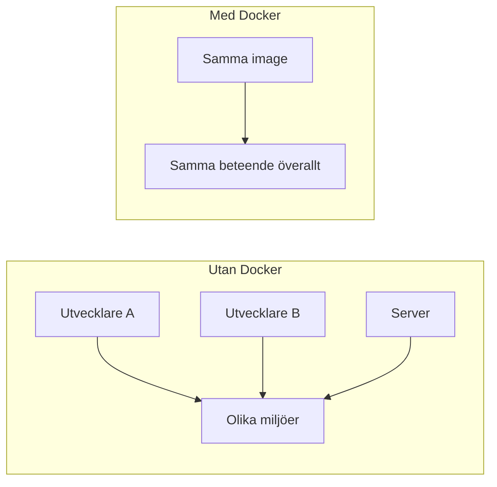
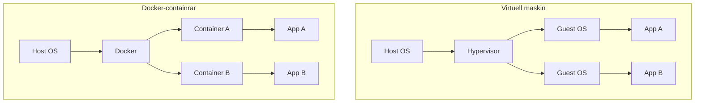
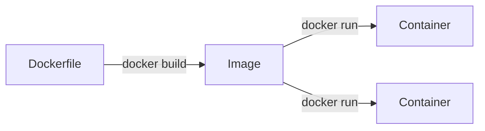
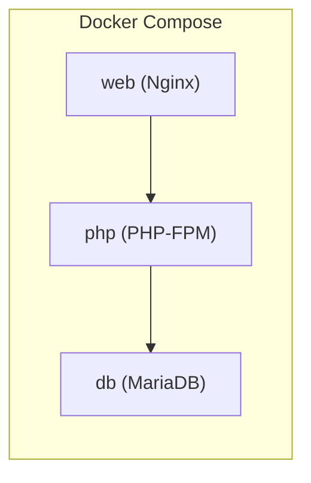
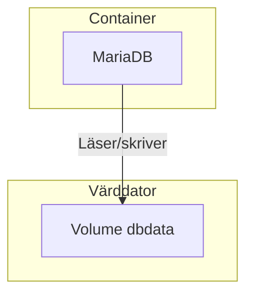
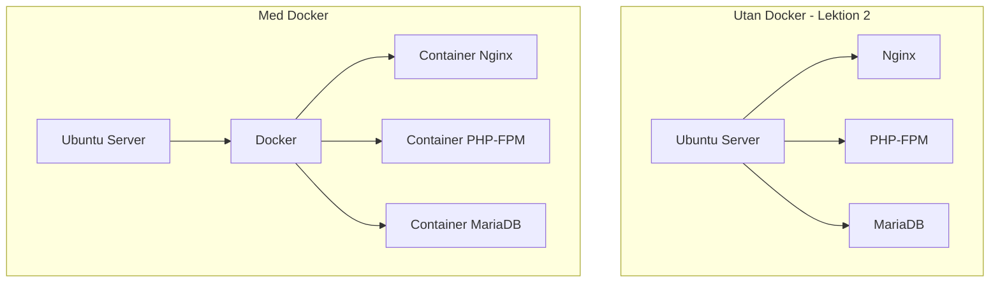

# Introduktion till Docker

I förra lektionen installerade vi Nginx, PHP och MariaDB direkt på en server. Det fungerar – men det kräver många manuella steg och kan ge problem: "Det fungerar på min server, men inte på din." **Docker** löser detta genom att paketera applikationen och dess miljö i **containrar** (containers) – isolerade, återanvändbara enheter som körs likadant överallt.

## Vad är Docker?

**Docker** är en plattform för att bygga, leverera och köra applikationer i containrar. En container innehåller allt som behövs för att applikationen ska fungera: kod, runtime, systembibliotek och inställningar. Resultatet är att samma container körs identiskt på din dator, på en kollegas Mac, eller på en server i molnet.



**Analogi:** Tänk på en container som en flyttlåda. Inuti finns allt som behövs – du behöver inte installera möbler på destinationen. Lådan kan flyttas till vilket hus som helst och innehållet fungerar likadant.

## Containrar vs virtuella maskiner

Du kanske känner till **virtuella maskiner** (VMs) – en hel "dator" som körs inuti en annan. Containrar är lättare och snabbare:



| Aspekt | Virtuell maskin | Docker-container |
|--------|-----------------|------------------|
| **Storlek** | Gigabyte (helt OS) | Megabyte (bara app + beroenden) |
| **Starttid** | Minuter | Sekunder |
| **Resursanvändning** | Hög | Låg |
| **Isolering** | Full (helt eget OS) | Processisolering |

Containrar delar värdens kernel (Linux-kärna) men har sin egen filsystemvy och nätverk. De är tillräckligt isolerade för de flesta behov.

## Grundbegrepp: Image och Container

*   **Image (avbild):** En skrivskyddad mall – en "recept" för vad som ska finnas i containern. Bilder byggs från en `Dockerfile` eller hämtas från ett register som Docker Hub.
*   **Container:** En körande instans av en image. Du kan starta flera containrar från samma image.



**Analogi:** En image är som en byggritning. En container är det färdiga huset – du kan bygga flera hus från samma ritning.

## Installera Docker

På Ubuntu/Debian installeras Docker med följande kommandon:

```bash
apt update
apt install -y ca-certificates curl gnupg
install -m 0755 -d /etc/apt/keyrings
curl -fsSL https://download.docker.com/linux/ubuntu/gpg | gpg --dearmor -o /etc/apt/keyrings/docker.gpg
chmod a+r /etc/apt/keyrings/docker.gpg
echo "deb [arch=$(dpkg --print-architecture) signed-by=/etc/apt/keyrings/docker.gpg] https://download.docker.com/linux/ubuntu $(. /etc/os-release && echo "$VERSION_CODENAME") stable" | tee /etc/apt/sources.list.d/docker.list > /dev/null
apt update
apt install -y docker-ce docker-ce-cli containerd.io docker-compose-plugin
```

*Terminal – installation:*

```
$ apt install -y docker-ce docker-ce-cli containerd.io docker-compose-plugin
Reading package lists... Done
...
Setting up docker-ce (24.0.5) ...
Created symlink /etc/systemd/system/multi-user.target.wants/docker.service
...
$ docker --version
Docker version 24.0.5, build 24.0.5-0ubuntu1
```

På **Windows** eller **macOS** används ofta **Docker Desktop**, som inkluderar både Docker Engine och ett grafiskt gränssnitt. Ladda ner från [docker.com/products/docker-desktop](https://www.docker.com/products/docker-desktop/).

## Grundläggande Docker-kommandon

### Köra en container från en image

Det enklaste sättet att prova Docker är att köra en färdig image från Docker Hub:

```bash
docker run hello-world
```

*Terminal – första containern:*

```
$ docker run hello-world
Unable to find image 'hello-world:latest' locally
latest: Pulling from library/hello-world
c1ec31eb5942: Pull complete
Digest: sha256:4bd7813b1...
Status: Downloaded newer image for hello-world:latest

Hello from Docker!
This message shows that your installation appears to be working correctly.
...
```

### Lista körande containrar

```bash
docker ps
```

*Terminal – lista containrar:*

```
$ docker ps
CONTAINER ID   IMAGE          COMMAND       CREATED         STATUS         PORTS     NAMES
a1b2c3d4e5f6   nginx:latest   "nginx -g ..."   2 minutes ago   Up 2 minutes   0.0.0.0:8080->80/tcp   web
```

För att se *alla* containrar (även stoppade):

```bash
docker ps -a
```

### Starta en webbserver i en container

Nginx kan köras direkt från en färdig image. Flaggan `-p` mappar port 8080 på värddatorn till port 80 i containern:

```bash
docker run -d -p 8080:80 --name web nginx:latest
```

*Terminal – starta Nginx:*

```
$ docker run -d -p 8080:80 --name web nginx:latest
Unable to find image 'nginx:latest' locally
latest: Pulling from library/nginx
a2abf6c4d29d: Pull complete
...
a1b2c3d4e5f6
```

Öppna nu `http://localhost:8080` i webbläsaren – du ska se Nginx välkomstsida. Inga `apt install` behövdes.

| Flagga | Betydelse |
|--------|-----------|
| `-d` | Kör i bakgrunden (detached) |
| `-p 8080:80` | Mappa värdens port 8080 till containerns port 80 |
| `--name web` | Ge containern namnet "web" |

### Hosta din egen HTML-sida med en volym

För att servera egna filer istället för Nginx standardvälkomstsida använder du en **volym** (volume) – en mapp på din dator som mappas in i containern.

Stoppa och ta bort den tidigare containern om den fortfarande körs:

```bash
docker stop web
docker rm web
```

Skapa en mapp med en enkel `index.html`:

```bash
mkdir -p my-html
echo '<h1>Hej från min container!</h1>' > my-html/index.html
```

Starta Nginx med volymen mappad till Nginx document root. I den officiella Nginx-imagen är det `/usr/share/nginx/html` (vid apt-installation på Ubuntu används ofta `/var/www/html` i stället):

```bash
docker run -d -p 8080:80 --name web -v $(pwd)/my-html:/usr/share/nginx/html:ro nginx:latest
```

*Terminal – starta med volym:*

```
$ docker run -d -p 8080:80 --name web -v $(pwd)/my-html:/usr/share/nginx/html:ro nginx:latest
a1b2c3d4e5f6
```

Besök `http://localhost:8080` – du ska nu se din egen HTML. Ändra `my-html/index.html` och ladda om sidan; ändringarna syns direkt utan att starta om containern.

| Flagga | Betydelse |
|--------|-----------|
| `-v $(pwd)/my-html:/usr/share/nginx/html:ro` | Mappa mappen `my-html` till Nginx document root. `:ro` gör volymen skrivskyddad för containern. |

### Stoppa och ta bort en container

```bash
docker stop web
docker rm web
```

*Terminal – stoppa och ta bort:*

```
$ docker stop web
web
$ docker rm web
web
```

## Bygga en egen image med Dockerfile

En **Dockerfile** beskriver hur en image ska byggas. Varje rad är ett steg. Här är ett enkelt exempel för en PHP-app med Nginx:

Skapa först `default.conf`:

```nginx
server {
    listen 80;
    server_name localhost;
    root /var/www/html;
    index index.php index.html;

    location / {
        try_files $uri $uri/ /index.php?$query_string;
    }

    location ~ \.php$ {
        fastcgi_pass 127.0.0.1:9000;
        fastcgi_param SCRIPT_FILENAME $document_root$fastcgi_script_name;
        include fastcgi_params;
    }
}
```

*Vad gör `default.conf`?*

| Rad | Betydelse |
|-----|-----------|
| `listen 80` | Nginx lyssnar på port 80 (HTTP) |
| `root /var/www/html` | Document root – var webbfilerna ligger |
| `server_name localhost` | Vilka domännamn som ska hanteras |
| `try_files $uri $uri/ /index.php?$query_string` | Försök först hitta filen som statisk; om den inte finns, skicka till `index.php` (bra för URL-rewriting) |
| `location ~ \.php$` | Alla förfrågningar till `.php`-filer |
| `fastcgi_pass 127.0.0.1:9000` | Skicka PHP-förfrågningar till PHP-FPM som lyssnar på port 9000 |
| `fastcgi_param SCRIPT_FILENAME $document_root$fastcgi_script_name` | Säg till PHP-FPM vilken fil som ska köras |
| `include fastcgi_params` | Standardparametrar för FastCGI (t.ex. HTTP-headers) |

```dockerfile
FROM php:8.2-fpm

RUN apt-get update && apt-get install -y \
    nginx \
    && docker-php-ext-install pdo pdo_mysql

COPY default.conf /etc/nginx/sites-available/default
COPY app/ /var/www/html
```

*Förklaring:*
*   `FROM` – basimage att bygga vidare på (här PHP 8.2 med PHP-FPM)
*   `RUN` – kör kommandon under bygget (installerar Nginx, PHP-extensions)
*   `COPY` – kopierar filer från byggkontexten till imagen

Bygg imagen:

```bash
docker build -t min-php-app .
```

*Terminal – bygg image:*

```
$ docker build -t min-php-app .
[+] Building 45.2s (8/8) FINISHED
 => [1/4] FROM docker.io/library/php:8.2-fpm
 => [2/4] RUN apt-get update && apt-get install -y nginx
 => [3/4] COPY default.conf /etc/nginx/sites-available/default
 => [4/4] COPY app/ /var/www/html
 => exporting to image
 => => naming to docker.io/library/min-php-app:latest
```

Flaggan `-t min-php-app` ger imagen ett taggnamn. Punkten `.` anger att byggkontexten är aktuell mapp.

## Docker Compose – flera containrar tillsammans

En PHP-app behöver ofta både webbserver, PHP och databas. **Docker Compose** låter dig definiera flera tjänster i en fil och starta dem tillsammans.

Skapa först `default.conf` (samma struktur som i Dockerfile-exemplet, men `fastcgi_pass` pekar på tjänsten `php` eftersom de körs i separata containrar):

```nginx
server {
    listen 80;
    server_name localhost;
    root /var/www/html;
    index index.php index.html;

    location / {
        try_files $uri $uri/ /index.php?$query_string;
    }

    location ~ \.php$ {
        fastcgi_pass php:9000;
        fastcgi_param SCRIPT_FILENAME $document_root$fastcgi_script_name;
        include fastcgi_params;
    }
}
```

Skapa sedan `docker-compose.yml`:

```yaml
services:
  web:
    image: nginx:latest
    ports:
      - "8080:80"
    volumes:
      - ./app:/var/www/html
      - ./default.conf:/etc/nginx/conf.d/default.conf
    depends_on:
      - php

  php:
    image: php:8.2-fpm
    volumes:
      - ./app:/var/www/html

  db:
    image: mariadb:latest
    environment:
      MYSQL_ROOT_PASSWORD: hemligt
      MYSQL_DATABASE: min_app
    volumes:
      - dbdata:/var/lib/mysql

volumes:
  dbdata:
```

*Observera:* `fastcgi_pass php:9000` använder tjänstnamnet `php` – Docker Compose skapar ett nätverk där tjänster når varandra via sitt namn. Både Nginx och PHP använder `root /var/www/html` så att `SCRIPT_FILENAME` pekar på samma filer i båda containrarna.



Starta alla tjänster:

```bash
docker compose up -d
```

*Terminal – starta med Compose:*

```
$ docker compose up -d
[+] Running 4/4
 ✔ Network min-app_default    Created
 ✔ Container min-app-db-1     Started
 ✔ Container min-app-php-1    Started
 ✔ Container min-app-web-1    Started
```

Stoppa och ta bort containrarna (volymen med databasen behålls):

```bash
docker compose down
```

### Viktiga begrepp i docker-compose.yml

| Nyckel | Betydelse |
|--------|-----------|
| `services` | Lista över tjänster (containrar) |
| `image` | Vilken image som ska användas |
| `ports` | Portmappning (värd:container) |
| `volumes` | Persistens – mappar eller namngivna volymer |
| `environment` | Miljövariabler (t.ex. databaslösenord) |
| `depends_on` | Startordning – "web" väntar på "php" |

## Volymer – spara data mellan körningar

Containrar är tillfälliga. När du tar bort en container försvinner allt innehåll. För att spara data (t.ex. databasfiler) använder du **volymer**:



*   **Namngiven volym** (`dbdata`): Docker hanterar lagringsplatsen. Data överlever `docker compose down`.
*   **Bind mount** (`./app:/var/www/html`): En mapp på värddatorn mappas in i containern. Bra för utveckling – ändringar i koden syns direkt.

## Sammanfattning

### Jämförelse: Hosting utan Docker vs med Docker

I förra lektionen installerade vi Nginx, PHP-FPM och MariaDB direkt på servern med `apt install` och `systemctl`. Med Docker paketeras samma komponenter i isolerade containrar:



| Aspekt | Utan Docker | Med Docker |
|--------|-------------|------------|
| **Installation** | `apt install` för varje paket | `docker compose up` – ingen installation på värd |
| **Konfiguration** | Manuella filer (nginx, php.ini) | Definieras i Dockerfile och docker-compose.yml |
| **Isolering** | Alla tjänster delar samma system | Varje tjänst i egen container |
| **Återanvändning** | Svårt att replikera exakt miljö | Samma image körs identiskt överallt |
| **Start** | `systemctl start nginx php-fpm mariadb` | `docker compose up -d` |

| Kommando | Syfte |
|----------|-------|
| `docker run -d -p 8080:80 nginx` | Starta Nginx på port 8080 |
| `docker ps` | Lista körande containrar |
| `docker stop namn` | Stoppa en container |
| `docker build -t namn .` | Bygg image från Dockerfile |
| `docker compose up -d` | Starta alla tjänster i bakgrunden |
| `docker compose down` | Stoppa och ta bort containrar |

Docker gör det möjligt att definiera hela miljön (Nginx, PHP, MariaDB) som kod. I nästa lektion använder vi detta för att hosta PHP-applikationen från lektion 2 – utan att installera något manuellt på servern.
