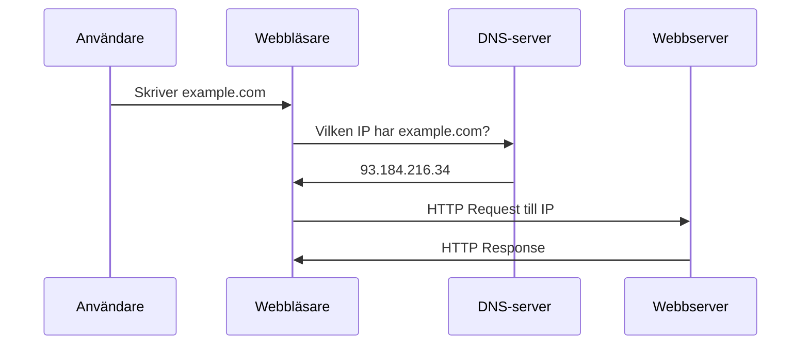

# Domänhantering och DNS

I lektionen om hosting lärde du dig att domännamn (t.ex. `example.com`) pekar på IP-adresser via DNS. Här går vi djupare: hur du registrerar en domän, konfigurerar DNS-poster (A-record, CNAME) och sätter upp SSL-certifikat för HTTPS.

## Domänregistrering

En **domän** är en unik adress på internet som du kan hyra – inte köpa – för en begränsad tid (vanligtvis 1–10 år). Registreringen sker hos en **domänregistrator** (domain registrar).

### Hur domännamn är uppbyggda

Ett domännamn består av delar separerade med punkt:

```
www.example.com
│   │       │
│   │       └── TLD (top-level domain): .com, .se, .org
│   └────────── Domännamn (second-level): example
└────────────── Subdomän (valfri): www, mail, api
```

| Del | Exempel | Beskrivning |
|-----|---------|-------------|
| **TLD** | .com, .se, .org, .net | Toppnivå – ofta land (.se) eller typ (.com) |
| **Domännamn** | example | Den unika delen du registrerar |
| **Subdomän** | www, mail, api | Valfria delar du själv konfigurerar i DNS |

### Var och hur registrerar man?

Populära registratorer:

| Leverantör | Fördelar |
|------------|----------|
| [Loopia](https://www.loopia.se/) | Svensk, bra för .se, enkel hantering |
| [Binero](https://www.binero.se/) | Svensk, domän + hosting i samma paket |
| [One.com](https://www.one.com/) | Nordisk, ofta kampanjer |
| [Namecheap](https://www.namecheap.com/) | Billiga .com, många TLD:er |
| [Cloudflare](https://www.cloudflare.com/) | Transparent prissättning, inkluderar DNS och CDN |

**Typiska priser:** .se cirka 150–300 kr/år, .com cirka 100–150 kr/år. Kontrollera alltid förnyelsepriset – första året kan vara kampanjpris.

### Vad att tänka på vid registrering

- **WHOIS-skydd** – dölj dina personuppgifter i den offentliga WHOIS-databasen (många registratorer erbjuder detta gratis)
- **Auto-förnyelse** – aktivera så att domänen inte löper ut av misstag
- **E-post** – använd en e-postadress du har tillgång till långsiktigt (för återställning och varningar)

## DNS-inställningar

**DNS** (Domain Name System) översätter domännamn till IP-adresser. När du registrerar en domän får du tillgång till DNS-inställningarna – antingen hos registratorn eller hos en extern DNS-leverantör (t.ex. Cloudflare).



### Name servers (namnservrar)

Varje domän pekar på **name servers** som innehåller de faktiska DNS-posterna. Registratorn anger vilka name servers som gäller.

- **Standard** – ofta registratorns egna (t.ex. ns1.loopia.se)
- **Extern** – du kan använda Cloudflare, AWS Route 53 eller annan leverantör för mer funktionalitet

När du byter hosting eller använder extern DNS måste du uppdatera name servers hos registratorn.

## A-record och CNAME

DNS består av **poster** (records) som kopplar domännamn till mål. De vanligaste för webbplatser är A-record och CNAME.

### A-record (Address record)

En **A-record** kopplar ett domännamn direkt till en **IPv4-adress**.

| Typ | Namn | Värde | TTL |
|-----|------|-------|-----|
| A | @ | 93.184.216.34 | 3600 |
| A | www | 93.184.216.34 | 3600 |

- **@** betyder roten (example.com)
- **www** betyder www.example.com
- **TTL** (Time To Live) – hur länge svaret får cachelagras (i sekunder)

**När använda:** När du pekar din domän mot en servers IP-adress. Det är den vanligaste posten för en webbplats.

### CNAME (Canonical Name)

En **CNAME** pekar ett domännamn på ett *annat* domännamn – en alias. Målet måste ha en A-record (eller annan post).

| Typ | Namn | Värde |
|-----|------|-------|
| CNAME | www | example.com |
| CNAME | api | myapp.herokuapp.com |

**När använda:** När du vill att flera namn ska peka på samma plats, eller när du pekar på en tjänst som byter IP (t.ex. Heroku, Netlify, Vercel). Då behöver du bara uppdatera A-recorden för målet – alla CNAME följer automatiskt.

| 📝 Notera |
|----------|
| Du kan inte ha en CNAME på roten (@). För example.com måste du använda A-record (eller ANAME/ALIAS om leverantören stödjer det). |

### Övriga användbara poster

| Typ | Syfte |
|-----|-------|
| **AAAA** | Som A-record men för IPv6-adresser |
| **MX** | Mail exchange – vilka servrar som tar emot e-post för domänen |
| **TXT** | Fri text – ofta för verifiering (t.ex. Google, Let's Encrypt) |

### Exempel: peka domän mot en server

Du har köpt `minbutik.se` och en VPS med IP `203.0.113.50`. I DNS-panelen hos din registrator lägger du till:

| Typ | Namn | Värde |
|-----|------|-------|
| A | @ | 203.0.113.50 |
| A | www | 203.0.113.50 |

Nu pekar både `minbutik.se` och `www.minbutik.se` på din server. Det kan ta upp till 24–48 timmar innan ändringarna sprids (DNS propagation), men ofta är det klart inom minuter till några timmar.

### Exempel: peka domän mot Netlify/Vercel

Många hostingtjänster för statiska sajter och frontend ger dig ett domännamn (t.ex. `mittprojekt.netlify.app`). Du vill använda `mittprojekt.se` istället.

1. I Netlify/Vercel: lägg till din domän under Domain settings.
2. Tjänsten visar vilka poster du behöver.
3. I DNS hos din registrator:
   - För **apex** (mittprojekt.se): använd A-record med deras IP, eller ALIAS/ANAME om tillgängligt.
   - För **www**: CNAME som pekar på deras domän (t.ex. `mittprojekt.netlify.app`).

## SSL-certifikat

**HTTPS** kräver ett **SSL-certifikat** (TLS-certifikat) på servern. Certifikatet verifierar att servern är den den utger sig för att vara och möjliggör krypterad trafik.

### Let's Encrypt – gratis certifikat

**Let's Encrypt** är en gratis certifikatutfärdare. Certifikaten gäller i 90 dagar och förnyas automatiskt med verktyg som **Certbot**.

```bash
# Installera Certbot (Ubuntu/Debian med Nginx)
apt install -y certbot python3-certbot-nginx
certbot --nginx -d example.com -d www.example.com
```

Certbot konfigurerar Nginx och sätter upp automatisk förnyelse. Efteråt svarar din webbplats på `https://example.com`.

### Vad krävs för SSL?

- Domänen måste peka på servern (A-record) *innan* du kör Certbot.
- Port 80 måste vara öppen (Certbot använder HTTP för verifiering).
- Servern måste vara nåbar från internet.

### Hosting med inkluderat SSL

Många leverantörer (Loopia, Netlify, Vercel, m.fl.) erbjuder SSL inkluderat. De hanterar certifikat och förnyelse åt dig – du behöver bara aktivera HTTPS i panelen.

### HTTP vs HTTPS

| | HTTP | HTTPS |
|---|------|-------|
| **Port** | 80 | 443 |
| **Kryptering** | Nej | Ja |
| **Webbläsarens indikator** | Ofta "Osäker" | Lås-ikon |
| **SEO** | Sämre | Bättre (Google prioriterar HTTPS) |

För produktionswebbplatser ska du alltid använda HTTPS.
