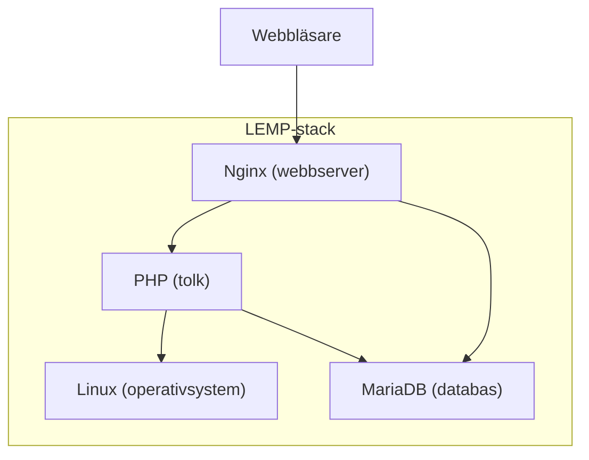
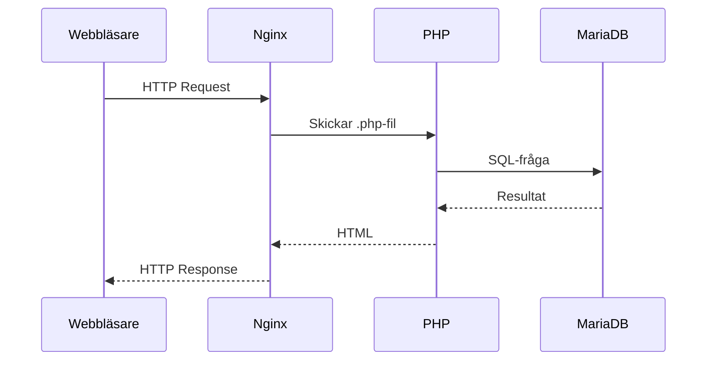
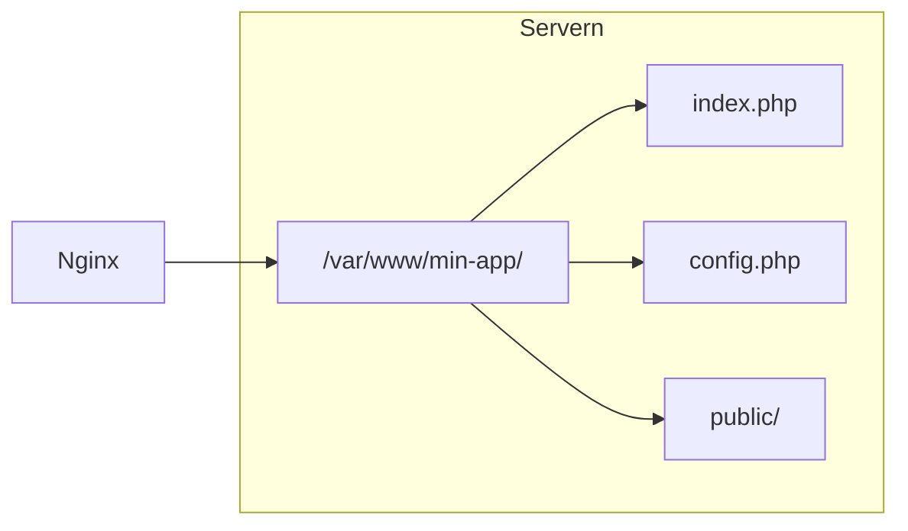
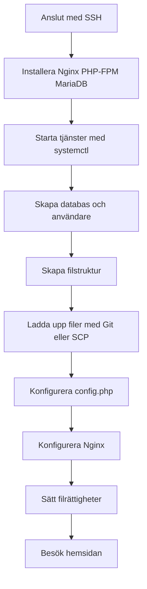

# Att hosta en PHP-applikation

I förra lektionen gick vi igenom grundbegreppen kring hosting. Nu går vi från teori till praktik: vad behöver du konkret för att få en PHP-applikation att köra på en server? Vi använder **Nginx** som webbserver och **MariaDB** som databas – två populära och stabila val.

## Vad en PHP-applikation behöver

En typisk PHP-applikation kräver flera komponenter som måste fungera tillsammans. Detta kallas ofta för en **LEMP-stack** (Linux, Nginx, MariaDB/MySQL, PHP):



| Komponent | Roll |
|-----------|------|
| **Linux** | Operativsystemet på servern (t.ex. Ubuntu, Debian) |
| **Nginx** | Webbservern som tar emot HTTP-förfrågningar och serverar filer |
| **MariaDB** | Relationsdatabasen där applikationen lagrar data |
| **PHP** | Tolken som kör PHP-koden och genererar dynamiskt innehåll |



## Förutsättningar

För att följa med behöver du:

*   En **VPS** eller server med Ubuntu/Debian (t.ex. från DigitalOcean, Hetzner eller Linode)
*   **SSH-åtkomst** till servern (användarnamn och IP-adress eller domän)
*   En enkel PHP-applikation att hosta (t.ex. från ett Git-repo)

Vi antar att du har root- eller sudo-åtkomst till servern.

| 📝 Notera |
|--------|
| Saknar du tillgång till en VPS? Kör detta kommando lokalt för att starta en Ubuntu-container där du kan följa stegen: `docker run -it --name lemp-ovning -p 8080:80 -p 3306:3306 ubuntu:22.04` |

## Steg 1: Anslut till servern med SSH

Först ansluter du till servern via **SSH** (Secure Shell). Du kör kommandot från din lokala dator.

```bash
ssh root@192.168.1.100
```

*Terminal – anslutning till server:*

```
$ ssh root@192.168.1.100
The authenticity of host '192.168.1.100' can't be established.
ED25519 key fingerprint is SHA256:abc123...
Are you sure you want to continue connecting (yes/no/[fingerprint])? yes
Warning: Permanently added '192.168.1.100' to the list of known hosts.
root@192.168.1.100's password: ********

Welcome to Ubuntu 22.04 LTS
root@server:~#
```

Nu är du inloggad på servern. Alla kommando som följer körs på servern om inget annat anges.

| 📝 Notera |
|--------|
| **Med Docker:** Hoppa över SSH. Kör istället `docker run -it --name lemp-ovning -p 8080:80 -p 3306:3306 ubuntu:22.04` på din lokala dator. Du hamnar direkt i en Ubuntu-terminal – följ sedan steg 2 och framåt där inne. |

## Steg 2: Installera Nginx, PHP och MariaDB

Uppdatera paketlistan och installera de nödvändiga paketen med **apt** (Ubuntu/Debians pakethanterare).

```bash
apt update && apt install -y nginx php-fpm php-mysql php-mbstring mariadb-server git nano
```

*Terminal – installation:*

```
$ apt update && apt install -y nginx php-fpm php-mysql php-mbstring mariadb-server git
Hit:1 http://archive.ubuntu.com/ubuntu jammy InRelease
Get:2 http://archive.ubuntu.com/ubuntu jammy-updates InRelease
...
Reading package lists... Done
Building dependency tree... Done
The following NEW packages will be installed:
  nginx php-fpm php-mysql php-mbstring mariadb-server git ...
...
Setting up nginx (1.18.0) ...
Setting up php-fpm (8.1.0) ...
Setting up mariadb-server (10.6.4) ...
...
Done.
```

*   **nginx** – webbservern
*   **php-fpm** – PHP FastCGI Process Manager (Nginx använder detta för att köra PHP)
*   **php-mysql** – PHP-extension för att prata med MariaDB/MySQL
*   **php-mbstring** – stöd för stränghantering (krävs av många applikationer)
*   **mariadb-server** – databasservern
*   **git** – versionshantering, används för att klona applikationskod (steg 6)
*   **nano** – enkel texteditor i terminalen

## Steg 3: Starta och aktivera tjänsterna

Använd **systemctl** för att starta tjänsterna och säkerställa att de startar automatiskt vid omstart.

```bash
systemctl start nginx php8.1-fpm mariadb
systemctl enable nginx php8.1-fpm mariadb
systemctl status nginx
```

*Terminal – starta tjänster:*

```
$ systemctl start nginx php8.1-fpm mariadb
$ systemctl enable nginx php8.1-fpm mariadb
Created symlink /etc/systemd/system/multi-user.target.wants/nginx.service
Created symlink /etc/systemd/system/multi-user.target.wants/php8.1-fpm.service
Created symlink /etc/systemd/system/multi-user.target.wants/mariadb.service

$ systemctl status nginx
● nginx.service - A high performance web server
     Loaded: loaded (/lib/systemd/system/nginx.service; enabled)
     Active: active (running)
```

*Notera:* PHP-versionen kan variera (t.ex. `php8.2-fpm`). Kontrollera med `apt list php*-fpm` om du är osäker.

| 📝 Notera |
|--------|
| **Med Docker:** `systemctl` fungerar inte i containern. Använd `service` istället: `service nginx start`, `service php8.1-fpm start`, `service mariadb start` |

## Steg 4: Konfigurera MariaDB och skapa databas

MariaDB har en grundläggande säkerhetskonfiguration. Kör först säkerhetsinställningarna, sedan skapa databas och användare.

```bash
mysql_secure_installation
```

*Terminal – säkra MariaDB (förkortat):*

```
$ mysql_secure_installation
Enter current password for root: [tryck Enter om ingen finns]

Switch to unix_socket authentication [Y/n] y
Change the root password? [Y/n] y
New password: ********
Re-enter new password: ********

Remove anonymous users? [Y/n] y
Disallow root login remotely? [Y/n] y
Remove test database? [Y/n] y
Reload privilege tables? [Y/n] y
Done.
```

Logga in i MariaDB och skapa databas samt användare för din applikation:

```bash
mysql -u root -p
```

*Terminal – skapa databas i MySQL:*

```
$ mysql -u root -p
Enter password: ********

MariaDB [(none)]> CREATE DATABASE min_app_db;
Query OK, 1 row affected (0.001 sec)

MariaDB [(none)]> CREATE USER 'app_user'@'localhost' IDENTIFIED BY 'säkert_lösenord_123';
Query OK, 0 rows affected (0.002 sec)

MariaDB [(none)]> GRANT ALL PRIVILEGES ON min_app_db.* TO 'app_user'@'localhost';
Query OK, 0 rows affected (0.001 sec)

MariaDB [(none)]> FLUSH PRIVILEGES;
Query OK, 0 rows affected (0.001 sec)

MariaDB [(none)]> EXIT;
Bye
```

## Steg 5: Filstruktur och document root

Nginx letar efter webbfiler i en **document root**. Standardplatsen på Ubuntu är `/var/www/html`. Vi skapar en mapp för vår applikation:



```bash
mkdir -p /var/www/min-app
```

Rekommenderad struktur för en PHP-app:

```
/var/www/min-app/
├── public/           # Document root – endast publika filer
│   ├── index.php
│   └── css/
├── includes/         # Konfiguration, funktioner (skyddad)
│   └── config.php
└── uploads/          # Uppladdade filer (om appen har det)
```

Nginx konfigureras så att den pekar på `public/` som document root – då hamnar känsliga filer som `config.php` utanför det som webbläsaren kan nå direkt.

Ett färdigt exempel med denna struktur finns i [demo-lemp-app](https://github.com/Glimakra-Webbutvecklare/demo-lemp-app) – en enkel blogg-app som du kan klona och använda i steg 6.

## Steg 6: Ladda upp applikationsfiler

Du kan ladda upp filer på flera sätt. Här visar vi två: **Git** (om koden finns i ett repo) och **SCP** (Secure Copy) från din lokala dator.

### Alternativ A: Klona med Git

```bash
cd /var/www
git clone https://github.com/användare/min-php-app.git min-app
```

*Terminal – klona med Git:*

```
$ cd /var/www
$ git clone https://github.com/anvandare/min-php-app.git min-app
Cloning into 'min-app'...
remote: Enumerating objects: 42, done.
remote: Counting objects: 100% (42/42), done.
remote: Compressing objects: 100% (42/42), done.
Receiving objects: 100% (42/42), 12.34 KiB | 2.1 MiB/s, done.
Resolving deltas: 100% (8/8), done.
```

### Alternativ B: Kopiera filer med SCP (från din lokala dator)

Kör detta på **din lokala dator**, inte på servern:

| 📝 Notera |
|--------|
| **Med Docker:** Använd `docker cp` istället för SCP. Exempel: `docker cp ./min-php-app/. lemp-ovning:/var/www/min-app/` (kör från mappen med filerna, medan containern körs) |

```bash
scp -r ./min-php-app/* root@192.168.1.100:/var/www/min-app/
```

*Terminal – SCP från lokal dator:*

```
$ scp -r ./min-php-app/* root@192.168.1.100:/var/www/min-app/
config.php        100%  234   1.2KB/s   00:00
index.php         100%  567   2.8KB/s   00:00
```

## Steg 7: Konfigurera databasanslutning

Skapa eller redigera `config.php` med rätt databasuppgifter. Använd **nano** (eller annan texteditor) på servern:

```bash
nano /var/www/min-app/includes/config.php
```

*Terminal – redigera med nano:*

```
$ nano /var/www/min-app/includes/config.php

  GNU nano 6.2                    includes/config.php

<?php
define('DB_HOST', 'localhost');
define('DB_NAME', 'min_app_db');
define('DB_USER', 'app_user');
define('DB_PASS', 'säkert_lösenord_123');

Sparar med Ctrl+O, avsluta med Ctrl+X.
```

Exempel på hur `config.php` kan användas i din applikation:

```php
<?php
require_once __DIR__ . '/../includes/config.php';

$pdo = new PDO(
    "mysql:host=" . DB_HOST . ";dbname=" . DB_NAME . ";charset=utf8mb4",
    DB_USER,
    DB_PASS
);
```

## Steg 8: Konfigurera Nginx

Skapa en Nginx-konfiguration för din webbplats. Nginx läser konfigfiler från `/etc/nginx/sites-available/`.

```bash
nano /etc/nginx/sites-available/min-app
```

Lägg in följande (anpassa `server_name` till din domän eller IP):

```nginx
server {
    listen 80;
    server_name 192.168.1.100;   # Eller din domän, t.ex. minapp.se

    root /var/www/min-app/public;
    index index.php index.html;

    location / {
        try_files $uri $uri/ /index.php?$query_string;
    }

    location ~ \.php$ {
        include snippets/fastcgi-php.conf;
        fastcgi_pass unix:/run/php/php8.1-fpm.sock;
    }
}
```

Aktivera webbplatsen och testa konfigurationen:

```bash
ln -s /etc/nginx/sites-available/min-app /etc/nginx/sites-enabled/
nginx -t
systemctl reload nginx
```

*Terminal – aktivera Nginx-konfiguration:*

```
$ ln -s /etc/nginx/sites-available/min-app /etc/nginx/sites-enabled/
$ nginx -t
nginx: the configuration file /etc/nginx.conf syntax is ok
nginx: configuration file /etc/nginx.conf test is successful

$ systemctl reload nginx
```

| 📝 Notera |
|--------|
| **Med Docker:** Använd `service nginx reload` istället för `systemctl reload nginx`. Använd `server_name localhost;` (eller `server_name _;`) i stället för IP-adressen, så att Nginx svarar när du besöker `http://localhost:8080`. Ta bort default-site för att undvika konflikter: `rm /etc/nginx/sites-enabled/default` innan du aktiverar min-app. |

## Steg 9: Sätt filrättigheter

Webbservern (Nginx) kör ofta som användaren `www-data`. Den måste kunna läsa filerna i document root.

```bash
chown -R www-data:www-data /var/www/min-app
chmod -R 755 /var/www/min-app
chmod -R 775 /var/www/min-app/uploads
```

*Terminal – filrättigheter:*

```
$ chown -R www-data:www-data /var/www/min-app
$ chmod -R 755 /var/www/min-app
$ chmod -R 775 /var/www/min-app/uploads
```

## Steg 10: Nu kan du se hemsidan

Öppna webbläsaren och besök din webbplats:

*   **Med VPS:** `http://192.168.1.100` (eller din serverns IP/domän)
*   **Med Docker:** `http://localhost:8080` (port 8080 mappas till containerns port 80)

Om allt är korrekt konfigurerat ska du nu se din PHP-applikation.

## Vanliga problem och felsökning

| Problem | Möjlig orsak | Åtgärd |
|---------|--------------|--------|
| **500 Internal Server Error** | PHP-krasch, fel i konfiguration | Kolla `tail -f /var/log/nginx/error.log` |
| **502 Bad Gateway** | PHP-FPM körs inte | `service php8.1-fpm status` (eller `systemctl status php8.1-fpm` på VPS) |
| **Database connection failed** | Fel användare/lösenord eller databasnamn | Dubbelkolla `config.php` och MariaDB-användaren |
| **Blank sida** | PHP-fel visas inte | Sätt `display_errors = On` i `php.ini` under felsökning (stäng av i produktion!) |
| **Permission denied** | Fel filrättigheter | `chown www-data:www-data` på mappar som webbservern behöver läsa/skriva |
| **Inget svar / tom sida (Docker)** | Default-site eller PHP-FPM | Se nedan |

**Med Docker – inget svar vid curl localhost:8088:**

1.  Ta bort default-site så att min-app hanterar alla förfrågningar:
    ```bash
    rm /etc/nginx/sites-enabled/default
    service nginx reload
    ```
2.  Kontrollera att PHP-FPM körs (krävs för .php-filer):
    ```bash
    service php8.1-fpm start
    service php8.1-fpm status
    ```
3.  Testa inifrån containern med `curl -v http://127.0.0.1/` – du ska få HTTP-svar. Om det fungerar inifrån men inte från host kan det vara nätverks-/brandväggsrelaterat.

```bash
tail -f /var/log/nginx/error.log
```

*Terminal – felsöka Nginx-loggar:*

```
$ tail -f /var/log/nginx/error.log
2024/01/15 10:23:45 [error] 1234#1234: *5 FastCGI sent in stderr: "PHP message: PHP Fatal error: Uncaught PDOException: SQLSTATE[HY000] [2002] Connection refused in /var/www/min-app/index.php:12
```

## Säkerhet – grundläggande

*   **Känsliga filer:** Lägg `config.php` och liknande utanför document root, eller se till att Nginx inte serverar dem.
*   **Databas:** Använd alltid prepared statements (PDO) – aldrig direkt variabler i SQL-frågor.
*   **HTTPS:** I produktion, använd SSL-certifikat (t.ex. Let's Encrypt med Certbot).
*   **Uppdateringar:** Håll Nginx, PHP och MariaDB uppdaterade med `apt update && apt upgrade`.

## Om jag vill köra något annat än en PHP-applikation?

Samma principer gäller – men vissa delar byts ut beroende på vilken typ av applikation du hostar.

**Det som ofta är samma:**

*   **Linux-server** – eller Docker-container
*   **Nginx** – fungerar som webbserver eller reverse proxy för de flesta typer
*   **SSH, Git, SCP** – samma sätt att ansluta och ladda upp filer
*   **Filstruktur** – document root, skyddade mappar, filrättigheter

**Det som ändras:**

| Applikationstyp | Istället för PHP + PHP-FPM | Databas |
|-----------------|----------------------------|---------|
| **Statisk webbplats** (HTML, CSS, JS) | Inget – Nginx serverar filer direkt | Ofta ingen |
| **Node.js** (Express, React SSR) | Node.js, Nginx proxar till t.ex. port 3000 | Valfritt (MongoDB, PostgreSQL) |
| **Python** (Django, Flask) | Python, Gunicorn eller uWSGI | Ofta PostgreSQL |
| **Byggd React/Vue-app** | Inget – Nginx serverar färdiga filer från `dist/` eller `build/` | Endast om appen anropar ett API |

**Exempel:** För en statisk sida eller en byggd React-app behöver du bara Nginx – ingen PHP, ingen databas. Nginx pekar på mappen med dina färdiga filer. För Node.js installerar du Node istället för PHP, startar appen (t.ex. med `node server.js` eller PM2) och konfigurerar Nginx att proxya förfrågningar till den port där Node lyssnar.

## Sammanfattning

| 📝 Notera |
|--------|
| **Med Docker:** För att återanvända containern nästa gång, använd `docker start -i lemp-ovning` istället för att skapa en ny. Data sparas tills du kör `docker rm lemp-ovning`. |

Här är en checklista för att hosta en PHP-applikation:



| Kommando | Syfte |
|----------|-------|
| `ssh user@server` | Anslut till servern |
| `apt install nginx php-fpm mariadb-server git` | Installera LEMP-stack |
| `systemctl start nginx` | Starta webbservern |
| `mysql -u root -p` | Öppna MariaDB-konsol |
| `scp -r filer user@server:/sökväg` | Kopiera filer till servern |
| `git clone url` | Hämta kod från Git |
| `nano fil` | Redigera filer |
| `nginx -t` | Testa Nginx-konfiguration |

I nästa lektion introducerar vi **Docker** – ett sätt att paketera hela denna miljö i en container och slippa installera allt manuellt på servern.
