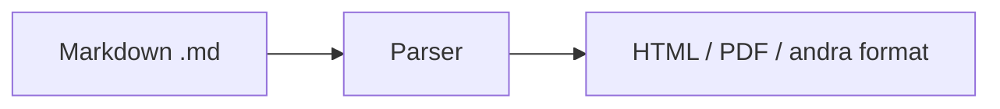

# Markdown och dokumentation

Markdown är ett enkelt markeringsspråk som används överallt i modern utveckling: README-filer på GitHub, dokumentation, bloggar, och denna kursbok. Att behärska Markdown och kunna skriva bra dokumentation är en viktig färdighet för varje webbutvecklare.

## Vad är Markdown och varför använda det?

**Markdown** är ett lättviktigt markeringsspråk (markup language) skapat av John Gruber 2004. Idén är enkel: skriv vanlig text med enkla symboler för formatering, som sedan kan konverteras till HTML eller andra format.

### Varför Markdown?

- **Läsbart som vanlig text** – även i råformat (raw) är Markdown lätt att läsa, till skillnad från HTML med många taggar
- **Plattformsoberoende** – fungerar överallt: GitHub, GitLab, Slack, Notion, VS Code, och många fler
- **Snabbt att skriva** – mindre kod för samma resultat jämfört med HTML
- **Versionshantering** – textfiler passar perfekt för Git; diff (skillnader) blir tydliga
- **Standard i utvecklingsvärlden** – README, CHANGELOG, och dokumentation skrivs ofta i Markdown



## Grundläggande Markdown

### Rubriker

Använd `#` för rubriker. Ett `#` är störst (h1), sex `#` minst (h6).

```markdown
# Rubrik nivå 1
## Rubrik nivå 2
### Rubrik nivå 3
```

### Textformatering

| Syntax | Resultat |
|--------|----------|
| `**fet text**` eller `__fet text__` | **fet text** |
| `*kursiv*` eller `_kursiv_` | *kursiv* |
| `~~genomstruken~~` | ~~genomstruken~~ |
| `` `kod` `` | `kod` |

### Listor

**Punktlistor** med `-`, `*` eller `+`:

```markdown
- Första punkten
- Andra punkten
  - Underpunkt (indentera med två mellanslag)
```

**Numrerade listor**:

```markdown
1. Steg ett
2. Steg två
3. Steg tre
```

### Länkar och bilder

```markdown
[Länktext](https://example.com)
[Bokmärke i samma fil](#rubrik-id)


```

### Kodblock

En rad kod med backticks: `` `kod` ``

Flera rader med fenced code blocks:

````markdown
```javascript
function hello() {
  console.log("Hej världen!");
}
```
````

## Avancerade Markdown-funktioner

### Tabeller

```markdown
| Kolumn 1 | Kolumn 2 | Kolumn 3 |
|----------|----------|----------|
| Cell A   | Cell B   | Cell C   |
| Cell D   | Cell E   | Cell F   |
```

Alignment med kolon:

```markdown
| Vänster | Center | Höger |
|:--------|:------:|------:|
| vänster | mitt   | höger |
```

### Blockquotes (citat)

```markdown
> Detta är ett citat.
> Flera rader behåller citatet.
```

### Horisontella linjer

```markdown
---
***
___
```

### Checkboxar (task lists)

```markdown
- [x] Klar uppgift
- [ ] Ej klar uppgift
```

### Fusk (escape) av specialtecken

Använd backslash `\` för att skriva tecken som annars har betydelse: `\*`, `\#`, `\[`, etc.

### HTML i Markdown

De flesta Markdown-parsers tillåter HTML. När Markdown inte räcker till kan du blanda in HTML:

```markdown
<details>
<summary>Klicka för att expandera</summary>

Dolt innehåll här.

</details>
```

## Hur man skriver en bra README

README.md är ofta det första en besökare ser på GitHub eller GitLab. En bra README gör projektet tillgängligt och professionellt.

### Grundstruktur för README

```markdown
# Projektnamn

Kort beskrivning (1–2 meningar) av vad projektet gör.

## Installation

Steg för att installera och köra projektet.

## Användning

Exempel på hur man använder projektet.

## Bidra

Hur andra kan bidra (om öppen källkod).
```

### Viktiga sektioner

| Sektion | Syfte |
|---------|-------|
| **Titel och beskrivning** | Vad är projektet? Vem är det för? |
| **Installation** | Konkreta steg: klona, installera beroenden, konfigurera |
| **Användning** | Exempel, kommandon, skärmdummar |
| **Konfiguration** | Miljövariabler, config-filer |
| **Bidra** | Contributing guidelines, kodstil |
| **Licens** | Vilken licens används? |

### Praktiska tips

- **Skriv för nybörjare** – anta att läsaren inte känner till projektet
- **Inkludera exempel** – kod eller kommandon som faktiskt fungerar
- **Uppdatera** – README som inte stämmer med koden skadar förtroendet
- **Använd bilder** – skärmdummar eller diagram kan förklara mycket snabbt

## Olika licenser

När du publicerar kod – särskilt som öppen källkod (open source) – behöver du ange en licens. Utan licens behåller du alla rättigheter (all rights reserved), vilket i praktiken innebär att andra inte får använda, kopiera eller modifiera koden utan ditt tillstånd.

### Permissiva licenser (öppna, få krav)

| Licens | Krav | När den passar |
|--------|------|----------------|
| **MIT** | Behåll licensnotisen i koden | När du vill att så många som möjligt ska kunna använda koden, även i proprietära projekt. Mycket vanlig för bibliotek och verktyg. |
| **Apache 2.0** | Behåll licensnotisen + patentgrant | Lik MIT men ger tydlig patentlicens. Bra för företagsprojekt och när patentfrågor är viktiga. |
| **BSD** | Behåll licensnotisen | Lik MIT. Används ofta i akademiska och forskningsprojekt. |

**MIT** är en av de enklaste och mest använda licenserna. Kort sagt: gör vad du vill, men inkludera originalet av licensen.

### Copyleft-licenser (kräver att derivat också är öppna)

| Licens | Krav | När den passar |
|--------|------|----------------|
| **GPL** | Derivater måste vara GPL och källkod måste delas | När du vill att förbättringar och tillägg också ska vara öppen källkod. Används av Linux, WordPress, många verktyg. |
| **AGPL** | Som GPL + krav vid nätverksanvändning | När du vill att även SaaS (software as a service) som bygger på koden ska dela sin källkod. |

**GPL** (General Public License) säkerställer att koden förblir fri – även om någon bygger vidare på den. Det kan vara en dealbreaker för företag som vill använda koden i slutna produkter.

### Public domain och ingen licens

| Licens | Krav | När den passar |
|--------|------|----------------|
| **Unlicense** / **CC0** | Inga | När du vill ge bort allt – koden tillhör alla. Mindre vanligt för kod. |

### Proprietär licens (sluten källkod)

Om du inte anger någon öppen licens behåller du copyright. Andra får inte använda koden utan avtal. Passar för kommersiella produkter, internkod eller när du vill behålla full kontroll.

### Sammanfattning – vilken ska jag välja?

- **Vill du maximal spridning?** → MIT eller Apache 2.0
- **Vill du att förbättringar också ska vara öppna?** → GPL
- **Bygger du på befintlig GPL-kod?** → Du måste använda GPL för ditt projekt
- **Vill du behålla all kontroll?** → Ingen licens (proprietär) eller skriv en egen licens

Se [choosealicense.com](https://choosealicense.com/) för en interaktiv guide.

Utöver README finns flera dokument som gör ett repo mer professionellt och lättare att arbeta med.

### Vanliga dokumentfiler

| Fil | Syfte |
|-----|-------|
| `README.md` | Introduktion, installation, användning |
| `CHANGELOG.md` | Historik över ändringar (versionshantering) |
| `CONTRIBUTING.md` | Hur man bidrar till projektet |
| `LICENSE` | Licensvillkor |
| `.gitignore` | Filer som inte ska versioneras |
| `docs/` | Utökad dokumentation |

### CHANGELOG

Följ [Keep a Changelog](https://keepachangelog.com/) för en tydlig struktur:

```markdown
# Changelog

## [1.1.0] - 2024-03-15

### Added
- Ny funktion för export till PDF

### Changed
- Uppdaterad inloggningsflöde

### Fixed
- Bugg i sökfunktionen
```

### AI-relaterad dokumentation

Med AI-verktyg (t.ex. Cursor, GitHub Copilot, ChatGPT) som används i utveckling blir det viktigt att dokumentera hur AI ska användas i projektet.

#### Cursor rules och AGENTS.md

- **`.cursor/rules/`** – Regler som styr hur AI beter sig i projektet
- **`AGENTS.md`** eller **`.cursor/AGENTS.md`** – Instruktioner för AI-agenter: arkitektur, konventioner, vad som är tillåtet

Exempel på vad som kan dokumenteras:

```markdown
# AI Agent Guidelines

## Kodstil
- Använd TypeScript för nya filer
- Följ befintliga namngivningskonventioner

## Arkitektur
- API-routes i /api/
- Komponenter i /components/

## Begränsningar
- Ändra inte databasschemat utan migrering
```

#### AI-skills och instruktioner

- **`SKILL.md`** – Återanvändbara färdigheter/instruktioner för AI
- **`docs/ai-usage.md`** – Beskriver hur AI används i projektet, vilka verktyg, vilka begränsningar

#### Dokumentation för AI-parsning

AI läser ofta README, CONTRIBUTING och kodkommentarer. Tydlig strukturering hjälper:

- **Tydliga rubriker** – AI kan hitta rätt sektion snabbare
- **Konsekvent terminologi** – minskar missförstånd
- **Exempel i kod** – AI kan bättre förstå och generera liknande kod

### Sammanfattning

En bra dokumentationsstruktur gör projektet lättare att förstå, bidra till och underhålla – både för människor och för AI-verktyg som används i utvecklingsprocessen.
