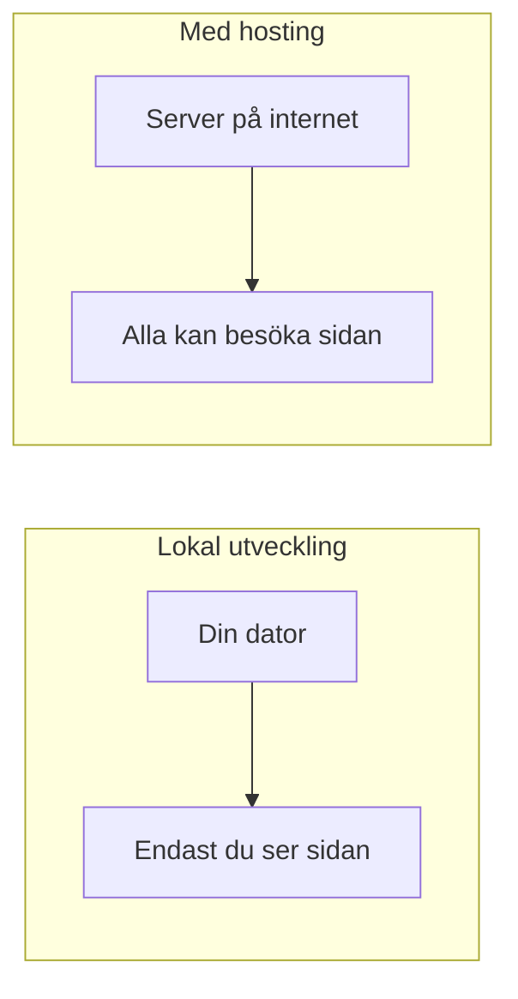
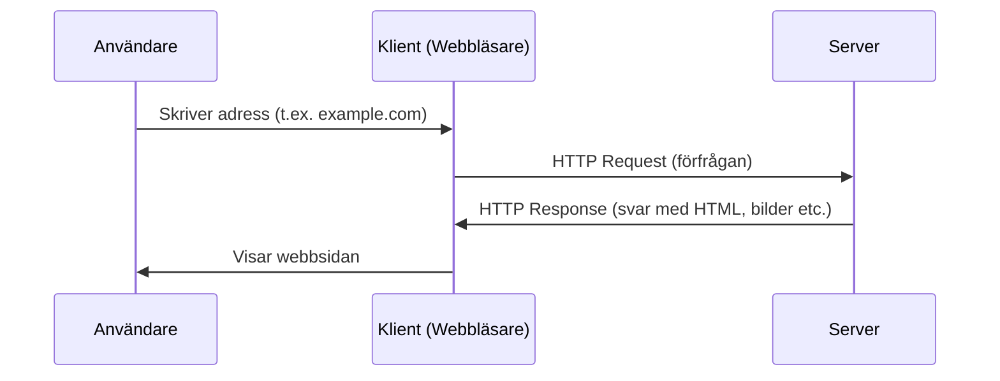
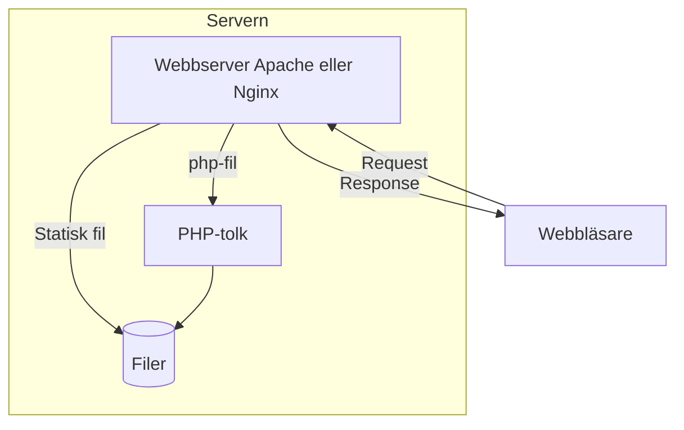
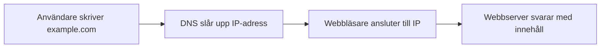
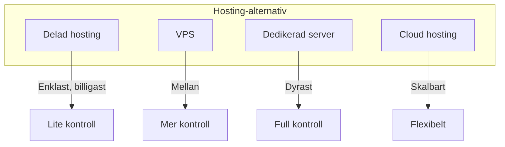
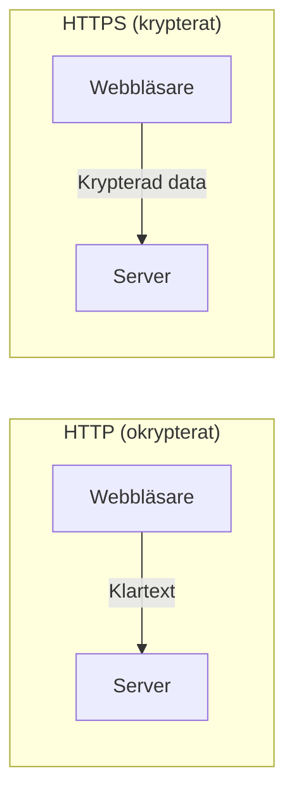
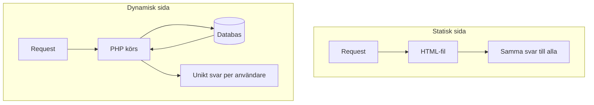

# Vad är hosting?

När du utvecklar en webbplats lokalt på din dator kan bara du se den. För att göra den tillgänglig för andra på internet behöver du **hosting** (värdskap) – en plats där din webbplats kan "bo" och vara tillgänglig dygnet runt. I den här lektionen går vi igenom de grundläggande begreppen du kommer att stöta på när du sätter upp och hostar webbapplikationer.

## Varför behövs hosting?

Tänk på lokal utveckling som att prova recept i ditt eget kök. Du kan experimentera, göra misstag och lära dig – men ingen annan kan äta maten. **Hosting** är som att öppna en restaurang: din webbplats måste vara tillgänglig för besökare när som helst, från vilken plats som helst i världen.

En server som är ansluten till internet 24/7, med rätt mjukvara installerad, gör att din webbplats kan nås av vem som helst som skriver in adressen i webbläsaren.

## Klient och server

För att förstå hur webben fungerar behöver vi två grundbegrepp:

*   **Klient (client):** Användarens webbläsare – Chrome, Firefox, Safari eller liknande. Klienten skickar en **förfrågan (request)** till en server och visar sedan svaret för användaren.
*   **Server:** En dator (ofta i ett datacenter) som kör programvara som lyssnar efter förfrågningar och svarar med innehåll – HTML, bilder, data och så vidare.

Detta är grunden för hur webben fungerar: klienten begär, servern svarar. Protokollet som används kallas **HTTP** (Hypertext Transfer Protocol).

## Vad är en webbserver?

En **webbserver** är ett program som körs på en dator och som:

1.  Lyssnar på nätverksportar (vanligtvis port 80 för HTTP och 443 för HTTPS).
2.  Tar emot HTTP-förfrågningar från webbläsare.
3.  Returnerar rätt innehåll – antingen en färdig fil eller resultatet av körning av skript (t.ex. PHP).

**Analogi:** Webbservern är som en receptionist på ett hotell. När en gäst (webbläsaren) kommer in med en förfrågan ("Jag vill ha rum 42") tar receptionisten emot den, hittar rätt information och lämnar tillbaka svaret.

De vanligaste webbservrarna är **Apache** och **Nginx**. Båda kan servera statiska filer (HTML, CSS, JavaScript, bilder) och kan konfigureras för att köra PHP eller andra serverspråk.

## IP-adress och domän

Varje dator ansluten till internet har en unik **IP-adress** (Internet Protocol-adress) – en serie siffror som identifierar den, t.ex. `93.184.216.34`. Det är den adressen som nätverket använder för att hitta rätt server.

Men människor är dåliga på att komma ihåg siffror. Därför använder vi **domännamn** (domain names) som `example.com` eller `glimakra.se`. Ett domännamn är en läsbar alias som pekar på en IP-adress.

| Domän       | IP-adress      |
|------------|----------------|
| example.com | 93.184.216.34 |
| google.com  | 142.250.74.46 |

När du köper hosting får du oftast en IP-adress till din server. Om du vill använda ett eget domännamn (t.ex. `minbutik.se`) måste du koppla domänen till den IP-adressen – det görs via DNS.

## DNS – telefonkatalogen för internet

**DNS** (Domain Name System) är det system som översätter domännamn till IP-adresser. När du skriver `example.com` i webbläsaren händer följande:

1.  Webbläsaren frågar en DNS-server: "Vilken IP-adress har example.com?"
2.  DNS-servern svarar med IP-adressen.
3.  Webbläsaren ansluter till den IP-adressen och skickar sin HTTP-förfrågan.

**Analogi:** DNS fungerar som en telefonkatalog – du slår upp ett namn (domän) och får tillbaka ett nummer (IP-adress) som du kan ringa (ansluta till).

### Var köper man domän och DNS?

Domäner köps hos en **domänregistrator** (domain registrar). Populära leverantörer är:

*   [Loopia](https://www.loopia.se/) – svensk leverantör, bra för .se-domäner
*   [Binero](https://www.binero.se/) – svensk, erbjuder både domäner och hosting
*   [One.com](https://www.one.com/) – dansk leverantör med stark närvaro i Norden
*   [Namecheap](https://www.namecheap.com/) – internationell, ofta billiga .com-domäner
*   [Cloudflare](https://www.cloudflare.com/) – registrator med transparent prissättning

**Typiska priser:** En .se-domän kostar cirka 150–300 kr/år. En .com-domän ligger oftast på 100–150 kr/år. Många leverantörer har kampanjer för första året.

## Typer av hosting

Det finns flera sätt att hosta en webbplats. Valet beror på budget, tekniska krav och hur mycket kontroll du vill ha.

| Typ | Beskrivning | Fördelar | Nackdelar |
|-----|-------------|----------|-----------|
| **Delad hosting (shared)** | Flera webbplatser delar samma server och resurser | Billigt, enkelt att komma igång, hostingleverantören sköter mycket | Begränsad kontroll, prestanda kan påverkas av andra kunders sajter |
| **VPS** (Virtual Private Server) | En virtuell egen server med dedikerade resurser | Mer kontroll, bättre prestanda, egen miljö | Kräver mer tekniska kunskaper, du ansvarar för uppdateringar och säkerhet |
| **Dedikerad server** | En hel fysisk server är din | Full kontroll, hög prestanda | Dyrt, kräver serveradministrationskunskap |
| **Cloud hosting** | Resurser i molnet (AWS, Azure, DigitalOcean m.fl.) | Skalbart, betala för vad du använder | Kan bli komplext, ofta mer avancerad konfiguration |

För nybörjare är **delad hosting** ofta det enklaste valet. När du vill ha mer kontroll eller hosta applikationer med specifika krav passar **VPS** eller **cloud** bättre.

### Var köper man hosting och vad kostar det?

| Typ | Var man köper | Typiskt pris |
|-----|---------------|--------------|
| **Delad hosting** | [Loopia](https://www.loopia.se/), [Binero](https://www.binero.se/), [One.com](https://www.one.com/), [Surftown](https://www.surftown.se/) | 30–100 kr/månad |
| **VPS** | [DigitalOcean](https://www.digitalocean.com/), [Linode](https://www.linode.com/), [Hetzner](https://www.hetzner.com/), [Vultr](https://www.vultr.com/) | 50–200 kr/månad |
| **Cloud** | [AWS](https://aws.amazon.com/), [Google Cloud](https://cloud.google.com/), [Azure](https://azure.microsoft.com/) | Varierar kraftigt, ofta pay-as-you-go |

**Svenska alternativ för nybörjare:** Loopia, Binero och One.com har enkla paket där domän, hosting och ofta e-post ingår. Många erbjuder gratis provperiod eller pengarna-tillbaka-garanti.

## SSL/TLS och HTTPS

När data skickas mellan webbläsaren och servern kan den i teorin avlyssnas. **SSL/TLS** (Secure Sockets Layer / Transport Layer Security) krypterar denna trafik så att tredje part inte kan läsa den.

*   **HTTP** – trafiken är okrypterad (port 80).
*   **HTTPS** – trafiken är krypterad (port 443).

För att använda HTTPS behöver servern ett **SSL-certifikat**. Certifikatet verifierar att servern är den den utger sig för att vara och möjliggör krypterad kommunikation.

**Varför HTTPS är viktigt:**

*   **Säkerhet:** Skyddar lösenord, kreditkortsinformation och annan känslig data.
*   **Förtroende:** Webbläsare visar ofta en varningssymbol för sidor utan HTTPS.
*   **SEO:** Sökmotorer som Google föredrar HTTPS-sidor.

Många hostingleverantörer erbjuder gratis SSL-certifikat (t.ex. via Let's Encrypt), så det finns sällan anledning att inte använda HTTPS.

## Statiskt vs dynamiskt innehåll

Webbplatser kan delas in i två huvudtyper baserat på hur innehållet serveras:

*   **Statiskt innehåll:** Färdiga filer – HTML, CSS, JavaScript, bilder – som webbservern skickar direkt till webbläsaren utan att ändra dem. Samma fil serveras till alla besökare.
*   **Dynamiskt innehåll:** Innehållet genereras vid varje förfrågan. En PHP-fil körs på servern, kanske hämtar data från en databas, och skapar unikt HTML för just den användaren.

**Exempel på statiska webbplatser** (samma innehåll till alla, ofta byggda med HTML/CSS eller statiska generators som Jekyll/Hugo):

*   [Information is Beautiful](https://informationisbeautiful.net/) – datavisualiseringar
*   [Smashing Magazine](https://www.smashingmagazine.com/) – delar av sajten är statiska
*   [CSS-Tricks](https://css-tricks.com/) – många artiklar serveras statiskt
*   Personliga portfolion och enkla företagssidor

**Exempel på dynamiska webbplatser** (innehåll genereras vid varje besök, ofta med PHP, Node.js eller liknande):

*   [WordPress.org](https://wordpress.org/) – CMS som driver miljontals sajter
*   [Facebook](https://www.facebook.com/) – personligt flöde per användare
*   [Blocket](https://www.blocket.se/) – annonser från databas
*   [Netflix](https://www.netflix.com/) – rekommendationer och innehåll baserat på användare

I kommande lektioner ska vi titta på vad som krävs för att hosta en **PHP-applikation** – alltså dynamiskt innehåll – och hur Docker kan förenkla processen.

## Sammanfattning

Här är de viktigaste begreppen från denna lektion:

| Begrepp | Beskrivning |
|---------|-------------|
| **Hosting** | En plats på internet där din webbplats är tillgänglig dygnet runt |
| **Klient** | Webbläsaren som skickar förfrågningar |
| **Server** | Datorn som svarar med innehåll |
| **Webbserver** | Program (Apache, Nginx) som tar emot HTTP-förfrågningar och serverar innehåll |
| **IP-adress** | Unik numerisk adress för en dator på internet |
| **Domän** | Läsbart namn (t.ex. example.com) som pekar på en IP-adress |
| **DNS** | System som översätter domännamn till IP-adresser |
| **SSL/HTTPS** | Krypterad trafik mellan webbläsare och server |
| **Statiskt innehåll** | Färdiga filer som serveras oförändrade |
| **Dynamiskt innehåll** | Innehåll som genereras vid varje förfrågan (t.ex. med PHP) |

I nästa lektion går vi från teori till praktik: vad behöver du konkret för att hosta en PHP-applikation?
