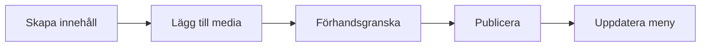

# WordPress adminpanel

Adminpanelen i WordPress är platsen där du skapar, redigerar och publicerar innehåll. När du förstår hur admin-delen fungerar blir det enklare att arbeta strukturerat, undvika misstag och samarbeta med andra i ett projekt.

## Förkunskaper

Innan du börjar bör du ha läst:

- [WordPress](./wordpress.md)
- [Hur wordpress är uppbyggt](./wordpress-uppbyggt.md)
- [Installation med Local by Flywheel](./wordpress-local.md)

## Vad är adminpanelen?

Adminpanelen (dashboard, kontrollpanel) är det interna gränssnittet för webbplatsen. Du når den vanligtvis via:

- `/wp-admin`

Här hanterar du bland annat:

- Inlägg och sidor
- Media (bilder, filer)
- Kommentarer
- Menyer och widgets
- Tillägg (plugins)
- Tema-inställningar
- Användare och roller

## Översikt av huvudmenyn

I vänstermenyn finns de viktigaste delarna:

- **Inlägg** – blogg och nyhetsinnehåll
- **Sidor** – statiska sidor
- **Media** – uppladdade filer
- **Kommentarer** – moderering
- **Utseende** – tema, menyer, widgetar
- **Tillägg** – installera/aktivera plugins
- **Användare** – konton och behörigheter
- **Inställningar** – grundinställningar för sajten

## Typiskt arbetsflöde i adminpanelen

Ett vanligt arbetsflöde ser ut så här:

1. Skapa innehåll i Inlägg eller Sidor.
2. Lägg till bilder i Media.
3. Kontrollera förhandsvisning.
4. Publicera eller schemalägg publicering.
5. Uppdatera navigering via menyer.

## Viktiga inställningar att kontrollera tidigt

När en ny WordPress-sajt sätts upp bör du börja med:

1. **Allmänt:** sajtens namn, tidszon och språk.
2. **Permalänkar:** välj en tydlig URL-struktur.
3. **Läsning:** vad som visas på startsidan.
4. **Diskussion:** kommentarsregler och moderering.
5. **Användare:** rätt roller för rätt personer.

## Roller och behörighet

Några vanliga roller i WordPress:

- **Administrator** – full åtkomst
- **Editor** – hanterar allt innehåll
- **Author** – hanterar egna inlägg
- **Contributor** – kan skriva men inte publicera
- **Subscriber** – grundläggande konto

Ge alltid minsta möjliga behörighet för uppgiften. Det minskar risker i drift.

## Vanliga misstag i admin-delen

1. Flera personer arbetar med admin-konto i stället för egna konton.
2. Innehåll publiceras utan förhandsgranskning.
3. Menyer uppdateras inte efter nya sidor.
4. Onödigt många plugins installeras utan tydligt syfte.

## Säkerhet i adminpanelen

För säkrare administration bör du:

- Använda starka lösenord och gärna 2FA (tvåfaktorsautentisering).
- Undvika att använda admin som användarnamn.
- Begränsa antalet administratörer.
- Uppdatera WordPress, teman och plugins regelbundet.
- Ta backup innan större ändringar.

## Sammanfattning

Adminpanelen är navet för allt redaktionellt arbete i WordPress. Med tydligt arbetsflöde, rätt behörigheter och goda säkerhetsrutiner blir arbetet både snabbare och säkrare.

## Reflektionsfrågor

1. Vilka menyval i adminpanelen kommer du använda mest i ett skolprojekt?
2. Vilken roll skulle du ge en person som bara ska skriva utkast?
3. Vilka tre säkerhetsåtgärder är viktigast i admin-delen?
